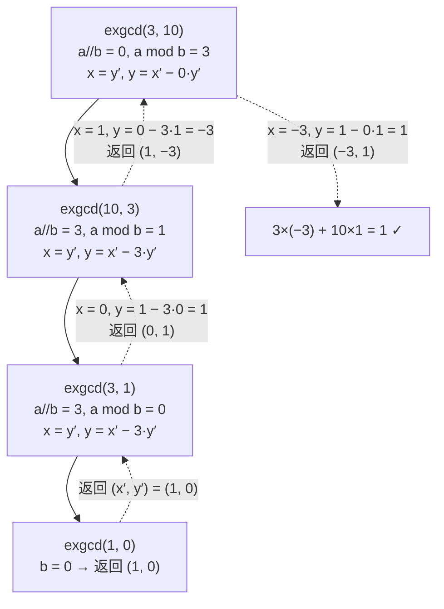

[[TOC]]

## 形式化题目

给定正整数 $a, b$（$2 \leqslant a, b \leqslant 2 \times 10^9$），求同余方程

$$
ax \equiv 1 \pmod b
$$

的最小正整数解 $x$。输入数据保证方程一定有解。

**样例**：$a = 3,\ b = 10$ 时，$3 \times 7 = 21 \equiv 1 \pmod {10}$，且不存在更小的正整数解，答案为 $7$。

## 正解

### 思路

**朴素做法为什么不行。** 最直接的想法是枚举 $x = 1, 2, 3, \dots$，检查 $ax \bmod b$ 是否等于 $1$。由于解在模 $b$ 意义下循环，最小正解一定小于 $b$，而 $b$ 最大可达 $2 \times 10^9$，枚举次数远超时限。要让复杂度降下来，必须利用方程的代数结构，而不是逐个试验。

**第一步：把同余方程改写成不定方程。** $ax \equiv 1 \pmod b$ 的意思是 $b \mid (ax - 1)$，即存在整数 $y$ 使 $ax - 1 = -by$，整理得

$$
ax + by = 1.
$$

反过来，这个方程的任何一组解 $(x, y)$ 两边对 $b$ 取模，就得到 $ax \equiv 1 \pmod b$。两个问题完全等价。

**第二步：裴蜀定理告诉我们解长什么样。** 方程 $ax + by = m$ 有整数解当且仅当 $\gcd(a, b) \mid m$。本题 $m = 1$，"保证有解"翻译过来就是 $\gcd(a, b) = 1$，即 $a$ 与 $b$ 互质。

**第三步：扩展欧几里得算法求出一组特解。** 利用最大公约数的递归性质 $\gcd(a, b) = \gcd(b, a \bmod b)$：

- 递归到 $b = 0$ 时，$\gcd(a, 0) = a$，此时 $a \cdot 1 + 0 \cdot 0 = a$，一组解就是 $(1, 0)$；
- 设子问题 $b x' + (a \bmod b)\, y' = g$ 已经解出 $(x', y')$，把 $a \bmod b = a - \lfloor a/b \rfloor \cdot b$ 代入：

$$
b x' + \Big( a - \lfloor a/b \rfloor \, b \Big) y' = a \cdot y' + b \cdot \big( x' - \lfloor a/b \rfloor \cdot y' \big) = g,
$$

对比 $ax + by = g$ 的系数，就得到当前层的解 $x = y'$，$y = x' - \lfloor a/b \rfloor \cdot y'$。

以 $a = 3,\ b = 10$ 为例，整个递归的下降与回代过程如下：

递归先一路下降到基例 `exgcd(1, 0)`，再沿虚线逐层回代：每一层只做一次"系数换算"（$x = y'$，$y = x' - \lfloor a/b \rfloor y'$），最后得到 $3 \times (-3) + 10 \times 1 = 1$。

**第四步：从特解到最小正整数解。** 若 $x_0$ 是 $ax \equiv 1 \pmod b$ 的解，则 $x_0 + kb$ 也都是解，全部解构成公差为 $b$ 的等差数列。因此最小正整数解就是 $x_0 \bmod b$；又因为 $x_0 \equiv 0 \pmod b$ 会推出 $by_0 = 1$、$b = 1$，与 $b \geqslant 2$ 矛盾，所以取模结果一定落在 $[1, b-1]$ 内，不需要任何特判。上例中 $-3 \bmod 10 = 7$，正是样例答案。

### 代码

Python 版：

@include-code(./main.py, python)

C++ 版（同一算法）：

@include-code(./main.cpp, cpp)

### 复杂度

- 时间复杂度：$O(\log \min(a, b))$。扩展欧几里得与欧几里得算法层数相同，最坏情况出现在相邻 Fibonacci 数上，$2 \times 10^9$ 以内不超过约 45 层递归。
- 空间复杂度：$O(\log \min(a, b))$，即递归栈深度。
- Python 实现说明：全程只有整数加减乘除与取模，无大数膨胀，1 秒内轻松完成；递归深度约 45 层，远低于默认上限。

## 总结

- 同余方程 $ax \equiv 1 \pmod b$ 等价于不定方程 $ax + by = 1$；"保证有解"即 $\gcd(a, b) = 1$（裴蜀定理）。
- 扩展欧几里得在欧几里得算法的回代路上顺手解出 $ax + by = \gcd(a, b)$：基例 $(1, 0)$，回代公式 $x = y'$，$y = x' - \lfloor a/b \rfloor y'$。
- 解集是公差为 $b$ 的等差数列，特解对 $b$ 取模即最小正整数解，无需特判。
- 本题是"模逆元"的标准模板：$x$ 就是 $a$ 在模 $b$ 下的乘法逆元，后续组合数学、CRT 等题目都建立在它之上。
