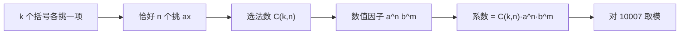

[[TOC]]

## 形式化题目

给定整数 $a,b,k,n,m$，其中 $0 \leqslant n,m \leqslant k \leqslant 1000$ 且 $n+m=k$，
求 $(ax+by)^k$ 的展开式中 $x^ny^m$ 项的系数对 $10007$ 取模的结果。

先看样例 $(x+y)^3$（$a=b=1,k=3$）的完整展开，题目要的是其中 $x^1y^2$ 那一项：

| 展开项 | 来源于哪些括号挑 $x$ | 组合数 | 系数 |
| --- | --- | --- | --- |
| $x^3$ | $\{1,2,3\}$ | $\binom{3}{3}=1$ | 1 |
| $x^2y$ | $\{1,2\},\{1,3\},\{2,3\}$ | $\binom{3}{2}=3$ | 3 |
| $xy^2$ | $\{1\},\{2\},\{3\}$ | $\binom{3}{1}=3$ | **3** |
| $y^3$ | $\varnothing$ | $\binom{3}{0}=1$ | 1 |

表格每一行是"$x$ 的次数固定"后的一种项：中间两列说明该项由多少个括号组合产生。
目标项 $xy^2$ 对应 $\binom{3}{1}=3$，与样例输出 `3` 一致。注意 $x$ 的次数一旦确定为
$i$，$y$ 的次数就被 $k-i$ 定死了，所以每种项只由一个组合数决定。

## 正解

### 思路

$(ax+by)^k$ 就是 $k$ 个相同的括号相乘。展开它的过程可以这样描述：**每个括号独立地
挑一个字母**——要么挑 $ax$，要么挑 $by$，乘起来得到一项；把所有 $2^k$ 种挑法的结果
合并同类项，就是展开式。

于是问"$x^ny^m$ 的系数"，等价于问：

- 有多少种挑法，使得恰好有 $n$ 个括号挑了 $ax$（剩下 $m$ 个只能挑 $by$）？
- 每种这样的挑法贡献多少数值因子？

第一个问题：从 $k$ 个括号里选 $n$ 个来挑 $ax$，选法数是 $\binom{k}{n}$。
（$m=k-n$ 是题目保证的，所以不必再乘"挑 $by$ 的方案数"，否则会重复计数。）

第二个问题：被选中的每个括号贡献一个因子 $a$，未被选中的每个括号贡献因子 $b$，
所以每次挑法都贡献 $a^nb^m$，与具体是哪几个括号无关。

两问相乘即得**二项式定理的通项**：

$$T_i=\binom{k}{i}(ax)^i(by)^{k-i}=\binom{k}{i}a^ib^{k-i}x^iy^{k-i}$$

我们要 $x$ 的次数为 $n$，因此取 $i=n$，$y$ 的次数自动等于 $k-n=m$，所求系数为

$$\binom{k}{n}a^nb^m \bmod 10007$$

下面这张图概括了从"挑括号"到最终表达式的推导链条：

图中左边是组合解释，右边是代数结果：中间那一步"选法数与数值因子相互独立"正是可以
把 $\binom{k}{n}$ 与 $a^nb^m$ 直接相乘的原因。

实现上有两个要点：

1. **组合数怎么算。** $k\leqslant 1000$，$\binom{1000}{500}$ 约有 300 位十进制数字。
   Python 的 `math.comb(k,n)` 直接给出精确整数，取模一次即可，不需要 Lucas 定理，
   也不必逐步乘除——因为 $n\leqslant 1000<10007$，不存在分母与模数不互素的麻烦。
2. **幂怎么算。** 直接用内置的三参数 `pow(base, exp, MOD)`，它在每一步乘法后就取模，
   中间结果永远小于 $10007$，$a,b$ 达到 $10^6$ 也不会溢出。

三个因子分别取模后相乘再取模，与"先算出精确系数再取模"结果相同，
因为 $(X\bmod p)(Y\bmod p)\bmod p=XY\bmod p$。

边界：$n=0$ 或 $m=0$ 时 `comb(k,0)=1`、`pow(x,0,MOD)=1`，公式自动退化为 $b^k$ 或 $a^k$；
$k=0$ 时输入必然是 $n=m=0$，输出 $1$，符合 $(ax+by)^0=1$。

### 代码

@include-code(./main.py, python)

### 复杂度

- **时间复杂度**：$O(k)$。`math.comb(k,n)` 处理 $k\leqslant 1000$ 规模的精确整数；
  两次 `pow(base, exp, MOD)` 各是 $O(\log k)$ 次模乘。相比"逐轮展开多项式"的
  $O(k^2)$ 次大整数乘法更快，且与答案无关的项完全不计算。
- **空间复杂度**：$O(k)$ 位，只用于存放 $\binom{k}{n}$ 的精确值。

## 总结

- 展开 $(ax+by)^k$ = "$k$ 个括号各挑一个字母"，挑法数就是组合数，通项为
  $T_i=\binom{k}{i}a^ib^{k-i}x^iy^{k-i}$。
- 题目保证 $n+m=k$，所以目标项由 $i=n$ 唯一确定，答案是一个封闭表达式
  $\binom{k}{n}a^nb^m$，不需要遍历、不需要 DP、不需要高精度手写。
- 取模在三个因子上分别做（`comb(...) % MOD` 与 `pow(..., MOD)`），既避免大数乘法，
  也不破坏结果。
- 同类模型：$(x+1)^n$ 系数、杨辉三角第 $k$ 行、独立重复试验概率
  $\binom{k}{n}p^n(1-p)^{k-n}$ 都是这条通项的直接应用。
