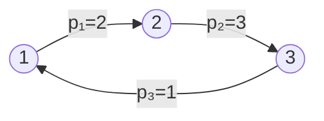
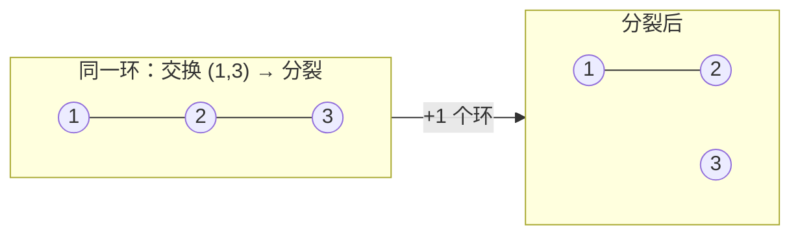

[[TOC]]

## 形式化题目

给定一个 $1\sim n$ 的排列 $p$，一次操作是任选两个位置交换它们的值。设把 $p$ 变成恒等排列
$1,2,\dots,n$ 至少需要 $m$ 次交换，求**长度恰为 $m$** 的操作序列条数（操作顺序不同算不同
方案），对 $10^9+9$ 取模。

先看样例 $p=2\ 3\ 1$。把它按「值 $\to$ 下标」连边，得到一个长度为 $3$ 的轮换：

| 位置 $i$ | 1 | 2 | 3 |
| --- | --- | --- | --- |
| $p_i$ | 2 | 3 | 1 |
| $p_i \to i$ | $1\leftarrow 2$ | $2\leftarrow 3$ | $3\leftarrow 1$ |

（沿箭头看：位置 1 的值 2 应去位置 2，位置 2 的值 3 应去位置 3，位置 3 的值 1 应去位置 1，
三者构成一个 3-环。）轮换个数 $k=1$，$n=3$，所以 $m=3-1=2$；题面给出的 3 种两步方法
正对应这个环的 3 种「拆法」。

## 正解

### 思路

**第一步：最少交换次数 $m$ 是多少？**

把排列分解成轮换（不动点也算长度为 1 的轮换），设轮换个数为 $k$。交换两个位置 $x,y$ 时：

- 若 $x,y$ 在**同一个**轮换里：这个环被**分裂**成两个环，$k$ 增加 $1$；
- 若 $x,y$ 在**不同**轮换里：两个环**合并**成一个，$k$ 减少 $1$。

图中 3-环 $\{1,2,3\}$ 在环内交换一次后断成 $\{1,2\}$ 与 $\{3\}$：环内交换的效果就是把环
剪成两段。而目标状态 $1,2,\dots,n$ 恰有 $n$ 个轮换（全是长度 1），所以任何方案都至少需要
$n-k$ 步；另一方面，不断在环内交换总能一步步把环剪碎，达到 $n-k$ 步。于是

$$m = n - k.$$

**第二步：$m$ 步的方案长什么样？**

关键约束：**合并步不允许出现**。若方案中出现一次「合并」（$k$ 减 1），那么之后还得多用一步
把它分裂回来，总步数必然超过 $n-k$。因此每个 $m$ 步方案里**每一步都是分裂**，于是：

- 长度为 $c$ 的轮换在整个方案中恰被分裂 $c-1$ 次；
- 不同轮换的操作互不干扰，操作集合可以按组划分。

**第三步：只数每一组的「分裂序列」。**

把整个方案逆过来看：把 $p$ 排好序的一串分裂，逆过来就是把 $c$ 个元素用 $c-1$ 次对换
**合并**成一个 $c$-轮换。这正是经典结论（Dénes 定理，其组合证明即 Cayley 公式
$c^{c-2}$）：

> 固定 $c$ 个元素，把它们用 $c-1$ 个对换的乘积表出**某一个** $c$-轮换的有序方式数恰为
> $c^{c-2}$。

所以每组贡献 $c^{c-2}$ 种。最后是组间的穿插：$m$ 个操作分属各组，同组内的相对顺序已被
$c^{c-2}$ 定死，而组与组之间可以任意穿插，共有多重排列数

$$\frac{m!}{\prod_i (c_i-1)!}$$

种排法。合在一起，把每组的 $\dfrac{1}{(c_i-1)!}$ 分摊回去：

$$\boxed{\ \text{ans} = m! \prod_{c_i>1} \frac{c_i^{\,c_i-2}}{(c_i-1)!} \pmod{10^9+9}\ }$$

用三个样例核对一下闭式：

| 排列 | 轮换长度 | $m$ | 计算 | 答案 |
| --- | --- | --- | --- | --- |
| $2\ 3\ 1$ | $\{3\}$ | 2 | $2!\cdot\dfrac{3^1}{2!}$ | **3** |
| $2\ 1\ 4\ 3$ | $\{2,2\}$ | 2 | $2!\cdot\dfrac{2^0}{1!}\cdot\dfrac{2^0}{1!}$ | **2** |
| $1\ 2$ | $\varnothing$ | 0 | $0!=1$ | **1** |

与题面输出完全一致。实现上只需：读入后 $O(n)$ 找出所有轮换长度，再对每个 $c>1$ 做一次
快速幂 $c^{c-2}$ 和一次费马小定理逆元 $((c-1)!)^{-1}$，全部乘起来。注意模数是
$10^9+9$（质数），不是常见的 $10^9+7$。

### 代码

Python 版：

@include-code(./main.py, python)

C++ 版（同一算法）：

@include-code(./main.cpp, cpp)

### 复杂度

- **时间复杂度**：每组数据轮换分解 $O(n)$，每个非平凡轮换各一次 $O(\log c)$ 快速幂，合计
  $O(n \log n)$ 上界；读入用一次性 `read().split()`。
- **空间复杂度**：$O(n)$，排列数组和访问标记。

## 总结

这道题的骨架是「模型变换 + 组合计数」：先用轮换结构把「最少交换次数」变成 $m=n-k$，
再用「最短方案中每步都是分裂」把方案按轮换分组，最后用 Dénes 定理（Cayley 公式的
$c^{c-2}$）收尾得到闭式。全程没有搜索、没有 DP，计数的关键在于找到那个可以逐组独立
计数、再乘穿插数合并的分解方式。

## 图示解析

从轮换视角完整回放样例 $2\ 3\ 1$ 的方法二（先交换 $2,1$，再交换 $3,2$）：

| 步骤 | 操作 | 排列 | 轮换个数 |
| --- | --- | --- | --- |
| 初始 | — | $2\ 3\ 1$ | 1（一个 3-环） |
| 第 1 步 | 交换位置 1、2 | $1\ 3\ 2$ | 2（3-环分裂出 $\{1\}$） |
| 第 2 步 | 交换位置 2、3 | $1\ 2\ 3$ | 3（全是不动点） |

每一步环数都 $+1$，两步正好把唯一的 3-环拆成三个不动点——这就是「最短方案每步都在分裂」
的具体样子。
