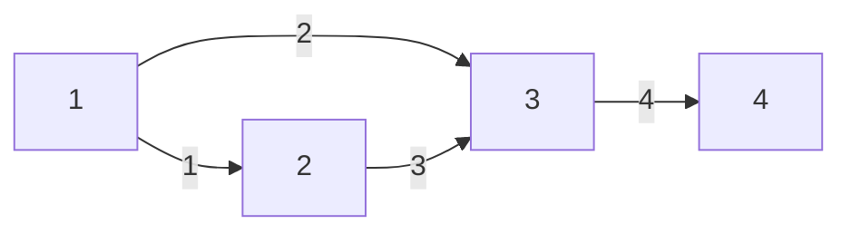

[[TOC]]

## 形式化题目

给定一张有向无环图，$N$ 个点、$M$ 条边，每条边带一个正长度 $c$。起点固定为 $1$，终点固定为 $N$；保证 $1$ 能到达所有点，所有点也都能到达 $N$。

从 $1$ 出发按下面的规则随机游走：每到达一个点 $u$，若它有 $K$ 条出边，就以 $1/K$ 的等概率选一条离开；一旦走到 $N$ 就立即停下。求停下时，走过的所有边长度之和的期望。

题面样例的图结构如下（每条边上的数字是长度）：



从点 $1$ 出发有两条等概率的出边：走 $1 \to 2$（长度 $1$）或走 $1 \to 3$（长度 $2$）。样例输出是 `7.00`：两条路的平均长度 $(1+3+4)$ 与 $(2+4)$ 即 $8$ 与 $6$，期望 $(8+6)/2 = 7$。

## 正解

### 思路

**先看最难想到的一步：不要枚举路径。** 最朴素的做法是列出所有可能的路径、按概率加权求平均。但每个点有 $K$ 条出边，路径数最坏是 $K^{N}$ 量级——本地数据里就有出度接近 $10^5$ 的点，枚举必然崩掉。既然"路径"这个对象太大，就把它换成"从某个点出发的**期望**"这个更小的对象。

**关键观察：期望满足一个只依赖后继的递推。** 设 $f[u]$ 表示"从 $u$ 出发走到 $N$ 的路径总长度期望"。青蛙在 $u$ 时做的第一件事是均匀随机挑一条出边，若挑中 $u \to v$（长度 $c$），那么这次游走的长度就等于 $c$ 加上"从 $v$ 继续走到 $N$"的随机长度。而**从 $v$ 继续走的过程与"是怎么走到 $v$ 的"完全无关**——这就是马尔可夫性，它允许我们把一长串历史压缩成一个数 $f[v]$。由全期望公式：

$$f[u] \;=\; \frac{1}{|out(u)|}\sum_{(u \to v,\ c) \in out(u)} \bigl(c + f[v]\bigr) \;=\; \frac{\sum c \;+\; \sum f[v]}{|out(u)|}.$$

也就是说，$f[u]$ 只由两部分决定：**所有出边的长度和**，以及**所有后继的 $f$ 之和**，再除以出度。长度和可以在读入时预先按点累加好。

**第二个观察：递推只指向后继，所以拓扑序倒推即可。** 递推式的右边只出现后继的 $f$，而图是 DAG，不存在从后继绕回自己的环。于是按**逆拓扑序**（先算 $N$，最后算 $1$）处理，每个状态恰好计算一次，既不需要解方程组，也不需要迭代到收敛。附带的好处是：正因为无环，随机游走在有限步内必然停在 $N$，$f$ 的期望才有定义。

终点怎么处理？题面是"到达终点即停止"，所以长度只算到踏进 $N$ 的那条边为止。令 $f[N] = 0$，递推式在 $v = N$ 时就自动只累加边长 $c$，语义正好对上。实现上把这个语义写死：$u = N$ 时不参与递推。**不要**改成"出度为 $0$ 时不递推"——那要求 $N$ 是唯一没有出边的点，而题面只保证"所有点都能到 $N$"，没保证终点没有出边。

下面是样例的完整倒推过程，$f$ 按逆拓扑序 $4 \to 3 \to 2 \to 1$ 逐个算出：

| 步骤 | $u$ | 出边 | $\sum c$ | $\sum f[v]$ | 出度 $K$ | $f[u] = (\sum c + \sum f[v])/K$ |
| --- | --- | --- | --- | --- | --- | --- |
| 1 | 4 | 无 | — | — | 0 | $0$（终点，固定为 $0$） |
| 2 | 3 | $3 \to 4$，长 $4$ | $4$ | $0$ | $1$ | $(4+0)/1 = 4$ |
| 3 | 2 | $2 \to 3$，长 $3$ | $3$ | $4$ | $1$ | $(3+4)/1 = 7$ |
| 4 | 1 | $1 \to 2$、$1 \to 3$ | $1+2=3$ | $7+4=11$ | $2$ | $(3+11)/2 = 7$ |

表格逐列读：第 2 步 $f[3] = 4$ 是因为从 $3$ 只有一条路，长度就是边 $3 \to 4$ 的 $4$；第 4 步把两条出边各自的"边长 + 后继期望"相加再平均，得到 $(1+7)$ 与 $(2+4)$ 的均值 $7$，与样例输出 `7.00` 一致。

**实现要点。** 逆拓扑序靠 Kahn 算法：先把所有入度为 $0$ 的点入队，每次取出队首、把它的后继入度减一、减到 $0$ 就入队。由于 $1$ 能到达所有点，除 $1$ 外每个点都有入边，初始入度为 $0$ 的只有 $1$，所以 $1$ 排在整个队列的最前面；队列的**正序就是一个拓扑序**（$1$ 在头、$N$ 在尾），倒过来就是我们要的逆拓扑序。代码里用"在同一个列表里边遍历边追加"来代替显式队列，省掉一层下标管理。

### 代码

@include-code(./main.py, python)

### 复杂度

- 时间：建图 $O(M)$；拓扑排序每个点出队一次、每条边被松弛一次 $O(N+M)$；逆拓扑序递推对每条出边访问一次 $O(N+M)$。合计 $O(N+M)$。题面 $M \leqslant 2N$，即 $O(N)$，与标准 C++ 写法同阶。
- 空间：出边表存 $M$ 个边编号，终点表存 $M$ 个整数，入度数组、拓扑序、$f$ 数组各 $O(N)$，合计 $O(N+M)$。

## 总结

- 期望类问题优先试"把整条路径的期望换成一个可递推的状态"。本题里 $f[u]$ 只与后继有关，是**马尔可夫性**把指数级的路径枚举压成了线性递推。
- 递推方向由依赖关系决定：只依赖后继 $\Rightarrow$ 逆拓扑序；只依赖前驱 $\Rightarrow$ 正拓扑序。DAG 保证了这种顺序一定存在。
- 常数项（边长和）在递推式里是仿射项，可以在读入时预先按点累加，避免倒推时重复扫边。
- 边界要按**题面语义**写：终点是"到达即停止"（$u = N$ 就不递推），而不是"没有出边就不递推"——后者是数据性质，不是题目保证。

## 图示解析

这张图串起本题从建模到得到答案的主线：

```text
枚举所有路径按概率加权          路径数最坏 K^N，不可行
`- 换成状态：f[u] = 从 u 出发到 N 的期望路程
   |- 马尔可夫性：之后怎么走与怎么来的无关
   |  `- 全期望公式：f[u] = (Σ 边长 + Σ f[后继]) / 出度
   `- 依赖方向：只用后继
      |- 正向 Kahn：只有 1 初始入度为 0 → 队列正序即拓扑序（1 在头）
      `- 逆拓扑序倒推：先 f[N]=0，最后读出 f[1] → 输出两位小数
```

读图时注意两个分叉的因果关系：第一个分叉说明"为什么可以只用后继"，第二个分叉说明"为什么可以一遍算完"。图中每一步都只用到正文已经证明过的结论，不替代正文里的递推式与样例推演。
