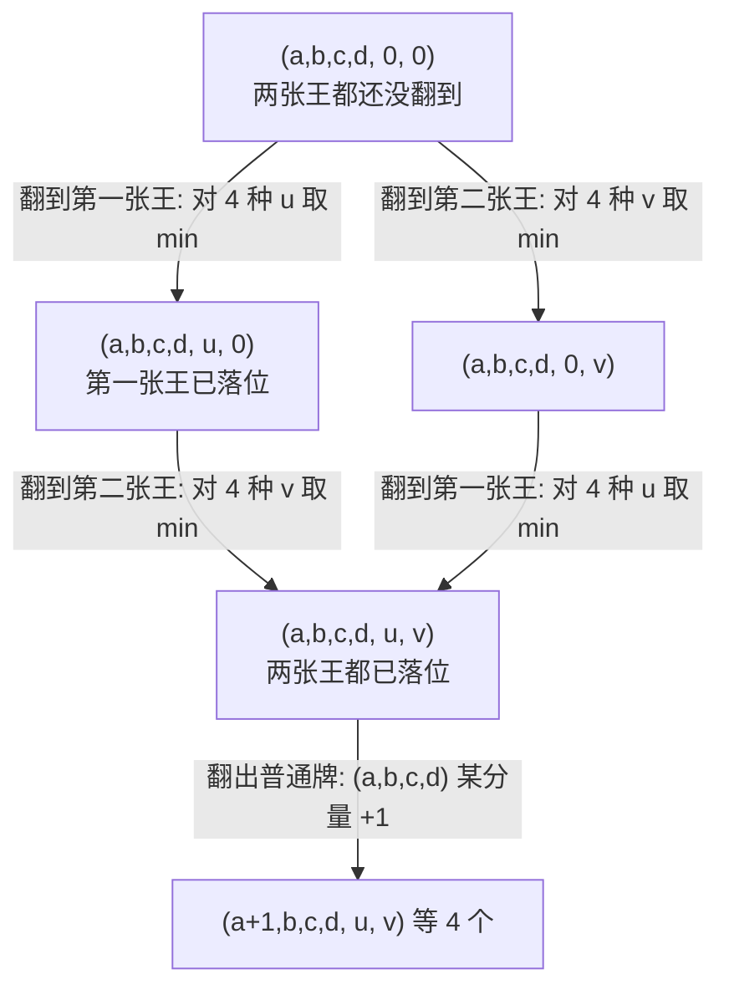

[[TOC]]

## 形式化题目

一副 54 张牌（黑桃、红桃、梅花、方块各 13 张，外加大王、小王各一张）被均匀随机地洗成一个排列，从前往后逐张翻开。

每翻到一张普通牌，就把它放进它花色对应的堆里；每翻到一张王，**就在翻开的这一刻**把它当成四种花色之一放进对应的堆里（这个选择由翻牌者决定，目的使此后的期望尽量小）。

求：四堆张数第一次同时满足"黑桃 $\geqslant A$、红桃 $\geqslant B$、梅花 $\geqslant C$、方块 $\geqslant D$"这个时刻，**已经翻开的牌数的期望** $E$。

$0 \leqslant A,B,C,D \leqslant 15$；若四堆无论如何都凑不齐，输出 `-1.000`。

样例 $A,B,C,D = 1,2,3,4$ 的答案是 `16.393`，可作为全文的验收数据。

## 正解

### 思路

**朴素路线与它的瓶颈。** 最直接的写法是按步数推概率分布：设 $P_t(a,b,c,d,x,y)$ 表示"翻了 $t$ 张后落在状态 $(a,b,c,d,x,y)$"的概率，从 $t=0$ 推到 $t=54$，把每层中"首次达标"的概率按 $t$ 加权求和。这个做法正确，但要维护 $54\times$ 状态数 的分布表，还要在每一层对王做一次取 $\min$ 的决策，既臃肿又容易写错。

瓶颈不在状态数，而在**它把"期望"拆成了 54 层概率**。其实我们只需要一个数：从当前局面出发，还要翻多少张。于是换方向——**逆推期望**：

$$
f(a,b,c,d,x,y) \;=\; \text{处于该局面时，还需翻开的牌数的期望}.
$$

答案为 $f(0,0,0,0,0,0)$。每个状态只存一个数，一遍枚举即可。

**关键观察一：王的指派必须在翻开的瞬间就进状态。** 这是本题唯一的难点，也是最多人写错的地方。题面说的是"**每翻开一张**……如果是大王或者小王，Admin 将会把它作为某种花色的牌放入对应堆中"——决策发生在翻开的瞬间，而且**不可撤回**。两种解读的答案并不相同：

| 解读 | 第一张王何时定花色 | $E(1,2,3,4)$ | $E(10,12,9,3)$ |
| --- | --- | --- | --- |
| 正解 | 翻开时立即定，之后不再改 | **16.393** | **44.202** |
| 误读 | 先把王搁在一边，等全部翻完再补缺 | 15.975 | 43.519 |

误读之所以答案偏小，是因为它让玩家"事后诸葛"：等看清缺哪一门再补，白拿了一次信息优势。样例 `16.393` 与数据仓的真实数据都能把两者区分开，所以**王必须作为状态的一部分**：$x\in\{0,1,2,3,4\}$ 表示第一张王"还没翻到"或"已指定给第 $x$ 门"，$y$ 同理表示第二张王。

**关键观察二：状态只需记四堆张数加两张王的指派。** 王翻到后一定立刻落进某一堆，所以"没落位的王"最多剩 $2-p$ 张（$p$ 是已翻到的王数）。状态就是 $(a,b,c,d,x,y)$：

- $a,b,c,d$ 是四堆里**普通牌**的张数（$0..13$）；
- $x,y \in \{0,1,2,3,4\}$，$0$ 表示该王还没翻到，$1..4$ 表示它被指定成了黑桃/红桃/梅花/方块。

于是"某一门现在有多少张"是 $a + [x = u] + [y = u]$，**不是** $a$。任何"是否达标"的判断都必须带上 $x,y$，否则王补上的那一张会被忽略。

状态总数是 $14^4 \times 25 = 960\,400$（四堆张数各取 $0..13$），每个状态 $O(1)$ 次转移。代码里把计数维的长度开成 15，是为了让"王补上来的那一张"也有下标可用，见复杂度一节。

**转移：一步的成本加后继的加权平均。** 令

$$
\text{left} \;=\; 54 - a - b - c - d - [x > 0] - [y > 0]
$$

为**还没翻开的牌数**。它由四门剩下的普通牌 $(13-a)+(13-b)+(13-c)+(13-d)$ 和没落位的王 $[x>0]+[y>0]$ 组成。洗牌均匀 ⇒ 每一步都是从剩余牌堆里等概率取一张，所以

$$
f(a,b,c,d,x,y)=\frac{1}{\text{left}}\Bigl(\text{left}+\sum_{\text{next}}\omega\cdot f(s')\Bigr)
$$

其中的权重 $\omega$ 是"剩余牌堆里这类牌有几张"：

| 下一张 | $\omega$ | 后继状态 |
| --- | --- | --- |
| 黑桃 | $13-a$ | $(a{+}1,b,c,d,x,y)$ |
| 红桃 | $13-b$ | $(a,b{+}1,c,d,x,y)$ |
| 梅花 | $13-c$ | $(a,b,c{+}1,d,x,y)$ |
| 方块 | $13-d$ | $(a,b,c,d{+}1,x,y)$ |
| 大王（仅当 $x=0$） | $1$ | $\min\limits_{u \in \{1,2,3,4\}} f(a,b,c,d,u,y)$ |
| 小王（仅当 $y=0$） | $1$ | $\min\limits_{u \in \{1,2,3,4\}} f(a,b,c,d,x,u)$ |

括号中的 `left` 正好等于所有 $\omega$ 之和：$(13-a)+\cdots+(13-d)+[x>0]+[y>0]$。除以 `left` 后，"1"变成"这一步必然花掉 1 张牌"，$\omega f(s')$ 变成后继期望按抽中概率的加权。

**王的两项为什么取 $\min$。** 剩余牌堆里"下一张是王"只有 1 个位置，翻到它时玩家会当场挑一门使期望最小的花色放进去，所以对四种指派取最小值；这个最小值就是"使得放入之后 $E$ 尽可能小"的字面含义。注意 $x,y$ 只会从 $0$ 变成非 $0$、永不变回去，这保证了状态图无环。

**枚举顺序。** 四个计数后继都只在某个分量上 $+1$，王的后继只把某个 $0$ 变成非 $0$，所以依赖方向一致：

- 外层 $a,b,c,d$ 从 13 **递减到 0**，保证 $a{+}1,b{+}1,c{+}1,d{+}1$ 已经算过；
- 内层 $(x,y)$ 按"已落位王数 $p=[x>0]+[y>0]$ **从 2 到 0**"枚举，保证 $x=0$ 时要读的 $(u,y)$、$y=0$ 时要读的 $(x,u)$ 已经算过。

**终止、不可行与哨兵。**

- 若 $a+[x{=}1]+[y{=}1] \geqslant A$ 且另外三门同理，则 $f=0$（已经停手，不必再翻）。这里必须是**四个不等式同时成立**——目标里出现 $0$ 时，$a=0$ 本身就"达标"了，但绝不能就此停手。
- 可不可行只看牌库：每门普通牌只有 13 张，超出部分只能靠两张王补，所以
  $$\text{不可行} \iff \sum_{u \in \{A,B,C,D\}} \max(0, u-13) > 2 .$$
  例如 $(14,13,12,15)$ 的缺口是 $1+0+0+2=3>2$，直接输出 `-1.000`。反过来只要缺口 $\leqslant 2$ 就一定可行：两张王各补一个缺口即可。
- 兜底：万一在某个状态牌已翻光而仍未达标（正常输入不会走到），填入一个远大于答案上限 54 的哨兵 `1e30`，防止把不可能的局面当成 0。

**用样例核对转移式。** 取 $A,B,C,D=1,2,3,4$，起点 $(0,0,0,0,0,0)$ 的六个后继如下表。表的读法是：每行是"下一张翻出什么"这一分支，$\omega$ 是它在剩余 54 张里的张数，最后一列是它对期望的贡献：

| 下一张 | $\omega$ | 后继 $f$ | $\omega \cdot f$ |
| --- | --- | --- | --- |
| 黑桃 | 13 | 16.018809 | 208.244516 |
| 红桃 | 13 | 15.754036 | 204.802471 |
| 梅花 | 13 | 15.243027 | 198.159356 |
| 方块 | 13 | 14.636730 | 190.277494 |
| 大王 → 方块 | 1 | 14.864184 | 14.864184 |
| 小王 → 方块 | 1 | 14.864184 | 14.864184 |
| 合计 | 54 | — | 831.212205 |

于是 $f(\text{起点}) = 1 + \dfrac{831.212205}{54} = 16.392819\ldots$，四舍五入正是样例的 `16.393`。注意目标的方块需求 $D=4$ 最大，所以两张王都优先补方块——这正是"翻到就选、并且选得最优"的直接体现；如果王可以留到最后再决定，这个数字会变成 15.975。

**再做一个能心算的校验。** 只要求一门（$A=B=C=0$，$D=d$）时，有用的牌恰好是"13 张方块 + 2 张王"共 15 张，且它们不会把方块堆撑爆，于是 $E(0,0,0,d) = d \cdot \frac{54+1}{15+1} = d \cdot \frac{55}{16}$，$d=1..4$ 依次是 $3.4375,\ 6.875,\ 10.3125,\ 13.75$。DP 表给出的值与之逐位吻合，这说明递推式里的权重与分母都没有写反。下表是更一般的两门小目标 $E(0,0,c,d)$：

| $c \backslash d$ | 0 | 1 | 2 | 3 | 4 |
| --- | --- | --- | --- | --- | --- |
| 0 | 0.000 | 3.438 | 6.875 | 10.312 | 13.750 |
| 1 | 3.438 | 5.231 | 7.780 | 10.752 | 13.955 |
| 2 | 6.875 | 7.780 | 9.558 | 11.872 | 14.605 |
| 3 | 10.312 | 10.752 | 11.872 | 13.639 | 15.829 |
| 4 | 13.750 | 13.955 | 14.605 | 15.829 | 17.587 |

表的行是梅花目标 $c$、列是方块目标 $d$，单元格是 $E(0,0,c,d)$。两点可读：一是沿主对角线对称（两门花色完全对称），二是每行每列都严格递增（要求越多，期望越大），且第 0 行第 0 列恰好落在 $\frac{55}{16}d$ 上——这正是上面那个闭式。

### 代码

@include-code(./main.py, python)

### 复杂度

- 时间：四重循环枚举 $14^4 \times 25 = 960\,400$ 个状态，每个状态只做 4 次乘法、至多 2 次四选一取最小、1 次乘法（用预计算的倒数表代替除法），即 $O(1)$。总计 $O(14^4 \times 25) \approx 9.6 \times 10^5$，与"推 54 层概率分布"的 $O(54 \times \text{状态数})$ 相比把常数 54 消掉了。实测单组约 **0.3–0.4 s**（Apple Silicon / CPython），远低于 1000 ms 限时。
- 空间：期望表用 `array('d')` 存 $15^4 \times 25 = 1\,265\,625$ 个 float64（计数维开成 15 而非 14，多留一格给"$a=14$"这种"某门被王补满 14 张"的局面），约 **9.7 MB**；加上倒数表与解释器开销，进程峰值 RSS 约 **34 MB**，低于 128 MB 限制。若改用 `list[float]`，同样的表要 50 MB 以上。

## 总结

- 期望题的第一反应应该是"**定义 f(状态) = 从此出发还需的代价**"，而不是"按步数推概率分布"。前者每个状态只存一个数，后者要存 54 层概率。
- 本题的全部难点在于**决策的时机**：王的花色在翻开那一刻就定死，所以它必须成为状态的一部分（$x,y$），转移时对四种指派取 $\min$ 才等于"选择使 $E$ 最小的花色"。若误以为王可以留到最后补缺，样例 $(1,2,3,4)$ 会得到 15.975 而不是 16.393。
- "已达标"必须四个不等式同时成立；"某一门够不够"必须用 $a+[x{=}u]+[y{=}u]$，别忘了王已经贡献过的那一张。
- 分母 `left` 要扣掉没落位的王——漏掉它会让所有概率同时偏大、答案系统性偏小。
- 状态依赖方向一致（计数维只增、王维只从 0 变非 0）⇒ 无需递归或拓扑排序，四重逆序枚举即可一遍填完表。

## 图示解析

先用一张图说明"枚举顺序为什么合法"。状态之间只靠两种箭头连接，箭头方向就是计算顺序：



图中三层就是 $p=[x>0]+[y>0]$ 的取值 0、1、2；同层内 $(x,y)$ 的顺序任意，因为王一旦落位就不再变动，两层之间不可能互相引用。所有箭头都指向"更晚计算"的方向，所以按 $p$ 从 2 降到 0 枚举时，每个后继都已经算出。最下面那条自环状的箭头表示普通牌的转移：它只让 $(a,b,c,d)$ 的某个分量加 1，与王无关，因此被外层 $a,b,c,d$ 的递减枚举一并解决。

再看整条算法主线：

```text
54 张牌随机排列，王在翻开瞬间指定花色
`- 朴素：按步数推 54 层概率分布        <- 正确但臃肿，常数 54
   `- 换成 f(状态) = 从此还需翻的期望   <- 马尔可夫性：只依赖当前局面
      |- 状态 (a,b,c,d,x,y)：x,y 是两张王的指派，0 = 还没翻到
      |  `- 王必须进状态：错过时机就变成"事后诸葛"（16.393 vs 15.975）
      |- 转移 f = 1 + (Σ ω·f(后继)) / left，ω 是剩余张数
      |  |- 普通牌：ω = 13-a / 13-b / 13-c / 13-d
      |  `- 翻到王：ω = 1，对 4 种花色取 min（题面要求"使 E 尽可能小"）
      |- 边界：四门都达标才 f=0；缺口和 > 2 输出 -1.000
      `- 顺序：a,b,c,d 递减 + 王按已落位张数递减 -> 一遍填表
```

读图时抓住两个分叉的因果：第一个分叉说明"为什么可以只用一个状态数代替整段历史"，第二个分叉说明"为什么一次遍历就能算完、不需要解方程"。图中每一步都只用到正文已经给出的递推式，不替代正文中的公式与样例核对。
