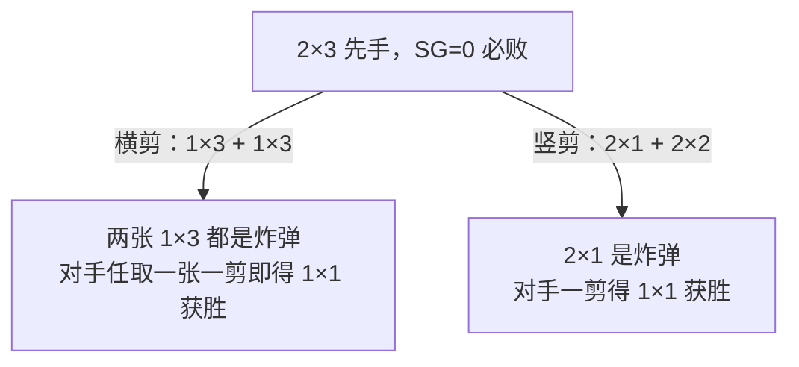
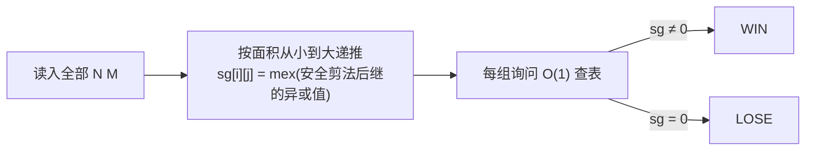

[[TOC]]

## 形式化题目

给定一张 $N \times M$ 的矩形网格纸（$2 \leqslant N,M \leqslant 200$），两名玩家轮流行动。每次行动任选当前存在的**一张**纸，沿某一行或某一列的格线把它剪成**两部分**。**首先剪出 $1 \times 1$ 网格纸的玩家获胜**。双方均采取最优策略，判断先手必胜（输出 `WIN`）还是必败（输出 `LOSE`）。输入包含多组询问，每组给出一对 $N, M$。

## 正解

### 思路

#### 从"一张纸的游戏"到"局面 = 若干纸的和"

观察每次操作的性质：一次只选**一张**纸去剪，其余纸原封不动。也就是说，每张纸都是一个独立的子游戏，整个局面就是这些子游戏的**和（Sum of Games）**。这正是公平组合游戏的经典场景，直接套用 **Sprague-Grundy 定理（SG 定理）**：

- 一张纸对应一个 SG 值 $\operatorname{SG}(i, j)$；
- 整个局面（多张纸共存）的 SG 值等于所有纸的 SG 值的**按位异或和**；
- **先手必败 $\iff$ 初始局面的 SG 异或和为 $0$**。

由于初始只有一张 $N \times M$ 的纸，问题化为：求出单张纸的 $\operatorname{SG}(N, M)$，判断它是否为 $0$。

#### 单张纸的 SG 值怎么算

先写朴素定义。一张 $i \times j$ 的纸共有 $(i-1)$ 条横格线与 $(j-1)$ 条竖格线，所以剪法共 $(i-1)+(j-1)$ 种；沿第 $a$ 条横线剪得到 $a \times j$ 与 $(i-a) \times j$ 两张纸，后继局面的 SG 值为二者异或 $\operatorname{SG}(a,j) \oplus \operatorname{SG}(i-a,j)$。于是

$$\operatorname{SG}(i, j) = \operatorname{mex}\big(\{\, \operatorname{SG}(a,j) \oplus \operatorname{SG}(i-a,j) \,\} \cup \{\, \operatorname{SG}(i,b) \oplus \operatorname{SG}(i,j-b) \,\}\big)$$

递推按面积从小到大进行（剪出来的纸一定更小），$N, M \leqslant 200$ 时状态 $O(N^2)$、转移 $O(N)$，总计 $O(N^3) \approx 8 \times 10^6$，轻松通过。

#### 关键：处理"先剪出 1×1 者获胜"这条特殊规则

SG 定理的标准形式假设"无法行动者败"，而本题是"**先剪出 $1\times 1$ 者胜**"，需要做一个转化。

考虑 $1 \times k\ (k \geqslant 2)$ 的纸：面对它的人沿唯一的格线一剪，就得到 $1 \times 1$，**立即获胜**。所以我们把 $1 \times k$ 称为一枚**炸弹**——谁的局面里出现 $1 \times k$，轮到谁走谁就赢。

由此得到两个推论：

1. **任何剪出 $1 \times k$ 部分的剪法都是"送炸弹"**：剪完后炸弹在**对手**面前，对手下一手直接获胜。这类剪法是自寻死路，理性的玩家绝不会主动选择——它们对"是否存在 SG 为 $0$ 的后继"没有任何贡献，计算 mex 时可以整体忽略。
2. **如果对手把炸弹送上门**（即收到的局面里已有 $1 \times k$），我直接剪它获胜。在递推里这意味着：含 $1 \times k$ 部分的局面"面对者必胜"，其 SG 值为 $0$（它是某些剪法的必胜后继，等价于"安全剪法"集合中 SG 为 $0$ 的出边，不影响 mex 的 $0$ 值判定）。

于是只保留"安全剪法"——剪开后两部分长宽都 $\geqslant 2$ 的剪法——来计算 mex：

$$\operatorname{SG}(i, j) = \operatorname{mex}\Big(\{\underbrace{\operatorname{SG}(a,j) \oplus \operatorname{SG}(i-a,j)}_{2 \leqslant a \leqslant i-a}\} \cup \{\underbrace{\operatorname{SG}(i,b) \oplus \operatorname{SG}(i,j-b)}_{2 \leqslant b \leqslant j-b}\}\Big)$$

并约定 $\operatorname{SG}(i, 1) = \operatorname{SG}(1, j) = 0$（$1 \times k$ 是炸弹，面对它的人必胜，SG 记 $0$）。

另一个实现细节：剪在 $a$ 处与剪在 $i - a$ 处得到的两块互换，异或值相同，所以枚举 $a$ 只需到 $\lfloor i/2 \rfloor$，转移常数减半。

#### 用样例验证模型

$\operatorname{SG}(2,2)$：唯一的剪法是 $1\times2 + 1\times2$，送出两枚炸弹，不属于安全剪法，mex 空集得 $0$ → `LOSE`。$\operatorname{SG}(3,2)$：横剪得 $1\times2+2\times2$（送炸弹），竖剪不存在（宽只有 2，无内部竖线），同样没有安全剪法，$0$ → `LOSE`。$\operatorname{SG}(4,2)$：剪成 $2\times2+2\times2$，$0 \oplus 0 = 0$ 出现在后继集合中，mex 至少为 $1$ → `WIN`。三个样例全部对上。

$\operatorname{SG}$ 值不为 $0$ 并不代表"这张纸不能剪"，而是"怎么剪都会把主动权交给对手"——这正是"无法行动者败"与"先剪出 $1\times1$ 者胜"两种规则之间微妙的差异所在。

一张 $2 \times 3$ 的纸从被剪到分出胜负的完整链条：

可以看到 $2 \times 3$ 的所有剪法（$i=2$ 的 $1$ 条横线、$j=3$ 的 $2$ 条竖线）都会产生一枚 $1 \times k$ 炸弹，安全剪法集合为空。先手无论怎么走都在送炸弹，故为必败态。反过来，$4 \times 2$ 先手一剪成 $2\times2+2\times2$，两张 $2 \times 2$ 都是 SG 为 $0$ 的"死纸"（谁先动谁送命），异或和为 $0$ 的局面轮到对手，先手稳赢。

#### SG 表长什么样

递推得到的部分 SG 表（行、列均为纸的长和宽，$2 \sim 12$）：

| $\operatorname{SG}(i,j)$ | $j=2$ | $3$ | $4$ | $5$ | $6$ | $7$ | $8$ | $9$ | $10$ | $11$ | $12$ |
| --- | - | - | - | - | - | - | - | - | -- | -- | -- |
| $i=2$ | **0** | **0** | 1 | 1 | 2 | **0** | 3 | 1 | 1 | **0** | 3 |
| $i=3$ | **0** | **0** | 1 | 1 | 2 | **0** | 3 | 1 | 1 | **0** | 3 |
| $i=4$ | 1 | 1 | 1 | 1 | 1 | 1 | 1 | 1 | 1 | 1 | 1 |
| $i=5$ | 1 | 1 | 1 | 1 | 1 | 1 | 1 | 1 | 1 | 1 | 1 |
| $i=6$ | 2 | 2 | 1 | 1 | 1 | 2 | 1 | 1 | 1 | 2 | 1 |
| $i=7$ | **0** | **0** | 1 | 1 | 2 | **0** | 3 | 1 | 1 | **0** | 3 |
| $i=8$ | 3 | 3 | 1 | 1 | 1 | 3 | 1 | 1 | 1 | 3 | 1 |
| $i=9$ | 1 | 1 | 1 | 1 | 1 | 1 | 1 | 1 | 1 | 1 | 1 |
| $i=10$ | 1 | 1 | 1 | 1 | 1 | 1 | 1 | 1 | 1 | 1 | 1 |
| $i=11$ | **0** | **0** | 1 | 1 | 2 | **0** | 3 | 1 | 1 | **0** | 3 |
| $i=12$ | 3 | 3 | 1 | 1 | 1 | 3 | 1 | 1 | 1 | 3 | 1 |

观察重点：

- 加粗的 $0$ 就是必败格：$2 \times 2$、$3 \times 2$（样例）以及 $2 \times 3$、$7 \times 2$、$11 \times 3$ 等，并非只有"剪不动"的纸才是必败态。
- 第 $4, 5, 9, 10$ 行整行都是 $1$：这些纸存在一类安全剪法把局面导回异或和 $0$，但没有后继的异或值恰好为 $1$，mex 卡在 $1$。
- 表中数值最大只到 $3$，后继 SG 异或值的分布非常集中，这也是"只保留安全剪法"后递推仍然闭合（不依赖被忽略剪法）的直观体现。
- 注意 SG 表没有简单的小周期（如第 $6$ 行与第 $2$ 行不同），不能试图找规律直接输出，老老实实递推即可。

整个求解流程：

### 代码

Python 版：

@include-code(./main.py, python)

C++ 版（同一算法）：

@include-code(./main.cpp, cpp)

### 复杂度

- 时间复杂度：$O(N^3)$ 建表（$N, M \leqslant 200$ 时约 $8 \times 10^6$ 次状态转移计算），每组询问 $O(1)$ 查表。
- 空间复杂度：$O(N^2)$ 的 SG 表。

## 总结

- 把"每步只动一张纸"识别为**独立子游戏的和**，用 SG 定理把多纸局面压成异或和，初始只有一张纸，问题就是求 $\operatorname{SG}(N,M)$ 是否为 $0$。
- "先剪出 $1\times1$ 者胜"通过**炸弹（$1 \times k$）**分析转化为标准 SG 规则：送炸弹的剪法必败，计算 mex 时只保留两部分长宽都 $\geqslant 2$ 的安全剪法。
- 剪切位置 $a$ 与 $i-a$ 对称，枚举到一半即可；递推按面积从小到大，$O(N^3)$ 建表后 $O(1)$ 回答询问。
- 易错点：SG 为 $0$ 不等于"不能剪"；不要把"剪出 $1\times1$ 直接获胜"的剪法当成普通后继参与 mex。

## 图示解析

### 一个必败局面的完整对局

以样例 $3 \times 2$（即旋转后的 $2 \times 3$）为例，把"先手无论怎么走都会输"走到底：

| 步骤 | 行动者 | 局面 | 说明 |
| --- | --- | --- | --- |
| 0 | 先手 | `3×2` | SG $=0$，先手必败 |
| 1a | 先手 | 横剪 → `1×2 + 2×2` | 送出一枚炸弹 |
| 1b | 先手 | 竖剪（不存在：宽为 $2$ 无内部竖线） | 唯一选择就是 1a |
| 2 | 后手 | 剪 `1×2` → `1×1 + 1×1` | **剪出 $1\times1$，后手获胜** |

若后手不急着剪炸弹而去剪 `2×2`，只会把炸弹再留给对手处理；对手剪掉炸弹后局面回到"一张 $2 \times 2$ 且轮到后手"，后手依然必败。每条分支的终点都是对手剪出 $1 \times 1$，这正是 $\operatorname{SG}(3,2)=0$ 的博弈含义。
