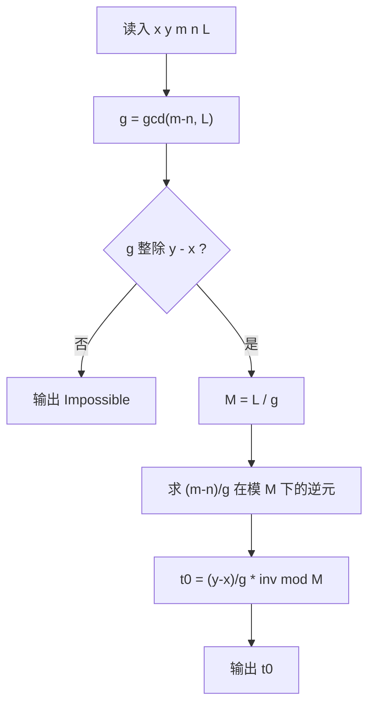

[[TOC]]

## 形式化题目

给定整数 $x, y, m, n, L$。两只青蛙分别从环上位置 $x$ 与 $y$ 出发，每跳一次各自前进 $m$ 米与 $n$ 米，环长为 $L$，即位置始终对 $L$ 取模。

求最小的非负整数 $t$，使得两蛙第 $t$ 次跳跃后落在同一位置：

$$(x + m t) \bmod L = (y + n t) \bmod L;$$

若不存在这样的 $t$，输出 `Impossible`。

数据范围：$x \neq y < 2 \times 10^9$，$0 < m, n < 2 \times 10^9$，$0 < L < 2.1 \times 10^9$。

样例 $x=1,\ y=2,\ m=3,\ n=4,\ L=5$ 的跳跃轨迹（位置对 $5$ 取模）：

| $t$ | 0 | 1 | 2 | 3 | 4 |
| :---: | :---: | :---: | :---: | :---: | :---: |
| 青蛙 A $(1+3t) \bmod 5$ | 1 | 4 | 2 | 0 | 3 |
| 青蛙 B $(2+4t) \bmod 5$ | 2 | 1 | 0 | 4 | 3 |

第 4 次跳跃后两蛙同时落在位置 3，与样例输出 `4` 一致；表也显示出两条轨迹的周期都整除 $L$，这正是后面把相遇写成同余方程的直观依据。

## 正解

### 思路

**从模拟到同余方程。** 最朴素的做法是模拟：每次跳跃后比较两蛙位置，直到相遇或确认循环。但位置序列的周期可以长达 $L \approx 2.1 \times 10^9$，模拟必然超时。注意到第 $t$ 次跳跃后两蛙的位置分别是 $(x + mt) \bmod L$ 与 $(y + nt) \bmod L$，"同时落在同一点"就是

$$x + mt \equiv y + nt \pmod L,$$

移项得到**一元线性同余方程**

$$(m - n)\,t \equiv y - x \pmod L. \tag{1}$$

于是问题变成解同余方程 (1)，答案是它的最小非负整数解。

**第一步：判断有没有解。** 记 $a = m-n$，$b = y-x$，$g = \gcd(a, L)$（约定 $\gcd(0, L) = L$）。左边 $at$ 模 $L$ 只能取到 $g$ 的倍数，由裴蜀定理，方程 (1) 有整数解当且仅当

$$g \mid b.$$

若不整除，直接输出 `Impossible`。特别地，若 $m = n$（即 $a=0$），则 $g = L$；而 $|y - x| < L$ 且 $y \neq x$，$L \nmid b$ 必然无解——两个步长相同的青蛙永远追不上，判定自动覆盖，无需特判。

**第二步：约简到系数可逆。** 当 $g \mid b$ 时，把 (1) 的系数、右端与模数同时除以 $g$：

$$\frac{a}{g}\,t \equiv \frac{b}{g} \pmod{M},\qquad M = \frac{L}{g}. \tag{2}$$

此时 $\gcd\!\left(\frac{a}{g}, M\right) = 1$，系数在模 $M$ 下可逆，且 (2) 与 (1) 同解。

**第三步：取最小非负解。** 两边乘上 $\frac{a}{g}$ 的逆元：

$$t \equiv \frac{b}{g} \cdot \left(\frac{a}{g}\right)^{-1} \pmod M.$$

方程的全部整数解是 $t_0 + kM$（$t_0$ 为最小非负剩余）。跳跃次数必须非负，而 $t_0 \in [0, M)$ 已经是非负中最小的一个，所以 $t_0$ 就是答案。

用样例验证：(1) 即 $-t \equiv 1 \pmod 5$，$g = \gcd(-1, 5) = 1$，逆元 $(-1)^{-1} \equiv -1$，故 $t \equiv -1 \equiv 4 \pmod 5$，与轨迹表第 4 列吻合。

Python 实现中整条链路可以压成几个表达式：`gcd(m - n, L)` 给出 $g$，`b % g` 做整除判定（Python 的 `%` 对负数返回非负余数，负系数无需特判），`pow(a // g, -1, M)` 用内建扩展欧几里得求模逆元，最后 `% M` 调进 $[0, M)$。

### 代码

@include-code(./main.py, python)

### 复杂度

- 时间复杂度：$O(\log L)$。一次 `gcd` 加一次模逆元，各为 $O(\log L)$，其余是 $O(1)$ 算术。
- 空间复杂度：$O(1)$ 额外空间，与 $L$ 无关。

## 总结

题目把「环上两个等速点的追及」抽象成同余方程 $(m-n)t \equiv y-x \pmod L$。$\gcd(m-n, L)$ 决定可达性，约去公因子后系数可逆，模逆元直接给出最小非负解。核心结论：答案只可能落在 $[0,\ L/\gcd(m-n,L))$ 内，模拟的 $10^9$ 量级周期被一次 $O(\log L)$ 的数论运算取代；$m = n$ 的退化情形也被 $\gcd(0, L) = L$ 的约定自然覆盖。

## 图示解析

下图给出单组数据的判定与求解流程，重点看两条分支：无解分支在 $\gcd$ 整除判定处直接结束；有解分支约去 $g$ 后，模 $M = L/g$ 的逆元运算一步给出答案。

流程中唯一的"重"运算是模逆元，它对应 (2) 式两侧同乘逆元这一步。$M$ 既是约简后的模数也是解的周期，所以 $t_0$ 一旦求出即是最少跳跃次数，无需回代验证。
