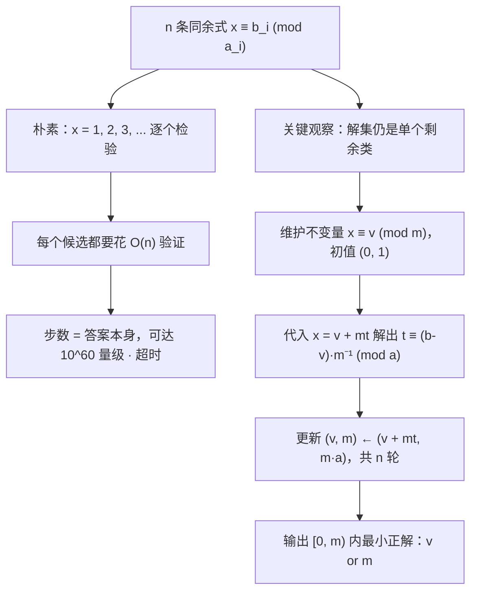

[[TOC]]

## 形式化题目

给定 $n$ 条条件，每条是「$a_i$ 头牛一圈时，最后一圈多出 $b_i$ 头」，即

$$x \equiv b_i \pmod{a_i} \qquad (i = 1, 2, \dots, n),$$

其中 $a_i$ 两两互质。求满足全部条件的最小**正**整数 $x$。

题面没有保证 $b_i < a_i$（真实数据里出现 $b_i = 0$ 以及 $b_i = a_i - 1$），
所以 $b_i$ 应当读作「$x \bmod a_i$ 的一个代表元」，而不是已经归好位的余数；
真实的 $a_i$ 也允许取 $1$。
由于模数两两互质，解在模 $M = \prod_{i=1}^{n} a_i$ 下唯一，
$M$ 的上界是 $1.2^{10}\times 10^{60} \approx 6.2\times10^{60}$（约 202 个二进制位）。

样例的三条条件为 $x \equiv 1 \pmod 3$、$x \equiv 1 \pmod 5$、$x \equiv 2 \pmod 7$，答案是 $16$。

## 正解

### 思路

**朴素做法与它的瓶颈。** 最直接的写法是从 $x = 1$ 开始逐个试，检验是否每个 $i$ 都满足
$x \bmod a_i = b_i$，第一个通过的即答案。做法本身正确，但枚举步数就是答案的大小，
而答案落在 $[1, M]$ 之内，$M$ 可以达到 $6.2\times 10^{60}$。真实数据也能看出量级：

| 数据 | $n$ | $M = \prod a_i$ | 答案 |
| --- | --- | --- | --- |
| `input1` | 1 | $1\,093\,258$ | $129\,842$ |
| `input3` | 3 | $995\,008\,305\,410$ | $206\,771\,281\,471 \approx 2\times 10^{11}$ |
| `input10` | 10 | $6\,469\,693\,230$ | $6\,469\,693\,229$ |

光是 `input3` 就要循环两千亿次。更要紧的是，**枚举出来的候选几乎全是废信息**：
$M$ 个数里只有一个符合全部条件，其余的都只是在重复确认「不在那个剩余类里」。

问题的本质在于，候选虽然有 $6\times10^{60}$ 个，但它们携带的信息只有
$\log_2 M \approx 202$ 比特——也就是「$x$ 落在模 $M$ 的哪一个剩余类里」。
所以应该**直接算出那个剩余类**，而不是逐个验证。

**关键观察：若干条同余式的解集仍然是一个剩余类。** 换句话说，
「同时满足 $x\equiv b_1 \pmod{a_1}$ 与 $x \equiv b_2 \pmod{a_2}$」
可以写成「$x \equiv v \pmod m$」的形式，$m = a_1a_2$。
于是可以**逐条合并**：维护一个不变量 $(v, m)$，表示「到目前为止的所有条件
$\iff x \equiv v \pmod m$」，每读入一条新条件就把这个剩余类与它求交。

**怎么合并：把不变量展开代入。** 设已合并的部分等价于 $x \equiv v \pmod m$，
也就是 $x = v + mt$（$t$ 为任意整数，代表 $m$ 的各个倍数）。现在加入 $x \equiv b \pmod a$：

$$v + mt \equiv b \pmod a \iff mt \equiv b - v \pmod a .$$

**互质性让这一步一步就能解出。** $m$ 是此前若干 $a_j$ 的乘积，而题面保证 $a_i$ 两两互质，
所以 $\gcd(m, a) = 1$——$m$ 在模 $a$ 下有逆元，方程有唯一解类

$$t \equiv (b - v)\cdot m^{-1} \pmod a .$$

取 $t_0 \in [0, a)$ 作代表元，新剩余类就是

$$v' = v + m\,t_0, \qquad m' = m\cdot a .$$

**这样取代表元不丢解。** $mt \equiv b-v \pmod a$ 的全部解是 $t \equiv t_0 \pmod a$ 一整类。
若 $t = t_0 + ka$，则 $x = v + m(t_0 + ka) = v' + k\,ma = v' + k\,m'$，
仍然落在同一个 $x \bmod m'$ 里。所以「在 $[0,a)$ 里挑一个」只是挑代表，不改变解集。

**为什么求逆元这一步能直接调用库函数。** 解 $mt \equiv b - v \pmod a$ 本来要做一次扩展欧几里得，
Python 的 `pow(m, -1, a)` 就是它的封装，直接把 $m^{-1} \bmod a$ 算出来。
整条合并因此可以写成一行：`t = (b - v) * pow(m, -1, a) % a`。
这里的 `% a` 还顺手解决了一个边界：$b - v$ 可能是负数。真实数据 `input10` 就是这种情形——
条件从 $(2,1),(3,2),(5,4),\dots,(29,28)$ 依次满足 $b_i = a_i - 1$，
而合并到 $(5,4)$ 时已有 $v = 5$，差值 $b - v = -1$。
C++ 的 `%` 会得出负数、把 $t$ 带到 $[0,a)$ 之外，必须手写 `((..)%a+a)%a`；
Python 的 `%` 总是返回非负余数，所以代码里不需要额外分支。

**样例逐步核对。** 三条条件 $x \equiv 1 \pmod 3$、$x \equiv 1 \pmod 5$、$x \equiv 2 \pmod 7$，
初值 $v, m = 0, 1$，每步解出 $t$ 后更新：

| 步 | 新条件 $(a, b)$ | 合并前 $(v, m)$ | 要解的方程 | 解出 $t$ | 合并后 $(v, m)$ |
| --- | --- | --- | --- | --- | --- |
| 1 | $(3, 1)$ | $(0, 1)$ | $1\cdot t \equiv 1 \pmod 3$ | $1$ | $(1, 3)$ |
| 2 | $(5, 1)$ | $(1, 3)$ | $3t \equiv 0 \pmod 5$ | $0$ | $(1, 15)$ |
| 3 | $(7, 2)$ | $(1, 15)$ | $15t \equiv 1 \pmod 7$ | $1$ | $(16, 105)$ |

读表时注意第 2 步：解出 $t = 0$，所以 $v$ 保持 $1$ 不变，而模数从 $3$ 涨到 $15$——
这一步只是把周期变长，没有挪动解的位置。第 3 步因为 $15 \equiv 1 \pmod 7$ 逆元是 $1$，
$t = 1$，$v$ 从 $1$ 跳到 $16$，最终 $x \equiv 16 \pmod{105}$。回代可知
$16 \bmod 3 = 1$、$16 \bmod 5 = 1$、$16 \bmod 7 = 2$ 全部相符。

**三个容易踩的边界。** 其一，合并出来的是**最小非负**解，若所有条件在 $x = 0$ 处同时成立
（例如只有一条 $x \equiv 0 \pmod 2$），$v$ 会是 $0$，而题目要的是**正**整数：
此时 $m$ 本身也满足全部条件，且是最小的正解，所以代码写 `print(v or m)`。
其二，$b - v$ 可能是负数（`input10` 的每条都满足 $b_i = a_i - 1$，合并到 $(5,4)$ 时 $v = 5$）：
Python 的 `%` 直接返回 $[0,a)$ 内的余数，不需要像 C++ 那样手写 `((..)%a+a)%a`。
其三，$a_i = 1$ 是允许的（真实数据 `input9` 第一条就是 `1 0`）：
`pow(m, -1, 1)` 定义为 $0$，于是 $t = 0$、状态不变，正好等价于「这条条件什么也没约束」；
所以读入时不要假设 $1 \leqslant b_i < a_i$。

### 代码

@include-code(./main.py, python)

代码只有三层，与上面的推导一一对应：

- `merge(v, m, a, b)` 就是「合并一条条件」：`t = (b - v) * pow(m, -1, a) % a`
  对应 $t \equiv (b-v)m^{-1} \pmod a$，返回值 `(v + m*t) % (m*a), m*a` 对应 $(v', m')$。
  末尾的 `% (m*a)` 不是必需的（结果本来就在 $[0, ma)$ 内），写出来是为了让
  「返回值永远是最小非负代表元」这个约定在函数边界上自明。
- `solve()` 里的 `v, m = 0, 1` 是合并的单位元：$x \equiv 0 \pmod 1$ 对一切 $x$ 成立。
  循环恰好执行 $n$ 次，每次消费一对 $(a, b)$，循环体内没有任何分支。
- `print(v or m)` 处理「答案必须是正整数」这一条。

### 复杂度

- **时间复杂度**：合并 $n$ 次，每次一次扩展欧几里得求逆元 $O(\log a_{\max})$，
  加上次数很少的大整数运算。设最终模数的位数为 $B = \sum \log_2 a_i \leqslant 202$，
  则总时间

  $$O\!\left(\sum_{i=1}^{n}\left(\log a_i + B\right)\right) = O\!\left(n\log a_{\max} + nB\right),$$

  也就是「$10$ 次 exgcd 加少量 200 位大数运算」的量级。实测真实数据最慢一组 $0.018$ s，
  手工构造的 $n = 10$、每个模数都在 $1.2\times10^6$ 附近、答案长达 61 位的极限用例 $0.017$ s，
  远低于 1000 ms 限时。
- **空间复杂度**：只保存当前 $(v, m)$ 与输入缓冲，$O(n + B)$，实测峰值 RSS 14.6 MB。
- **与朴素做法对比**：朴素枚举是 $O(\text{ans}\cdot n)$，其中 $\text{ans}$ 可达 $6.2\times10^{60}$；
  这里是 $O(n\log M)$。差别不是常数，而是「枚举剩余类里的每个数」被换成了「直接算出这个剩余类」。

## 总结

- 「建 $a_i$ 个牛棚剩 $b_i$ 头牛」就是同余式 $x \equiv b_i \pmod{a_i}$，题目求同余方程组的最小正解。
- 朴素枚举的瓶颈不是常数，而是**在一个剩余类里逐个试数**；$M$ 有 $10^{60}$ 量级，
  但它只携带 $\log_2 M \approx 202$ 比特信息。
- 逐条合并的核心是维护不变量 $x \equiv v \pmod m$：把旧解写成 $v + mt$ 代入新条件，
  用 $t \equiv (b-v)m^{-1} \pmod a$ 更新成 $(v + mt,\ ma)$。
- $a_i$ 两两互质 $\Rightarrow \gcd(m,a) = 1 \Rightarrow$ 逆元总存在，
  合并永远有解，不需要写一般 CRT 的无解分支；`pow(m, -1, a)` 直接给出逆元。
- 三个实现细节：`% a` 自动把负的 $b - v$ 归一到 $[0,a)$；`v or m` 保证输出是正整数；
  $a_i = 1$ 时 `pow(m, -1, 1) = 0`，状态自动不变，不必特判。

## 图示解析

先用一张图对比「朴素枚举」与「逐条合并」两条路线，说明优化究竟消除了什么：



图中上半支是朴素路线：它的每一步只回答「这个数行不行」，信息量为 1 比特，
却要重复 $10^{60}$ 次。下半支是正解路线：第 3 步把「检验」换成「解方程」，
一次就锁定整个剩余类；第 4 步的每一轮都只做常数次大数运算，
所以总代价从「答案的量级」降到「$n$ 轮」。

再看合并过程中「解在数轴上的位置」如何被一步步锁定：

```text
第 1 条 x ≡ 1 (mod 3)   候选：1, 4, 7, 10, 13, 16, 19, 22, ...   -> v=1,  m=3
第 2 条 x ≡ 1 (mod 5)   取交集：1, 16, 31, 46, 61, ...           -> v=1,  m=15
第 3 条 x ≡ 2 (mod 7)   取交集：16, 121, 226, ...                 -> v=16, m=105
                                  ^^ 第一个正解就是 16
```

三行的模数依次是 $3 \to 15 \to 105$（每次乘上新模数），而候选序列之间的间隔同步变宽：
条件越多，候选越稀疏，但**代表元始终只有一个**，所以不需要保留整个序列，只要 $(v, m)$ 两个数。
这正是不变量「$x = v + mt$」的几何含义：$v$ 指出解在哪，$m$ 指出下一次出现在多远之后。
