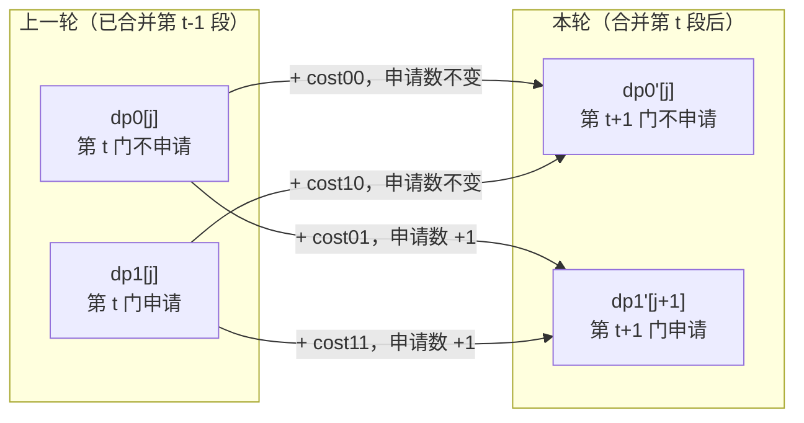

[[TOC]]

## 形式化题目

给定 $n$ 门课，第 $i$ 门课有两个候选教室 $c_i,d_i$，以及一个概率 $k_i\in[0,1]$。
预先选定一个申请集合 $S\subseteq\{1,\dots,n\}$，$|S|\leqslant m$，此后第 $i$ 门课实际去的教室是

$$
X_i=\begin{cases}d_i & i\in S \text{ 且申请通过（独立概率 }k_i)\\ c_i & \text{否则}\end{cases}
$$

给定 $v$ 个教室与 $e$ 条带权双向道路（保证连通），令 $\mathrm{dist}(u,w)$ 为两教室间最少体力。
求

$$
\min_{|S|\leqslant m} E\Bigl[\sum_{i=1}^{n-1}\mathrm{dist}(X_i,X_{i+1})\Bigr]
$$

的精确到小数点后两位的值。样例：$n=3,m=2$，$c=[2,1,2]$，$d=[1,2,1]$，$k=[0.8,0.2,0.5]$，
边为 $(1,2,5),(1,3,3),(2,3,1)$，答案为 `2.80`。

## 正解

### 思路

#### 1. 朴素做法与瓶颈

最直接的写法是枚举申请集合：枚举所有 $|S|\leqslant m$ 的 $S$，再枚举"哪些申请通过"算期望，
取最小。$n\leqslant 2000$ 时 $2^n$ 直接爆掉；即便用期望线性性把"算期望"降到 $O(n)$，
仍是 $O(2^n n)$，只能做 $n\leqslant 20$。

瓶颈不在常数，而在**把"选集合"当成无结构的子集选择**。题目里藏着一个很强的结构：
总花费是 $n-1$ 个只依赖**相邻两门课**的项之和。抓住它就能线性扫一遍。

#### 2. 第一阶段：一次 Floyd 求出所有教室对的距离

DP 的转移系数完全由最短路决定，而且每段都要问 4 个教室对，$n$ 段共 $4n$ 次查询，
必须 $O(1)$ 查表。两种预处理的代价对比（$n=2000,v=300,e=90000$）：

| 做法 | 复杂度 | 量级 |
| --- | --- | --- |
| 每段跑一次 Dijkstra | $O\bigl(n\cdot e\log v\bigr)$ | $2000\times90000\times9\approx1.6\times10^9$，不可行 |
| 跑一次 Floyd–Warshall | $O(v^3+e)$ | $2.7\times10^7+9\times10^4$，可行 |

所以先用 Floyd 把 $\mathrm{dist}$ 算出来。

#### 3. 期望的线性性 ⇒ 逐段相加

因为期望可以逐项拆开，

$$
E\Bigl[\sum_{i=1}^{n-1}\mathrm{dist}(X_i,X_{i+1})\Bigr]=\sum_{i=1}^{n-1}E\bigl[\mathrm{dist}(X_i,X_{i+1})\bigr].
$$

**这是整道题的枢纽**：不需要枚举"哪些申请通过"这 $2^{|S|}$ 种结果，只要逐段算期望再相加。
段与段之间也不需要有相关性，所以后面可以放心用线性 DP。

#### 4. 第 $t$ 段的期望只依赖两个决策位

把"申请第 $i$ 门"记成 $b_i\in\{0,1\}$（注意 $b_i=1$ 只表示**提交了申请**，
通过与否由 $k_i$ 加权）。第 $t$ 段（第 $t$ 门到第 $t+1$ 门）只和 $b_t,b_{t+1}$ 有关。
记四个最短路值

$$
cc=\mathrm{dist}(c_t,c_{t+1}),\quad cd=\mathrm{dist}(c_t,d_{t+1}),\quad
dc=\mathrm{dist}(d_t,c_{t+1}),\quad dd=\mathrm{dist}(d_t,d_{t+1}),
$$

上一位申请结果与这一位申请结果共有四种组合，期望段费是

$$
\begin{aligned}
\text{cost}_{00} &= cc &&\text{上不申请、下不申请}\\
\text{cost}_{01} &= (1-k_{t+1})\,cc+k_{t+1}\,cd &&\text{上不申请、下申请}\\
\text{cost}_{10} &= (1-k_t)\,cc+k_t\,dc &&\text{上申请、下不申请}\\
\text{cost}_{11} &= (1-k_t)\,\text{cost}_{01}+k_t\bigl[(1-k_{t+1})dc+k_{t+1}dd\bigr]
&&\text{两门都申请}
\end{aligned}
$$

$\text{cost}_{11}$ 的写法是关键技巧：**按"上一位申请被拒/通过"二分再复用 $\text{cost}_{01}$**，
不用手写 16 项概率乘积。展开验证：上一位被拒时下一位自己的期望正好是 $\text{cost}_{01}$，
上一位通过时是 $(1-k_{t+1})dc+k_{t+1}dd$，四项系数
$(1-k_t)(1-k_{t+1}),\ (1-k_t)k_{t+1},\ k_t(1-k_{t+1}),\ k_tk_{t+1}$ 之和为 1。

把样例的数字代进去（$\mathrm{dist}=\begin{pmatrix}0&4&3\\4&0&1\\3&1&0\end{pmatrix}$，
行列为教室 1..3）：

| 段 | $cc$ | $cd$ | $dc$ | $dd$ | $\text{cost}_{01}$ | $\text{cost}_{10}$ | $\text{cost}_{11}$ |
| --- | --- | --- | --- | --- | --- | --- | --- |
| 第 1 段<br/>上：$c_1{=}2,d_1{=}1$<br/>下：$c_2{=}1,d_2{=}2$ | 4 | 0 | 0 | 4 | $0.8\cdot4+0.2\cdot0$<br/>$=3.20$ | $0.2\cdot4+0.8\cdot0$<br/>$=0.80$ | $0.2\cdot3.2+0.8\cdot(0.8\cdot0+0.2\cdot4)$<br/>$=1.28$ |
| 第 2 段<br/>上：$c_2{=}1,d_2{=}2$<br/>下：$c_3{=}2,d_3{=}1$ | 4 | 0 | 0 | 4 | $0.5\cdot4+0.5\cdot0$<br/>$=2.00$ | $0.8\cdot4+0.2\cdot0$<br/>$=3.20$ | $0.8\cdot2.0+0.2\cdot(0.5\cdot0+0.5\cdot4)$<br/>$=2.00$ |

读法是：$cc,cd,dc,dd$ 分别是"上取 $c$ / 上取 $d$ 与下取 $c$ / 下取 $d$"的四种物理距离，
后三列是它们按 $k_t,k_{t+1}$ 加权后的期望段费。注意这里 $cd=dc=0$，
因为 $c_1=d_2=2$、$d_1=c_2=1$：只要**其中一方**申请成功，两门课就落在同一教室。
表中用"上/下"区分同一个 $k$ 的两次使用（第 $t$ 段用 $k_t,k_{t+1}$，第 $t+1$ 段用 $k_{t+1},k_{t+2}$），
所以 $c_2$ 同时出现在第一段的"下"和第二段的"上"。

#### 5. 状态里必须记住"上一位是否申请"

由于 $\text{cost}$ 直接依赖 $b_t$，而合并完第 $t-1$ 段后 $b_t$ 的信息就丢了，
所以状态必须是 $dp[t][j][b]$：前 $t$ 门课、用掉 $j$ 次申请、**第 $t$ 门是否申请为 $b$**
时，前 $t-1$ 段期望段费之和的最小值。滚动掉 $t$，只剩两个长度 $m+1$ 的数组：

$$
\begin{aligned}
dp'_0[j] &= \min\bigl(dp_0[j]+\text{cost}_{00},\ dp_1[j]+\text{cost}_{10}\bigr)\\
dp'_1[j] &= \min\bigl(dp_0[j-1]+\text{cost}_{01},\ dp_1[j-1]+\text{cost}_{11}\bigr)
\end{aligned}
$$

含义直白：本轮不申请，从前一态的两种 $b_t$ 里取小，加上对应的段费；
本轮申请就消耗一次机会，所以从 $j-1$ 位转移。这和 0/1 背包省掉第一维同理。
初始化 $dp_0[0]=0$（第 1 门不申请、用 0 次）、$dp_1[1]=0$（第 1 门申请、用 1 次），
其余为 $+\infty$。迭代 $n-1$ 轮后答案是 $\min_j\bigl(\min(dp_0[j],dp_1[j])\bigr)$ ——
约束是 $j\leqslant m$ 而非 $=m$，因为**允许不用完申请机会**。

样例的滚动过程（`-` 表示不可达）：

| 阶段 | `dp0[0]` | `dp0[1]` | `dp0[2]` | `dp1[0]` | `dp1[1]` | `dp1[2]` |
| --- | --- | --- | --- | --- | --- | --- |
| 初始（第 1 门） | 0 | - | - | - | 0 | - |
| 合并第 1 段后 | 4.00 | 0.80 | - | - | 3.20 | 1.28 |
| 合并第 2 段后 | 8.00 | 4.80 | 4.48 | - | 6.00 | **2.80** |

以第二行为例：`dp1[2]=1.28` 表示"第 2 门申请、用掉 2 次申请（即第 1、2 门都申请），
第 1 段的期望段费最小值是 1.28"，来源是 $dp_1[1]+\text{cost}_{11}=0+1.28$。
第三行的 `dp0[2]=4.48` 是 $dp_1[2]+\text{cost}_{10}=1.28+3.2$，即"前两门都申请、
第 3 门不申请"。最终 $\min=2.80$，对应 $S=\{1,3\}$（两段期望段费 $0.8+2.0$）——
对比全不申请的 $4+4=8$、只申请相邻两门的 $4.48$，可见让每段只承担一半不确定性最优。

#### 6. 输出：按"分"做四舍五入，不要直接用 `f"{x:.2f}"`

题面要求"四舍五入精确到小数点后恰好 2 位"，且**输出必须和标准输出完全一样**。
直接写 `f"{ans:.2f}"` 会踩两个坑（都已实测）：

1. **`format` 用银行家舍入（round-half-even）**。当真值恰好等于"半分"时它向偶数靠：
   `f"{0.125:.2f}"` 得到 `0.12`（$0.125$ 是二进制精确值，所以这个坑真的会触发），
   而题面要的"四舍五入"是 `0.13`。
2. **十进制三位小数在 float64 里往往不精确**。$1.005$ 的实际存储值略小于 $1.005$，
   `1.005 * 100 == 100.49999999999999`，于是 `int(... + 0.5) == 100`，输出 `1.00`；
   同理 `f"{4.545:.2f}"` 得到 `4.54` 而不是 `4.55`。这与第 1 条是两回事，
   但在 $0.005$ 边界上会给出同样的错误方向。

正确做法是先转成整数"分"再格式化，并且加一个极小的 $\varepsilon$：

```python
cents = int(ans * 100 + 0.5 + 1e-9)   # +0.5 实现 half-up，+1e-9 兜住第 2 条的表示误差
print(f"{cents / 100:.2f}")
```

$10^{-9}$ 远小于"分"的量级 $10^{-2}$，不会改变任何距边界超过 $10^{-9}$ 的题。
它并非装饰：枚举 $0.001$ 到 $199.999$ 的全部 $199999$ 个三位小数真值，
有 **1147 个（约 $0.57\%$）**（如 $0.145,0.285,1.005,1.015$）在加 $\varepsilon$ 前
会被算低一分，加上后全部正确。

### 代码

@include-code(./main.py, python)

### 复杂度

- **时间复杂度**：$O(v^3+nm)$。Floyd 是 $300^3=2.7\times10^7$ 次比较，
  DP 是 $2000\times1889\approx3.8\times10^6$ 次转移，与标准 C++ 正解同阶。
- **空间复杂度**：$O(v^2+m)$，主要是 $v\times v$ 的最短路表和两个长度 $m+1$ 的 DP 数组。

实测（Apple Silicon / CPython 3.14，最坏一组 $n=2000,m=1889,v=300,e=33193$）：
整题 **0.76 s**（Floyd 内核 0.41 s + DP 0.34 s），峰值内存 **24 MB**，均低于限制。
其中 Floyd 部分用紧凑的三重 `for` 而不是 `di[:] = map(min, di, ...)`：
后者虽然把循环压到 C 层，却要为每次迭代创建 `map` 对象与绑定方法对象，实测反而慢一倍
（整题 1.18 s，Floyd 内核 0.83 s）。

## 总结

- 见到"期望 + 选一个子集"先想**期望线性性**：总期望拆成每段期望之和，段间就不需要相关性信息了。
- 拆完段之后看每段的依赖范围。本题第 $t$ 段只依赖 $b_t,b_{t+1}$，这正是线性 DP 的信号。
- **状态里一定要带回"上一位的决策"**：$\text{cost}$ 依赖 $b_t$ 与 $b_{t+1}$ 两者，
  只记计数 $j$ 不够。这与很多区间 DP 要记住"端点状态"是同一类理由。
- 四种组合不要手写 16 项概率乘积，按"上一位拒/过"二分并复用 $\text{cost}_{01}$，
  既短又不容易漏项。
- $j$ 是**确定性**计数（申请了就消耗一次机会，与运气无关），所以不必对 $j$ 取期望；
  又因为 $j\leqslant m$，答案要在所有 $j$ 上取 min。
- 输出小数别直接信 `f"{x:.2f}"`：先乘 100 加 0.5 取整再除，才能既避开银行家舍入又吸收浮点噪声。

## 图示解析

这张图串起本题从输入到答案的完整主线：

```text
输入：n 门课（每门两个候选教室）+ v 个教室的道路图
|- 阶段一：v <= 300，且 DP 每段要查 4 个教室对 -> 先跑一次 Floyd
|  `- dist[u][w] = 任意两教室的最少体力（O(1) 查表）
`- 阶段二：期望线性性 -> 总期望 = n-1 段期望之和
   `- 第 t 段只依赖 b_t, b_{t+1}（b = 是否提交申请）
      |- 四组合段费 cost01 / cost10 / cost11（由 k 与 cc/cd/dc/dd 加权）
      `- 滚动 DP：dp0[j] / dp1[j] = 上一位不申请 / 申请
         |- 转移要读 j-1 位 -> dp1 左边补 INF 实现错位
         |- 逐轮合并 n-1 段，允许 j <= m（不必用满）
         `- 答案 = min over j of min(dp0[j], dp1[j])
            `- half-up 到整数分 -> 输出 "x.xx"
```

读图时抓两个分叉的因果：第一个分叉说明"为什么必须把最短路一次性预处理完"
（$v^3$ 可接受而 $n\cdot e\log v$ 不可接受）；第二个分叉说明"为什么 DP 状态要多带一位 $b$"
（段费依赖 $b_t$ 与 $b_{t+1}$ 两者），以及"为什么 $j$ 维度会错位 +1"。

再用一张状态依赖图说明 $j$ 维度的转移方向：



图中左右两列分别是相邻两轮的 DP 数组。$dp_0'$ 是**同位**转移（申请数不变，
源是 $dp_0[j],dp_1[j]$）；$dp_1'$ 是**错位**转移（申请数 +1，所以目标是 $dp_1'[j+1]$，
源是 $dp_0[j],dp_1[j]$）。这正是代码里 `dp1 = [INF] + [...]` 与
`head0, head1 = dp0[:m], dp1[:m]` 的来源：
`[INF] +` 实现目标下标整体右移一位，而源数组只用到前 $m$ 项——
多申请一门就越过上限、直接从数组尾部丢掉。
