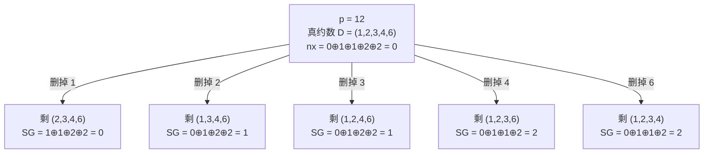

[[TOC]]

## 形式化题目

初始有若干堆正整数 $a_1, a_2, \dots, a_n$。一次操作是：

1. 选中一堆 $p > 1$，记 $p$ 的全部**真约数**（小于 $p$ 的正约数，包含 $1$、不包含 $p$）为 $D(p) = \{b_1, b_2, \dots, b_m\}$；
2. 把这一堆 $p$ 替换成 $m$ 堆，数量分别为 $b_1, \dots, b_m$；
3. 从这 $m$ 堆中删去任意一堆。

轮到某人操作时，若所有堆都等于 $1$，则该人失败。双方均采取最优策略，由先手开始，判断先手胜负。

## 正解

### 思路

#### 朴素做法为什么会炸

最直接的想法是把「当前所有堆」当成一个状态去搜：枚举所有 $p > 1$ 的堆，枚举删掉哪一个真约数，递归判断胜负。正确，但完全不可行——一次操作会把一堆 $p$ 拆成 $\tau(p) - 2$ 堆（$p = 12$ 就变成 4 堆），局面里堆的数量和形态都在膨胀，状态总数随 $n$ 和 $a_i$ 指数上升，记忆化也几乎不命中。

问题出在「把整局面当状态」这件事上：它浪费了题目最强的结构——一次操作只触碰**一堆**。

#### 第一步：把「多堆」压成异或和

先看一次操作动了什么。它只选中**一堆** $p$，其余各堆原封不动。也就是说，每一堆都是一个互不干涉的独立子游戏，整个局面是这些子游戏的**和（disjunctive sum）**。

再看终局条件：「所有堆都是 $1$ 就输」。而 $p = 1$ 没有任何真约数，本来就一步也走不了——「全是 $1$」恰好等价于「当前无路可走」，这正是标准的 normal play 规则。

子游戏独立、双方可用操作集合相同、无路可走者败，三个条件齐备，可以直接套 **Sprague–Grundy 定理**：

- 若单堆 $p$ 的 SG 值为 $\operatorname{SG}(p)$，则整个局面的 SG 值为 $\bigoplus_{i=1}^{n} \operatorname{SG}(a_i)$；
- **先手必胜 $\iff$ 异或和非零**。

这一步就把「$n$ 堆联合的局面空间」压成了「$n$ 个数的异或和」。剩下的问题只有一个：怎么求单堆的 $\operatorname{SG}(p)$。

#### 第二步：单堆的后继本身已经是「一堆之和」

$p$ 的走法是：摆出全部真约数堆，再删掉其中一个。设

$$\text{nx} = \bigoplus_{d \in D(p)} \operatorname{SG}(d)$$

即「$D(p)$ 中所有堆都在场」时那一组子游戏的 SG 值。删掉 $e \in D(p)$ 后局面变成 $D(p) \setminus \{e\}$，它是**同一组子游戏删掉一个**，所以它的 SG 值也是异或和，把 $\operatorname{SG}(e)$ 从 $\text{nx}$ 里异或出去即可：

$$\text{后继价值}(e) = \text{nx} \oplus \operatorname{SG}(e)$$

于是单堆的 SG 递推是

$$\operatorname{SG}(p) = \operatorname{mex}\Big(\big\{\, \text{nx} \oplus \operatorname{SG}(e) \;\big|\; e \in D(p) \,\big\}\Big)$$

- $p = 1$：$D(1) = \varnothing$，没有后继，$\operatorname{SG}(1) = \operatorname{mex}(\varnothing) = 0$；这也印证了「全是 $1$ 必败」。
- 依赖方向：$\operatorname{SG}(p)$ 只用到真约数 $d < p$ 的值，所以从 $1$ 往上递推（或记忆化递归）一定无环。

注意每个约数只贡献**一次**枚举：先把 $\text{nx}$ 算好，删哪个约数就是异或掉哪个值，不必对每个 $e$ 重新扫一遍 $D(p)$。

下面这张表把 $\operatorname{SG}(1) \sim \operatorname{SG}(24)$ 的整条递推算出来。前三列是中间量，最后一列是结果；「后继价值」一列就是 mex 的输入。

| $p$ | 真约数 $D(p)$ | $\text{nx}$ | 后继价值 $\text{nx} \oplus \operatorname{SG}(e)$ | $\operatorname{SG}(p)$ |
| --- | --- | --- | --- | --- |
| 1 | $\varnothing$ | 0 | $\varnothing$ | **0** |
| 2 | $\{1\}$ | 0 | $\{0\}$ | 1 |
| 3 | $\{1\}$ | 0 | $\{0\}$ | 1 |
| 4 | $\{1,2\}$ | 1 | $\{0,1\}$ | 2 |
| 5 | $\{1\}$ | 0 | $\{0\}$ | 1 |
| 6 | $\{1,2,3\}$ | 0 | $\{0,1\}$ | 2 |
| 7 | $\{1\}$ | 0 | $\{0\}$ | 1 |
| 8 | $\{1,2,4\}$ | 3 | $\{1,2,3\}$ | **0** |
| 9 | $\{1,3\}$ | 1 | $\{0,1\}$ | 2 |
| 10 | $\{1,2,5\}$ | 0 | $\{0,1\}$ | 2 |
| 11 | $\{1\}$ | 0 | $\{0\}$ | 1 |
| 12 | $\{1,2,3,4,6\}$ | 0 | $\{0,1,2\}$ | 3 |
| 13 | $\{1\}$ | 0 | $\{0\}$ | 1 |
| 14 | $\{1,2,7\}$ | 0 | $\{0,1\}$ | 2 |
| 15 | $\{1,3,5\}$ | 0 | $\{0,1\}$ | 2 |
| 16 | $\{1,2,4,8\}$ | 3 | $\{1,2,3\}$ | **0** |
| 17 | $\{1\}$ | 0 | $\{0\}$ | 1 |
| 18 | $\{1,2,3,6,9\}$ | 0 | $\{0,1,2\}$ | 3 |
| 19 | $\{1\}$ | 0 | $\{0\}$ | 1 |
| 20 | $\{1,2,4,5,10\}$ | 0 | $\{0,1,2\}$ | 3 |
| 21 | $\{1,3,7\}$ | 0 | $\{0,1\}$ | 2 |
| 22 | $\{1,2,11\}$ | 0 | $\{0,1\}$ | 2 |
| 23 | $\{1\}$ | 0 | $\{0\}$ | 1 |
| 24 | $\{1,2,3,4,6,8,12\}$ | 3 | $\{0,1,2,3\}$ | 4 |

观察重点：

- $p = 8$ 与 $p = 16$ 的 SG 值是 **0**，即「一堆 8」对先手是必败局面。这说明 SG 值完全不随 $p$ 单调，**不能凭直觉代替递推**。
- $p$ 为质数时 $D(p) = \{1\}$，后继只有「局面空掉」一种，SG 恒为 1；这也是后面样例里 $3$、$5$ 都取 1 的原因。
- 表里没有出现比 4 更大的值（$p \leqslant 1000$ 时最大 SG 值也只有 4），但这只是数值分布的结果，不构成提前终止递推的理由。

单堆 $p = 12$ 的后继展开可以画成一棵一层树：每个分支是一种「删掉哪个真约数」的选择，叶子上的数就是该后继局面的 SG 值（也是异或和）。

五个后继的 SG 值集合是 $\{0,1,2\}$，不含 3，所以 $\operatorname{SG}(12) = 3$。可以看出「删掉 $e$」只是把 $\operatorname{SG}(e)$ 从 $\text{nx}$ 中消去：删掉 $1$ 得到 $0 \oplus 0 = 0$，删掉 $4$ 得到 $0 \oplus 2 = 2$，无需重建那组堆。

#### 第三步：用样例验证整套模型

第一个样例 `3` 堆 `2 2 2`：$\operatorname{SG}(2) = 1$，异或和 $1 \oplus 1 \oplus 1 = 1 \neq 0$，先手必胜 → `freda`。

第二个样例 `1 3 5`：$\operatorname{SG}(1) = 0$，$\operatorname{SG}(3) = 1$（$3$ 是质数），$\operatorname{SG}(5) = 1$（$5$ 也是质数），异或和 $0 \oplus 1 \oplus 1 = 0$，先手必败 → `rainbow`。两问都与题面样例一致。

其中「一堆 $1$ 贡献 SG 值 $0$」这一点很关键：$1$ 永远动不了，它在异或里就等于「不存在」。

### 代码

@include-code(./main.py, python)

### 复杂度

设 $P = \max a_i \leqslant 1000$。

- 求单个 $\operatorname{SG}(p)$：$O(\sqrt p)$ 枚举约数，加 $O(\tau(p))$ 次异或与 mex 扫描；每个 $p$ 只算一次（`@cache`），最坏情况把 $1 \sim P$ 全部算出共 $O(P\sqrt P)$，$P = 1000$ 时约 $2 \times 10^4$ 次内层循环。
- 每组数据 $O(n)$ 次异或，$n \leqslant 100$。
- 总计 $O(P\sqrt P + \sum n)$，与标准 C++ 解法（先递推 $1 \sim 1000$ 的 SG 表，再逐组异或）同阶。
- 空间 $O(P)$：`@cache` 中最多 1000 个记录，加上单组的 $n$ 个堆。

## 总结

- 一次操作只改动**一堆**，所以每堆是独立子游戏，整个局面是它们的和；又因为「全是 $1$ 就输」正好等价于 normal play，可直接用 SG 定理把整局压成 $\bigoplus_i \operatorname{SG}(a_i)$。
- 单堆 $p$ 的后继是「摆出全部真约数、再删一个」，它本身就是一组子游戏之和，价值等于异或和；先算出 $\text{nx} = \bigoplus_{d \in D(p)} \operatorname{SG}(d)$，删掉 $e$ 的价值就是 $\text{nx} \oplus \operatorname{SG}(e)$。
- 由此得到 $\operatorname{SG}(p) = \operatorname{mex}\{\text{nx} \oplus \operatorname{SG}(e)\}$，只依赖真约数（严格更小），从 $p=1$ 递推即可，$a_i \leqslant 1000$ 时一次预计算、多组复用。
- 易错点：$\operatorname{SG}$ 值随 $p$ **不单调**（$\operatorname{SG}(8) = \operatorname{SG}(16) = 0$），必须真算；$p=1$ 的 SG 值为 $0$，不能漏掉对它的定义；枚举约数时只需到 $\sqrt p$，配对取 $i$ 与 $p/i$，完全平方数靠集合去重。
