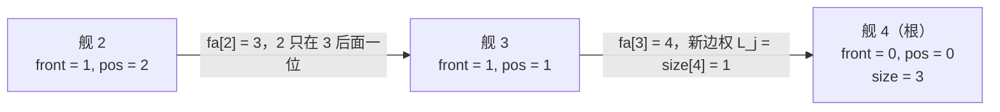

[[TOC]]

## 形式化题目

把 $N$ 个编号 $1, 2, \dots, N$ 的**有序序列**（称为「列」）初始化为 $N$ 个单元素序列，
第 $i$ 列只含编号 $i$。依次处理 $T$ 条指令，指令只有两种：

- `M i j`：设 $i$ 所在列是 $A$，$j$ 所在列是 $B$，把 $A$ 整段**保持内部顺序**拼接到
  $B$ 的尾部（即拼接后 $B$ 的元素在前、$A$ 的元素在后），列数因此减少 $1$。
- `C i j`：若 $i$ 与 $j$ 不在同一列，回答 `-1`；否则回答二者之间夹着的元素个数，
  即「不含两端的距离」。

约束为 $N \leqslant 30000$，$T \leqslant 500000$（1000 ms / 128 MB）。
题目只问「在不在同一列」和「相隔几个」，从不要求输出列的完整内容。

样例输入：

```text
4
M 2 3
C 1 2
M 2 4
C 4 2
```

按「$i$ 列接到 $j$ 列尾部」逐条推演：

| 指令 | 操作 | 得到的列 | 输出 |
| --- | --- | --- | --- |
| `M 2 3` | 把 $\{2\}$ 接到 $\{3\}$ 尾部 | `3, 2` | — |
| `C 1 2` | 1 在 $\{1\}$，2 在 `3, 2` | 不变 | `-1` |
| `M 2 4` | 把 `3, 2` 接到 $\{4\}$ 尾部 | `4, 3, 2` | — |
| `C 4 2` | 同列，4 与 2 之间夹着 3 | 不变 | `1` |

样例输出为 `-1` 与 `1`。注意第三行：`M 2 4` 是「把 2 所在列接到 **4 所在列**尾部」，
所以 4 排在最前面，中间夹着的正是 3。

## 正解

### 思路

**朴素做法与它的瓶颈。** 最直接的想法是用 $N$ 个 `list` 真的维护每一列，
再用一个数组 `belong[舰] = 列编号`：

- `M i j`：`cols[belong[j]] += cols[belong[i]]`，然后遍历被搬走的那一列，
  把其中每艘舰的 `belong` 改成新的列；
- `C i j`：同列时用 `list.index` 求两个位置再相减。

做法正确，但对本题的规模完全不够。设一列长度为 $L$：`M` 要整体搬运并逐个改写归属，
代价 $\Theta(L)$；`C` 要在列里线性查找位置，代价也是 $O(L)$。
拿真实数据估算一下这个代价（把每条指令实际要碰的元素个数累加；
$C$ 的 `index` 两次查找合计约等于一列长度，$M$ 只计一遍搬运，属偏低估计）：

| 数据 | `M` 搬运量 | `C` 的 `index` 扫描量 | 合计 |
| --- | --- | --- | --- |
| `input5`（$T = 50000$） | $1.2 \times 10^7$ | $3.2 \times 10^8$ | $3.3 \times 10^8$ |
| `input9`（$T = 500000$） | $1.1 \times 10^8$ | $1.3 \times 10^{10}$ | $1.3 \times 10^{10}$ |
| `input10`（$T = 500000$） | $1.1 \times 10^8$ | $1.1 \times 10^{10}$ | $1.1 \times 10^{10}$ |

可见真正压垮朴素做法的不是 `M` 而是 `C`：`C` 有 47 万条，
而每次同列询问都要在 $\Theta(N)$ 长的列里做两次线性查找，
在 `input9` 上就累积到 $10^{10}$ 次元素访问，远超 1000 ms 能承受的范围。

更值得琢磨的是：朴素做法搬运的**整列元素本身，对题目要回答的两个问题毫无用处**。
题目只问「在不在同一列」和「相隔几艘」，从来不问列里到底有谁、谁紧挨着谁。
真正需要维护的信息其实只有两条：**每艘舰在第几位**，以及**每一列有多长**。
所以应该把「真的去搬、真的去数」换成「把位置信息压缩成可累加的增量」。

**关键观察一：`M` 不改变列内相对顺序。** `M i j` 把 $i$ 列整段平移后挂到 $j$ 列尾部，
两列各自内部谁在谁前面都不变。既然顺序不变，那么对 $i$ 列里的任意一艘舰来说，
它的名次变化是**同一个值**：正好增加 $j$ 列的长度 $L_j$。
这就是朴素做法那 $\Theta(L)$ 次搬运所做的事——把同一个 $+L_j$ 抄给 $L$ 艘舰。
既然是同一个值，就该**记一次**，而不是记 $L$ 次。

**关键观察二：「在同一列」是等价关系。** `M` 只会把两个等价类并成一个，等价类只会越变越少，
`C` 只问两个元素是否同类。这正是并查集的用武之地：每一列用一个**根**（该列的队首）代表，
`find(i) == find(j)` 就等价于两舰同列。

**把两个观察合起来，就是带权并查集。** 在每个结点上只存两条信息：

- `front[x]`：$x$ 相对**父结点**还多排着几艘舰（只算父结点那一段，不是整列）。
  沿 `fa` 路径把 `front` 累加起来，就得到 $x$ 在该列中的下标 $pos_x$（0 基）。
- `size[r]`：根 $r$ 那一列的战舰总数（只有根上有效）。

于是两个操作都变成 $O(1)$ 级的指针改动：把 $i$ 列的根 $r_i$ 挂到 $j$ 列的根 $r_j$ 下面，
新边 $r_i \to r_j$ 的权取 $size[r_j]$，再更新 $r_j$ 的列长：

$$\texttt{front}[r_i] = size[r_j], \qquad size[r_j] \leftarrow size[r_j] + size[r_i], \qquad \texttt{fa}[r_i] = r_j .$$

为什么边权取 $size[r_j]$ 恰好正确？合并前 $i$ 列中每艘舰的下标是它在 $i$ 列里的名次
（都 $\in [0, size[r_i])$）；合并后 $j$ 列整体排在前面，长度 $L_j = size[r_j]$，
所以 $i$ 列里每一艘舰的下标都要加上 $L_j$。而 $i$ 列里所有舰的增量又完全相同，
因此只要在**新出现的那条边** $r_i \to r_j$ 上记 $L_j$，
原来 $i$ 列内部的相对增量原封不动，路径和就自动整体多了 $L_j$。

**`find` 顺便把增量摊平。** 路径压缩时不能只改 `fa` 而不改 `front`，
否则「路径和 = 下标」这条不变量会被破坏。做法是从根往叶回溯：

```text
depth = 0
for node in reversed(path):        # path 是从 x 上溯到根的结点序列
    depth += front[node]           # depth = node 到根的路径和 = node 的下标
    front[node] = depth
    fa[node] = root
```

这样压缩完成后 `front[x]` 直接就是 $pos_x$，之后同一艘舰再被问到就是纯 $O(1)$ 的数组读取。

**`C` 的答案。** 同列时，两舰下标之差的绝对值 $|pos_i - pos_j|$ 是它们的间隔距离
（相邻时为 1），而题目要的是**夹在中间**的舰数，所以答案是

$$|pos_i - pos_j| - 1 .$$

有一个语义边界要顺势处理：题面没有排除 $i = j$。此时 $|pos_i - pos_j| = 0$，
直接减 1 会输出 `-1`，与「$i$ 与 $i$ 之间」的直觉不符，应当输出 `0`。

**用样例核对一遍。** 四条指令按顺序执行，列状态与并查集里变化的量如下
（$pos_x$ 是 $x$ 在它那一列中的 0 基下标，即路径和）：

| 操作 | 真实列 | `fa` / `front` / `size` 的变化 | `pos` |
| --- | --- | --- | --- |
| 初始 | 每列单元素 | `fa[x] = x`，`front[x] = 0`，`size[x] = 1` | $pos_x = 0$ |
| `M 2 3` | `3, 2` | `front[2] = size[3] = 1`，`fa[2] = 3`，`size[3] = 2` | $pos_2 = 1$ |
| `C 1 2` | — | `find(1) = 1 \neq find(2) = 3` | 不同列 → `-1` |
| `M 2 4` | `4, 3, 2` | `find(2) = 3`，所以 `front[3] = size[4] = 1`，`fa[3] = 4`，`size[4] = 3` | $pos_3 = 1$ |
| `C 4 2` | 同列 | `find(4) = 4`；`find(2)` 顺带把 `front[2]` 压成 `front[3] + front[2] = 2` | $pos_4 = 0$，$pos_2 = 2$ |

最后一步 $|2 - 0| - 1 = 1$，与样例一致。
读表时注意 `M 2 4` 那一行：代码里操作的是 `find(2)` 也就是 3，
而不是 2 本身——`front[3] = 1` 记录了「3 在 4 后面第一位」，
而 `front[2] = 1` 始终表示「2 在 3 后面第一位」，
两个增量各自独立，路径和才拼出完整下标。

### 代码

@include-code(./main.py, python)

三段结构与上面的推导一一对应：

- `find(x)` 的 `while` 上溯负责找根，`for node in reversed(path)` 负责把路径和摊平到
  `front[node]`。这里必须写成迭代而不是递归：数据里 3 万条 `M` 足以把链接成长链，
  递归会触到 Python 的递归深度上限。
- 循环体内的 `rx, ry = find(x), find(y)` 是「同列判定」；
  `M` 分支的 `if rx != ry` 拦住同列的空操作（否则会把根挂到自己身上并弄坏 `size`），
  三行赋值分别对应整体偏移 $L_j$、列长累加、挂树。
- `C` 分支的三个出口：不同列写 `b"-1\n"`，同列写 `|front[i] - front[j]| - 1`，
  其中 `gap - 1 if gap else 0` 单独处理 $i = j$。

输入用 `sys.stdin.buffer.readline()` 逐行读、输出用 `bytearray` 攒行后一次写出：
这两处安排都是为 128 MB 上限服务的——把 6.6 MB 输入一次性 `read().split()`
会生成数十万个 `bytes` 对象，实测峰值从 21 MB 涨到 113 MB，
而逐行读不损失任何时间。

### 复杂度

- **时间复杂度**：每条指令两次 `find`，路径压缩下均摊 $O(\alpha(N))$
  （$\alpha$ 是反阿克曼函数，实际不超过 5），合并与求差都是 $O(1)$。
  总计 $O(T\,\alpha(N))$，约 $10^6$ 次近常数操作。
  实测真实数据最慢的 `input9`、`input10`（$T = 500000$）各约 **0.29 s**，
  远低于 1000 ms。作为对比，朴素做法在同一数据上需要 $10^{10}$ 量级的元素访问
  （实测约 $1.1 \times 10^{10}$ 次），差了三到四个数量级。
- **空间复杂度**：`fa`、`front`、`size` 各长 $N + 1$，加上 `bytearray` 形式的输出，
  共 $O(N + \#C)$。实测峰值 RSS 约 21 MB，在 128 MB 以内。

## 总结

- 题目的两个问题（同列判定、名次差）都不需要知道列里有哪些元素，
  朴素做法真正浪费的是「把同一个偏移抄给整列」的那 $\Theta(L)$ 次操作，
  以及每次询问都线性数一遍名次。
- 关键观察一：`M` 保持列内相对顺序 ⇒ 名次只在合并时**整体加同一个偏移** $L_j$。
- 关键观察二：并列是等价类合并 ⇒ 用根代表一列，`find` 判断同列。
- 合并观察：带权并查集，`front[x]` 记「相对父结点多排了几艘」，
  `size[root]` 记列长；`M` 时 `front[ri] = size[rj]`、`size[rj] += size[ri]`、`fa[ri] = rj`；
  路径压缩时从根向叶累加 `front`，压缩后 `front[x]` 即 0 基下标。
- 询问答案：不同列 `-1`，同列 $|front_i - front_j| - 1$，且 $i = j$ 时输出 `0`。
- 复杂度 $O(T\,\alpha(N))$ 时间、$O(N + \#C)$ 空间。

## 图示解析

先看合并过程中增量是怎么被「只记一次」的。下图画的是样例执行完 `M 2 3`、`M 2 4`
之后仍然保留的指针结构（此时 `fa` 还未被压缩：2 指向 3、3 再指向 4）：



观察重点：图中的列是 `4, 3, 2`，可整列名次只由**两条边**共同描述——
`3` 相对根 4 的偏移 1（这一列之所以整段靠右，就是因为合并时加了 $L_j = 1$），
以及 `2` 相对 3 的偏移 1。`2` 的完整下标是沿路径的和 $1 + 1 = 2$，
所以代码从不需要让 `2` 直接连到 `4`；`size` 只挂在根 4 上，
这也解释了为什么只有根上的 `size` 才有意义。

再看 `find` 的路径压缩把 `front` 改成了什么，以及它对询问的影响：

```text
压缩前：fa[2]=3  front[2]=1      询问 C 4 2 时会执行 find(2)
        fa[3]=4  front[3]=1      从根往叶累加（path = [2, 3]，reversed 后是 3, 2）
                                 depth = 1     → front[3] = 1, fa[3] = 4
                                 depth = 1 + 1 → front[2] = 2, fa[2] = 4
压缩后：fa[2]=4  front[2]=2      pos_2 = front[2] = 2，pos_4 = 0
        fa[3]=4  front[3]=1      答案 |2 - 0| - 1 = 1
```

压缩只是把同一段路径和换了个存放方式：`1 + 1` 从「两条边各自记一半」变成「一条边记全部」，
路径和始终是 2，所以不变量没有被破坏。这正是「路径压缩必须从根向叶累加」的原因——
反过来加会把子结点相对父结点的增量赋给父结点，路径和就错了。
而答案总是 $|pos_i - pos_j| - 1$：减掉的 1 表示两端中有一艘不算进「中间夹着」的部分；
当 $i = j$ 时差值为 0，代码输出 `0` 而不是 `-1`。
