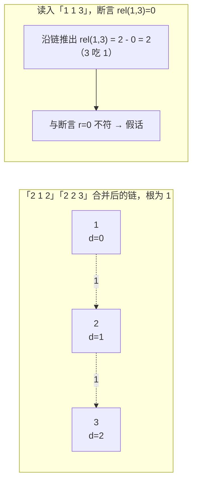

[[TOC]]

## 形式化题目

有 $N$ 个元素，每个元素处于三种状态 A、B、C 之一，状态构成模 3 循环：A 吃 B、B 吃 C、C 吃 A。依次给出 $K$ 条断言，每条断言为以下两种之一：

- `1 X Y`：X 与 Y 状态相同；
- `2 X Y`：X 的状态是 Y 的"食物"（即 X 吃 Y）。

按顺序处理每条断言，若它与之前所有被判定为真的断言推出的约束矛盾，则该断言为假。求假断言的总数。

## 正解

### 思路

朴素做法是枚举每只动物的种族（$3^N$ 种分配），逐句检查。指数级，$N \leqslant 50000$ 下完全不可行。但仔细想：题目从不问"某只动物是什么"，只问"两只动物**相对**是什么关系"。所以不必枚举具体种族，只需维护一个不断增长的**约束系统**，每句真话往里加一条约束，假话就是与系统矛盾的断言——这需要一种能在线维护"两点间相对关系"的数据结构。

给三种状态编号，定义关系值 $\mathrm{rel}(a, b) = (b - a) \bmod 3$：$0$ 表示同类，$1$ 表示 $a$ 吃 $b$，$2$ 表示 $a$ 被 $b$ 吃。关系沿约束链**可加**：若 $a \to b$ 的关系是 $r_1$、$b \to c$ 的关系是 $r_2$，则 $a \to c$ 的关系是 $(r_1 + r_2) \bmod 3$。妙处在于"吃"的方向会随传递自动翻转：正走一步是 $1$，反走一步加 $2$，而 $-1 \equiv 2 \pmod 3$，恰好表示"被吃"——环形食物链天然适配模 3 加法。

这正符合**带权并查集**的形状。维护 `d[x]` = $x$ 到其根的关系值，同根的 $x, y$ 之间关系为 $(d[x] - d[y]) \bmod 3$。逐句处理：

1. `X > N` 或 `Y > N`：假话（越界）。
2. 语句映射成关系值 $r$：`D=1`（同类）时 $r = 0$；`D=2`（X 吃 Y）时 $r = 1$。
3. $X, Y$ 同根：核对 $(d[X] - d[Y]) \bmod 3$ 是否等于 $r$，不等则与前面真话冲突，是假话。注意 "X 吃 X" 会走这条分支：$(0 - 0 - 1) \bmod 3 = 2 \neq 0$，自动判假，无需特判。
4. 不同根：$X, Y$ 之间原本没有任何约束，此句必真，合并两块——设 `fa[fx] = fy`（$fx$、$fy$ 为各自的根），利用 `d[X]`、`d[Y]` 分别是 $X \to fx$、$Y \to fy$ 的关系，把三段路拼起来：

$$d[fx] = \underbrace{-d[X]}_{fx \to X} + \underbrace{r}_{X \to Y} + \underbrace{d[Y]}_{Y \to fy} \pmod 3$$

下面用样例的前几句展示关系链如何生长（边上的数字是关系值：$0$ 同类、$1$ 前者吃后者）：

```mermaid
flowchart TD
    subgraph 处理「2 1 2」「2 2 3」后
    A["1"] --"1（1吃2）"--> B["2"]
    B --"1（2吃3）"--> C["3"]
    end
```

随后读入「1 1 3」（1 与 3 同类）。$1, 3$ 已连通，沿链推出 $\mathrm{rel}(1, 3) = 1 + 1 = 2$（3 吃 1），与断言的 $r = 0$ 不符——这句是假话。读者可以对照观察：判定只用了一次模 3 减法，而链条无论多长，路径压缩后每个点都直挂根，`d` 值一减即得任意两点关系。

实现上最容易出错的是**路径压缩的顺序**：`d[x]` 要累加"父节点对根的关系"，必须先压缩父节点。写法上先找根、再收集整条路径，然后**从靠近根的一端开始**逐点向上累加：

| 累加顺序 | 结果 |
| --- | --- |
| 自叶向根（错误） | 父的 `d` 还是旧值（对爷爷的关系），少加一截，链长 $\geqslant 3$ 即出错 |
| 自根向叶（正确） | `acc` 沿途累加，每点写入的 `d` 都是对根的完整关系 |

### 代码

@include-code(./main.py, python)

### 复杂度

并查集带路径压缩，单次操作均摊 $O(\alpha(N))$，总计时间 $O((N + K)\,\alpha(N))$，空间 $O(N)$。CPython 实测最大测例（$N = 50000$，$K = 100000$）约 0.3s，OJ 限时 1s 内安全。

## 总结

本题是带权并查集处理"环形关系"的模板题。核心两步：一是把 A/B/C 环编码成模 3 关系值，使"同类 / 吃 / 被吃"统一为 $\{0, 1, 2\}$ 上的加法，传递时"吃"方向自动翻转；二是带权并查集的 `d` 数组与合并公式 $d[fx] = (r + d[Y] - d[X]) \bmod 3$。判定条件里还藏着两个"免费"简化：越界单独特判后，"X 吃 X" 会被同根核对公式自然判假。相比之下，"每个动物拆 3 个点"的种类并查集是同一思想的另一种展开，两者复杂度相同，但带权写法代码更短、与关系推导一一对应。

## 图示解析

### 关系链与假话判定

下图重演样例第 5 句判假的完整状态，节点标注 `d` 值（对根的关系，根为 1）：



样例 7 句中判假的三句分别是：第 1 句（`Y = 101 > N` 越界）、第 4 句（3 吃 3）、第 5 句（与「2 1 2」「2 2 3」推出的 3 吃 1 冲突）；第 6 句「2 3 1」断言 3 吃 1，恰好与链一致，是真话。观察这条链可见：每加入一条约束只需一次合并，而每次判定只依赖两点的 `d` 值之差——这正是并查集把"关系传递"摊薄到近 $O(1)$ 的意义。
