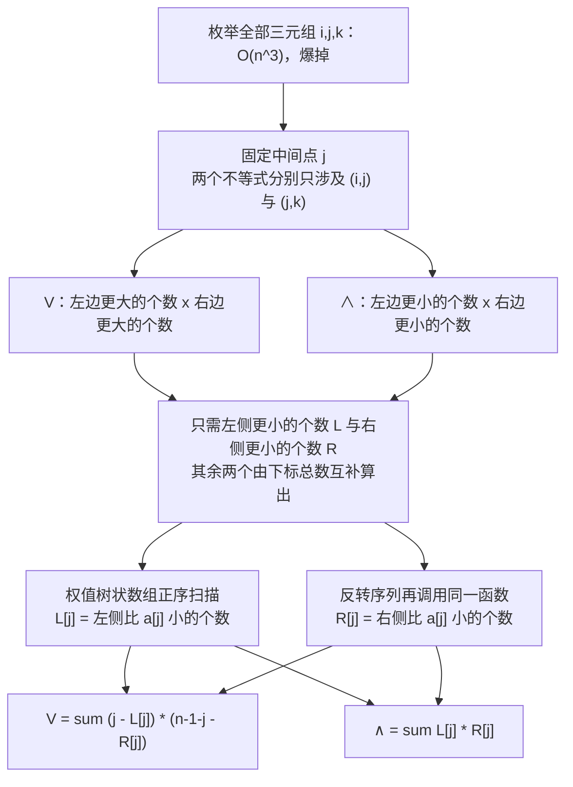

[[TOC]]

## 形式化题目

给定 $y_1,\dots,y_n$ 是 $1\sim n$ 的一个排列。对每个下标三元组 $1\leqslant i<j<k\leqslant n$：

- 若 $y_i>y_j$ 且 $y_j<y_k$，称 $(i,j,k)$ 构成 **V 图腾**（$j$ 是谷）；
- 若 $y_i<y_j$ 且 $y_j>y_k$，称 $(i,j,k)$ 构成 **∧ 图腾**（$j$ 是峰）。

求 V 图腾与 ∧ 图腾的个数。

样例：$n=5$，$y=[1,5,3,2,4]$，答案为 `3 4`。

## 正解

### 思路

#### 1. 朴素做法与瓶颈

最直接的做法是三层循环枚举 $(i,j,k)$，对每个三元组做两次比较，$O(n^3)$。
$n=200000$ 时约 $1.3\times10^{15}$ 个三元组，无论常数多小都跑不完。

稍微聪明一点：注意 V 的判定 $y_i>y_j,\ y_j<y_k$ 中**没有任何一项同时涉及 $i$ 和 $k$**。
换言之，一旦 $j$ 定下来，$i$ 的合法性与 $k$ 的合法性是两件互不相干的事，
可以只枚举 $j$ 与 $(i,k)$：对每个 $j$ 数出左边比它大的个数、右边比它大的个数，相乘再累加。
这样降到 $O(n^2)$，但 $4\times10^{10}$ 仍然不可行。

两种朴素做法的共同瓶颈是**同一批元素被反复扫描**：每个 $j$ 都要重新数一遍左边有多少个比它大的，
而 $j$ 从 $1$ 走到 $n$ 时，"已扫描集合"每次只是多了一个元素。

| 做法 | 复杂度 | $n=2\times10^5$ 时的量级 |
| --- | --- | --- |
| 枚举三元组 | $O(n^3)$ | $1.3\times10^{15}$，爆掉 |
| 固定 $j$ 枚举 $(i,k)$ | $O(n^2)$ | $4\times10^{10}$，仍爆掉 |
| 权值树状数组 | $O(n\log n)$ | $1.4\times10^{7}$，可行 |

#### 2. 固定中间点：$i$ 与 $k$ 的条件互相独立

这是整道题的枢纽。对固定的 $j$，定义四个集合

$$
A^{>}_j=\{i<j:y_i>y_j\},\quad
A^{<}_j=\{i<j:y_i<y_j\},\quad
B^{>}_j=\{k>j:y_k>y_j\},\quad
B^{<}_j=\{k>j:y_k<y_j\}.
$$

因为 $y$ 是排列、元素两两不同，每个 $i$ 恰好落在 $A^{>}_j$ 或 $A^{<}_j$ 之一，$k$ 同理。
$i<j<k$ 的次序已经由集合定义保证，两个条件又互不牵连，所以：

$$
\text{V}=\sum_{j=1}^{n}|A^{>}_j|\cdot|B^{>}_j|,\qquad
\text{∧}=\sum_{j=1}^{n}|A^{<}_j|\cdot|B^{<}_j|.
$$

每个三元组的中间点唯一，所以按 $j$ 分类既不重也不漏。

#### 3. 四个计数只需两个：互补量由下标总数给出

$A^{>}_j$ 与 $A^{<}_j$ 加起来正好是 $j$ 左边的全部元素，$B^{>}_j$ 与 $B^{<}_j$ 加起来是 $j$ 右边的全部元素。于是只要会算"更小的个数"就够了：

$$
|A^{>}_j|=\underbrace{(j-1)}_{\text{左侧总数}}-|A^{<}_j|,\qquad
|B^{>}_j|=\underbrace{(n-j)}_{\text{右侧总数}}-|B^{<}_j|.
$$

（上式用 $1$ 开始的下标；代码走 0 开始，左侧总数与右侧总数分别是 $j$ 和 $n-1-j$。
后文为对照代码统一用 0 基记号。）

#### 4. 用权值树状数组把"数一遍"降到 $O(\log n)$

现在唯一要回答的问题变成：**已经扫过的元素里，权值比 $y_j$ 小的有几个**。
把元素从 $1$ 到 $n$ 依次插入，每次插入前先查一次前缀和：

- `tree` 是一棵**权值树状数组**，`tree` 上区间 $[1,v)$ 的和 = 已插入元素中权值 $<v$ 的个数；
- 查询 `query(y_j-1)` 得到的就是 $|A^{<}_j|$；
- 查询完再 `add(y_j, 1)`，把当前元素登记进去。

因为查的是"插入之前"的状态，统计到的自然只有 $j$ 左边的元素，不用额外排除自己。
又因为 $y$ 是 $1\sim n$ 的排列，权值范围恰好是 $1..n$，**不需要离散化**。
单次查询与插入各 $O(\log n)$，全程 $O(n\log n)$。

#### 5. 反向扫描复用同一个函数

右侧计数 $|B^{<}_j|$ 不用另写一份镜像代码：把序列反转后，"原位置 $j$ 右侧比它小"
就变成"反转序列中对应位置**左侧**比它小"。所以

```
right = prefix_less(a[::-1], n)[::-1]   # 得到的结果整体倒序，下标重新对齐
```

同一份 `prefix_less` 被调用两次，一次正序、一次倒序，四个计数就齐了。

#### 6. 样例推演

把 $n=5$、$y=[1,5,3,2,4]$ 逐位置拆开，表中的数字都用 0 基下标下的互补公式
$L^{>}=j-L^{<}$、$R^{>}=(n-1-j)-R^{<}$ 算得：

| $j$ | $y_j$ | $L^{<}$ | $R^{<}$ | $L^{>}$ | $R^{>}$ | V 的贡献 $L^{>}R^{>}$ | ∧ 的贡献 $L^{<}R^{<}$ |
| --- | --- | --- | --- | --- | --- | --- | --- |
| 0 | 1 | 0 | 0 | 0 | 4 | 0 | 0 |
| 1 | 5 | 1 | 3 | 0 | 0 | 0 | 3 |
| 2 | 3 | 1 | 1 | 1 | 1 | 1 | 1 |
| 3 | 2 | 1 | 0 | 2 | 1 | 2 | 0 |
| 4 | 4 | 3 | 0 | 1 | 0 | 0 | 0 |
| | | | | | | **V = 3** | **∧ = 4** |

读法：$L^{<},R^{<}$ 是代码里真正求出的两个数组（左侧 / 右侧比它小的个数），
$L^{>},R^{>}$ 由同一行的下标总数减出来。以 $j=1$（$y_j=5$）为例，
左边只有 $y_0=1$ 比它小，右边 $3,2,4$ 全比它小，所以 ∧ 贡献 $1\times3=3$、V 贡献 $0$——
这与"最大值只能当峰"的直觉一致。把所有行分别相加，得到 `3 4`。

### 代码

@include-code(./main.cpp, cpp)
@include-code(./main.py, python)

### 复杂度

- **时间复杂度**：$O(n\log n)$。树状数组被调用两次，每次 $n$ 轮查询 + $n$ 轮插入，
  每轮 $O(\log n)$；末尾两个求和是 $O(n)$。与标准 C++ 正解（树状数组 / 线段树 / 归并）同阶。
- **空间复杂度**：$O(n)$，来自树状数组、两个计数数组和反转序列的拷贝。

实测（Apple Silicon / CPython 3.14）：最大一组 $n=200000$ 用时 **0.43 s**、峰值内存 **55.6 MB**，
低于 1000 ms / 128 MB 的限制；$n=190000$ 一组为 0.30 s / 52.2 MB。

## 总结

- 看到"数三元组"先问一句：**这些条件能不能按中间点拆开**。本题 V、∧ 的两个不等式分别只涉及
  $(i,j)$ 与 $(j,k)$，拆开后左右两侧独立，计数就从"枚举配对"变成"两个数相乘"。
- 拆完只需求"左边有多少个比它小"。这类**动态前缀和**（集合单调增长、反复问前缀）
  是树状数组的标准信号；权值是 $1\sim n$ 的排列则省掉了离散化。
- **互补量用下标总数减**：四个计数只要求两个，少写一半代码也少一半出错机会。
- **反转序列复用函数**：右侧计数就是反转后的左侧计数，位置上的对应关系靠 `[::-1]` 还原。
  这比写一个 `suffix_less` 更短，也不会出现两边边界处理不一致的 bug。
- 查询必须在插入**之前**做，这样统计范围天然是"已扫过的元素"，不用再减掉自己。

## 图示解析

下面这张图串起从朴素枚举到 $O(n\log n)$ 的完整主线，重点是"条件按中间点分裂"这一步：



读图时抓两条分叉：第一条说明**为什么可以相乘**（$i$ 与 $k$ 的条件互不相干，
中间点是唯一的分类依据）；第二条说明**为什么只求两个数组就够**（左侧与右侧的大小关系
各自互补，总数由下标给出），以及右侧数组为什么不必单独实现（反转序列后同一个函数即可）。

再看一眼树状数组在这道题里到底"数"了什么。以样例前三个元素 $1,5,3$ 为例：

| 扫描到 | 查询 $[1,y_j)$ | 得到 | 插入后 `tree` 中已登记的权值 |
| --- | --- | --- | --- |
| $y_0=1$ | $[1,1)$ | 0 | $\{1\}$ |
| $y_1=5$ | $[1,5)$ | 1（只有 1） | $\{1,5\}$ |
| $y_2=3$ | $[1,3)$ | 1（只有 1） | $\{1,3,5\}$ |

这张表展示了"查询在插入之前"的含义：处理 $y_2=3$ 时，集合里还只有 $y_0,y_1$，
所以数出来的 1 就精确等于 $|A^{<}_2|$；如果先插入再查询，就会把 $3$ 自己算进去。
