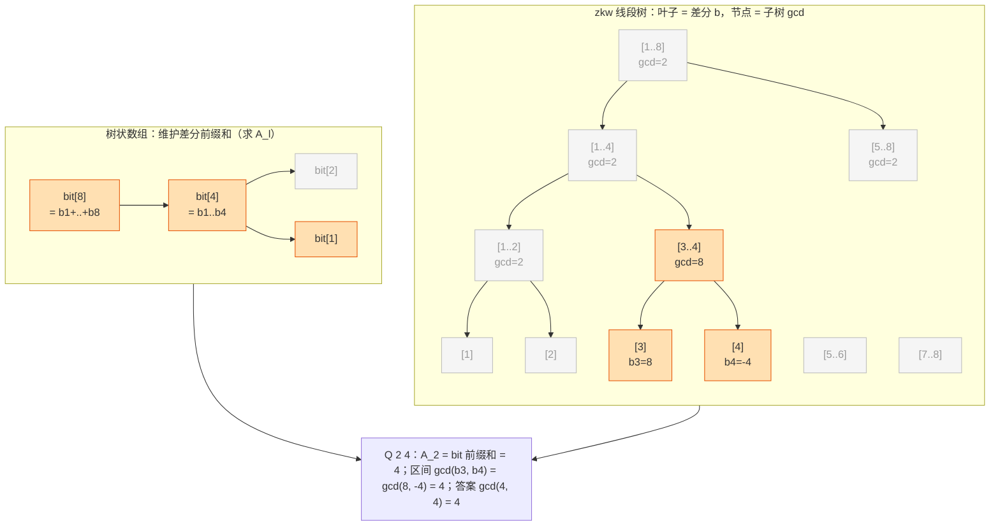

[[TOC]]

## 形式化题目

给定长度为 $N$ 的数列 $A$，以及 $M$ 条指令，每条指令是以下两种之一：

- `C l r d`：把 $A_l, A_{l+1}, \ldots, A_r$ 都加上 $d$；
- `Q l r`：询问 $\gcd(A_l, A_{l+1}, \ldots, A_r)$。

对每个询问输出一个整数。

数据范围：$N \leqslant 5 \times 10^5$，$M \leqslant 10^5$。

## 思路

### 朴素做法为什么不行

最直接的做法是每次询问把区间逐个元素取 $\gcd$：单次 $O(N)$，总共 $O(NM)$，
在 $N = 5 \times 10^5$、$M = 10^5$ 的规模下不可行。修改操作如果真的去区间加，
同样绕不开"逐个元素改"的代价。

更根本的障碍在于：普通线段树擅长"单点改 + 区间可合并信息（和 / max）"，
但本题是**区间加 + 区间 gcd**。加法懒标记对 gcd 没有传递规律——
$\gcd$ 节点存的是子树内部的 $\gcd$，整体加 $d$ 之后，
$\gcd(\text{lazy} + \text{子节点值})$ 并不等于真实区间的 $\gcd$，懒标记无法下传。

### 突破口：把 gcd 搬到差分序列上

$\gcd$ 有一条古老而好用的性质（更相减损术）：

$$\gcd(x, y) = \gcd(x, y - x)$$

对相邻两项反复套用：设差分 $b_1 = A_1$，$b_i = A_i - A_{i-1}$（$i \geqslant 2$），则

$$\gcd(A_l, \ldots, A_r) = \gcd\bigl(A_l,\; \underbrace{A_{l+1}-A_l}_{b_{l+1}},\; \ldots,\; \underbrace{A_r - A_{r-1}}_{b_r}\bigr) = \gcd\bigl(A_l,\; b_{l+1}, \ldots, b_r\bigr)$$

也就是说，区间 $\gcd$ 可以拆成**一个单点值 $A_l$** 和**一段差分上的区间 $b_{l+1..r}$**。

而区间加操作在差分序列上会"塌缩"：$A_{l..r}$ 整体加 $d$，只影响两个差分点——

$$b_l \mathrel{+}= d, \qquad b_{r+1} \mathrel{-}= d$$

（$r = n$ 时 $b_{r+1}$ 不存在，只改 $b_l$。）于是原问题变成了三种**经典可维护**的量：

| 需要的量 | 对应结构 | 操作 |
| :-- | :-- | :-- |
| $A_l$（原数列单点值） | 树状数组 | 维护 $b$ 的前缀和，单点加 + 前缀求和 |
| $\gcd(b_{l+1..r})$ | 线段树 | 叶子是 $b_i$，内部节点是子树 $\gcd$；单点改 + 区间查 |

$\gcd$ 满足结合律，是"可合并"信息，线段树天然支持；而它承担不了的"区间加"
被差分拆给了树状数组——**两种结构各管一件事，正好互补**。

### 合并答案

每次询问：

1. 用树状数组求 $A_l = b_1 + b_2 + \cdots + b_l$；
2. 用线段树求 $\gcd(b_{l+1}, \ldots, b_r)$（$l = r$ 时为空，跳过）；
3. 答案是 $\gcd\bigl(|A_l|,\ \gcd(b_{l+1..r})\bigr)$。

两个细节：

- $d$ 可为负，$A_l$ 与 $b_i$ 都可能是负数，$\gcd$ 对非零数取绝对值不影响结果，
  所以对 $A_l$ 显式取 $|\cdot|$；线段树内部节点由 `math.gcd` 合出，天然非负。
- $\gcd(0, x) = x$ 是 $\gcd$ 的单位元：查询初值取 $0$、线段树补零叶子都靠它成立，
  $l = r$ 的边界也自动正确。

用样例演示这个转化（初始 $A = [1, 3, 5, 7, 9]$，差分 $b = [1, 2, 2, 2, 2]$）：

| 操作 | 原数列视角 | 差分视角 |
| :-- | :-- | :-- |
| `Q 1 5` | $\gcd(1,3,5,7,9)=1$ | $\gcd\bigl(A_1,\ b_2..b_5\bigr)=\gcd(1,2,2,2,2)=1$ |
| `C 1 5 1` | $A \to [2,4,6,8,10]$ | $b_1 \mathrel{+}= 1,\ b$ 无 $b_6 \to b=[2,2,2,2,2]$ |
| `Q 1 5` | $\gcd(2,4,6,8,10)=2$ | $\gcd\bigl(A_1,\ b_2..b_5\bigr)=\gcd(2,2,2,2,2)=2$ |
| `C 3 3 6` | $A_3 \to 12$ | $b_3 \mathrel{+}= 6,\ b_4 \mathrel{-}= 6 \to b=[2,2,8,-4,2]$ |
| `Q 2 4` | $\gcd(4,12,8)=4$ | $\gcd\bigl(A_2,\ b_3, b_4\bigr)=\gcd(4,8,-4)=4$ |

两次修改每次都只动了差分序列上的至多两个点，查询则合并"一个前缀和 + 一段区间 gcd"。

## 代码

@include-code(./main.cpp, cpp)
@include-code(./main.py, python)

实现说明：

- **zkw 线段树**（非递归）：`size` 取 $2^{\lceil \log_2 n\rceil}$，叶子 $b_1..b_n$
  平铺在 `tree[size .. size+n-1]`，其余补 $0$（不影响 $\gcd$）；建树自底向上。
  单点修改先改叶子，再沿父链 `tree[i>>1] = gcd(tree[2i], tree[2i+1])` 重算——
  只有到根的一条链会变化；区间查询用 `lo/hi` 双指针向上爬，把覆盖区间的节点并进 `res`。
- **树状数组**维护差分前缀和，用 `tree[i] += delta[i]` 后向 `i + lowbit(i)` 累加的
  写法 $O(n)$ 建树，避免 $n$ 次 $O(\log n)$ 插入。
- 读入用 `sys.stdin.buffer.read().split()` 的扁平 token 流加 `pos` 指针顺序扫描，
  操作符与 `b'C'` 直接比较，$M = 10^5$ 条指令的开销降到最低。

## 图示解析

下图画出样例最后一次查询 `Q 2 4` 时的两棵结构（$n=5$ 补零叶子到 $size=8$）：
左边的树状数组负责回答"$A_l$ 是多少"，右边的 zkw 线段树负责回答"差分区间的 gcd"，
查询路径高亮了各自要经过/合并的节点。

- 树状数组侧：$A_2 = b_1 + b_2$，按 `2 → 1` 的 lowbit 链把 `bit[2]`、`bit[1]` 累加起来。
- 线段树侧：$b_3, b_4$ 正好落在节点 `[3..4]`（$\gcd(8,-4)=4$）内，一次合并完成；
  若区间跨更多块，就在爬树过程中逐块并进 `res`。
- 单点修改（`C` 指令）在线段树上只重算叶子到根的一条链，树状数组上只改一条 lowbit 链，
  这正是"区间加塌缩成单点改"换来的效率。

## 复杂度

- 预处理 $O(N)$：差分、线段树自底向上、树状数组 $O(N)$ 建树。
- 每次修改 `C`：至多两次单点更新，各 $O(\log N)$。
- 每次询问 `Q`：一次前缀和 $O(\log N)$ + 一次区间 $\gcd$（合并 $O(\log N)$ 个节点，
  每次 $\gcd$ 计算 $O(\log V)$）→ $O(\log N \cdot \log V)$。
- 总时间 $O\bigl((N + M)\log N \cdot \log V\bigr)$，空间 $O(N)$。
  C++ 可轻松通过；Python 版实测 4 组测试数据均在 $1\,\text{s}$ 内完成。

## 总结

- 破题点是恒等式 $\gcd(x, y) = \gcd(x, y - x)$：它把**区间 gcd** 搬到差分序列上，
  让**区间加**塌缩成两个单点改，一个看似"懒标记失效"的难题就此拆成两个经典模型。
- 结构分工要记牢：$\gcd$ 交给可合并的线段树，加法信息交给常数更小的树状数组（前缀和求 $A_l$）；
  合并公式 $\gcd\bigl(|A_l|,\ \gcd(b_{l+1..r})\bigr)$ 与边界 $l = r$、$r = n$ 是易错点。
- "差分 + 单点维护 + 合并查询"是处理"区间加 + 不可懒传的区间信息"的通用套路，
  同样适用于区间加 + 区间异或和、区间加 + 区间最大公约数变体等问题。
