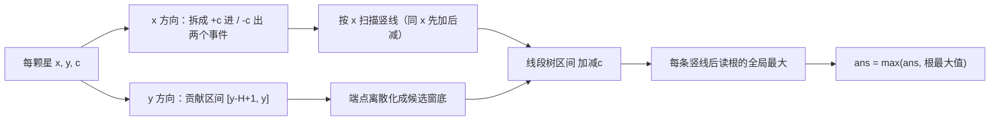

[[TOC]]

## 形式化题目

平面上给定 $n$ 个互不重合的点（星星），第 $k$ 个位于整数坐标 $(x_k, y_k)$，权值为整数 $c_k$。
选取一个边平行于坐标轴、宽 $W$ 高 $H$ 的开矩形窗口
$(x_0,\, x_0 + W) \times (y_0,\, y_0 + H)$
（$x_0, y_0$ 可为任意实数），使窗口**严格内部**的星星权值之和最大，输出这个最大值。

数据范围：$1 \leqslant n \leqslant 10^4$，$1 \leqslant W, H \leqslant 10^6$，
$0 \leqslant x, y < 2^{31}$。多组测试用例。

样例：$W=5, H=4$，三颗星 $(1,2)$ 亮 $3$、$(2,3)$ 亮 $2$、$(6,3)$ 亮 $1$。
把窗口框住前两颗星（如 $[1,6) \times [0,4)$）得到 $3 + 2 = 5$；
窗口怎么移，能不能更大？这正是「边界上的星不算」带来的语义坑，
下文用扫描线把它一并处理掉。

## 暴力解法

### 思路

最朴素的想法是枚举窗口左下角 $(x_0, y_0)$，逐个位置数窗内的星。
但窗口位置是连续的，先要问：**哪些位置值得枚举？**

每颗星在窗内的条件是 $x_0 < x_k < x_0 + W$ 且 $y_0 < y_k < y_0 + H$，
即 $x_0 \in (x_k - W,\, x_k)$、$y_0 \in (y_k - H,\, y_k)$。
把窗口左右平移时，窗内星集只在 $x_0$ 跨过某个 $x_k$ 或 $x_k + W$ 时才变化；
上下平移同理。所以有效候选位置只需取

$$x_0 \in \{\,x_k,\ x_k + W\,\}, \qquad y_0 \in \{\,y_k,\ y_k + H\,\}$$

共 $O(n)$ 个横位置 × $O(n)$ 个纵位置。每个候选位置逐星判断是否在窗内需要 $O(n)$，
总复杂度 $O(n^3)$ —— $n = 10^4$ 时约 $10^{12}$，完全不可行。

### 代码

<!-- 不单独给出：暴力做法仅用于暴露瓶颈，正式主解在下方 ## 正解 小节 -->

### 复杂度

- 时间 $O(n^3)$（候选位置 $O(n^2)$ × 每位置统计 $O(n)$）。
- 空间 $O(n)$。

### 瓶颈

瓶颈在「每个候选位置都从头统计一遍」。但相邻候选之间窗内的星几乎不变：

1. **横方向**：$x_0$ 在两个相邻事件坐标之间滑动时，窗内星集完全不变——
   横位置其实只有 $2n$ 条"竖线"，答案只在竖线上结算。
2. **纵方向**：固定竖线后，「选窗底 $y_0$ 最大化权值和」是一维问题，
   每条竖线重新排序滑窗太浪费，它也应该随扫描**增量**变化。

两个方向合起来，就是扫描线 + 线段树的正解。

## 正解

### 关键观察

**观察一（竖线扫描）**：每颗星拆成两个事件——左边界到达 $x_k$ 时星"进入"（$+c$），
左边界越过 $x_k + W$ 时星"离开"（$-c$）。把 $2n$ 个事件按 $x$ 升序扫描，
处理完某条竖线的全部事件后，"当前在树里的星"恰好是横坐标在
$(x_0 - W,\, x_0]$ 内的星集，即左边界停在 $x_0$ 的窗口能圈住的全部星。
相邻竖线之间窗内星集不变，所以**答案只在竖线处结算**，共 $O(n)$ 次。

**观察二（y 方向降维）**：固定窗内星集后，剩下的问题是选窗底 $y_0$
最大化 $\sum [y_0 < y_k < y_0 + H]\, c_k$。对每颗星，它能对哪些 $y_0$ 贡献？
条件 $y_0 < y_k < y_0 + H$ 等价于 $y_k - H < y_0 < y_k$，
**每颗星对应窗底的一个带权开区间 $(y_k - H,\, y_k)$ 上的 $+c$**。
覆盖值 $cover(y_0)$ 是关于 $y_0$ 的分段常数函数，断点只在 $y_k - H$ 与 $y_k$，
且在每个区间的右端点左侧取到局部最大，于是问题变成：

> 维护每个窗底位置的覆盖值 $cover(y_0) = \sum_{\text{星}} [y_0 \in \text{区间}_k]\, c_k$，
> 支持区间加、询问全局最大值。

**观察三（线段树登场）**：事件只有"区间 $+c$"与"区间 $-c$"两种，
全局最大值就是覆盖值的最大者——这正是**区间加 + 区间最大值（带懒标记）线段树**的标准场景。
把所有区间端点 $y_k - H + 1$ 与 $y_k$ 离散化成 $m \leqslant 2n$ 个候选位置，
线段树叶子就是候选窗底位置。每条竖线结算时，答案对根的值 $MX[1]$ 取 max。

### 思路

**第一步，离散化窗底。** 把每颗星的 $y - H + 1$ 与 $y$ 排序去重得到
$m$ 个候选窗底位置。$cover$ 的断点只在这些位置，
最优覆盖一定在某个候选（某个星的顶端 $y_k$）处取到，离散化不丢最优解。

**第二步，事件化。** 每颗星 $(x, y, c)$ 产出两条事件：

- $(x,\ +c,\ [y-H+1,\ y])$：左边界贴上 $x$，星进入；
- $(x + W,\ -c,\ [y-H+1,\ y])$：左边界越过 $x + W$，星离开。

事件按 $(x,\ -\text{sign})$ 排序，即**同一竖线先加后减**。
效果：右边界恰好压住某颗星的离开事件，与左边界恰好贴上另一颗星的进入事件
落在同一条竖线时，先加后减使两者互不干扰——
"窗口左边界在 $x$ 处"对应的覆盖状态被正确算出，边界语义自动配平。

**第三步，扫描与结算。** 流程骨架：

```text
ans = 0
for 每条竖线 x（把同 x 的事件全部处理完）:
    区间加 ±c
    ans = max(ans, 根的全局最大覆盖)
```

**第四步，线段树细节。** 结点维护两个值：

- `MX[node]`：结点区间内所有候选窗底的覆盖值最大值；
- `LAZY[node]`：还没下传给儿子的区间加标记。

区间加完全落在结点区间内时只改 `MX` 与 `LAZY`；
否则下传 `LAZY`（儿子的 `MX` 与 `LAZY` 都加上去），递归两侧，
最后 `MX[node] = max(MX[左], MX[右]) + LAZY[node]`。
"父结点回填时加上自己的 LAZY"是懒标记不必每次下传的关键——
读根 `MX[1]` 时，沿途未下传的加值已经体现在根自己身上。

样例（$W=5, H=4$，三颗星）的 6 个事件，按竖线分组后：

| 竖线 | 事件 | 变化 | 星 $y$ | 含义 |
| :-: | :-: | :-: | :-: | :-- |
| 1 | $x=1$ | $+3$ | 2 | 星 $(1,2)$ 进入（左边界贴上） |
| 2 | $x=2$ | $+2$ | 3 | 星 $(2,3)$ 进入 |
| 3 | $x=6$ | $+1$ | 3 | 星 $(6,3)$ 进入（左边界贴上） |
| 3 | $x=6$ | $-3$ | 2 | 星 $(1,2)$ 离开（右边界越过 $1+5=6$） |
| 4 | $x=7$ | $-2$ | 3 | 星 $(2,3)$ 离开 |
| 5 | $x=11$ | $-1$ | 3 | 星 $(6,3)$ 离开 |

观察点：竖线 3 上"先 $+1$ 后 $-3$"。结算时窗口左边界取 $x_0 \in [6, 7)$，
窗内是横坐标 $\in (x_0 - 5, x_0] = (1, 6]$ 的星，即 $(2,3)$ 与 $(6,3)$，
而 $y$ 方向还能框住的最大权和是 $2 + 1 = 3$；
竖线 2 结算时窗内是 $(1,2)$ 与 $(2,3)$，最大权和 $3 + 2 = 5$ —— 全局最大 $5$，与样例一致。

建模主线（从星星到答案）：



### 代码

@include-code(./main.py, python)

实现说明：

- `range_add` 是裸的递归线段树区间加：完全覆盖时改 `MX`/`LAZY`；
  否则先下传 `LAZY`，递归两侧，回填时 `max(左右) + LAZY[node]`。
- 全局最大值永远是 `MX[1]`，所以不需要单独的查询函数；
  每条竖线结算一次，$O(1)$。
- `events` 生成式同时产出一条星的进入与离开事件；排序键
  `(e[0], -e[1])` 中第二维取 `-e[1]`（sign 的相反数）实现"先加后减"。
- `points` 是 $y-H+1$ 与 $y$ 的排序去重；`bisect_left` 把区间两端
  映射成线段树叶子下标。
- 多组用例：`MX`/`LAZY` 用全局列表，每组重建；输出按组拼接。

### 复杂度

- 时间 $O(n \log n)$：事件排序 $O(n \log n)$；$2n$ 次区间加各 $O(\log n)$；
  每条竖线读根 $O(1)$。离散化排序同为 $O(n \log n)$。
- 空间 $O(n)$：事件 $2n$ 条，线段树 $4m \leqslant 8n$。

## 总结

- 破题点是**两层降维**：横方向把窗口位置压成 $2n$ 条竖线（事件扫描），
  纵方向把"选窗底"变成"带权区间覆盖的最大值"。
- 每颗星拆成 $+c$ / $-c$ 两个事件，配上线段树区间加，
  "窗内星集"与"每个窗底的覆盖值"都能增量维护，总复杂度 $O(n \log n)$。
- 「边界上的星不算」在本题有三处落点：横方向**同竖线先加后减**、
  纵方向贡献区间左端取 $y - H + 1$、以及结算时机在"整条竖线处理完之后"。
  这类语义细节是本题最容易出错的地方。
- 线段树实现上，懒标记采用"下传 + 父结点回填加自身 LAZY"的标准写法；
  由于只询问全局最大值，查询退化成读根，非常干净。
- 同一套模型还能解决矩形面积并（ROJ 3114「Atlantis」）与 POJ 2482 同型题：
  区别只在线段树维护的是"覆盖长度"还是"覆盖最大权"。

## 图示解析

本题从题意到答案的主线：

```text
窗口圈星（边界不算）
`- 每颗星拆成两个 x 事件：+c 进窗 / -c 出窗
   `- 按竖线扫描 x，窗内星集只随事件变化
      `- y 方向降维：星对窗底 t 的贡献是区间 [y-H+1, y]
         `- 线段树区间 ±c 维护「每个候选窗底的覆盖值」
            `- 每条竖线后取根的全局最大值 → 答案
```

顺着分支看：第一层把二维的窗口选择降成对竖线的扫描；
第二层把"窗内星集"变成增量维护的状态；
第三层把剩下的一维问题（选窗底最大化带权覆盖）交给线段树；
最后一层利用"全局最大值只读根"做到每次结算 $O(1)$。
