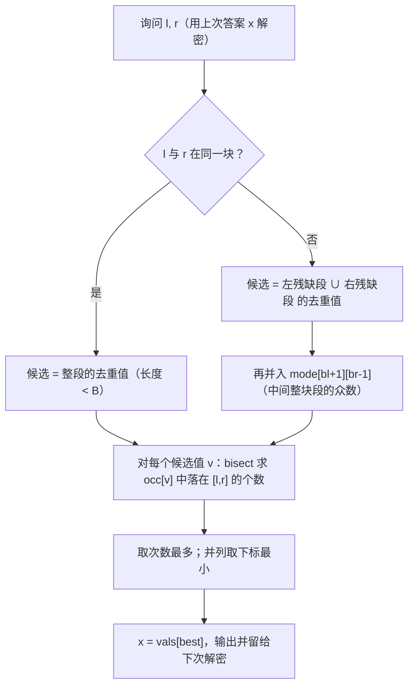

[[TOC]]

## 形式化题目

给定长度为 $n$ 的序列 $a_1, a_2, \dots, a_n$（$a_i$ 是正整数），需要回答 $m$ 次询问。
每次询问一个区间 $[l, r]$，求该区间内**出现次数最多**的数值；若多种数值出现次数同样最多，
输出其中数值最小者。询问强制在线：第 $k$ 次询问给出的 $l_0, r_0$ 需要用上一次的答案 $x$
（第一次 $x = 0$）解密为
$l = (l_0 + x - 1) \bmod n + 1$、$r = (r_0 + x - 1) \bmod n + 1$，
若 $l > r$ 则交换二者。

数据范围：$1 \leqslant n \leqslant 40000$，$1 \leqslant m \leqslant 50000$，$1 \leqslant a_i \leqslant 10^9$。

样例：$a = [1, 2, 3, 2, 1, 2]$。区间 $[1,5]$ 中 $1$ 出现 $2$ 次、$2$ 出现 $2$ 次，
次数并列时取更小的 $1$（第 2 次询问由上一次答案 $1$ 解密得到 $[3,6]$，答案为 $2$），
与样例输出 $1, 2, 1$ 一致。

## 暴力解法

### 思路

最直接的做法是每次询问都扫一遍区间 $[l, r]$：用计数器统计每个值出现的次数，
取次数最多、并列时取值最小者。这是完全正确的，也自然满足强制在线。

### 代码

<!-- 不单独给出：暴力做法仅用于暴露瓶颈，正式主解在下方 ## 正解 小节 -->

### 复杂度

- 时间 $O(n \cdot m)$：每次询问最坏扫满整个区间。
- 空间 $O(n)$（离散化后的计数器）。

### 瓶颈

$n \cdot m = 40000 \times 50000 = 2 \times 10^9$，纯 Python 完全不可能跑完。
瓶颈在于**相邻两次询问之间没有任何信息被复用**。

观察询问区间的结构：把序列按固定的块长切成整块，
任何区间 $[l, r]$ 都可以拆成

> 左端残缺块的一小段 + 中间若干**完整块** + 右端残缺块的一小段

中间那段"完整块"是长度 $O(n)$ 的大头，两端残缺段加起来只有 $O(\text{块长})$
个位置。于是自然的想法是：**把中间整块段的答案预处理出来，询问时只现算两端的零散位置**。

## 正解

### 关键观察

**观察一（切块）**：取块长 $B = \lfloor\sqrt{n}\rfloor$，块数 $T = \lceil n / B \rceil$，
两者同为 $O(\sqrt{n})$。询问 $[l, r]$ 落在块 $b_l = \lfloor l/B \rfloor$、$b_r = \lfloor r/B \rfloor$：

- 若 $b_l = b_r$（区间不足一块），直接统计整段，长度 $< B$；
- 否则拆成左残缺段 $[l, (b_l+1)B)$、中间整块段 $[(b_l+1)B,\ b_r B)$、右残缺段 $[b_r B, r]$，
  两段残缺长度都 $< B$。

**观察二（整块段答案可预处理）**：记 $mode[i][j]$ 为仅由块 $i$ 到块 $j$ 覆盖的那段序列的答案
（次数最多、并列取编号最小）。共 $T^2 = O(n)$ 个状态。固定左端块 $i$、让右端块 $j$ 递增时，
只新增一个块的元素，计数可以**增量**维护，所以整个表能在 $O(n \cdot T) = O(n\sqrt{n})$ 内建好。
由于这里统计的是固定区间，$mode[i][j]$ 与询问的 $l, r$ 无关，一次预处理长期复用。

**观察三（答案必在候选集里）**：设询问区间的真正答案是 $v^*$，它的出现次数记为 $c^*$。
把 $[l, r]$ 分成 $F$（两端残缺段）和 $M$（中间整块段）两部分，则
$c^* = \mathrm{cnt}_{F}(v^*) + \mathrm{cnt}_{M}(v^*)$，两种情况：

1. $\mathrm{cnt}_{F}(v^*) > 0$：$v^*$ 在残缺段里出现过，它属于 $F$ 的值集合；
2. $\mathrm{cnt}_{F}(v^*) = 0$：$v^*$ 只出现在 $M$ 里，此时 $v^*$ 在 $M$ 中的次数就是 $c^*$。
   而 $mode$ 给出的整块段最优答案在 $M$ 中的次数 $\geqslant \mathrm{cnt}_M(v^*)$，
   所以在 $M$ 上的最优值出现次数也等于 $c^*$（否则 $v^*$ 在 $[l,r]$ 里就不是最多的了）——
   即 $mode[b_l+1][b_r-1]$ 也是 $[l, r]$ 的一个最优解。

于是**候选集只需**：

$$C = \{\,a_i : i \in F\,\} \cup \{\,mode[b_l+1][b_r-1]\,\}$$

大小 $O(B)$。对每个候选值 $v$，还需要它在整个 $[l, r]$ 上的出现次数
$\mathrm{cnt}(v, l, r)$。

**观察四（次数用二分求）**：把每个值的所有出现位置收集成升序数组 $occ[v]$，则

$$\mathrm{cnt}(v, l, r) = \big|\{\,p \in occ[v] : l \leqslant p \leqslant r\,\}\big|
= \mathrm{upper\_bound}(occ[v], r) - \mathrm{lower\_bound}(occ[v], l)$$

一次 $O(\log n)$。候选 $O(B)$ 个，单次询问 $O(B \log n)$，
总计 $O(n\sqrt{n} + m\sqrt{n}\log n)$，对 $n = 4\times10^4, m = 5\times10^4$ 约为 $10^7$ 量级。

**值的比较顺序**：先把种类编号离散化成升序下标（第 $k$ 小的值 ↔ 下标 $k$），
这样"次数并列取编号最小"就退化成"次数并列取下标最小"，
预处理表的 $<$ 比较和询问的取最小都能直接按下标做，最后用 `vals[best]` 还原真实数值。

样例 $a = [1,2,3,2,1,2]$（$n = 6$，$B = 2$，共 3 块）的区间拆解：

| 询问 | 解密后的 $[l,r]$ | 左残缺段 | 中间整块段 | 右残缺段 | 候选集 | 答案 |
| :-: | :-: | :-: | :-: | :-: | :-: | :-: |
| 1 | $[1,5]$ | $\{a_1,a_2\} = \{1,2\}$ | 块 1 = $\{3,2\}$ | $\{a_5\} = \{1\}$ | $\{1,2\} \cup \{mode[1][1]=2\}$ | $1$（1 与 2 各 2 次，取小） |
| 2 | $[3,6]$ | $\{a_3,a_4\} = \{3,2\}$ | 块 2 = $\{1,2\}$ | $\{a_5,a_6\} = \{1,2\}$ | $\{2,3,1\}$ | $2$（2 出现 3 次） |
| 3 | $[1,5]$ | $\{1,2\}$ | 块 1 = $\{3,2\}$ | $\{1\}$ | $\{1,2\}$ | $1$ |

每次询问枚举的候选都只有 $O(B)$ 个，而它们覆盖了真正的答案。

单次询问的处理流程：



### 代码

@include-code(./main.cpp, cpp)
@include-code(./main.py, python)

实现说明：

- `prepare` 一次做完三件事：值离散化、`occ[v]` 出现位置表、以及 $O(T^2)$ 的
  `mode[i][j]` 整块区间众数表。
- `mode` 建表时固定左端块 $i$，右端块 $j$ 向右推进，块内每个元素只把计数 $+1$，
  因此总代价是 $O(n \cdot T)$ 而不是每对块重新扫。
- 计数用 `bisect_right(occ[v], r) - bisect_left(occ[v], l)`，
  即"$\leqslant r$ 的个数减去 $< l$ 的个数"，闭区间 $[l,r]$ 两端都算进去。
- 询问循环里 `x` 保存的是**真实数值**（用于解密下标），不是离散化下标；
  下标只在候选比较阶段使用，最终经 `vals[best]` 还原。
- 边界：$l$ 与 $r$ 同块时没有中间块，`mode` 不参与；
  中间块区间为空（$b_r - 1 \leqslant b_l$）时同样跳过，避免越界。

### 复杂度

- 时间：预处理 $O(n \log n)$（离散化排序）+ $O(n\sqrt{n})$（众数表）；
  每次询问枚举 $O(B) = O(\sqrt{n})$ 个候选，每个候选二分 $O(\log n)$，
  总计 $O(n\sqrt{n} + m\sqrt{n}\log n)$。
- 空间：$occ$ 共 $O(n)$；`mode` 表 $T^2 = O(n)$；离散化数组 $O(n)$。

## 总结

- 区间众数没有"可减"的结构，无法像前缀和那样两次相减得到，所以不能直接用树状数组 / 前缀和。
- 分块把区间拆成"两小段 + 一大段"：大段的答案预处理成 `mode[i][j]` 表长期复用，
  小段只有 $O(\sqrt n)$ 个位置，枚举它们就够了。
- 正确性的关键是**候选集不漏**：真正的最优解要么出现在残缺段里（被枚举到），
  要么只出现在整块段里，而那时 `mode` 给出的整块众数已经是一个同样最优的解。
- 每个候选值的区间出现次数用 `occ[v]` 上的两次二分求，把这个"数数"从 $O(\text{区间长})$
  压到 $O(\log n)$。
- 强制在线只影响解密方式，不影响算法本身；把"上次答案"按真实数值传递即可。

## 图示解析

从题意到答案的主线：

```text
区间 [l, r] 求众数（强制在线）
`- 逐次暴力统计：O(n·m)，不可行
   `- 分块：B = sqrt(n)，区间拆成「左残缺 + 中间整块 + 右残缺」
      `- 中间整块段的众数 mode[i][j]：固定 i、j 右移增量维护，O(n·sqrt n) 预处理
         `- 答案必在候选集内：残缺段的去重值 ∪ mode[bl+1][br-1]
            `- 每个候选值用 occ[v] 上两次 bisect 求 [l,r] 内出现次数
               `- 次数最多、并列取最小编号 → 输出并作为下次解密的 x
```

顺着分支看：第一层否掉暴力；第二层把长区间拆短，把"大头"整块段交给预处理；
第三层论证候选集不漏；最后一层用二分把每个候选的计数压到对数时间。
