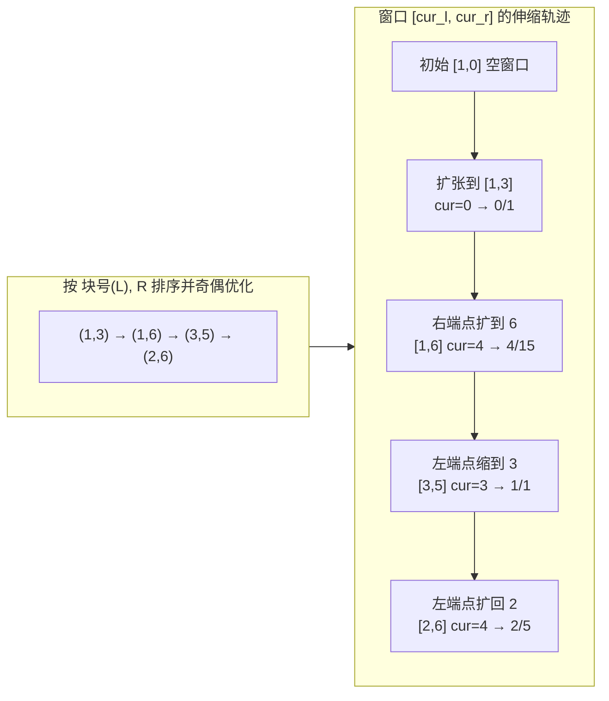

[[TOC]]

## 形式化题目

给定长度为 $N$ 的颜色序列 $C_1, C_2, \ldots, C_N$，以及 $M$ 个询问 $(L, R)$。对每个询问：从下标区间 $[L, R]$ 中等概率地选出两个不同位置的袜子，求两只袜子颜色相同的概率，并以最简分数 $A/B$ 输出；概率为 $0$ 时输出 `0/1`。

数据范围：$N, M \leqslant 50000$，$1 \leqslant L < R \leqslant N$，$C_i \leqslant N$。

以样例 `C = [1, 2, 3, 3, 3, 2]` 的询问 `2 6` 为例：区间内颜色为 $\{2, 3, 3, 3, 2\}$，同色的取法有 $\binom{3}{2} + \binom{2}{2} = 3 + 1 = 4$ 种，总取法 $\binom{5}{2} = 10$ 种，概率 $\frac{4}{10} = \frac{2}{5}$。

## 暴力解法

### 思路

对每个询问 $(L, R)$ 直接扫描区间一遍，用计数数组统计每种颜色的出现次数 $cnt_c$，则

$$
P = \frac{\sum_c \binom{cnt_c}{2}}{\binom{R-L+1}{2}}
$$

最后用 $\gcd$ 约分输出。单次询问 $O(N)$，总复杂度 $O(NM) = 2.5 \times 10^9$，在 $N, M \leqslant 50000$ 下完全不可接受。

### 代码

暴力解不单独给出：它只是下面正解在「每个询问独立重扫区间」时的退化形态，正解代码删掉排序部分即是暴力，验证也直接用正解代码完成。

### 复杂度

- 时间：$O(NM)$。
- 空间：$O(N)$。

### 瓶颈

瓶颈在于**相邻询问的高度重叠被完全浪费**：处理完 $(2,6)$ 再处理 $(3,5)$，两个区间只差一两个元素，暴力却把整个区间从头数一遍。如果能让「当前统计好的区间」在询问之间**只伸缩端点**地滑动，每次伸缩的代价又足够小，重叠部分就不用重算了。

## 正解

### 关键观察

**分子可以随端点增减 $O(1)$ 维护。** 设当前窗口为 $[l, r]$，$cnt_c$ 是窗口内颜色 $c$ 的只数，维护

$$
cur = \sum_c \binom{cnt_c}{2}
$$

把颜色为 $c$ 的一只袜子加入窗口时，它与窗口内已有的每只同色袜子各配成一对，所以同色对数恰好增加「加入前窗口内 $c$ 的只数」：

- 加入：`cur += cnt[c]`，然后 `cnt[c] += 1`；
- 删除：`cnt[c] -= 1`，然后 `cur -= cnt[c]`。

这两步是互逆的，且顺序不能颠倒（必须用**改变前**的计数算增量）。

### 思路

有了 $O(1)$ 的增量维护，问题变成：**按什么顺序处理 $M$ 个静态区间询问，能让端点移动总量最小？** 这正是莫队算法：

1. 块长取 $size \approx \sqrt{N^2/M}$（$M$ 与 $N$ 同阶时即 $\sqrt{N}$），把位置 $1 \sim N$ 分成若干块。
2. 所有询问按（$L$ 所在块编号，$R$）排序：块间从左到右；块内按 $R$ 排序。再做**奇偶优化**——奇数块内 $R$ 降序、偶数块内 $R$ 升序，避免换块时右指针整段回扫。
3. 维护窗口 $[cur_l, cur_r]$，按顺序对每个询问把四个端点逐格伸缩到目标位置，用上面的增量公式维护 $cnt$ 和 $cur$。

可以证明端点总移动量为 $O((N+M)\sqrt{N})$：左端点每块内最多移动 $O(size)$，共 $O(M \cdot size)$；右端点在块内单调、整块间最多扫 $O(N)$，共 $O(N^2/size + M)$。取 $size = N/\sqrt{M}$ 时两项平衡为 $O(N\sqrt{M})$ 级别。

下面用样例的 $4$ 个询问（$N=6$，取 $size=2$）演示窗口的滑动路径：

观察重点：排序后右端点 $3 \to 6 \to 5 \to 6$ 只在小范围内来回，左端点按块单调向右；窗口每移动一格只做一次 $O(1)$ 增量，总代价就是端点走过的格子数，而不是每个询问的区间长度之和。

最后对每个询问输出：$total = \binom{r-l+1}{2}$；若 $cur = 0$ 输出 `0/1`，否则设 $g = \gcd(cur, total)$，输出 $\frac{cur/g}{total/g}$。答案按原始下标存回，保证按输入顺序输出。

### 代码

@include-code(./main.cpp, cpp)
@include-code(./main.py, python)

### 复杂度

- 时间：排序 $O(M \log M)$ + 端点移动 $O((N+M)\sqrt{N})$ 次 $O(1)$ 增量。$N = M = 50000$ 时约 $10^7$ 量级基本操作。
- 空间：$O(N + M)$（颜色计数数组与询问列表）。

## 总结

- 概率公式的核心是把「随机选两只」看成无序二元组：分子 $\sum_c \binom{cnt_c}{2}$，分母 $\binom{len}{2}$。
- 把分子改写成「加入一只袜子时增量可算」的形式，静态区间统计就从"每次重扫"变成"端点增量维护"。
- 莫队 = 离线排序（分块 + 奇偶优化）+ $O(1)$ 增量伸缩，适用于**无修改的区间询问**；本题是莫队的经典入门模型。
