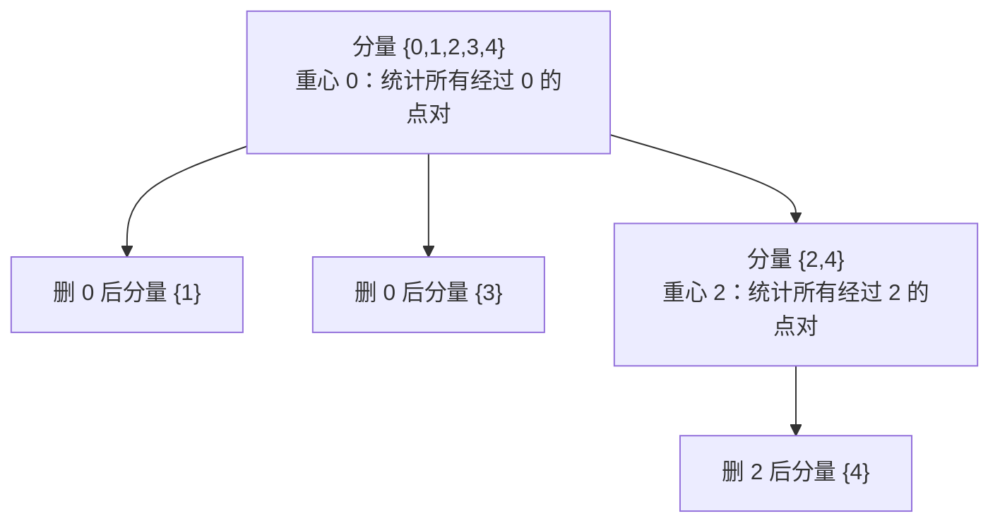

[[TOC]]

## 形式化题目

给定一棵 $N$ 个点的带权树，点编号 $0 \sim N-1$，每条边的权值非负且不超过 $1000$。求无序点对 $(x, y)$（$x \neq y$）的个数，使得树上 $x$ 到 $y$ 的唯一路径的边权之和不超过 $K$；输入含多组测试用例，以 `0 0` 结束。

题目不保证 $K < N$，也不保证边权为正：$K$ 可以大于所有点对的距离之和，边权可以取 $0$（数据范围 $N \leqslant 10000$，多组用例）。这两种情形都会影响计数的实现方式。

以样例 $N = 5,\ K = 4$ 的树为例，10 个点对的路径长度如下：

| 点对 | 路径 | 长度 | $\leqslant 4$？ |
| --- | --- | --- | --- |
| $(0,1)$ | $0 \to 1$ | 3 | ✅ |
| $(0,2)$ | $0 \to 2$ | 1 | ✅ |
| $(0,3)$ | $0 \to 3$ | 2 | ✅ |
| $(0,4)$ | $0 \to 2 \to 4$ | 2 | ✅ |
| $(1,2)$ | $1 \to 0 \to 2$ | 4 | ✅ |
| $(1,3)$ | $1 \to 0 \to 3$ | 5 | ❌ |
| $(1,4)$ | $1 \to 0 \to 2 \to 4$ | 6 | ❌ |
| $(2,3)$ | $2 \to 0 \to 3$ | 3 | ✅ |
| $(2,4)$ | $2 \to 4$ | 1 | ✅ |
| $(3,4)$ | $3 \to 0 \to 2 \to 4$ | 4 | ✅ |

合法点对共 8 个，与样例输出一致。注意 $(2,4)$ 的路径不经过点 $0$，而 $(1,2)$ 的路径经过点 $0$——这个区别正是下面点分治容斥的落点。

## 暴力解法

### 思路

枚举每个点 $s$ 作为起点，做一次 DFS 求出它到所有点的距离，统计 $s < t$ 且 $dis(s,t) \leqslant K$ 的点对数。由于路径唯一且对称，每个无序点对恰被数一次，正确性显然。

### 代码

暴力解不单独给出：它就是正解代码去掉「求重心、分层、容斥」之后的退化形态——保留「从当前根 DFS 收集距离 + 统计距离和不超过 $K$ 的点对」，并对每个点都当作根跑一遍即可，验证也直接用正解代码完成。

### 复杂度

- 时间：$O(N^2)$（每个起点一次 DFS）。
- 空间：$O(N)$。

### 瓶颈

瓶颈是**每换一个起点就重扫整棵树**：$N = 10^4$ 时是 $10^8$ 级别的边访问，而这还只是单组用例。要提速，就必须让「一批点对」在一次遍历里一起被统计，而不是一个起点一次。

## 正解

### 关键观察

**观察 1：固定一个点 $c$，同时统计所有经过 $c$ 的路径。** 若 $x, y$ 的路径经过 $c$，则 $dis(x,y) = dis(x,c) + dis(y,c)$。所以从 $c$ 出发 DFS 一趟，收集所有点到 $c$ 的距离，就能一次性判断「哪些点对经过 $c$ 且距离不超过 $K$」。

**观察 2：按重心分层，不重不漏。** 每次取当前分量的重心 $c$ 统计经过 $c$ 的路径，然后删掉 $c$、递归进剩下的分量。任一点对 $(x,y)$ 要么路径经过 $c$（在本层被统计），要么 $x, y$ 落在删掉 $c$ 后的同一个分量里（在后续层被统计），两种情况互斥且穷尽。重心保证每个分量规模减半，递归深度 $O(\log N)$。

**观察 3：本层的多余计数恰好是「同一子树内部」的点对。** 只按 $dis(x,c) + dis(y,c) \leqslant K$ 统计，会把「两点同在 $c$ 的同一棵子树、路径不经过 $c$」的点对也算进来，需要减掉。这正是样例里 $(2,4)$ 与 $(1,2)$ 的区别。

### 思路

点分治的每一层做三件事：求重心、收集距离、容斥计数。

图中每个方框是一层：先在重心处统计，再把删掉重心后的各分量作为下一层处理。样例树的重心依次是 $0$ 和 $2$；点对 $(1,2)$ 在第一层（经过 $0$）被统计，点对 $(2,4)$ 直到第二层（经过 $2$）才被统计，各出现一次。

**求重心。** 先从分量的代表点做一次迭代式 DFS，用 `order` 数组边遍历边增长代替手写栈，再由后往前累加子树大小。然后从代表点出发沿「重儿子」走：只要某个儿子的子树超过总点数一半，就走过去；走不动时所在点就是重心（它所有子树都不超过一半）。

**收集距离。** 从重心出发 DFS，把每个点到重心的距离记下来；超过 $K$ 的分支直接剪掉（边权非负，更深的点只会更远）。同时按「重心的那棵邻接子树」分桶，为容斥做准备。

**计数。** 对升序数组 $D$，满足 $d_i + d_j \leqslant K$（$i \leqslant j$）的点对数为

$$
\text{cnt}(D) = \sum_i \#\{j \leqslant i : d_j \leqslant K - d_i\},
$$

每个 $i$ 只需一次 `bisect_right(D, K - d_i, 0, i + 1)`。用二分而不是双指针，是因为本题 $K$ 可以大于所有距离、边权可以为 $0$，距离数组里会有大量相等值，二分的边界语义（「第一个大于」）不需要额外的单调性假设。

于是本层的贡献是

$$
\text{cnt}(D_c) - \sum_{v \in \text{儿子}} \text{cnt}(D_v),
$$

其中 $D_c$ 是所有点到重心的距离再加上重心自身的 $0$，$D_v$ 是第 $v$ 棵子树内各点到重心的距离。代码里 `sub[0]` 是重心自身的空占位，`merged` 就是 $D_c$，`sub[1:]` 就是各个 $D_v$。减掉的这些点对本层来说本来就不成立（路径不经过重心），它们会被递归到该子树时被正确统计。

用样例验证这一步（$K = 4$，重心 $0$）：$D_c = \{0,1,2,2,3\}$，按 $i$ 从小到大，每个 $d_i$ 的前缀内合法个数为 $1,2,3,4,2$，合计 $\text{cnt}(D_c) = 12$；三棵子树（分别含点 $1$、点 $2,4$、点 $3$）的距离集合是 $\{3\}, \{1,2\}, \{2\}$，各自内部的 $\text{cnt}$ 为 $0, 3, 1$，合计 $4$。所以本层贡献 $12 - 4 = 8$：其中 7 个是路径经过点 $0$ 的合法点对 $(0,1),(0,2),(0,3),(0,4),(1,2),(2,3),(3,4)$，另 1 个是重心自己的自配对。

**自配对修正。** 计数时把重心自己的距离 $0$ 也算进了 $D_c$，因此每层会多算 1 个「点到它自己」的自配对；每个点恰好当过一次重心，共多算 $N$ 个。最后统一输出 `divide(adj, k) - n`。

### 代码

@include-code(./main.cpp, cpp)
@include-code(./main.py, python)

### 复杂度

- 时间：每层分量总规模为 $N$，层数 $O(\log N)$；每层排序与二分各 $O(N \log N)$，总复杂度 $O(N \log^2 N)$。$N = 10^4$ 时为 $10^6 \sim 10^7$ 量级基本操作。
- 空间：邻接表、`removed`、`size`、`parent` 均为 $O(N)$，每层的距离数组不跨层累积，总空间 $O(N)$。

## 总结

- 树上路径问题可以按「路径经过哪个点」分类统计；固定一个点 $c$ 后，$dis(x,y) \leqslant K$ 变成两个到 $c$ 的距离之和不超过 $K$，可在一趟 DFS 内批量判定。
- 点分治用重心保证递归深度 $O(\log N)$，用「删点后各分量独立递归」保证每个点对只被统计一次；本层多算的恰好是同一子树内部的点对，用容斥减掉。
- 计数用「排序 + 对每个 $d_i$ 二分 $K - d_i$」代替双指针，避免了边权为 $0$、$K$ 大于所有距离时的边界陷阱，复杂度同阶。
- 实现上全部使用显式栈，不做递归调用，避免 Python 深树时的递归深度问题。
