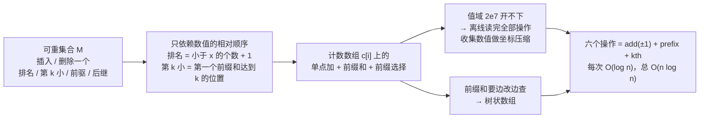

[[TOC]]

## 形式化题目

维护一个可重集合 $M$（同一数值可以出现多次），依次处理 $n$ 个操作，共六种：

1. 向 $M$ 中插入 $x$；
2. 从 $M$ 中删除一个 $x$（若 $M$ 中有多个 $x$，只减少一个副本）；
3. 查询 $x$ 的排名，定义为 $\#\{y \in M : y < x\} + 1$（有多个相同值时取最小的那个排名）；
4. 查询 $M$ 中第 $x$ 小的数值（$x$ 是排名，$1$-indexed）；
5. 查询 $x$ 的前驱，即 $\max\{y \in M : y < x\}$；
6. 查询 $x$ 的后继，即 $\min\{y \in M : y > x\}$。

题目要求的是：在任意多次插入、删除之后，仍能回答任意给定数值或排名的顺序位置查询，且重复值必须被正确计数。

题面样例（$8$ 个操作，其中 $4$ 个是查询）：

```text
8
1 10
1 20
1 30
3 20
4 2
2 10
5 25
6 -1
```

输出：

```text
2
20
20
20
```

## 正解

### 思路

先把题目从"平衡树"翻译成"顺序统计"。题目规模是 $n \leqslant 10^5$，数值在 $[-10^7, 10^7]$ 内，因此不能把值域直接展开成数组。$M$ 中每个元素具体是什么值并不重要，重要的是它们在数轴上的**相对顺序**。设 $M$ 去重后为 $v_1 < v_2 < \dots < v_m$，$c_i$ 为 $v_i$ 在 $M$ 中的出现次数，记前缀和

$$
S(x) = \#\{y \in M : y < x\} = \sum_{v_i < x} c_i,
\qquad
S'(x) = \#\{y \in M : y \leqslant x\} = \sum_{v_i \leqslant x} c_i .
$$

于是六个操作变成：

| 操作 | 用前缀和表示 |
| --- | --- |
| 1 插入 $x$ | $c_i \mathrel{+}= 1$ |
| 2 删除一个 $x$ | $c_i \mathrel{-}= 1$ |
| 3 $x$ 的排名 | $S(x) + 1$ |
| 4 第 $k$ 小 | 最小的 $v_i$ 使 $S'(v_i) \geqslant k$ |
| 5 $x$ 的前驱 | 第 $S(x)$ 小的值 |
| 6 $x$ 的后继 | 第 $S'(x) + 1$ 小的值 |

这张表是整道题的枢纽：**所有查询都是"前缀和"和"在前缀和上找位置"**。下面这张图把它画成一条主线：



**朴素做法与瓶颈。** 最直接的想法是维护一个有序列表 `a`：插入用 `bisect.insort(a, x)`，删除用 `bisect_left` 定位后 `a.pop(i)`，四个查询都是 $O(\log n)$。问题在于 Python 的 `list` 是连续内存，`insort` 和 `pop` 都要把插入点之后的元素整体搬移一位，单次 $O(n)$，最坏情况要搬 $10^{10}$ 量级的元素。**二分本身很快，慢的是维护这个顺序的物理存储。**

另一条路是按值开计数数组 `cnt[x]`：插入删除变成 $O(1)$，但值域 $[-10^7, 10^7]$ 要开 $2 \times 10^7$ 个槽；更致命的是"排名"是前缀和、"第 $k$ 小"是在前缀和上找位置，每次扫描 $O(V)$，同样不可接受。

**两个瓶颈对应两个工具。**

其一，**值域太大 $\to$ 离线坐标压缩**。题目不要求强制在线：先把 $n$ 个操作全部读完，收集所有可能作为数值出现的 $x$，去重排序得到坐标表 `coords`，值域就从 $2 \times 10^7$ 压到 $O(n)$。

这里有一个容易踩的坑：操作 4 的 $x$ 是**排名**而不是数值，不能收进坐标表。以样例为例，`coords` 应当是 $[-1, 10, 20, 25, 30]$ —— 操作 6 的 $-1$ 和操作 5 的 $25$ 虽然从未被插入，仍然需要坐标位（它们参与 `bisect` 定位）；而操作 4 的 $x = 2$ 若混进去，会在 $10$ 之前多插一个空槽，使"第 $k$ 小"整体取错。

其二，**前缀和要能边改边查 $\to$ 树状数组**。在压缩后的坐标上，插入/删除是单点加，排名是前缀和，两者都是 $O(\log n)$。剩下的"第 $k$ 小"是前缀选择，也能在树状数组上直接做。另外，操作 5、6 的查询结果保证存在，所以前驱与后继对应的排名 $S(x)$ 必定 $\geqslant 1$、$S'(x) + 1$ 必定不超过 $|M|$，代码里无需额外的空集判断。

**树状数组上怎么找第 $k$ 小。** 树状数组的第 $i$ 个元素 `tree[i]` 维护区间 $(i - \text{lowbit}(i),\, i]$ 的计数和。设数组长度为 $L$，从最大的不超过 $L$ 的 $2^j$ 开始，维护当前坐标 `i`（初值 $0$）与剩余的 $k$：

- 若 `i + step < L` 且 `tree[i + step] < k`：说明答案坐标一定在 `i + step` 之后，于是把 `i` 推进到 `i + step`，并从 `k` 中减掉这一段计数 `tree[i + step]`；
- 否则不动，把 `step` 折半继续。

循环结束时，`i` 是最后一个前缀计数仍小于 $k$ 的坐标，答案坐标是 `i + 1`；由于下标转换，`coords[i]`（0-based）恰好就是答案。之所以能"整段跳过"，是因为 `tree[i + step]` 正是区间 $(i, i + step]$ 的计数和。

**严格小于与小于等于的区分。** `bisect_left(coords, x)` 是第一个 $\geqslant x$ 的坐标下标，即 $\#\{v < x\}$，用于排名；`bisect_right(coords, x)` 是第一个 $> x$ 的坐标下标，即 $\#\{v \leqslant x\}$，用于后继。前驱用前者，后继必须用后者才能跳过所有等于 $x$ 的副本。

**样例推演。** 坐标表为 `coords = [-1, 10, 20, 25, 30]`（$-1$ 与 $25$ 来自操作 6、5 的查询值，操作 4 的 $x = 2$ 被排除），只需 5 个槽就完整表达了整个值域：

| # | 操作 | 计数数组 `cnt` | 前缀和 `[0..5]` | 答案 |
| --- | --- | --- | --- | --- |
| 1 | `1 10` | `[0,1,0,0,0]` | `[0,0,1,1,1,1]` | — |
| 2 | `1 20` | `[0,1,1,0,0]` | `[0,0,1,2,2,2]` | — |
| 3 | `1 30` | `[0,1,1,0,1]` | `[0,0,1,2,2,3]` | — |
| 4 | `3 20` | `[0,1,1,0,1]` | `[0,0,1,2,2,3]` | $S(20)=1$，输出 $1+1=2$ |
| 5 | `4 2` | 同第 4 行 | 同第 4 行 | 第一个前缀 $\geqslant 2$ 处是 $v_3=20$ |
| 6 | `2 10` | `[0,0,1,0,1]` | `[0,0,0,1,1,2]` | — |
| 7 | `5 25` | `[0,0,1,0,1]` | `[0,0,0,1,1,2]` | $S(25)=1$，第 1 小 $=20$ |
| 8 | `6 -1` | `[0,0,1,0,1]` | `[0,0,0,1,1,2]` | $S'(-1)=0$，第 1 小 $=20$ |

表格的"计数数组"列按 `coords` 的顺序列出 $c_i$，"前缀和"列是 $[\text{prefix}(0), \text{prefix}(1), \dots, \text{prefix}(5)]$。前三次插入只改计数、不改答案；第 4 行说明排名就是"严格小于的个数加一"；第 5 行说明第 $k$ 小就是在前缀和序列上找第一次达到 $k$ 的位置；第 7、8 行则说明操作 5 与操作 6 的区别只在用 $S$ 还是 $S'$。最终输出 `2 20 20 20`，与题面一致。

**代码结构。** `main.py` 里只有三个嵌套函数，正好对应三个原语：`add(pos, delta)` 是单点加，`count_below(pos)` 是前缀和 $\sum_{i < pos} c_i$，`value_at(rank)` 是前缀选择。主循环 `for opt, x in ops` 的六个分支就是上表的直接翻译，例如前驱写 `value_at(count_below(bisect_left(coords, x)))`。

### 代码

@include-code(./main.py, python)

### 复杂度

- **时间**：收集坐标与排序 $O(n \log n)$；每个操作一次 `bisect` 加一次树状数组操作，均为 $O(\log n)$，共 $O(n \log n)$。$n = 10^5$ 时实测约 $0.13\text{s}$。
- **空间**：`coords`、`tree`、`ops` 各 $O(n)$，总计 $O(n)$，实测峰值约 15MB。

## 总结

- 普通平衡树的六个操作本质上都是**顺序统计**：排名是前缀和加一，第 $k$ 小是前缀和上第一次达到 $k$ 的位置，前驱与后继只是选择不同的前缀边界。
- 只要题目允许离线读完全部输入，就不必在 Python 里手写 Treap：**坐标压缩把值域降到 $O(n)$，树状数组负责单点加、前缀和与前缀选择**，六个接口全部由两个原语拼出，常数小且不易写错。
- 两个易错点：操作 4 的 $x$ 是排名不能进坐标表；前驱用 `bisect_left`、后继用 `bisect_right`，否则重复值会算错。

## 图示解析

这张图串起本题从"可重集合"到"树状数组"的主线：

```text
可重集合 M（插入 / 删除一个 / 排名 / 第 k 小 / 前驱 / 后继）
`- 六个操作只依赖数值的相对顺序：排名 = 前缀和 + 1，第 k 小 = 第一个前缀和达到 k 的位置
   |- 值域 2e7 开不下 -> 离线读完全部操作，收集所有数值做坐标压缩
   `- 前缀和要能边改边查 -> 树状数组
      `- 六个操作 = add(±1) + prefix + kth，每次 O(log n)
```

先看第一层：六个操作里没有任何一个需要知道"元素的物理位置"，只需要知道"比我小的有多少个"。顺着这条线走到第二层，就会得到"计数数组上的前缀和 + 前缀选择"这个统一模型；再看两个瓶颈（值域太大、前缀和要频繁更新），才落到坐标压缩与树状数组。图中只保留正文已经论证过的关系，具体的坐标表与答案推演见 `## 正解` 中的样例表。
