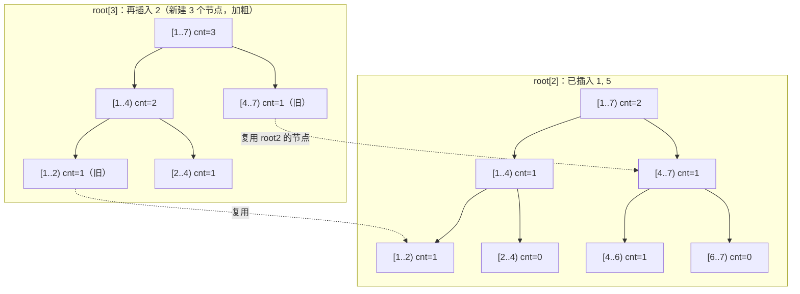

[[TOC]]

## 形式化题目

给定长度为 $n$ 的静态序列 $A$。对 $m$ 个询问 $(l, r, k)$，分别回答 $A[l..r]$ 中第 $k$ 小的值（重复的值按出现次数计）。$n \leqslant 10^5$，$m \leqslant 10^4$，$|A_i| \leqslant 10^9$。

## 正解

### 思路

**朴素做法**：对每个询问，把 $A[l..r]$ 复制出来排序，取第 $k$ 个。单次询问 $O(n \log n)$，总共 $O(mn \log n) \approx 10^4 \times 10^5$ 次比较级的工作，无法承受。

**第一个观察：把"区间"变成"前缀之差"。** 数组是静态的，$A[l..r]$ 中每个值的出现次数，恰好等于"前 $r$ 个数中该值的出现次数"减去"前 $l-1$ 个数中该值的出现次数"。所以若我们能对每个前缀维护一个"按值统计次数"的权值线段树，则一次询问就是两棵线段树的对应节点做减法。问题在于：$n$ 棵完整的权值线段树要 $O(n^2)$ 空间。

**第二个观察：相邻前缀只差一个数——可持久化。** 前缀 $1..i$ 的线段树和前缀 $1..i-1$ 的线段树相比，只有从根到"值 $A_i$ 所在叶子"这一条链上的计数变了，其余部分完全相同。于是第 $i$ 棵树不必新建，只需从第 $i-1$ 棵树**复用所有旧节点**、沿这条链新建 $O(\log n)$ 个新节点即可。这就是可持久化线段树（主席树）：$n$ 次插入共用 $O(n \log n)$ 个节点。

**查询：两棵树同步下降。** 设 $u = root[l-1]$，$v = root[r]$。区间内落在值域左半区的个数是 $cnt[lc_v] - cnt[lc_u]$：若 $k$ 不超过它，第 $k$ 小在左半区，两棵树同时走左儿子；否则把 $k$ 减去左半个数，同时走右儿子。走到底时所在的叶子就是答案的离散化下标。

用样例 `1 5 2 6 3 7 4` 看查询 `[2,5]`（即 `5 2 6 3`，求第 3 小）：排序后为 `2 3 5 6`，第 3 小是 `5`。查询时先比较"左半区（较小的那些值）里有几个数"，再决定向左还是向右，每层只看一次计数差：

```text
值域（离散化后 7 个值: 1 2 3 4 5 6 7）
层级1  [1..7)  左半 {1,2,3} 有 2 个 (2,3)  → k=3 > 2，去右半，k←3-2=1
层级2  [4..7)  左半 {4,5}   有 1 个 (5)   → k=1 ≤ 1，去左半
层级3  [4..6)  左半 {4}     有 0 个      → 去右半，k 不变
层级4  [5..6)  只剩值 5                  → 答案 5
```

### 代码

@include-code(./main.cpp, cpp)
@include-code(./main.py, python)

### 复杂度

- 预处理：$n$ 次插入，每次新建一条 $O(\log n)$ 的链，时间与空间都是 $O(n \log n)$。
- 每次询问：两棵树同步下降一层只做一次减法，$O(\log n)$。
- 总计 $O((n + m)\log n)$，与数据范围匹配：$10^5 \times 17 + 10^4 \times 17$ 远小于朴素做法。

## 总结

- 静态区间第 $k$ 小的经典模型：**前缀可减性 + 可持久化权值线段树**。
- 两个关键转化：用"前缀之差"消去区间维度，用"路径复制"消去版本维度，两者共同把 $O(n^2)$ 的空间压到 $O(n \log n)$。
- 实现要点：先离散化把值域压到 $O(n)$；主席树用平行数组存节点，下标即节点编号，$0$ 号节点兼任"空节点"哨兵，省去所有空指针判断。

## 图示解析

### 主席树版本共享

下图展示样例中依次插入 `1, 5, 2` 后，第 3 棵树（`root[3]`）如何与第 2 棵树共享大部分节点，只新建一条从根到值 `2` 叶子的链：



观察重点：插入值 `2` 只影响从根到叶子 `[2..4)` 的路径，所以 `root[3]` 只有 3 个新节点（根、`[1..4)`、`[2..4)`）；右子树 `[4..7)` 和左深处的 `[1..2)` 都直接指回 `root[2]` 的旧节点。$n$ 个版本合起来只建 $O(n \log n)$ 个节点，而不是 $n$ 棵完整的树。
