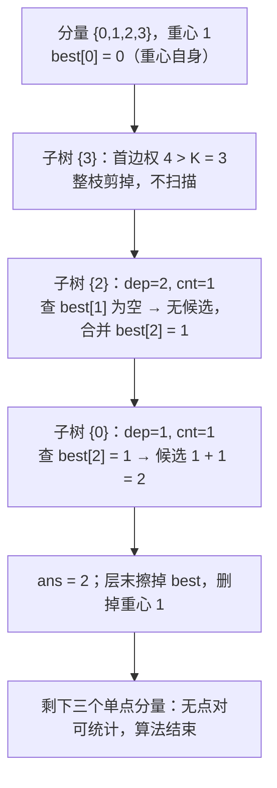

[[TOC]]

## 形式化题目

给定一棵 $N$ 个节点的树，节点编号 $0 \sim N-1$，每条边带非负权值。求一条简单路径，使路径上各边权值之和等于 $K$，且路径包含的边数最少；不存在这样的路径时输出 `-1`。

把「路径」翻译成结构化的对象：对点 $c$ 和点 $u$，记

- $dep_c(u)$：树上 $c$ 到 $u$ 唯一路径的边权之和；
- $cnt_c(u)$：这条路径包含的边数。

要求的量就是

$$
\min\{\,cnt_x(y) \;:\; x \neq y,\ dep_x(y) = K\,\}.
$$

当 $x \neq y$ 的路径经过 $c$ 时，$dep_c(x) + dep_c(y) = dep_x(y)$ 且 $cnt_c(x) + cnt_c(y) = cnt_x(y)$——这是后面所有推导的支点。

以样例 $N = 4,\ K = 3$ 为例，树为 $0-1$（权 1）、$1-2$（权 2）、$1-3$（权 4），六个点对的全部数据如下：

| 点对 | 路径 | 权值和 | 边数 | 等于 $K=3$？ |
| --- | --- | --- | --- | --- |
| $(0,1)$ | $0 \to 1$ | 1 | 1 | ❌ |
| $(0,2)$ | $0 \to 1 \to 2$ | 3 | 2 | ✅ |
| $(0,3)$ | $0 \to 1 \to 3$ | 5 | 2 | ❌ |
| $(1,2)$ | $1 \to 2$ | 2 | 1 | ❌ |
| $(1,3)$ | $1 \to 3$ | 4 | 1 | ❌ |
| $(2,3)$ | $2 \to 1 \to 3$ | 6 | 2 | ❌ |

只有 $(0,2)$ 的权和等于 3，边数为 2，所以输出 `2`。注意 $(0,2)$ 的路径经过点 $1$，而 $(0,3)$、$(2,3)$ 也经过点 $1$ 却不合法——「按路径经过哪个点分类」正是下面点分治的落点。

## 暴力解法

### 思路

枚举起点 $s$，做一次 DFS 求出 $s$ 到所有点的距离 `dis[]` 与边数 `cnt[]`，再枚举终点 $t$ 检查 `dis[t] == K`，取最小的 `cnt[t]` 作为答案。

正确性来自树上路径的唯一性：任意点对 $(x,y)$ 的路径只在 $s = x$（或 $s = y$）那一轮被完整走出来，不存在漏数或重复计入最优解的情况。

### 代码

暴力解不单独给出：它就是把正解代码里「求重心、分层、容斥/先查询后合并」的部分删掉，退化成「对每个点各做一次 DFS 收集 $(dep, cnt)$，再两两检查」的形态。本次任务明确要求不落盘 `brute.cpp`，因此正确性改用两种方式验证：真实数据 50 组输出与标准答案完全一致；另用一次性 $O(N^2)$ 脚本在 $N \leqslant 30$、边权含 $0$ 的随机树上对拍 3000 组，结果完全一致。

### 复杂度

- 时间：$O(N^2)$（每个起点一次 DFS 扫描全部边）。
- 空间：$O(N)$（每次 DFS 的距离与边数数组）。

### 瓶颈

瓶颈是**每条路径都要被单独走一遍**。$N = 2 \times 10^5$ 时是 $2 \times 10^{10}$ 量级的边访问，而题目给的时限只有 1s。真正被用到的信息其实只有「经过某点的两条半路径能否拼成 $K$」，因此必须让**一批路径在同一次遍历里被一起判定**。

## 正解

### 关键观察

**观察 1（拆路径）。** 固定一个点 $c$，则所有经过 $c$ 的路径都可以拆成「$c \to x$」和「$c \to y$」两段。于是判定条件由一个二元关系降成两个**到 $c$ 的标量**：

$$
dep_c(x) + dep_c(y) = K \quad\Longleftrightarrow\quad dep_c(y) = K - dep_c(x),
$$

答案候选也随之变成 $cnt_c(x) + cnt_c(y)$。从 $c$ 出发 DFS 一趟，就能为所有经过 $c$ 的路径同时判定。

**观察 2（不重不漏）。** 只固定一个 $c$ 不够，因为不经过 $c$ 的路径还没被处理。用点分治分层：每层取当前分量的重心 $c$，统计所有经过 $c$ 的路径，然后删掉 $c$，把剩下的每块递归下去。任一点对的路径要么经过 $c$（本层统计），要么两点落在删掉 $c$ 后的同一块里（更深层统计），两种情况互斥且穷尽。重心保证每块规模不超过一半，层数 $O(\log N)$。

**观察 3（用数组代替哈希表）。** 题目给出 $K \leqslant 10^6$，距离的取值范围很小，不必用哈希表。开一个定长数组

$$
best[d] = \text{「已处理部分中到重心距离为 } d \text{ 的最少边数」},
$$

对子树里的每个点 $u$ 只需读 `best[K - dep[u]]`，配对查询就是一次数组下标访问。因为查询只做加法 $cnt + best[K - dep]$，同一个 $d$ 的候选中边数最少的必然最优，所以每个 $d$ 只留最小值不会丢失最优解。

**观察 4（先查询后合并）。** 直接把重心所有子树的点一次性合并进 `best` 再查询，会把「两点同在一棵子树、路径根本不经过重心」的点对也算进来。所以子树必须**先查询、后合并**：扫描某棵子树时，`best` 里只有重心和更早处理过的子树。这同时顺带解决了「点和自己配对」——查询时自己还没进 `best`，不会读到自己的记录。

**观察 5（剪枝）。** 边权非负，所以子树内某点的 $dep$ 已超过 $K$ 时，它和它的所有后代都不可能再与任何点凑成 $K$，整枝丢弃。

### 思路

点分治的每一层做四件事：求重心、清空 `best`、逐棵子树「查询 + 合并」、删点后把邻居压栈。

以样例（$K = 3$）为例，第一层的重心是点 $1$，三棵子树分别是 $\{0\}$、$\{2\}$、$\{3\}$：

图中每个方框是重心 1 这一层按邻接表顺序处理的一步。子树 $\{3\}$ 因首边权 4 超过 $K$ 被整枝丢弃；子树 $\{2\}$ 扫描时 `best` 里只有重心，查到的是空位，合并后 `best[2]` 才有值；子树 $\{0\}$ 扫描时才能在 `best[2]` 上查到候选 2。删掉重心 1 后剩下三个单点分量，没有点对可统计。

把 `best` 数组的演化逐步写出来（$K=3$，`∞` 表示该格为空）：

| 阶段 | 操作 | `best[0]` | `best[1]` | `best[2]` | `best[3]` | 当前答案 |
| --- | --- | --- | --- | --- | --- | --- |
| 初始化 | 处理重心 1，登记 $dep=0$ | 0 | ∞ | ∞ | ∞ | ∞ |
| 子树 $\{3\}$ | 首边权 $4 > K$，整枝跳过（不出现任何读写） | 0 | ∞ | ∞ | ∞ | ∞ |
| 扫描子树 $\{2\}$ | 点 2：$dep=2, cnt=1$，查 `best[1]`$=\infty$ | 0 | ∞ | ∞ | ∞ | ∞ |
| 合并子树 $\{2\}$ | 把 $cnt=1$ 写入 `best[2]` | 0 | ∞ | 1 | ∞ | ∞ |
| 扫描子树 $\{0\}$ | 点 0：$dep=1, cnt=1$，查 `best[2]`$=1$ → 候选 $1+1=2$ | 0 | ∞ | 1 | ∞ | **2** |
| 合并子树 $\{0\}$ | 把 $cnt=1$ 写入 `best[1]` | 0 | 1 | 1 | ∞ | 2 |
| 层末清理 | 擦掉 `touched` 里的下标，删重心 1 | ∞ | ∞ | ∞ | ∞ | 2 |

表格的列是 `best` 的四个格子，行是层内按邻接表顺序发生的事件。要观察的重点有两个：一是**查询总发生在合并之前**，所以点 0 只能看到重心和子树 $\{2\}$，看不到自己；二是 `best` 里存的是「最少边数」，同一距离出现更优值时才覆盖。

实现上有三处细节：

- **求重心**：先从代表点做一次迭代式 DFS，用 `order` 边遍历边增长代替手写栈，再由后往前累加子树大小；然后从代表点沿「重儿子」下走，只要存在超过总量一半的分支就走过去，走不动时所在点即重心。注意父方向那一块（大小 $total - sz[cent]$）也要参与比较，否则重心会判错。
- **层末清理**：`best` 每层都要变空，但整数组清空是 $O(K)$、层数 $O(\log N)$，代价不必要。代码用 `touched` 记录本层首次写入的下标，层末只还原这些格子，与整层清空等价。
- **迭代代替递归**：分量栈 `todo` 和扫描栈 `stack` 都是显式列表，避免 Python 深链上的递归深度问题。

### 代码

@include-code(./main.py, python)

### 复杂度

- 时间：每层每个点只被扫一次邻接表，该层总代价 $O(\text{分量规模})$；重心保证层数 $O(\log N)$，故总时间 $O(N \log N)$。与标准 C++ 点分治同阶。
- 空间：链式前向星（`head` 与 `to`/`wt`/`nxt` 共约 $7N$ 个 `int`）、`best[0..K]`、以及 $O(N)$ 的辅助数组，合计 $O(N + K)$，$N = 2 \times 10^5$、$K = 10^6$ 时约 12MB。

## 总结

- 树上路径问题可以按「路径经过哪个点」分类：固定点 $c$ 后，$dep_c(x) + dep_c(y) = K$ 把「找一条路径」变成「配对两个到 $c$ 的距离」，一趟 DFS 就能批量判定。
- 点分治用重心保证递归深度 $O(\log N)$，用「删点后各块独立递归」保证每条路径只被统计一次；本层多算的恰好是同一子树内部的点对，用「先查询后合并」天然排除。
- 观察到 $K \leqslant 10^6$ 后，把「距离 → 最少边数」的映射放进定长数组而不是哈希表，配对查询变成一次下标访问，常数显著变小。
- 边权非负是（也是唯一需要的）剪枝依据：$dep > K$ 的整棵子树都不可能再参与配对。
