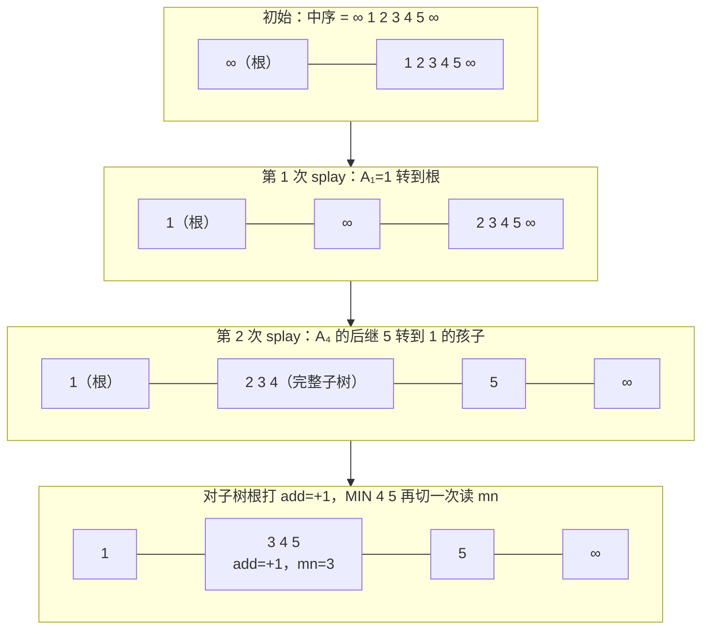
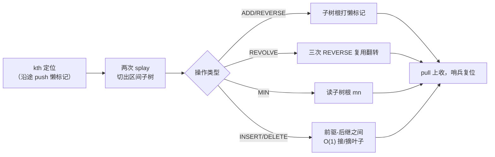

[[TOC]]

## 形式化题目

给定一个长度为 $n$ 的数列 $A_1, A_2, \ldots, A_n$，依次处理 $M$ 条操作：

- `ADD x y D`：$A_x, \ldots, A_y$ 每个数加 $D$；
- `REVERSE x y`：翻转 $A_x, \ldots, A_y$；
- `REVOLVE x y T`：把 $A_x, \ldots, A_y$ 右轮换 $T$ 次（每轮把区间最后一个数移到区间最前）；
- `INSERT x P`：在 $A_x$ 后面插入一个数 $P$（序列长度加一）；
- `DELETE x`：删除 $A_x$（序列长度减一）；
- `MIN x y`：输出 $A_x, \ldots, A_y$ 中的最小值。

$n, M \leqslant 10^5$。所有下标都指**当前序列**中的位置；每个 `MIN` 输出一行答案。

## 正解

### 思路

先用数组朴素模拟找找瓶颈：`ADD` 和 `MIN` 用线段树或差分都能到 $O(\log n)$，但 `REVERSE`、`REVOLVE` 要把区间逐个元素翻过来，`INSERT`、`DELETE` 要搬动后半段所有元素，单次最坏 $O(n)$，总代价 $O(nM) = 10^{10}$，必然超时。瓶颈的本质是：**序列的元素位置一直在变，任何"按下标组织"的静态结构都无法应付翻转和插删**。

所以要换一种组织方式：用平衡树（Splay）保存序列，但**不按值、而按中序位置理解它**——把树中序遍历一遍，得到的恰好就是当前序列。这样：

- "序列的一段 $[x, y]$"对应"树中连续一段中序"，而树中**连续一段中序恰好组成一颗完整子树**；
- 只要能把这颗子树完整地"切"出来，区间操作就变成对单个节点的懒标记。

**区间切分**：在序列两端各加一个值为 $+\infty$ 的哨兵，树的中序固定为 `[左哨兵, A₁, …, Aₙ, 右哨兵]`，这样 $A_y$ 的后继永远存在。把 $A_{x-1}$（$x=1$ 时即左哨兵）转到根，再把树中第 $y+2$ 个元素（即 $A_y$ 的后继）转到根的孩子，此时后继的**左子树**恰好就是整个区间，可用子树大小验证。两次 splay，均摊 $O(\log n)$。

切出子树后，六种操作全部落在子树根这一个节点上：

| 操作 | 在切出的子树根上做什么 |
| --- | --- |
| `ADD x y D` | 打 `add` 懒标记，同步修正该点的 `val`/`mn` |
| `REVERSE x y` | 打 `rev` 懒标记（下传时交换左右子树） |
| `REVOLVE x y T` | 转化为三次 `REVERSE`（见下） |
| `INSERT x P` | 定位 $A_x$ 与其后继，两针之间接一个新叶子 |
| `DELETE x` | 定位 $A_{x-1}$ 与 $A_x$ 的后继，摘掉中间那颗单节点子树 |
| `MIN x y` | 直接读子树根维护的子树最小值 `mn` |

**轮换化翻转**：设区间为 $A\,B$（$A$ 是前 $len-t$ 个，$B$ 是后 $t$ 个），右轮换 $t$ 次的目标是 $B\,A$。由 $(A^r B^r)^r = B\,A$（$X^r$ 表示把 $X$ 翻转），依次"翻 $A$、翻 $B$、整段再翻"即可，完全复用 `REVERSE` 的懒标记。$T$ 先对区间长度取模，为 $0$ 直接跳过。

**正确性要点**：懒标记可以一直"趴"在子树根上不下传——因为整树加 $D$ 时子树最小值恰好也加 $D$，整树翻转时子树最小值根本不变，所以 `mn` 在打标记处就能算对；只有真正要进入子树（`kth`、切分）时才沿路径下传，均摊不改变复杂度。

用样例演示 `ADD 2 4 1` 的切树过程（树只画中序骨架，$\infty$ 是哨兵）：

观察重点：第 2 步之后"2 3 4"成为一颗**父子关系完整的子树**，此后加标记只碰它的根，翻转也只碰它的根，区间外的任何节点都不再被触及——这就是所有操作 $O(\log n)$ 的来源。

再看 `REVOLVE 2 4 2` 的三次翻转（区间是 3 4 5，$t = 2$）：

| 步骤 | 区间内容 | 动作 |
| --- | --- | --- |
| 初始 | `3 4 5` | 目标：尾部 2 个移到前面，即 `4 5 3` |
| 翻前 $len-t=1$ 个 | `3` → `3` | $A^r$，单元素不变 |
| 翻后 $t=2$ 个 | `4 5` → `5 4` | $B^r$ |
| 整段翻转 | `3 5 4` → `4 5 3` | $(A^r B^r)^r = B A$ ✓ |

三次懒标记全部打在同一颗子树的根上，push 时一次性生效。

### 代码

@include-code(./main.py, python)

Python 版按教学短解法风格实现：平行数组存树、迭代 splay（免递归爆栈）、两个哨兵。同样的算法落地到 C++ 就是常见的 `ch/fa/val/mn/add/rev/siz` 数组 + `rotate/splay/push/pull` 模板，逻辑一一对应。

### 复杂度

- 时间：建树 $O(n)$；每次操作常数次 `splay` / `kth`，均摊 $O(\log n)$，总计 $O\big((n+M)\log n\big) \approx 10^5 \times 17$，与 C++ 正解同阶。Python 常数较大，OJ 1s 限内可能 TLE（本地放宽 10 倍限时后最强数据 4.3s 通过），按约定接受，不改为暴力。
- 空间：$O(n + M)$ 个节点（每次 `INSERT` 至多新增一个），平行数组存下，最强大的测点峰值约 92MB。

## 总结

- 序列被翻转、轮换、插删，位置信息不可靠 ⇒ 用平衡树的**中序**表示序列，"区间"="完整子树"。
- 两次 splay 切出区间子树后，`ADD`/`REVERSE` 打懒标记，`MIN` 读根，`INSERT`/`DELETE` 在相邻位置间 $O(1)$ 修补指针。
- `REVOLVE` 用恒等式 $(A^r B^r)^r = B\,A$ 化成三次翻转，不写任何循环移位。
- 两个 $+\infty$ 哨兵让"前驱/后继"永远存在，边界统一；空节点 `mn` 也置 $+\infty$，防止污染子树最小值。

## 图示解析

整体路线：一段序列在树中始终是"中序连续段"，任何区间操作都走同一条"定位 → 切出 → 碰根 → 合回"的流水线：

读者只需盯住一点：无论哪种操作，被修改的都只有"切出来的那颗子树的根"（插删是它旁边的两个指针），其余节点原封不动。这正是均摊 $O(\log n)$ 的结构保证。
