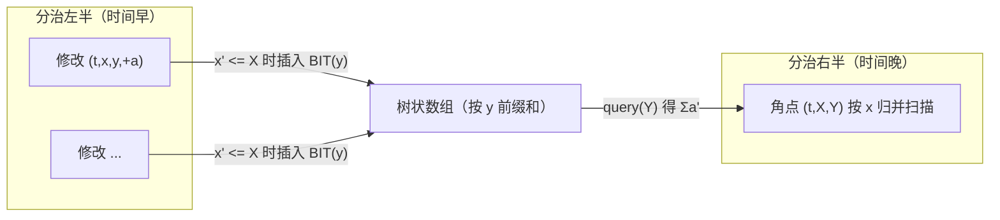

[[TOC]]

## 形式化题目

维护一个初始全 $0$ 的 $W \times W$ 矩阵（下标从 $1$ 开始），依次处理若干操作：

- 修改：给格子 $(x, y)$ 的权值增加 $a$；
- 询问：求以 $(x_1, y_1)$ 为左下角、$(x_2, y_2)$ 为右上角的子矩阵内所有权值之和。

修改操作数 $M \leqslant 160000$，询问次数 $Q \leqslant 10000$，$W \leqslant 2000000$，$1 \leqslant a \leqslant 10000$。矩阵是稀疏的（被修改的格子数不超过 $M$），但坐标值域极大。

## 正解

### 思路

**朴素做法。** 直接开一个 $W \times W$ 的数组模拟：修改 $O(1)$，询问要把子矩阵逐格累加，最坏 $O(W^2)$。$W$ 高达 $2 \times 10^6$，光存数组就需要 $4 \times 10^{12}$ 个格子，时间和空间都不可行。

**第一步优化：单点插入 + 前缀和。** 子矩阵和可以用四个二维前缀和角点做容斥：

$$
\mathrm{sum}(x_1,y_1,x_2,y_2) = F(x_2,y_2) - F(x_1-1,y_2) - F(x_2,y_1-1) + F(x_1-1,y_1-1)
$$

其中 $F(X,Y)$ 表示矩形 $[1,X] \times [1,Y]$ 内所有权值之和。于是问题变成：**在任意时刻询问二维前缀和 $F(X,Y)$**。

**第二步优化：把"时刻"变成一维偏序。** 由于修改在时间上单调累加，$F(X,Y)$ 只依赖于"当前已经发生的修改"。把每个修改记成一个点 $(t, x, y, a)$（$t$ 为操作序号），把每个询问角点 $(X, Y)$ 记成 $(t, X, Y)$，那么这个角点的答案就是所有满足

$$
t' < t,\quad x' \leqslant X,\quad y' \leqslant Y
$$

的修改点权值 $a'$ 之和——这是一个标准的三维偏序求和问题（时间严格在前，两个坐标分量不超过询问角点）。

**第三步：CDQ 分治 + 树状数组。** 类似三维偏序求个数，采用"时间维分治，一维排序，一维数据结构"的套路：

1. 把修改点和询问角点统一成事件序列，按下标（即时间）分治 $[l, r]$；
2. 递归处理完左右两半的内部贡献后，计算**左半的修改点对右半的询问角点**的贡献：此时左半的时间天然全部早于右半，只剩二维偏序；
3. 两半各自按 $x$ 归并有序（分治时顺手归并，代替预排序），用双指针把 $x' \leqslant X$ 的修改点插入树状数组（按下标 $y$ 加 $a$），每个询问角点用 $Y$ 查询前缀和即可。

注意坐标可能是 $0$（容斥会出现 $x_1 - 1 = 0$、$y_1 - 1 = 0$），树状数组查询下标 $0$ 时返回 $0$，插入下标不会为 $0$（修改坐标 $\geqslant 1$），无需平移。

下图展示一次询问被拆成 4 个角点、以及左半修改如何通过树状数组贡献给右半询问的过程：

每个角点拿到的是"时间在本层分治左侧"的修改贡献；所有包含它的 $O(\log M)$ 层累加起来，恰好等于全部更早修改的贡献，最终按容斥符号组合出子矩阵和。

### 代码

@include-code(./main.py, python)

### 复杂度

设事件总数 $N = M + 4Q \leqslant 2 \times 10^5$。CDQ 分治共 $O(\log N)$ 层，每层双指针加树状数组操作共 $O(N \log W)$，总时间复杂度 $O(N \log N \log W)$；树状数组大小 $O(W)$，事件数组 $O(N)$，空间约 $O(W + N)$。实测最大数据约 $2$ 秒（Python 常数较大，算法复杂度与标准 C++ 解法同阶）。

## 总结

- 稀疏矩阵的单点加 + 子矩阵求和，不要被 $W \leqslant 2 \times 10^6$ 吓到：真正参与运算的只有 $M$ 个修改点。
- 核心转化链：子矩阵和 $\to$ 四角容斥的二维前缀和 $\to$ 引入时间维后的三维偏序求和 $\to$ CDQ 分治（时间）+ 归并（$x$）+ 树状数组（$y$）。
- 实现细节：询问拆角点时坐标会出现 $0$；分治内用"时间戳清零"的树状数组，避免每层 $O(W)$ 回滚；左右两半按 $x$ 归并保持有序，省去每层重新排序。

## 图示解析

### 样例推演

以样例为例（$W=4$）：先修改 $(2,3) \mathrel{+}= 3$，再询问 $[1,1]\times[3,3]$。询问拆成 4 个角点，下表列出每个角点命中的修改点与容斥符号：

| 角点 $(X, Y)$ | 容斥符号 | 命中的修改（$x' \leqslant X, y' \leqslant Y$） | 贡献 |
| :---: | :---: | :---: | :---: |
| $(3, 3)$ | $+$ | $(2, 3)$ | $+3$ |
| $(0, 3)$ | $-$ | 无（$X=0$） | $0$ |
| $(3, 2)$ | $-$ | 无（$y'=3 > 2$） | $0$ |
| $(0, 2)$ | $+$ | 无 | $0$ |

四个角点的贡献相加得 $3$，与样例输出一致。第二个询问 $[2,2]\times[3,4]$ 同理：角点 $(3,4)$ 与 $(3,2)$ 命中两次修改点 $(2,2)$ 与 $(2,3)$，容斥后得 $2+3=5$。

观察重点是：每个角点本身只做一次"历史修改中 $x, y$ 双不超过"的前缀统计，容斥只是把 4 次这样的统计组合起来；而"历史"这一维由 CDQ 分治保证——任何一对（早修改，晚询问）恰好在分治树的某一层被计入一次。
