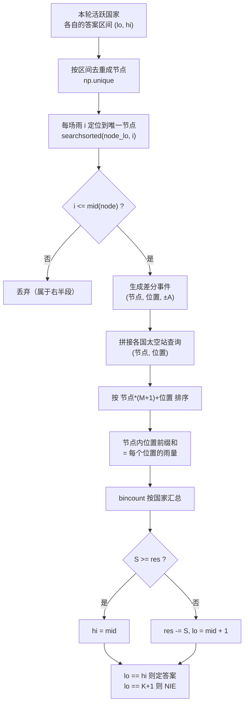

[[TOC]]

## 形式化题目

环上有 $M$ 个位置，第 $j$ 个位置属于国家 $A_j$（国家编号 $1 \sim N$，一个国家可以拥有多个位置）。

接下来有 $K$ 场陨石雨，第 $i$ 场给环上从 $L_i$ **顺时针**到 $R_i$ 的每个位置加 $A_i$；若 $L_i > R_i$ 则该区间是 $[L_i, M] \cup [1, R_i]$。

记 $\text{cnt}(c, t)$ 为国家 $c$ 在**前 $t$ 场**雨后收到的总量。对每个国家 $c$，求

$$\min \{\, t : \text{cnt}(c, t) \geqslant P_c \,\}$$

若到第 $K$ 场结束仍不足则输出 `NIE`。$1 \leqslant N, M, K \leqslant 3 \times 10^5$，$1 \leqslant P_c \leqslant 10^9$，$1 \leqslant A_i < 10^9$。

以样例为例，三个国家分别拥有 $1$ 段、$1$ 段、$2$ 段，逐场累加后：

| 累计场次 | 国家 1（段 1,4） | 国家 2（段 3） | 国家 3（段 2,5） | 需求 |
| --- | --- | --- | --- | --- |
| 1 | 8 | 0 | 8 | 10 / 5 / 7 |
| 2 | 9 | 1 | 9 | |
| 3 | 11 | 3 | 11 | |
| **答案** | **3** | **NIE** | **1** | |

国家 2 只有第 3 段，三场雨里只有第 2 场覆盖到它，共 3 < 5，所以是 `NIE`。

## 正解

### 思路

**为什么不逐国二分。** 对固定的国家 $c$，"前 $t$ 场够不够"关于 $t$ 单调（雨量都是正数），所以可以二分。但直接二分会把同一场雨反复重算：单国判定要 $O(t \log M)$，总复杂度 $O(NK\log M) \approx 10^{16}$，不可行。真正的浪费不在"二分了几次"，而在**同一场雨被每个国家各算一遍**。

**关键观察：同一轮里，所有国家的答案区间互不相交。**

整体二分让所有国家**同时**二分：每个国家维护一个答案区间 $[\text{lo}_c, \text{hi}_c]$，每轮取中点 $\text{mid}_c$ 判定，然后区间折半。由于所有区间每轮长度都减半，同一轮里它们的**深度完全相同**，于是这些区间把 $[1, K+1]$ 切成互不相交的若干段：

$$[\text{lo}_c, \text{hi}_c] \cap [\text{lo}_{c'}, \text{hi}_{c'}] = \varnothing \quad (c \neq c')$$

这一步的意义是：**每场雨在本轮只归属一个节点**，不同节点的区间加互不干扰。那么"每个节点各做一次区间加"就可以拼接成**一个**数组任务，一次性交给 numpy。

```
环上位置:  ... 每个位置属于某个国家
雨 i:      归属节点 v_i = 满足 lo_v <= i <= hi_v 的那个 v
本轮:      节点 v 内，把 i <= mid_v 的雨做区间加，再查 v 里各国的太空站
```

**把区间加转成差分事件。** 区间 $[a, b]$ 加 $v$ 等价于"$a$ 处 $+v$、$b+1$ 处 $-v$"（$b = M$ 时不需要撤销事件）。跨环的 $[L, M] \cup [1, R]$ 拆成两段，各自生成差分事件，共用同一个节点。

把所有事件按 `(节点, 位置)` 排序，**节点内的位置前缀和**就是每个位置收到的雨量。用组合键 `节点 * (M+1) + 位置` 排序，就能让"先按节点分组、再按位置升序"一次 `argsort` 完成。

**节点内前缀和怎么算。** 全局 `cumsum` 之后，把每个节点块首之前的累计量减掉即可。块首位置用 `np.searchsorted(ev_node, ev_node, side="left")` 一次求出——同一节点的事件在排序后连续，所以这个 searchsorted 就是"每个元素所属块的起点"。

**查询与归并。** 每个太空站是一个查询 `(节点, 位置)`，二分找它前面最后一个不晚于它的事件，该处的前缀和就是它收到的雨量。最后用 `np.bincount(qcid, weights=…)` 把同一国家所有太空站加起来。

判定与转移照标准整体二分：$S \geqslant \text{res}_c$ 则 `hi = mid`，否则 `res -= S`、`lo = mid + 1`。残留需求 `res` 保证了右半段的判定仍等价于"前 $t$ 场总量 $\geqslant P_c$"。`lo` 收敛到 $K+1$ 即为 `NIE`。

### 代码

@include-code(./main.py, python)

### 复杂度

每轮 $O((N + K + M)\log(N + K + M))$（瓶颈是排序），共 $\lceil \log_2(K+1) \rceil \approx 19$ 轮，总时间

$$O\big((N + K + M)\log K \log(N + K + M)\big)$$

空间 $O(N + K + M)$。与标准整体二分同阶；多出的那一个 $\log$ 来自排序，但 numpy 的排序常数极小，实测最坏一组（$N = 233410$，$M = K = 3 \times 10^5$）0.91 s、248 MB。

### 实现里的两个坑

**坑 1：空洞节点。** 一旦有国家先定出答案，节点区间就出现空洞。落在空洞里的雨会被 `searchsorted` 定位到 $-1$——而 numpy 里 `-1` 是**合法索引**（取最后一个元素），雨会被静默加到别的节点上。必须先过滤 `node_of >= 0`。

**坑 2：数值溢出。** 位置前缀和可达 $\sum A_i \approx 3 \times 10^{14}$（`int64` 安全），但一个国家最多有 $3 \times 10^5$ 个太空站，逐站相加到 $10^{19}$ 会撑爆 `int64`，`float64` 也超过 $2^{53}$ 失去整数精度（实测 `astype(np.int64)` 直接抛警告并给出垃圾值）。

处理方式是**按需求上限截断**：任何国家的需求 $P_c \leqslant 10^9$，所以对每个太空站的雨量取 `min(got, 2*10**9)`。截断后单国总和 $\leqslant 3 \times 10^5 \times 2 \times 10^9 = 6 \times 10^{14} < 2^{53}$，`float64` 精确；而 `res <= 10^9 < 2*10**9`，所以 `S >= res` 的判定完全不变。

## 总结

整体二分的教学版本常写成递归：`solve(国家集合, 雨的区间[l, r])`，每层把 `[l, mid]` 的雨加进树状数组、判定、再回滚。本题换了一个视角——**既然同一轮里所有节点互不相交，就把递归的每一层摊平成一个大数组任务**，用一次排序 + 一次前缀和 + 一次二分代替树状数组。这是把 $O((N+M+K)\log K\log M)$ 的分治在 Python 里落地的关键：算法不变，只是把"逐元素操作"改写成"整段向量操作"。

要看懂这份代码，只需要抓住三句话：**节点是答案区间、雨按节点归属、节点内做一次前缀和**。其余全是 numpy 的表达技巧。

## 图示解析

下图给出"每轮摊平"的数据流：所有雨按所属节点被分成互不相交的几组，各组内部独立做区间加，再与本国太空站汇合。



要点有三：**（1）** 节点去重后，雨到节点的映射是一次 `searchsorted`，不是循环；**（2）** `节点*(M+1)+位置` 这个组合键让"按节点分组 + 组内按位置排序"合并成一次排序；**（3）** 组内前缀和靠"减去块首之前的累计量"实现，`searchsorted` 一次性求出所有块首，因此整个流程没有逐元素的 Python 循环。
