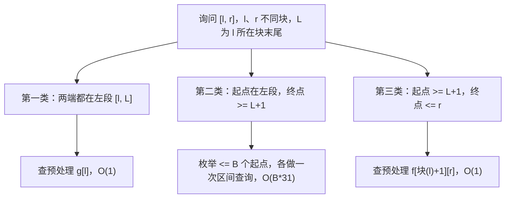

[[TOC]]

## 形式化题目

给定长为 $N$ 的序列 $A_1, \dots, A_N$ 与 $M$ 组询问。每组询问给出区间 $[l, r]$，要求该区间内
连续非空子段的最大异或和：

$$\max_{l \leqslant i \leqslant j \leqslant r}\ A_i \oplus A_{i+1} \oplus \cdots \oplus A_j.$$

询问在线给出：由输入对 $(x, y)$ 与上一问答案 $lastans$（初始 $0$）解码，两项分别取
$(x+lastans) \bmod N + 1$ 与 $(y+lastans) \bmod N + 1$，小者为 $l$、大者为 $r$。
$N = 12000$，$M = 6000$，$0 < x, y, A_i < 2^{31}$。

样例的解码链与答案（$A = [1, 4, 3]$，前缀异或 $S = [0, 1, 5, 6]$）：

| 询问 | x | y | 进入时 lastans | 解码两项 | 区间 | 最优子段 | 答案 |
| --- | --- | --- | --- | --- | --- | --- | --- |
| 1 | 0 | 1 | 0 | 1, 2 | $[1, 2]$ | $1 \oplus 4$ | 5 |
| 2 | 0 | 1 | 5 | 3, 1 | $[1, 3]$ | $4 \oplus 3$ | 7 |
| 3 | 4 | 3 | 7 | 3, 2 | $[2, 3]$ | $4 \oplus 3$ | 7 |

"解码两项"是取 min/max 之前的两个数。观察两点：$lastans$ 沿询问链传递，第 2 问被第 1 问的
答案平移到 $[1, 3]$；最优子段未必铺满区间——第 2 问区间是 $[1, 3]$，取到的却是其中的
$[2, 3]$，这正说明答案要在 $O(N^2)$ 个子段里挑，不能只比较整个区间。

## 正解

### 思路

**从朴素枚举说起。** 对每个询问枚举全部 $(i, j)$ 逐段求异或和是 $O(M N^2)$；即使先记前缀异或、
把"算一段"降到 $O(1)$，枚举下标对仍是每问 $O(N^2)$。真正的瓶颈是：**两个下标都要落在
$[l, r]$ 内**，候选集合随询问变化，没法一次预处理包办。

记 $S_k = A_1 \oplus \cdots \oplus A_k$（$S_0 = 0$），则子段 $A_i \cdots A_j$ 的异或和
$= S_{i-1} \oplus S_j$。先解决一半：若右端点 $q$ 固定、左端点只能在**任意区间**
$[lo, hi]$ 里挑，就是经典 01 Trie 贪心——从第 30 位到第 0 位，只要区间里存在走反方向
（让该位为 1）的数就走反方向，$O(31)$。

**把"区间"做进 Trie：可持久化。** 按 $k = 0, 1, \dots, N$ 依次插入 $S_k$，每插一次保存根，
得到一列版本；插入只复制路径上的节点、其余共享。查询 $\max_{q \in [lo, hi]} S_q \oplus x$ 时
拿"插到 $hi$"与"插到 $lo-1$"两个版本的根同时下钻：同一路径位置两节点的**子树计数差**恰好是
区间 $[lo, hi]$ 内走到这里的元素个数，计数差大于 $0$ 就说明能走反方向。于是任意区间、任意
$x$ 的最大异或都能 $O(31)$ 回答——这就是代码里的 `range_max_xor(hi, lo, x)`。

**再用分块消掉另一端的枚举。** 一次询问 $p = i-1$、$q = j$ 两端都被 $[l, r]$ 包住，只靠上面对
$[lo, hi]$ 的查询仍要枚举另一端 $O(N)$。设块长 $B \approx \sqrt N$，$L$ 为 $l$ 所在块的末尾，
把 $[l, r]$ 内的子段按端点位置分成三类（$l, r$ 同块时没有完整块，直接枚举右端点 $j$，
每次问"候选左端点集合 $S_{[l-1, j-1]}$ 与 $S_j$ 的最大异或"，$O(B \times 31)$）；
下图是三类子段与对应查询手段的对应关系：

三类互斥且合并恰好覆盖所有合法子段：终点不超过 $L$ 的子段两端必然都在 $[l, L]$（第一类）；
终点越过 $L$ 后，起点在左段归第二类、起点也在 $L+1$ 之后归第三类。逐类落实：

1. **第一类**：预处理 $g[i]$ = "$i$ 到所在块末尾"的最大子段异或。每块内从右往左扫，
   维护"起点固定在 $i-1$、终点在 $[i, \text{块末}]$"的区间查询最大值并与右邻答案取 max，
   全程只花 $N$ 次查询，询问时 $O(1)$ 取 $g[l]$。
2. **第二类**：$p = i-1$ 只在 $[l-1, L-1]$，至多 $B$ 个；对每个 $p$ 在固定区间
   $S_{[L+1, r]}$ 上做一次 `range_max_xor`，共 $O(B \times 31)$。恒有 $p < q$，不会取到空子段。
3. **第三类**：预处理 $f[\text{块}][j]$ = "起点不早于该块首、终点不超过 $j$"的最大子段异或。
   对每个块首向右扫描、边扫边保留历史最大，询问时直接 $O(1)$ 取 $f[\text{块}(l)+1][r]$；
   $l$ 的下一个块首之前的起点已被第二类覆盖，此处起点从 $L+1$ 数起不重不漏。

**块长平衡。** 预处理 $f$ 约 $N^2/(2B)$ 次查询、单次询问至多约 $B$ 次查询，总代价
$N^2/(2B) + M \cdot B$ 在 $B \approx N/\sqrt{2M} \approx 110 \approx \sqrt N$ 处平衡，代码取
`block = int(n ** 0.5)`。询问虽在线，但解码只依赖上一问的答案，按输入顺序处理、维护
`last`（即 lastans）即可，与结构无关。

### 代码

@include-code(./main.py, python)

### 复杂度

- 建持久化 Trie：$(N+1)$ 次插入 $\times$ 31 层，$O(N \times 31)$；预处理 $g$ 为
  $O(N \times 31)$，预处理 $f$ 为 $O(N^2 / B \times 31)$。
- 单次询问：同块或跨块都至多枚举一个块 $= O(B \times 31)$，两张表查询 $O(1)$。
- 取 $B = \sqrt N$ 后总时间 $O((N+M)\sqrt N \times 31)$，与标准 C++ 解法（分块 +
  可持久化 Trie）同阶；空间 $O(N \times 31 + N^2/B) = O(N\sqrt N)$，Trie 约 $3.8\times10^5$
  个节点、$f$ 表约 $6.5\times10^5$ 个整数。
- 实测：10 组真实数据（$N=12000, M=6000$）输出全部一致，单组 3.2~3.6s、峰值约 50MB
  （本地限时 20s、不设内存硬限制；OJ 的 1000ms 是 C++ 参照，本仓库 Python 解法按约定
  以输出正确为准）。

## 总结

答案链条是：**子段异或和 $\to$ 前缀异或对 $S_p \oplus S_q$ $\to$ 可持久化 01 Trie 的
区间最大异或查询 $\to$ 分块三分 + 两张端点预处理表**。持久化 Trie 负责把"一端在任意区间"
压到 $O(31)$，分块负责把"另一端只能枚举一个块"，两者拼起来就是预处理 $O(N^{1.5})$、
单问 $O(\sqrt N)$ 的标准解。实现上最值得记住的不变量：版本只增不删，所以两版本同位置节点的
计数差就是区间计数；三类子段覆盖互斥完备，取 max 即为答案。
