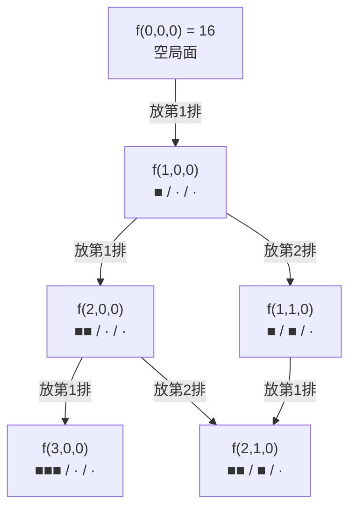

[[TOC]]

## 形式化题目

把 $1 \dots N$（身高从高到低编号）填入一个左端对齐的 $k$ 排 Young 图：第 $i$ 排有 $N_i$ 格，$N_1 \ge N_2 \ge \dots \ge N_k$，$\sum N_i \le 30$，$k \le 5$。要求同一排从左到右编号递减、同一列从后到前编号递减（即每一列在"第 $1$ 排、第 $2$ 排、……"方向上递减），求合法填法总数。

样例 $N=6,\ (N_1,N_2,N_3)=(3,2,1)$ 的答案是 $16$，即该形状下标准 Young 表的个数。

## 正解

### 思路

**朴素做法**：枚举 $N!$ 种全排列，逐一检查每排、每列是否递减。$N = 30$ 时 $30! \approx 2.7 \times 10^{32}$，完全不可行。瓶颈在于：绝大多数排列的**前几个数**就已经把局面放进非法状态，我们却仍然把整个排列生成完再检查。

**关键观察**：编号 $1$（最高的人）在两个约束下没有任何"邻居必须更小"的余地，它只能放在左上角 $(1,1)$——第 $1$ 排最左。归纳一下：**编号 $1..m$ 填完后，一定恰好占据每排的前缀**，整体是一个左端对齐的阶梯形；不在前缀位置的格子一旦填了，左边或上面的格子还没填，约束立刻被破坏。

于是倒过来想：**按身高从高到低（编号 $1 \to N$）依次放人**，任何时刻的局面都是"每排已放若干人"的阶梯。状态只需要一个 $k$ 元组 $(r_1, \dots, r_k)$，表示第 $i$ 排已放 $r_i$ 人。

**转移**：要放当前最高（编号最小）的未放者，可以放在第 $i$ 排最左的空位，当且仅当：

- $r_i < N_i$：这一排还有空位；
- $i = 1$ 或 $r_{i-1} > r_i$：上方那一格（第 $i-1$ 排第 $r_i+1$ 个位置）已经有人，否则这个位置根本不在合法的"列"里（列必须连续且从后到前递减）。

设 $f(r_1, \dots, r_k)$ 表示该状态下放完剩余所有人的方案数：

$$
f(r_1, \dots, r_k) = \sum_{i \,:\, r_i < N_i \,\wedge\, (i = 1 \,\lor\, r_{i-1} > r_i)} f(r_1, \dots, r_i + 1, \dots, r_k), \qquad f(N_1, \dots, N_k) = 1
$$

答案为 $f(0, \dots, 0)$。

以样例形状 $(3, 2, 1)$ 为例，放完前 $4$ 人后的几个阶梯状态如下（`■` 为已放，`·` 为空位）：

| 状态 $(r_1,r_2,r_3)$ | 图示 | 合法放法 |
| :---: | :---: | :---: |
| $(2,1,1)$ | `■■` / `■·` / `■` | 只能第 1 排（$r_2 = r_3 = 1$，第 3 排违反 $r_{i-1} > r_i$ 被禁止） |
| $(2,2,0)$ | `■■` / `■■` / `··` | 只能第 1 排（第 2 排已满，第 3 排上方无人） |
| $(3,1,0)$ | `■■■` / `■··` / `···` | 第 2 排（第 1 排已满，第 3 排上方无人） |

状态用 tuple 直接做哈希表的键，配合 `functools.cache` 记忆化搜索，一行生成器表达式就完成了全部转移。

### 代码

@include-code(./main.cpp, cpp)
@include-code(./main.py, python)

### 复杂度

- 状态数是 $\prod_{i=1}^{k} (N_i + 1)$ 的一部分（其中各 $r_i$ 还受 $r_1 \ge r_2 \ge \dots \ge r_k$ 的阶梯限制，实际远小于），$N \le 30$、$k \le 5$ 时不超过 $\binom{35}{5} \approx 3.2 \times 10^5$；
- 每个状态枚举 $k \le 5$ 个转移，总时间 $O\!\big(k \prod (N_i+1)\big)$，约 $10^6$ 量级；空间即记忆化哈希表 $O\!\big(\prod (N_i+1)\big)$。
- Python 原生大整数直接输出精确值，无需取模。

## 总结

- 本题是**标准 Young 表（SYT）计数**：给定行长的 Young 图形状，求行列都递增的填法数（该形状恰有钩长公式可算，但 DP 更通用）。
- 核心洞察是**按编号顺序放人时中间局面必为左对齐行前缀阶梯**，把"棋盘上放什么"压缩成"$k$ 元组各排已放人数"。
- 转移条件"上一排严格更多"一步编码了列连续性与列递减两个约束。
- $k \le 5$、$N \le 30$ 下状态量级 $10^5$，记忆化搜索天然免手工进制编码；同样的算法在 C++ 中可开五维数组（只开到各 $N_i$）填表实现。

## 图示解析

### $(3,2,1)$ 形状下的放人决策树（局部）

下图展示按编号 $1 \to 6$ 放人时，从空局面出发的前两步分支。`f(0,0,0)` 处第 $1$ 排是唯一合法放法（其余排的上方无人）；到 `f(1,0,0)` 后第 $2$ 排解锁，产生分支。

观察要点：`f(2,1,0)` 有两条到达路径，但记忆化只算一次——这正是 DP 计数"按状态合并、无重无漏"的体现；而 `f(2,0,0)` 到 `f(3,0,0)` 之后第 $2$ 排仍未解锁（$r_1 = 3 > r_2 = 0$ 成立，可放），分支随阶梯逐渐铺开。完整树上 $16$ 条从根到满局面的路径恰好对应题面三角矩阵中的 $16$ 种方案。
