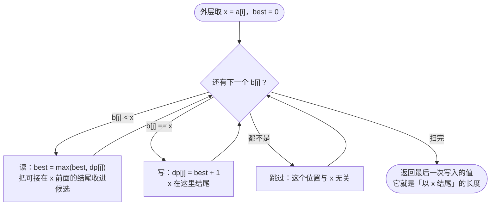

[[TOC]]

## 形式化题目

给定两个长度都为 $N$ 的整数数列 $A=(a_1,\dots,a_N)$ 与 $B=(b_1,\dots,b_N)$，求最大的 $L$，使得存在下标

$$
1 \leqslant i_1 < i_2 < \dots < i_L \leqslant N,\qquad
1 \leqslant j_1 < j_2 < \dots < j_L \leqslant N
$$

满足

$$
a_{i_1}=b_{j_1} < a_{i_2}=b_{j_2} < \dots < a_{i_L}=b_{j_L}.
$$

也就是说：$B$ 的一个**严格递增**子序列同时必须是 $A$ 的子序列，求这样的子序列的最大长度。

**样例。** $A=(2,2,1,3)$，$B=(2,1,2,3)$，答案是 $2$：取 $B$ 的下标 $2,4$ 得到值序列 $(1,3)$，
它在 $A$ 中对应下标 $3,4$，严格递增。虽然 $(2,3)$ 也合法，但 $B$ 里两个 $2$ 不能同时取，
所以最长到不了 $3$。

## 正解

### 思路

**朴素做法：照抄 LCS 再加一维。** LCS 的状态 $f(i,j)$（$A[1..i]$ 与 $B[1..j]$ 的最长公共子序列）很好写，
但多出来的「上升」约束会把它弄坏：$a_i=b_j$ 可以配对时，能不能接上去取决于**当前子序列最后一个值**，
而长度 $f(i-1,j-1)$ 里没有这个信息。补救办法是把「上界」也塞进状态：设 $H(i,j,v)$ 表示
「$A[1..i]$ 与 $B[1..j]$ 中，全部元素都严格小于 $v$ 的最长公共上升子序列长度」，则

$$
H(i,j,v)=\begin{cases}
\max\bigl(H(i-1,j,v),\; H(i,j-1,v),\; 1+H(i-1,j-1,a_i)\bigr), & a_i=b_j<v,\\[2mm]
\max\bigl(H(i-1,j,v),\; H(i,j-1,v)\bigr), & \text{其他}.
\end{cases}
$$

第三项就是「接龙」：拿 $a_i$ 当新结尾时，前面的元素必须全部小于 $a_i$，所以上界要换成 $a_i$ 而不是原来的 $v$。
递推本身没错，但代价很高：同一个 $(i,j)$ 要对很多不同的上界 $v$ 各算一遍，
把 $v$ 离散化后状态数是 $O(N^2\cdot N)=O(N^3)$，$N=3000$ 时无法接受。

**第一次化简：把「结尾值的上界」换成「结尾下标」。** 关键性质是——**上升约束只依赖值的大小，不依赖位置**：
一项能不能接在前一项后面，只看它是否严格更大；位置的前后由 $B$ 的下标顺序天然保证。
于是直接把“以谁结尾”写进状态：令（本节公式用 1 下标，代码里对应 `i-1` / `j-1`）

$$
g(i,j)=\text{以 } b_j \text{ 结尾、只使用 } A[1..i] \text{ 与 } B[1..j] \text{ 的 LCIS 长度},
$$

则 $a_i=b_j$ 作为结尾时，它前一项必然终止在某个 $b_k$（$k<j$，$b_k<b_j$），得到

$$
g(i,j)=\begin{cases}
\max\left(g(i-1,j),\; 1+\max\limits_{k<j,\;b_k<b_j} g(i-1,k)\right), & a_i=b_j,\\[2mm]
g(i-1,j), & a_i\ne b_j.
\end{cases}
$$

状态降到了两维（共 $O(N^2)$ 个），但内层那个 $\max$ 若每次重扫 $k$ 又是 $O(N^3)$。

**瓶颈在哪。** 固定 $i$ 时，$\max_{k<j,\,b_k<b_j} g(i-1,k)$ 只依赖两个条件：$k$ 的位置在 $j$ 左边，
$b_k$ 的值比 $b_j$ 小。而 $j$ 本来就是从左到右枚举的，$k$ 的候选集合**单调增长**，
所以这个最大值完全可以**在扫描 $j$ 的过程中顺带维护**，不必重算。

**正解：外层枚举值，内层一次扫描同时读和写。** 把 $g$ 压成一维 $dp_j$ 并滚动外层 $i$：

```text
for x in A:                        # x = a[i]，本轮新的「结尾值」
    best = 0
    for j in 0 .. N-1:
        if b[j] < x:               # 可以接在 x 前面 → 收进候选最大值
            best = max(best, dp[j])
        elif b[j] == x:            # 命中 → x 在这里结尾
            dp[j] = best + 1
```

三个要点保证了它是对的：

1. **读集合与写集合按值互斥**：读到的是满足 $b_k<x$ 的位置，写的是满足 $b_j=x$ 的位置，
   两者不可能同时成立。所以 `dp[j] = best + 1` **就地覆盖是安全的**，不用给 `dp` 做备份。
2. **连 `max(dp[j], best+1)` 都不用写**。写入前 `dp[j]` 存的是 $g(i-1,j)$，要证的就是 $g(i-1,j)\leqslant best+1$：
   取 $g(i-1,j)$ 的最优解，它必以 $b_j$ 结尾。若长度为 1 则显然成立；否则去掉最后一项，
   得到一个结尾在某个 $b_k$（$k<j$、$b_k<b_j=a_i$）的公共上升子序列，长度为 $g(i-1,j)-1$，
   于是 $g(i-1,k)\geqslant g(i-1,j)-1$。而 $k<j$ 与 $b_k<a_i$ 正好是 `best` 的收集条件，
   所以 $best\geqslant g(i-1,k)\geqslant g(i-1,j)-1$，即 $g(i-1,j)\leqslant best+1$。覆盖不会丢更大的值。
3. **`best` 只增不减**，所以对同一个 $x$，最后一次写入就是本轮最大值，也就是「以 $x$ 结尾的 LCIS 长度」，
   可以拿它实时更新答案，省掉最后对 `dp` 求一次 `max`。

再叠两个不改复杂度的剪枝：$a_i\notin B$ 时直接跳过（它不可能是公共子序列的结尾）；
答案达到上界 $|A\cap B|$ 时提前结束（严格递增的子序列值两两不同，长度不可能超过公共不同值的个数）。

**样例逐步推演。** $A=(2,2,1,3)$，$B=(2,1,2,3)$，`dp` 初值全 $0$（下表列名用代码里的 0 下标，
`b[0..3]` 就是 $b_1,\dots,b_4$；$dp$ 的下标与 $b$ 对齐）。
每格写「本次扫描中 `best` 的变化，以及是否写入」：
`<x` 表示这个位置的值小于 $x$（仅把 `dp[j]` 收进 `best`），`=x` 表示命中并写入，
`—` 表示既不小于 $x$ 也不等于 $x$，该位置本轮被跳过：

| $x=a_i$ | `b[0]=2` | `b[1]=1` | `b[2]=2` | `b[3]=3` | 本轮写入 | 答案 |
| --- | --- | --- | --- | --- | --- | --- |
| 2 | =x → 写 `dp[0]=1` | <x，`best`←`dp[1]`$=0$ | =x → 写 `dp[2]=1` | — | 1 | 1 |
| 2 | =x → 写 `dp[0]=1` | <x，`best`←`dp[1]`$=0$ | =x → 写 `dp[2]=1` | — | 1 | 1 |
| 1 | — | =x → 写 `dp[1]=1` | — | — | 1 | 1 |
| 3 | <x，`best`←`dp[0]`$=1$ | <x，`best`←$\max(1,$`dp[1]`$=1)=1$ | <x，`best`不变$=1$ | =x → 写 `dp[3]=2` | 2 | **2** |

最后一行是要点：扫描到 `b[3]=3` 时，`best` 已经收集了 $B$ 中所有比 $3$ 小的值对应的 `dp`
（`dp[0]=dp[2]=1` 来自 `b=2`，`dp[1]=1` 来自 `b=1`），于是 `dp[3]=2`。答案 $2$ 与样例一致。

### 代码

@include-code(./main.py, python)

### 复杂度

设两个数列长度为 $N$。

- 时间：外层遍历 $A$ 的 $N$ 个元素，每个进入内层的元素做一次 $O(N)$ 的 $B$ 扫描，共 $O(N^2)$；
  $N=3000$ 时约 $9\times10^6$ 次比较。剪枝（跳过不在 $B$ 里的 $a_i$、取到上界就停）让实际常数明显小于最坏情况。
- 空间：`dp` 长度 $N$，加一个集合，$O(N)$。没有二维表。

实现细节：代码分成三层——`relax(dp, b, x)` 就是上面那次「一次扫描、边读边写」；
`lcis(a, b)` 是外层循环加两个剪枝；`solve()` 只负责读入和输出。
`solve()` 用 `nums[1:n+1]` 与 `nums[n+1:2n+1]` 切片，长度按实际读到的算
（数据文件中若 $B$ 被截断也能算出答案，空则输出 $0$）；数列中的数可以是负数、绝对值不超过 $2^{31}-1$，
代码只做 `<` 与 `==` 比较，不需要离散化也不会溢出。

## 总结

- 上升约束只看**值的大小**，不看位置 —— 所以“结尾值必须要多少”这种维度可以丢掉，
  改成「以 $b_j$ 结尾」的二维状态 $g(i,j)$，位置约束由扫描顺序天然满足。
- 剩下的 $\max_{k<j,\,b_k<b_j} g(i-1,k)$ 因为 $j$ 从左到右枚举、候选集合单调增长，
  可以在扫描中用一个 `best` 顺带维护，$O(N^3)$ 降到 $O(N^2)$。
- 一次内层扫描同时完成「收集候选最大值」和「写入新状态」，且读写条件按值互斥，
  因而就地更新、无需 `max`、无需备份数组。
- `best` 只增不减，最后一次写入即「以当前 $x$ 结尾的长度」，答案可增量维护；
  再配上「跳过不在 $B$ 中的值」和「达到上界 $|A\cap B|$ 就停」两个剪枝。
- 验证：数据仓 10 组真实数据输出全部一致（本地单组 0.02–0.05 s，峰值约 15 MB，
  限时 1000 ms / 128 MB）；另用穷举程序与教科书写法在小数据上交叉核对，答案一致。

## 图示解析

### 一次内层扫描在做什么

下图是外层遇到某个值 $x$ 时，内层从头到尾扫一遍 $B$ 的流程。两条分支分别对应「读」和「写」：



观察重点：**读和写走的是两条互斥分支**（`b[j] < x` 与 `b[j] == x` 不可能同时成立），
所以本轮刚写进去的值不可能在同一轮被读走——这是可以“就地更新、不给 `dp` 做备份”的原因。
至于为什么连 `dp[j] = max(dp[j], best + 1)` 里的 `max` 也可以省掉，靠的是另一条不等式
$g(i-1,j)\leqslant best+1$（上一节第 2 点）：旧值永远不会比新值大。

### 两层循环的分工

| 层 | 遍历对象 | 承担的角色 | 对应状态 |
| --- | --- | --- | --- |
| 外层 | $A$ 的每个元素 $x=a_i$ | 决定「本轮允许的结尾值」，一次只处理一个值 | 滚动掉 $i$ 这一维 |
| 内层 | $B$ 的每个位置 $b_j$ | 一遍扫描中同时维护 `best`（读）和写 $dp_j$ | 保留 $j$ 这一维 |

观察重点：外层是**值维度**、内层是**位置维度**，二者分工明确；这也解释了为什么
「跳过不在 $B$ 中的 $x$」有效——$x$ 从不出现在 $B$ 里，内层这一整轮都不产生任何写入。
