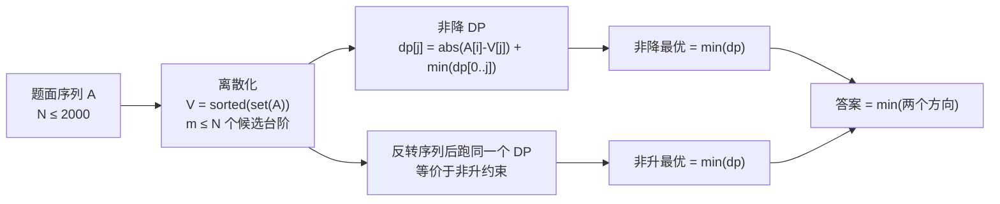

[[TOC]]

## 形式化题目

给定整数序列 $A_1, \dots, A_N$。求

$$\min_{B}\ \sum_{i=1}^{N} |A_i - B_i|,$$

其中 $B$ 为整数序列，且满足 $B_1 \leqslant B_2 \leqslant \dots \leqslant B_N$（非降）或 $B_1 \geqslant B_2 \geqslant \dots \geqslant B_N$（非升）之一。

$N \leqslant 2000$，$0 \leqslant A_i \leqslant 10^9$。只需输出最小值，不要求给出 $B$。

## 正解

### 思路

**先说结论**：存在一组最优解，使每个 $B_i$ 都等于某个 $A_j$；在这个前提下按位置做线性 DP，利用"前缀最小值"把转移压到 $O(1)$，两个单调方向各算一次取较小值。

#### 第一步：为什么候选取值只需来自 $A$

$B_i$ 本来是任意整数，看似有无穷多种选择。这里用一个**分段线性凸函数**的归纳说明：只需考虑 $V = \{A_1, \dots, A_N\}$ 里的取值。

先把 $B_i$ 的取值范围**放宽到实数**（放宽只会让最小值更小；最后会看到最优解本来就落在 $V$ 这些整数上，所以放宽不影响答案）。设

$$F_i(x) = \text{只考虑前 } i \text{ 个元素、且 } B_i = x \text{ 时的最小代价},$$

则 $F_0 \equiv 0$，且

$$F_i(x) = |A_i - x| + \min_{y \leqslant x} F_{i-1}(y).$$

归纳证明「每个 $F_i$ 都是凸的分段线性函数，且所有折点都在 $V$ 中」：

- $F_0 \equiv 0$ 是常数函数，没有折点。
- 设 $F_{i-1}$ 凸、折点 $\subseteq V$。$G(x) = \min_{y \leqslant x} F_{i-1}(y)$ 就是把 $F_{i-1}$ 极小点右侧的部分压平：$F_{i-1}$ 凸，所以它在某个极小点 $p$ 左边单调不增、右边单调不减，于是 $G(x) = F_{i-1}(x)$（当 $x \leqslant p$）、$G(x) = F_{i-1}(p)$（当 $x \geqslant p$）。压平后仍然凸，折点集合不增。
- $F_i = G + |A_i - x|$：两个凸分段线性函数之和仍凸，折点是二者折点之并再并入 $A_i$ 处的新折点，而 $A_i \in V$，归纳成立。

于是 $\min_x F_N(x)$ 一定能在某个折点处取到，即最优值可以由 $x \in V$ 实现。再顺着转移回溯：在 $(-\infty, x]$ 上取 $F_{i-1}$ 的极小点，得到的要么是 $x$ 本身、要么是 $F_{i-1}$ 极小值段的端点，两者都是折点——所以可以取到一组**每个 $B_i$ 都属于 $V$** 的最优解。又因为 $V$ 里全是整数，实数放宽与整数原题的答案相同。

去重排序后记 $V = (V_1 < V_2 < \dots < V_m)$，$m \leqslant N \leqslant 2000$。候选台阶只有 $m$ 个，问题从"在数轴上选"变成"在 $m$ 个台阶里选"。

#### 第二步：按末位台阶做线性 DP

约束只存在于**相邻两个位置之间**，所以决定 $B_i$ 时唯一需要知道的过去信息就是 $B_{i-1}$ 取了哪个台阶。定义

$$dp[j] = \text{处理完前缀 } A_1..A_i \text{、且 } B_i = V_j \text{ 时的最小代价。}$$

因为要求非降，$B_{i-1}$ 可以取任何不超过 $V_j$ 的台阶：

$$dp_{\text{new}}[j] = |A_i - V_j| + \min_{0 \leqslant k \leqslant j} dp_{\text{old}}[k].$$

关键在于 $\min_{k \leqslant j} dp_{\text{old}}[k]$ 与 $A_i$ 无关，可以整表一次前缀最小算好，于是单行转移是 $O(m)$ 而不是 $O(m^2)$。初值 $dp \equiv 0$：还没有元素时不存在"末位"约束，从任何台阶起步都是免费的。最后答案取 $\min_j dp[j]$——题面没有约束 $B_N$ 的大小，末位可以落在任何台阶上。

这一段在 `main.py` 里就是 `level_cost()` 循环体的那一行：`accumulate(dp, min)` 给出旧表的前缀最小，`map(add, (abs(a - v) for v in values), ...)` 把 $|A_i - V_j|$ 逐列加上去，`min(dp)` 就是该方向的答案。

#### 第三步：两个方向

非升只是非降的镜像：反转序列后非升约束变成非降约束，而代价 $\sum |A_i - B_i|$ 在反转下逐项不变。所以同一份代码跑两遍，取较小值。

先验证一下方向确实都要算：样例 $A = (1,3,2,4,5,3,9)$ 在非降方向上是 $3$，在非升方向上是 $12$，取 $\min$ 才是答案 $3$。

#### 样例的 DP 表推演

对样例取 $V = (1,2,3,4,5,9)$。下表第 $i$ 行是处理完 $A_1..A_i$ 后的 `dp`，列是末位取的台阶；**加粗**的是该行的最小值（初值行全为 $0$，不标注）。

| 已处理 | $A_i$ | $B=1$ | $B=2$ | $B=3$ | $B=4$ | $B=5$ | $B=9$ |
| :---: | :---: | ---: | ---: | ---: | ---: | ---: | ---: |
| （无） | — | 0 | 0 | 0 | 0 | 0 | 0 |
| $A_1$ | 1 | **0** | 1 | 2 | 3 | 4 | 8 |
| $A_2$ | 3 | 2 | 1 | **0** | 1 | 2 | 6 |
| $A_3$ | 2 | 3 | **1** | **1** | 2 | 3 | 7 |
| $A_4$ | 4 | 6 | 3 | 2 | **1** | 2 | 6 |
| $A_5$ | 5 | 10 | 6 | 4 | 2 | **1** | 5 |
| $A_6$ | 3 | 12 | 7 | 4 | **3** | **3** | 7 |
| $A_7$ | 9 | 20 | 14 | 10 | 8 | 7 | **3** |

读表要点：每一格 = 同列 $|A_i - V_j|$ + 上一行左侧（含本列）最小值。最后一行最小值 $3$ 落在 $B_N = 9$，对应方案 $B = (1,3,3,4,5,5,9)$，代价 $0+0+1+0+0+2+0 = 3$。再看第 $A_6$ 行：该行最小值 $3$ 出现在末位 $4$ 和 $5$，而末位 $9$ 时是 $7$；若贪心地在每一行只保留最小值、把其余末位剪掉，末位 $9$ 这条线就消失了，而最后一行恰恰只有从末位 $9$ 出发才能得到 $3$。这就是必须把 $m$ 个末位全部保留到下一行、直到最后才取最小值的理由。

### 代码

@include-code(./main.py, python)

### 复杂度

- 设 $m = |\operatorname{set}(A)| \leqslant N$。离散化排序 $O(N \log N)$。
- 单方向 DP：$N$ 轮 × 每轮 $O(m)$，即 $O(Nm) \leqslant O(N^2)$；两个方向常数因子 2。
- 总计 $O(N^2)$ 时间、$O(N)$ 额外空间（`dp` 与两个长度 $m$ 的临时表）。$N = 2000$ 时约 $8 \times 10^6$ 次逐元素运算。

边界：$N = 1$ 或 $A$ 已经非降时答案就是 $0$（数据 `grading.7` 即这一情形）；$A$ 全相等时 $m = 1$，表宽为 $1$；$A_i$ 取到 $10^9$ 时答案上界 $2 \times 10^{12}$，Python 无需处理溢出，C++ 实现必须用 `long long` 存代价。

## 总结

- 本题的第一个关键不是"优化枚举"，而是**证明最优解的取值只需来自 $A$**：把 $B_i$ 放宽到实数后，逐位最小代价 $F_i(x)$ 是凸分段线性函数，其折点只会出现在 $A_i$ 上，因此最小值可在 $V$ 的某个折点取到。
- 离散化之后问题变成链式约束 DP：状态只记"末位台阶"，转移是 $|A_i - V_j| + \min_{k \leqslant j} dp[k]$。
- `dp[k]` 的前缀最小与 $A_i$ 无关，一次扫描即可求出，把 $O(N^3)$ 压到 $O(N^2)$。
- 非升 = 反转后的非降，复用同一函数跑两遍取 $\min$，不用写第二份 DP。
- 同样的算法在 C++ 中就是 `sort + unique` 离散化、`for` 每行扫一遍更新前缀最小值，`long long` 存代价（答案上界 $2 \times 10^{12}$，`int` 会溢出）。

## 图示解析

### 解法路线

下图给出从题面到答案的三步：离散化确定候选台阶、非降方向跑一次线性 DP、反转序列复用同一 DP 得到非升方向，最后取较小值。

观察要点：两条分支**共享同一个 `level_cost`**，唯一区别是传入 `seq` 还是 `seq[::-1]`；表 $V$ 对两个方向完全相同（反转不改变元素集合），所以离散化只需做一次。真正把搜索空间压下来的是最左边那一步——没有它，右边两个 DP 的表宽是值域规模而不是 $m \leqslant 2000$。
