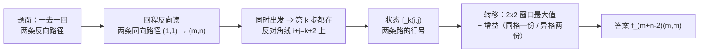

[[TOC]]

## 形式化题目

给定 $m$ 行 $n$ 列的矩阵 $a$，$a_{ij}\in[0,100]$，且 $a_{11}=a_{mn}=0$。求两条从 $(1,1)$ 到 $(m,n)$、
每步只向下或向右的路径 $P_1,P_2$，最大化

$$\sum_{(i,j)\in P_1\cup P_2} a_{ij}.$$

$1 \leqslant m,n \leqslant 50$，答案上界为 $2500\times100=2.5\times10^5$。

**为什么是并集。** 题面说「此人在去程帮过忙，回程就不再帮忙」，翻译过来就是：**同一个格子
被两条路径覆盖时只贡献一次权重**。规则只限制收益不重复，并没有禁止两条路径经过同一个格子。
样例的最优解恰好只共享起点终点，但共享内点的方案也是允许的，只是共享那格不额外加分——
这一点直接决定了转移公式里 $i=j$ 要单独处理。

> 另一种读法是「两条路径除起点终点外不得有公共格」。在本题的保证下两种读法答案相同：
> 权重非负时，任一对路径的并集总可被某一对「内点不交」路径的并集包含（对 $m,n\leqslant6$ 已穷举验证），
> 而 $a_{11}=a_{mn}=0$ 又使两读法在起点终点上无分歧。本文按直接的并集读法推导，代码也如此实现。

**样例。** 矩阵为

| | 列 1 | 列 2 | 列 3 |
| :---: | :---: | :---: | :---: |
| 行 1 | $0$ 起 | $3$ | $9$ |
| 行 2 | $2$ | $8$ | $5$ |
| 行 3 | $5$ | $7$ | $0$ 终 |

最优取法为 $P_1=(1,1)\to(2,1)\to(2,2)\to(3,2)\to(3,3)$ 与 $P_2=(1,1)\to(1,2)\to(1,3)\to(2,3)\to(3,3)$。
把它们标在矩阵上（**粗体**表示被路径覆盖）：

| | 列 1 | 列 2 | 列 3 |
| :---: | :---: | :---: | :---: |
| 行 1 | **$0$** 起 | **$3$** | **$9$** |
| 行 2 | **$2$** | **$8$** | **$5$** |
| 行 3 | $5$ | **$7$** | **$0$** 终 |

覆盖的格子共 $8$ 个：其中 $6$ 个只被覆盖一次，起点和终点被覆盖两次但只计一份。
两条路各自权重都是 $17$，并集总计 $17+17-0-0=34$，与输出一致。

## 正解

### 思路

#### 第一步：把「一去一回」拉直成两条同向路径

回程允许向上、向左，把这条路径**整体反向读**，每一步就变成向下、向右，起点终点也正好互换。
于是「小渊传过去 + 小轩传回来」和「两条都从 $(1,1)$ 走到 $(m,n)$ 的单调路径」一一对应。
这样两条路就有了**共同的起点和共同的终点**——这是后面能同步推进的前提。

#### 第二步：先看朴素的四维状态，找到它浪费在哪里

最直白的想法是把两条路当前所在的格子都记下来：

$$F(i_1,j_1,i_2,j_2)=\text{两条路分别停在 }(i_1,j_1)\text{ 与 }(i_2,j_2)\text{ 时，并集权重的最大值}.$$

转移时两条路各自从「上 / 左」走来，共 $2\times2=4$ 种组合；新增权重按两格是否相同决定加一份还是两份。
状态数 $O(m^2n^2)$，$m=n=50$ 时约 $6.25\times10^6$，再加上 $4$ 倍转移与列表开销，Python 会非常吃力。

注意这里有一个容易写错的点：**不能把两条路当成两个独立问题**。两条路会争抢同一批格子，
而重叠部分只能算一次；单独最优的两条路可能严重重叠，合起来反而不优。
必须把两条路的位置**同时**放进状态，才能在转移时知道两格是否相同，进而决定加一份还是两份。

#### 第三步：关键观察——两条路永远在同一条反对角线上

两条路都从 $(1,1)$ 出发，每走一步 $i+j$ 恰好增加 $1$。走 $k$ 步后，两条路都满足

$$i+j=k+2 .$$

也就是说，**第 $k$ 步时两条路一定都停在第 $k+1$ 条反对角线 $i+j=k+2$ 上**。
这条对角线上合法的行号范围是

$$\max(0,\ k-n+1)\ \leqslant\ r\ \leqslant\ \min(m-1,\ k).$$

于是列号可以由行号直接算出来：$j=k+2-i$。状态从四维降到三维：

$$f_k(i,j)=\text{两条路都停在第 }k+1\text{ 条对角线上、分别在第 }i\text{ 行与第 }j\text{ 行时的最大并集权重}.$$

这一步的价值不只是「少记两个坐标」。真正重要的是**同步**：只有当两条路处在同一条对角线上，
才能用「当前两格是否是同一格」来判断该加一份还是两份权重。如果让两条路各走各的、不按步数同步，
就永远说不清某次转移里有没有重复。

#### 第四步：转移方程

从第 $k$ 条对角线（$i+j=k+2$）走到第 $k+1$ 条对角线（$i+j=k+3$）时，一条路要落到新对角线的第 $i$ 行，
它的来路只有两种：上一条对角线的第 $i-1$ 行（往下走）或第 $i$ 行（往右走）。两条路互相独立，于是

$$
f_{k+1}(i,j)=\max_{\substack{i'\in\{i-1,\,i\}\\ j'\in\{j-1,\,j\}}}\Bigl(f_k(i',j')+w(i,j)\Bigr),
\qquad
w(i,j)=
\begin{cases}
a_{i,\,k+3-i}, & i=j,\\[1mm]
a_{i,\,k+3-i}+a_{j,\,k+3-j}, & i\ne j.
\end{cases}
$$

$w(i,j)$ 就是本次并集新增的权重：**同格只加一份，异格各加一份**。这正是题面「每人只帮一次」的落地方式。

初值与答案（$f_k$ 所在对角线为 $i+j=k+2$，所以终点对角线 $i+j=m+n$ 对应 $k=m+n-2$）：

$$f_0(1,1)=a_{11}=0,\qquad \text{其余为不可达};\qquad \text{答案}=f_{m+n-2}(m,m).$$

起点被两条路同时占用，初值只记一份 $a_{11}$；终点同理，它落在外层循环之后的 $f_{m+n-2}(m,m)$，
也只加一份。

#### 第五步：样例的状态转移表

取样例 $a=\begin{pmatrix}0&3&9\\2&8&5\\5&7&0\end{pmatrix}$，逐条对角线把 $f_k(i,j)$ 展开。
下表每一行是推进到一条对角线时的**状态矩阵**：矩阵的行是第一条路的行号 $i$、列是第二条路的行号 $j$，
表中未列出的行号表示不在这条对角线上（越界），不予考虑；矩阵关于主对角线对称。

| 状态 | 对角线 $i+j$ | 行号集合 | 本层格值 | 状态矩阵 $f_k(i,j)$ |
| :---: | :---: | :---: | :---: | :--- |
| $f_0$ | $2$ | $\{1\}$ | $(0)$ | $\begin{matrix}0\end{matrix}$ |
| $f_1$ | $3$ | $\{1,2\}$ | $(3,\ 2)$ | $\begin{matrix}3&5\\5&2\end{matrix}$ |
| $f_2$ | $4$ | $\{1,2,3\}$ | $(9,\ 8,\ 5)$ | $\begin{matrix}12&22&19\\22&13&18\\19&18&7\end{matrix}$ |
| $f_3$ | $5$ | $\{2,3\}$ | $(5,\ 7)$ | $\begin{matrix}27&34\\34&25\end{matrix}$ |
| $f_4$ | $6$ | $\{3\}$ | $(0)$ | $\begin{matrix}34\end{matrix}$ |

读表时抓五处：

- **$i=j$ 的那一格**：$f_1(1,1)=3$，两条路同处一格，增益只加一份 $3$，不是 $6$；
- **对称性**：矩阵沿主对角线对称（$f_1(1,2)=f_1(2,1)=5$），因为两条路完全对等；
- **窗口与推进**：$f_2(2,2)=13$ 的窗口是 $f_1$ 上第 $1,2$ 行与第 $1,2$ 列的四格
  $\max\bigl(f_1(1,1),f_1(1,2),f_1(2,1),f_1(2,2)\bigr)=\max(3,5,5,2)=5$，
  再加同格增益 $a_{22}=8$ 得到；
- **异格增益**：$f_3(2,3)=34$ 的窗口是 $f_2$ 上第 $1,2$ 行与第 $2,3$ 列的四格
  $\max\bigl(f_2(1,2),f_2(1,3),f_2(2,2),f_2(2,3)\bigr)=\max(22,19,13,18)=22$，
  再加异格增益 $a_{23}+a_{32}=5+7=12$ 得到；
- **终局**：$f_4(3,3)$ 取 $f_3$ 的 $\max\bigl(f_3(2,2),f_3(2,3),f_3(3,2),f_3(3,3)\bigr)=\max(27,34,34,25)=34$，
  终点同格只加一份 $a_{33}=0$，恰好 $34$。从 $f_4(3,3)$ 向前回溯、每次选窗口里取到最大值的前驱，
  得到的状态链是 $f_0(1,1)\to f_1(1,2)\to f_2(1,2)\to f_3(2,3)\to f_4(3,3)$，
  四次转移的增益依次是 $a_{12}+a_{21}=3+2=5$、$a_{13}+a_{22}=9+8=17$、$a_{23}+a_{32}=5+7=12$、$a_{33}=0$，
  累加即 $5+17+12+0=34$。
  把状态翻成格子：第一条路是 $(1,1)\to(1,2)\to(1,3)\to(2,3)\to(3,3)$，第二条路是 $(1,1)\to(2,1)\to(2,2)\to(3,2)\to(3,3)$，
  正是题面样例里那两条互不重叠、只共享起点终点的路径。

#### 第六步：把最内层那一维向量化

朴素三维循环在 Python 里是 $99\times50\times50\times4\approx10^6$ 次解释器级操作，能过但不够简洁。
观察转移式：把上一条对角线的状态按行号排成方阵后，$\max$ 里的四项
$f(i-1,j-1),f(i-1,j),f(i,j-1),f(i,j)$ 恰好是一个 $2\times2$ 窗口的最大值。
它可以拆成两次一维操作：

1. 纵向合并：`from_row[t] = max(state[i-1][t], state[i][t])`，即整行 `map(max, state[i-1], state[i])`；
2. 横向合并：`incoming[t] = max(from_row[t], from_row[t+1])`，即错一位再 `map(max, row, row[1:])`。

关键在于**来路与被更新的格子无关**：算出 `incoming` 之后，第 $i$ 行的所有 $j$ 都能直接用它。
增益那边同理，先算整条对角线的 `values`，再用 `gain = [value + other for other in values]`
得到「另一条路在第 $t$ 格时的总增益」，只把 $i$ 自己那一格改成 `value`（同格只算一份）。
最后 `map(add, incoming[lo:hi+1], gain)` 一次性写出整行。

这样每条对角线只需 $O(|R_k|)$ 次 Python 循环，每次循环内部都是长度 $O(m)$ 的 C 级向量操作。

#### 第七步：转置让表更小

状态表按行号索引，尺寸是 $(m+1)^2$；对角线上的行号个数上界是 $\min(m,n)$。
矩阵转置只是把「向下 / 向右」两种走法互换，格子集合与并集权重都不变，所以先交换行列、
让行数取较小的一维，表尺寸和每条对角线的工作量都收缩到 $O(\min(m,n))$。
`main.py` 的 `solve()` 里就是 `if m > n: m, n = n, m`，再把 `grid` 用 `zip(*grid)` 转置。

### 代码

@include-code(./main.cpp, cpp)
@include-code(./main.py, python)

### 复杂度

设转置后 $m=\min(m,n)\leqslant n$，$m,n\leqslant50$。

- 时间：每条对角线要为行号集合 $R_k$ 中的每个 $r$ 做 $O(m)$ 次元素操作，
  而 $\sum_k|R_k|=mn$（每个格子恰属一条对角线），所以处理量是 $O(m^2n)$；
  再加上每条对角线重建一张 $(m+1)^2$ 的表，共 $O\bigl((m+n)\cdot m^2\bigr)$。
  两者合起来 $O\bigl((m+n)\cdot m^2\bigr)$，与经典的三重循环写法**同阶**，
  只是最内层那维（另一条路的行号）交给了 `map` 和切片；$m=n=50$ 时约 $2.5\times10^5$ 量级。
- 空间：两张 $(m+1)\times(m+1)$ 的状态表，$O(m^2)$。
- 实测：$50\times50$ 每个测例 $<0.03$ s、峰值 $15$ MB，远低于限制的 $1000$ ms / $128$ MB。

边界：$m=n=1$ 时外层循环不执行，直接输出 $a_{11}=0$；$m=1$ 或 $n=1$ 时路径唯一，
两条路被迫完全重合，并集只算一次，答案就是这一行/列之和；答案上界 $2.5\times10^5$，
C++ 用 `int` 即可存放。

## 总结

- **拉直**：回程反向读就是一条同向路径，于是「一去一回」变成「两条 $(1,1)\to(m,n)$ 的单调路径」。
- **并集计权**：题面「每人只帮一次」= 公共格子只贡献一次权重，但**允许**两条路共享格子；
  因此增益要写成 $i=j$ 加一份、$i\ne j$ 加两份。
- **同对角线**：两条路同时出发、同时到达，所以第 $k$ 步必然都停在第 $k+1$ 条反对角线上。
  这既是压维的依据，更是「能判断两格是否相同」的前提。
- 状态 $f_k(i,j)$ 只记两条路的行号，转移是 $2\times2$ 窗口最大值 + 增益，答案取 $f_{m+n-2}(m,m)$。
- 实现上把最内层（另一条路的行号）整行向量化，并用转置把表压到 $\min(m,n)$ 见方。

## 图示解析

### 算法路线

下图给出从题面到答案的四步：拉直、同步推进、按对角线转移、取终点状态。

观察要点：左边的「拉直」让两条路共享起点终点，中间的「共对角线」让四维状态降到三维——
少了任何一步，都无法在一次转移里判断两条路是否踩在同一格上，也就没法正确计算并集权重。
再回看上面的状态表：每一层的格子集合互不相交，所以任何一个格子只会被并入并集一次，
重复计权只可能发生在**同一层内部**——这正是转移里 $i=j$ 判断要解决的问题。
