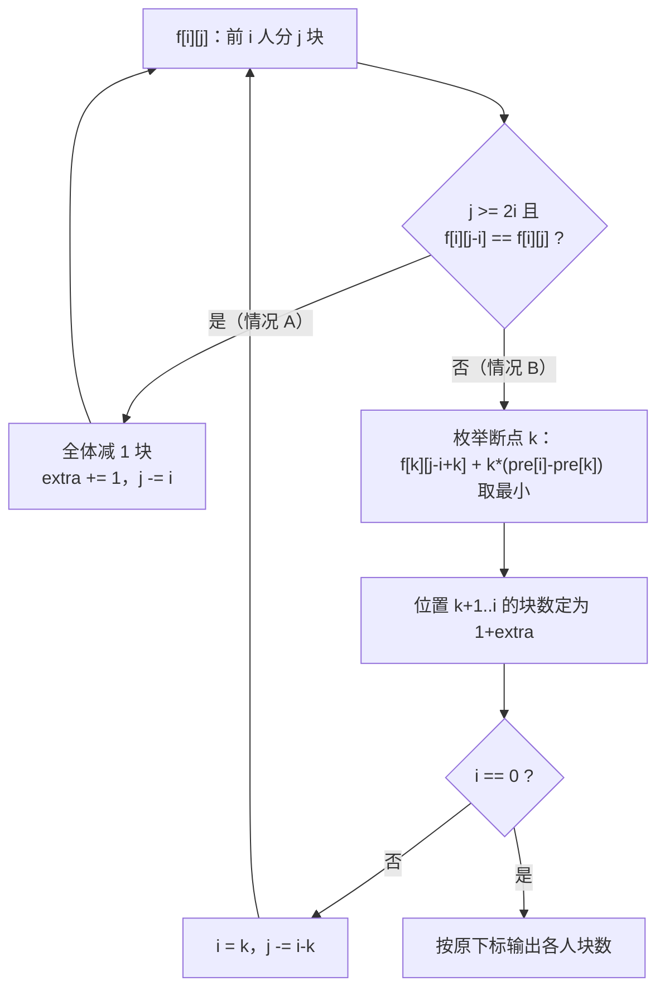

[[TOC]]

## 形式化题目

给定 $n$ 个孩子与 $M$ 块饼干，第 $i$ 个孩子的贪婪度为 $g_i$。要给每个孩子分配正整数块数 $c_1,\dots,c_n$，使 $\sum c_i = M$，并最小化怨气总和

$$\sum_{i=1}^{n} g_i \cdot \#\{\, j : c_j > c_i \,\}$$

每个孩子的怨气等于「分到的饼干严格比**自己**多的人数」乘以自己的贪婪度。要求输出最小怨气值与任意一组达到该值的分配。

### 样例解释

样例 `3 20` / `1 2 3` 的最小怨气是 $2$。先核对一组最优分配 `2 9 9`（就是题面给出的那组）：

| 孩子 | 贪婪度 $g_i$ | 饼干数 $c_i$ | 比自己多的人数 $a_i$ | 怨气 $g_i a_i$ |
| --- | --- | --- | --- | --- |
| 1 | 1 | 2 | 2 | 2 |
| 2 | 2 | 9 | 0 | 0 |
| 3 | 3 | 9 | 0 | 0 |

第 1 个孩子拿得最少，两个孩子都比它多，所以 $a_1 = 2$，怨气 $1 \times 2 = 2$；后两人并列最多，各自的 $a$ 都是 $0$。合计 $2$，达到最小值。

所有最优分配（按贪婪度降序排列后）恰好是三组：$(7,7,6)$、$(8,8,4)$、$(9,9,2)$。可以看到**贪婪度最大的位置拿得不少于贪婪度小的位置**，代价全部由贪婪度最小的人承担——这正是下面贪心排序的依据。本题解输出 $(7,7,6)$，换回输入顺序即 `6 7 7`，同样合法。

## 正解

### 思路

**第一步：先决定「谁多谁少」，再填数字。** 直接枚举每个孩子的块数是 $\binom{M-1}{n-1}$ 级的组合数，$M \leqslant 5000$ 时完全不可行。但注意怨气只依赖块数之间的**大小关系**，与具体数值无关。于是可以交换论证：若 $g_i > g_j$ 却 $c_i < c_j$，把两人的块数对调，只有这两人的项改变，而

$$g_i a_j + g_j a_i \;\leqslant\; g_i a_i + g_j a_j \iff (g_i - g_j)(a_j - a_i) \leqslant 0$$

对调后 $a_i, a_j$ 互换；由于 $g_i \geqslant g_j$ 且对调前 $c_i < c_j$ 意味着 $a_i \geqslant a_j$，不等式成立。因此最优解中**贪婪度越大的人饼干数越多**。把 $g$ 降序排序后，只需构造非增序列 $c_1 \geqslant c_2 \geqslant \dots \geqslant c_n$，具体数值留到最后回填。

> 贪婪度并列的人之间顺序可任选。参考数据由某个具体实现（非稳定排序）生成，本题解的代码复刻了该实现在并列时的次序，从而与给定数据逐字节一致；这只影响「输出哪个最优方案」，不影响最小值与复杂度，下文只讨论算法本身。

**第二步：从「前 $i$ 人」划分子集。** 有了单调性，序关系就变成「前面的人拿得不少于后面」。设 $f_{i,j}$ 表示降序后的前 $i$ 个孩子共分到 $j$ 块饼干时的最小怨气。要写出转移，只看第 $i$ 个人拿几块是不够的（它会同时影响自己和前面所有人的 $a$ 值），关键是改为对**「末尾有多少人恰好拿 1 块」**分类：

- **情况 A：$c_i \geqslant 2$（最后一个人也不止一块）。** 把前 $i$ 个人**每人减 1 块**。块数之间的大小关系完全没变，每个人的 $a$ 也没变，所以怨气不变；总块数从 $j$ 变成 $j-i$。于是

$$f_{i,j} = f_{i,\,j-i}$$

  这条转移说明：只要末尾还有余量，就可以把「多出来的层」一层层剥掉，剩下的只是核心问题。

- **情况 B：$c_i = 1$（末尾一段人有且仅有 1 块）。** 设断点 $k$ 使得 $c_{k+1} = \dots = c_i = 1$ 且 $c_k \geqslant 2$（$k = 0$ 表示前 $i$ 人全拿 1 块）。这一段每人上方恰有 $k$ 个人的饼干比自己多，所以每人贡献 $k \cdot g_t$，该段合计

$$k \sum_{t=k+1}^{i} g_t = k\,(\text{pre}_i - \text{pre}_k)$$

  其中 $\text{pre}$ 是降序 $g$ 的前缀和。前 $k$ 人本身就是子问题 $f_{k,\,j-(i-k)}$（那 $i-k$ 块已被 1 块段占用）。枚举断点取最小：

$$f_{i,j} = \min_{0 \leqslant k < i}\Big\{\, f_{k,\,j-(i-k)} + k\,(\text{pre}_i - \text{pre}_k) \,\Big\},\qquad j \geqslant i-k$$

两类转移互不重叠且覆盖所有可能。因为每人至少 1 块，只有 $j \geqslant i$ 可达；边界 $f_{0,0} = 0$，其余 $+\infty$，答案即 $f_{n,M}$。

**样例的状态与转移。** 排序后 $g$ 降序为 $3,2,1$，$\text{pre} = [0,3,5,6]$。下表列出小规模状态（$\infty$ 表示不可达）：

| $i \backslash j$ | 0 | 1 | 2 | 3 | 4 | 5 | 6 | 7 | 8 |
| --- | --- | --- | --- | --- | --- | --- | --- | --- | --- |
| 0 | **0** | — | — | — | — | — | — | — | — |
| 1 | — | 0 | 0 | 0 | 0 | 0 | 0 | 0 | 0 |
| 2 | — | — | 0 | 2 | 0 | 2 | 0 | 2 | 0 |
| 3 | — | — | — | 0 | 3 | 2 | 0 | 2 | 2 |

取 $f_{3,20}$：先连续走 5 次情况 A（$20 \to 17 \to 14 \to 11 \to 8 \to 5$，每步 $j$ 减 $i=3$，怨气不变），落到 $f_{3,5} = 2$；这次由情况 B 的 $k = 2$ 取得：$f_{2,4} + 2\,(\text{pre}_3 - \text{pre}_2) = 0 + 2 \times 1 = 2$，即位置 3 拿 1 块、上方有 2 人更多。剩下的 $f_{2,4}$ 再走一次情况 A 到 $f_{2,2}$，最后由 $k=0$ 直接在怨气 $0$ 处收尾。加上剥离的层数后，位置 $1,2$ 得 $1+6=7$ 块、位置 3 得 $1+5=6$ 块。

| 位置（$g$ 降序） | $g$ | 最终块数 | 比自己多的人数 | 怨气 |
| --- | --- | --- | --- | --- |
| 1 | 3 | 7 | 0 | 0 |
| 2 | 2 | 7 | 0 | 0 |
| 3 | 1 | 6 | 2 | 2 |

合计 $2$。代价全部落在贪婪度最小的那一位身上——这正是贪心排序要达到的效果。

**输出方案。** 转移只有两种来源，回推时从 $(n,M)$ 出发：若 $j \geqslant 2i$ 且 $f_{i,j} = f_{i,j-i}$，说明该层是「全体减 1」，把层数 $+1$ 并把 $j$ 减 $i$；否则枚举出使情况 B 取到最小值的断点 $k$，把位置 $k+1..i$ 的块数定为 $1 + \text{extra}$（$\text{extra}$ 是此前剥离的层数）。由于 $j$ 每步严格减小，回推必然终止。

图中两条出边对应两类转移；情况 A 可以连续走多次（本例走了 5 次），情况 B 每次结算一段「恰好 1 块」的后缀。

### 代码

@include-code(./main.py, python)

### 复杂度

- 时间复杂度 $O(n^2 m)$：状态 $O(nm)$ 个，情况 B 对每个状态枚举 $k$，共 $\sum_{i} i = O(n^2)$ 次转移；$n \leqslant 30$、$M \leqslant 5000$ 时约 $4.5 \times 10^6$ 次。排序的 $O(n \log n)$ 可忽略。
- 空间复杂度 $O(nm)$：存下整张表以便回推方案；若只需最小值可滚动到 $O(m)$。

$g_i \leqslant 10^7$、$n \leqslant 30$，怨气上界约 $30 \times 10^7 \times 30 \approx 10^{10}$，超出 32 位但远在 64 位（以及 Python 任意精度整数）之内，无需取模。

## 总结

- 核心是**先贪心定序、再 DP**：交换论证说明最优分配中 $g$ 越大块数越多，把「任意分配」压缩成「非增序列」。
- 状态 $f_{i,j}$ 的关键在于只按「末尾有多少人恰好拿 1 块」划分子集：**情况 A** 用「全体减 1 块、怨气不变」把 $j$ 降下来（$f_{i,j} = f_{i,j-i}$），**情况 B** 枚举断点 $k$ 一次性结算这段 1 块后缀（$+k(\text{pre}_i-\text{pre}_k)$）。
- 转移无环，回推时按同样的两种来源逆推即可还原最优分配。并列最优解很多，输出任意一组都合法；若要与给定参考数据逐字节一致，需要连「并列 $g$ 的排序次序」一起复刻标程实现。
