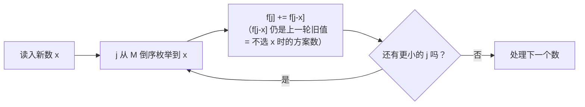

[[TOC]]

## 形式化题目

给定 $N$ 个正整数 $A_1, A_2, \ldots, A_N$，从中选出若干个数（每个数至多选一次），使它们的和恰好为 $M$，求有多少种选法。选出的数的**下标集合**不同即视为不同方案（数值相同但位置不同的数算不同的选择）。

### 输入样例解释

样例中 4 个数为 `1 1 2 2`，目标和为 4，共 3 种方案：

| 方案 | 选中的数（按下标） | 和 |
| --- | --- | --- |
| ① | 第 1、2、3 个（`1` + `1` + `2`） | 4 |
| ② | 第 1、2、4 个（`1` + `1` + `2`） | 4 |
| ③ | 第 3、4 个（`2` + `2`） | 4 |

方案①和②的区别只在选的是第 3 个还是第 4 个 `2`：计数时按下标区分，数值相同的数**不能去重**。

## 正解

### 思路

**朴素做法**：每个数都有"选 / 不选"两种决策，暴力枚举所有 $2^N$ 个子集检查和是否为 $M$，复杂度 $O(2^N)$，$N \leqslant 100$ 时完全不可行。而且枚举子集时，"前 $i$ 个数凑出和 $j$"这一局面会被大量重复经过——同一状态反复出现，正是可以记忆化 / 递推的信号。

**建模为 01 背包计数**。把每个数看作一件体积为 $A_i$ 的物品，背包容量为 $M$，但不求"最大价值"，而是数"恰好装满的方案数"。定义：

$$f[i][j] = \text{只在前 } i \text{ 个数中选择、和恰好为 } j \text{ 的方案数}$$

转移按第 $i$ 个数选不选分成两类，两类方案互不重叠、又恰好覆盖所有可能：

$$f[i][j] = f[i-1][j] + f[i-1][j - A_i] \quad (j \geqslant A_i)$$

其中 $f[i-1][j]$ 是"不选第 $i$ 个数"，$f[i-1][j-A_i]$ 是"选第 $i$ 个数"。边界：$f[0][0] = 1$（空集凑出和 0），$f[0][j] = 0\ (j > 0)$。答案即 $f[N][M]$。

**滚动成一维**。第 $i$ 行只依赖第 $i-1$ 行，可以滚动掉第一维。但若 $j$ 从小到大枚举，更新 $f[j]$ 时 $f[j - A_i]$ 已被本轮更新过，等于"第 $i$ 个数被选了多次"（退化成完全背包，多算方案）。因此 $j$ 必须**从大到小**枚举：更新 $f[j]$ 时 $f[j - A_i]$ 还是上一轮的旧值，对应二维转移里的 $f[i-1][j-A_i]$，保证每个数至多被选一次——这是 01 背包的标准写法。

用样例 `1 1 2 2`、$M = 4$ 演示滚动数组逐个物品更新后的结果（行 = 已处理完的物品数，列 = 目标和 $j$，单元格 = $f[j]$）：

| 处理完的数 | f[0] | f[1] | f[2] | f[3] | f[4] |
| --- | --- | --- | --- | --- | --- |
| 初始 | 1 | 0 | 0 | 0 | 0 |
| 第 1 个 `1` | 1 | 1 | 0 | 0 | 0 |
| 第 2 个 `1` | 1 | 2 | 1 | 0 | 0 |
| 第 3 个 `2`（倒序更新） | 1 | 2 | 2 | 2 | 1 |
| 第 4 个 `2`（倒序更新） | 1 | 2 | 3 | 4 | **3** |

观察重点：

- 第 2 行处理后 `f[1] = 2`：两个 `1` 各自成一种方案——数值相同的数在计数 DP 中天然被按下标区分。
- 第 3 行的 `f[4] = 1` 对应唯一方案 `1+1+2`；`f[3] = 2` 对应 `1+2` 的两种（两个 `1` 各配一次）。
- 最后一行 `f[4] = 3`，与样例输出一致。

一个数进入滚动数组时的更新流程：

图中关键点是 `f[j-x]` 必须是**旧值**：倒序枚举保证它尚未被本轮覆盖，从而等价于二维转移中的 $f[i-1][j-A_i]$。

### 代码

@include-code(./main.py, python)

### 复杂度

- 时间复杂度 $O(N \cdot M)$：每个数扫一遍容量 $[A_i, M]$，$N \leqslant 100$、$M \leqslant 10^4$，约 $10^6$ 次转移。
- 空间复杂度 $O(M)$：滚动数组只需一维长度 $M+1$。

方案数本身可能很大（例如 100 个 `1`、$M=50$ 时答案是 $\binom{100}{50} \approx 10^{29}$，超出 64 位整数范围），Python 的原生大整数正好无溢出风险；若用 C++ 实现需留意这一点。

## 总结

- 本题是 01 背包的**计数变形**：把"最大价值"换成"方案数"，把 `max` 换成 `+`，转移即 $f[j] \mathrel{+}= f[j - A_i]$。
- 最容易错的点是**一维滚动的枚举方向**：必须倒序枚举 $j$，否则同一物品被重复选取（退化成完全背包），方案被多算。
- 计数意义下，数值相同的多个数各自独立计数（按下标区分），不能去重。
- 从生成函数的角度看，答案是多项式乘积 $\prod_i (1 + x^{A_i})$ 中 $x^M$ 的系数；DP 的每一轮就是"逐项乘一个新的 $(1 + x^{A_i})$"。
