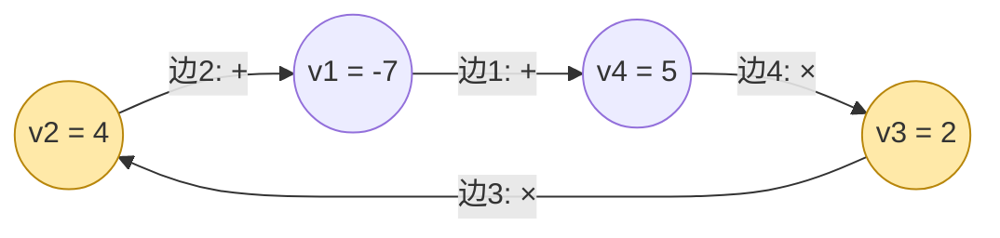

[[TOC]]

## 形式化题目

给定一个 $N$ 个顶点、$N$ 条边的环，顶点 $i$ 上写着整数 $v_i$，每条边上标着运算符 $+$ 或 $\times$。

一次操作为：选择一条边，把这条边以及它连接的两个顶点移除，换成一个新顶点，新顶点上的数等于原来两个顶点上的数按这条边上的运算符计算的结果。操作共进行 $N-1$ 次，最终剩下的那个数就是得分。

求：

1. 得分的最大值；
2. 有哪些边可以作为**第一步被删除的边**（第一条边只删除、不计算），使得得分能取到这个最大值，按编号从小到大输出。

$3 \leqslant N \leqslant 50$，数据保证操作过程中所有数值都在 $[-32768, 32767]$ 内。

下面以样例 `t -7 t 4 x 2 x 5`（$N=4$）为参照：顶点取值 $v_1 = -7,\ v_2 = 4,\ v_3 = 2,\ v_4 = 5$。输入的第 $i$ 对「符号, 数」里的符号画在边 $i$ 上，而边 $i$ 连接顶点 $v_{i-1}$ 与 $v_i$（下标对 $N$ 取模），即边 2 连接 $v_1, v_2$，边 3 连接 $v_2, v_3$，以此类推：



图中橙色顶点是删去边 2 之后链条的起点与第二站。删边 2 断开环，剩下链条 $v_2 \xrightarrow{\times} v_3 \xrightarrow{\times} v_4 \xrightarrow{+} v_1$：先算 $4 \times 2 \times 5 = 40$，再 $40 + (-7) = 33$，这就是答案；删边 1 剩下链条 $v_1 \xrightarrow{+} v_2 \xrightarrow{\times} v_3 \xrightarrow{\times} v_4$，最优同样是 $-7 + 4 \times 2 \times 5 = 33$。所以第二行输出 `1 2`。

## 正解

### 思路

**从搜索到区间 DP。** 直接模拟游戏，每步有 $O(N)$ 条边可选，总量是 $(N-1)!$ 级别，$N=50$ 显然不行。突破口是一个结构性观察：第一步删掉边之后，剩下的所有合并都发生在一段**连续弧**内，永远不会跨过被删的那条边。于是整个游戏 = 「选一条边删掉」 + 「一段链上的合并顺序」，而链上合并的最后一步一定是：

$$
[i..j] \;=\; [i..k] \;\oplus\; [k+1..j] \quad (\oplus\ \text{为边 } k \text{ 上的运算符})
$$

即左半段先合成一个数、右半段先合成一个数，再按分割边 $k$ 上的运算符合并。左右两段的内部顺序互不影响，只通过各自的最终取值相互作用——标准的区间 DP 结构。

**必须同时维护最小值。** 运算符含乘法且数值可为负：$(-7) \times (-7) = 49$，两个「最小」相乘可能成为全局最大。设一段弧合并后能取到的值为集合 $S$，则状态定义为

$$
merged(i, j) = \Big( \max_{\text{合并顺序}} val,\ \min_{\text{合并顺序}} val \Big)
$$

转移时两侧取值互相独立，合并后的最值只需在两侧四个端点 $\{min_L, max_L\} \times \{min_R, max_R\}$ 的 4 个两两组合里取最大与最小（加法单调，乘法最值只会出现在这四个组合中），不需要更多信息。

**破环为链。** 删边 $i$ 后剩下的链条起点是 $v_i$：对每个 $i$ 单独做一遍链上 DP 是 $O(N^4)$。把顶点序列复制一份接在后面（下标对 $2N$ 取模），长度为 $N$ 的弧就成了链上区间 $[i, i+N-1]$，一次 $O(N^3)$ 的 DP 同时覆盖全部 $N$ 个起点，并且**删边 $i$ 的得分恰好等于弧 $[i, i+N-1]$ 的最大值**——「枚举第一步删边」被吸收进了 DP 的枚举里。

以样例中删边 2 的链条 $v_2, v_3, v_4, v_1$（对应链上区间下标 $1..4$）为例，下表按区间长度从左到右给出从每个顶点出发的弧的 (max, min)；$\times$ 边在 $v_2\text{-}v_3$、$v_3\text{-}v_4$ 之间，$+$ 边在 $v_4\text{-}v_1$ 之间。min 与 max 相同时只写一个数，不同时写成 $max\ (min)$：

| 弧 | 长度 1 | 长度 2 | 长度 3 | 长度 4 |
| --- | --- | --- | --- | --- |
| 从 $v_2$ 出发 | $4$ | $4{\times}2 = 8$ | $4{\times}2{\times}5 = 40$ | $40 + (-7) = \mathbf{33}\ (-16)$ |
| 从 $v_3$ 出发 | $2$ | $2{\times}5 = 10$ | $3\ (-4)$ | |
| 从 $v_4$ 出发 | $5$ | $5{+}(-7) = -2$ | | |
| 从 $v_1$ 出发 | $-7$ | | | |

两个单元格值得细看：

- 「从 $v_3$ 出发，长度 3」（弧 $v_3, v_4, v_1$）有两种合并顺序：先 $v_3{\times}v_4 = 10$ 再 $10{+}(-7) = 3$；或先 $v_4{+}v_1 = -2$ 再 $2{\times}(-2) = -4$。两种顺序对应不同的分割点，所以这一格的 (max, min) = $(3, -4)$——**两种结果都要记下来**，因为作为更大的弧的子问题，$-4$ 这个 min 在乘法下可能翻回最大值（全负数据里正是如此）。
- 「从 $v_2$ 出发，长度 4」：分割点取「$[v_2..v_4]$ 与 $[v_1]$」时，$40 + (-7) = 33$ 是最大值；分割点取「$[v_2..v_3]$ 与 $[v_4..v_1]$」时，$8 \times (-2) = -16$ 恰好是这一格的最小值。一个区间内的所有分割点同时贡献 max 和 min，这正是转移要同时取两者、且 `calc` 要把四个端点组合全部算一遍的原因。

### 代码

@include-code(./main.py, python)

实现上有两处对应关系值得对照：

- 输入的第 $i$ 对运算符画在**边 $i$** 上，而边 $i$ 连接 $v_{i-1}$ 与 $v_i$，所以「顶点 $k$ 与 $k+1$ 之间」的运算符是输入数组的第 $(k+1) \bmod N$ 对——代码里的 `ops[(k + 1) % n]`。
- 没有显式把数组复制一份：`nums[i % n]`、`ops[(k + 1) % n]` 的取模访问与破环为链等价；`@cache` 记忆化搜索替代自底向上填表，状态集合相同。

### 复杂度

- 时间：$O(N^2)$ 个状态 × 每个状态 $O(N)$ 个分割点 = $O(N^3)$，$N = 50$ 时约 $1.25 \times 10^5$ 次转移；实测最长单点 0.13s（限时 1s 的数据最大 $N=48$）。若不破环、对每个起点独立 DP 则是 $O(N^4)$。
- 空间：$O(N^2)$ 个区间状态。

## 总结

- **结构观察优先**：环上合并问题的第一步是发现「删一条边后操作封闭在一段弧内」，它把环问题降为链问题，并让「枚举第一步删边」与「枚举区间起点」合一。
- **区间 DP 的状态要成对存极值**：只要转移运算里有乘法、数值可负，只存最大值就会丢掉「负负得正」的翻转；同时维护 (max, min) 后转移只需 $O(1)$ 次四端点组合。
- **易错点**：本题输入的「边、点」交替描述里，边 $i$ 连接的是 $v_{i-1}$ 与 $v_i$，边-点对应关系错了样例都过不了；写代码前最好先用样例手工核对一遍。

## 图示解析

### 整体求解路线

```text
读入 N 与 (边i符号, 顶点i值) 对
        │
        ▼
核对边-点对应: 边 i 连接 v[i-1] 与 v[i]
        │
        ▼
破环为链: 下标取模 2N, 顶点复制一份
        │
        ▼
区间 DP merged(i,j) = (max, min)          i == j → (v_i, v_i)
   枚举分割点 k ∈ [i, j)                    │
   四端点组合取 (max, min) ◄────────────────┘
        │
        ▼
edge_scores[i] = merged(i, i+N-1).max   ← 删边 i 的得分
        │
        ▼
输出 max(edge_scores) 与所有并列的边编号
```

路线图里最值得记住的一步是最后一段：**答案与第一步删边方案不需要第二次计算**——弧 $[i, i+N-1]$ 的最大值本身就是删边 $i$ 的得分，全局最大值与并列边在同一个数组里一次读出。
