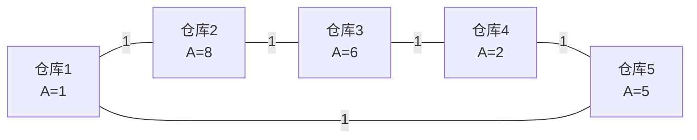

[[TOC]]

## 形式化题目

环形公路上均匀分布 $N$ 座仓库，编号 $1\sim N$。编号 $i$ 与 $j$ 的仓库之间的环上最短距离为

$$
dist(i,j)=\min\bigl(|i-j|,\;N-|i-j|\bigr).
$$

仓库 $i$ 的库存量为 $A_i$，在 $i$ 与 $j$ 之间运货的代价为

$$
cost(i,j)=A_i+A_j+dist(i,j).
$$

求

$$
\max_{1\leqslant i<j\leqslant N} cost(i,j).
$$

输入样例：

```
5
1 8 6 2 5
```

输出样例：

```
15
```

样例里的环形公路如下：节点内标出库存量，边上的 $1$ 是相邻编号仓库之间的距离。
把边上权值沿环累加就得到 $dist$。



读图时注意 $dist$ 是环上两个方向的较小值，把边上的 $1$ 累加就得到距离：
仓库 $5$ 与仓库 $1$ 相邻，距离为 $1$；仓库 $5$ 到仓库 $2$ 的两个方向分别是 $2$（经仓库 $1$）
和 $3$（经仓库 $4,3$），取较小的 $2$。
按公式逐一算：选择仓库 $2$ 与仓库 $3$ 得 $8+6+1=15$，
选择仓库 $5$ 与仓库 $2$ 得 $5+8+2=15$，两者并列最优。

## 正解

### 思路

**朴素做法与瓶颈。** 数据范围是 $1\leqslant N\leqslant 10^6$、$1\leqslant A_i\leqslant 10^7$。
枚举所有 $i<j$，把环上较短路代入求值（这里 `A` 是 0 起始下标的库存数组，长度 `n`）：

```python
best = max(A[i] + A[j] + min(j-i, n-(j-i)) for i in range(n) for j in range(i+1, n))
```

这是 $O(N^2)$，$N=10^6$ 时约 $5\times 10^{11}$ 次运算，必须把“每个右端点都扫一遍所有左端点”
压到摊还 $O(1)$。

**第一步：断环成链，把环形距离变成下标差。**

两个方向的距离之和恒为 $N$，所以较短路必然不超过 $K=\lfloor N/2\rfloor$。于是把数组复制出前 $K$ 项接在后面：

$$
B=(A_1,A_2,\dots,A_N,\;A_1,A_2,\dots,A_K),\qquad |B|=N+K .
$$

那么，这样做会不会落下某一对仓库？设一对仓库编号 $u<v$，取较短路长度 $d=dist(u,v)\leqslant K$。
若 $v-u=d\leqslant K$，则下标对 $(u,v)$ 本身就在链的前 $N$ 项里；
若 $v-u>K$，则 $v-u\geqslant K+1$，较短路是从 $v$ 绕回 $u$、长度 $d=N-(v-u)$，
且由 $u\leqslant v-(K+1)\leqslant N-K-1$ 得 $u\leqslant K$（因为 $K=\lfloor N/2\rfloor$ 推出 $N-K-1\leqslant K$）。
于是下标对 $(v,\;u+N)$ 落在链上（$u+N\leqslant N+K$），且 $(u+N)-v=N-(v-u)=d\leqslant K$。两种情形都被覆盖。

链上满足 $j-i\leqslant K$ 的下标 $(i,j)$，其下标差 $j-i$ 就等于这两座仓库的环上较短路距离
（因为 $j-i\leqslant K$ 意味着这个方向不比另一个方向 $N-(j-i)$ 远），所以每个下标对都是一对真实仓库的合法候选。
例如样例中仓库 $5$ 与仓库 $2$：

```text
N = 5   K = N // 2 = 2   链长 = N + K = 7

下标    1   2   3   4   5   6   7
库存    1   8   6   2   5   1   8
来源    A   A   A   A   A  复  复
```

下标 $5$ 到下标 $7$ 的距离是 $7-5=2$，正是仓库 $5$ 到仓库 $2$ 绕环的较短路距离。

要注意距离小于 $K$ 的仓库对会在链上出现两次（例如仓库 $1,2$ 对应下标 $1,2$ 和 $6,7$），
距离恰为 $K$（$N$ 为偶数）时同样如此。幸好本题只求最大值、不计数：
重复出现的下标对算出的就是同一个代价，既不会把答案抬高，也不会漏掉任何一对。
这是断环成链能直接用在本题的关键前提。

**第二步：把 $j-i$ 拆开，让左右端点各管一半。**

$$
B_i+B_j+(j-i)=\underbrace{\bigl(B_i-i\bigr)}_{f(i)}+\underbrace{\bigl(B_j+j\bigr)}_{g(j)} .
$$

$f$ 只和左端点有关，$g$ 只和右端点有关，于是问题变成

$$
\text{答案}=\max_{j}\Bigl(g(j)+\max_{i\in[\,j-K,\;j-1\,]} f(i)\Bigr).
$$

**第三步：滑动窗口最大值用单调队列。**

右端点 $j$ 从小到大枚举，窗口 $[j-K,j-1]$ 的左右两端都单调右移，正是单调队列的场景。
队列存左端点下标，并维护 $f$ 从队首到队尾严格递减，这样队首就是窗口内 $f$ 最大者：

1. 新的左端点 $i=j-1$ 入队前，先弹出队尾所有 $f$ 值不大于 $f(i)$ 的下标——它们既更小、又更早过期，永远不可能再当选；
2. 再看队首是否已滑出窗口（下标 $<j-K$），是则弹出；
3. 此时队首就是窗口内最优左端点，算出候选值并更新答案。

样例的完整扫描轨迹。表里的下标都换算成 $1$ 起始编号，所以 $f(i)=B_i-i$、$g(j)=B_j+j$；
“队列中的下标”按从队首到队尾排列，队首就是候选值的取值位置：

| $j$ | $B_j$ | 合法左端点窗口 | 队列中的下标 | 候选值 $g(j)+f(\text{队首})$ | 当前最优 |
| --- | --- | --- | --- | --- | --- |
| $2$ | $8$ | $[1,1]$ | $1$ | $10$ | $10$ |
| $3$ | $6$ | $[1,2]$ | $2$ | $15$ | $15$ |
| $4$ | $2$ | $[2,3]$ | $2,3$ | $12$ | $15$ |
| $5$ | $5$ | $[3,4]$ | $3,4$ | $13$ | $15$ |
| $6$ | $1$ | $[4,5]$ | $5$ | $7$ | $15$ |
| $7$ | $8$ | $[5,6]$ | $5,6$ | $15$ | $15$ |

第 $3$ 行是本题答案的来源：扫到 $j=3$（$B_3=6$，仓库 $3$）时，窗口是下标 $1\sim2$，
但入队下标 $2$ 时发现它的 $f(2)=8-2=6$ 不小于下标 $1$ 的 $f(1)=1-1=0$，于是下标 $1$ 被弹出。
队首因此是下标 $2$（仓库 $2$），候选值 $f(2)+g(3)=6+(6+3)=15$，即 $8+6+1$。
第 $7$ 行给出了并列最优的另一对（仓库 $5$ 与仓库 $2$，代价 $5+8+2=15$），它只在下标 $7$ 这个复制出来的位置上才会出现，
这也说明了为什么要复制前 $K$ 项。

**正确性要点。** 每一步入队弹出的队尾元素既比新元素更早过期、值又不更大，因此删除它们不改变任何后续窗口的最优值；
被弹出的队首元素已不在窗口内。故循环过程中队首始终是当前窗口内 $f$ 的最大值，
每次得到的候选值都对应链上一对满足 $j-i\leqslant K$ 的下标，也就是一对真实仓库的合法代价，
取最大即得答案。

**边界。** 当 $N=1$ 时链长为 $1$，扫描循环一次都不执行；因为 $A_i\geqslant 1$，把 `best` 初始化成 $0$ 直接输出，
正好对应“找不到第二座仓库”。

正文与代码的对应关系是直接的：`parse_chain()` 完成第一步的断环成链，
`best_cost()` 里的 `weight = chain[i] - i` 就是 $f(i)$，`chain[j] + j` 就是 $g(j)$，
两个 `while` 分别完成入队弹出与窗口过期，`queue[0]` 就是上表里的“队首”。

### 代码

@include-code(./main.py, python)

### 复杂度

- 时间复杂度：$O(N)$。断环成链是 $O(N)$，单调队列扫描链长 $N+K=O(N)$，
  且每个下标最多入队、出队各一次。
- 空间复杂度：$O(N)$。链 $B$ 用 `array('i')` 存放，占 $4(N+K)$ 字节；队列最多同时容纳 $K$ 个下标。

## 总结

这道题的核心是把“环形 + 距离”这两个麻烦逐个消掉：

1. **环** → 用 $dist\leqslant\lfloor N/2\rfloor$ 断环成链，把环形距离变成链上下标差；
2. **距离** → 把 $j-i$ 拆给左右端点，让 $f(i)=B_i-i$ 与 $g(j)=B_j+j$ 各自独立；
3. **取最大值** → 窗口两端单调右移，用单调队列把每个右端点的 $O(N)$ 降到摊还 $O(1)$。

只要题目求的是最大值而不是计数，第 1 步的重复枚举就完全无害——这是断环成链能直接用在本题的关键前提。
第 2 步的代数拆分同样常见：把“两个点之间的耦合项”（这里是距离 $j-i$）拆成只含单个下标的表达式，
是滑动窗口、单调栈、斜率优化这一族优化的共同起点。
