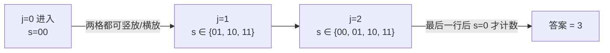
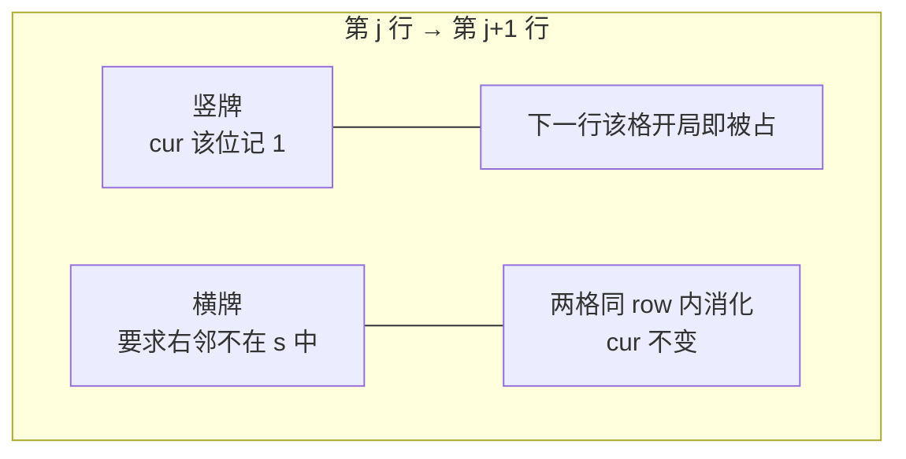

[[TOC]]

## 形式化题目

给定 $N \times M$ 的棋盘（$1 \le N, M \le 11$），用若干 $1 \times 2$ 的骨牌不重叠地铺满它，求铺满的方案数。骨牌可以横放也可以竖放，棋盘必须被完全覆盖，不能有重叠也不能留空格。多组询问，以 `0 0` 结束。

## 思路

### 朴素做法及其困境

最直接的想法是给每个格子依次决定放什么牌，但骨牌是横跨两个格子的：放一张横牌会影响右邻格，放一张竖牌会影响下一行。如果只记录"扫到哪个格子"，无法知道哪些格子已经被之前的牌占住了，决策无从做起。所以状态里必须携带"当前格之前的格子被谁占了"的完整信息。

### 逐行划分 + 列压缩状态

把棋盘按**行**划分阶段。逐行填放，先注意一个关键性质：**横牌一旦越过行边界就不存在**——横牌只占同一行的相邻两格。因此行与行之间的"相互影响"只有一种来源：竖牌。一张竖牌占第 $j$ 行和第 $j+1$ 行的同一列。

于是定义：

$$f_{j,s} = \text{前 } j \text{ 行已完全填满时，第 } j+1 \text{ 行中被竖牌占住的列集合为 } s \text{ 的方案数}$$

其中 $s$ 是一个 $N$ 位二进制数，第 $pos$ 位为 1 表示第 $j+1$ 行的第 $pos$ 列已被上一行伸下来的竖牌占住。前 $j$ 行已完全填满，意味着这些伸出列就是唯一悬而未决的信息。

初始 $f_{0,0}=1$；转移时对第 $j+1$ 行做一次**行内逐格 dfs**，把该行剩余空格用横牌/竖牌填满，竖牌用 `cur` 记录向下伸出的列集合，填完后累加到 $f_{j+1,cur}$。答案为 $f_{M,0}$（所有行填完且没有向下伸出）。

### 行内逐格 dfs 的三种情况

设进入本行时被占列集合为 `s`，`dfs(pos, cur)` 表示正在决定第 `pos` 列（`cur` 为本行向下伸出的列集合）：

| 情况 | 条件 | 动作 |
| --- | --- | --- |
| 已被上竖牌占据 | `s` 的第 `pos` 位为 1 | 直接跳到 `pos+1`，不改 `cur` |
| 放竖牌 | 总可放 | 记 `cur` 第 `pos` 位为 1，走 `pos+1` |
| 放横牌 | `pos+1 < N` 且第 `pos+1` 位也不在 `s` 中 | 同时占 `pos, pos+1` 两格，`cur` 不变，走 `pos+2` |

注意两点：横牌合法的前提是**右邻格没有被上一行的竖牌占住**；本行内每张竖牌都登记到 `cur`，传给下一行处理，本行自身不会出现"填一半"的状态。

### 为什么这样是对的

按行从上往下扫，决策只依赖"上一行传下来的伸出列集合"，不依赖更早的行（更早的行已全部填满，无法再伸出）。每个合法铺法按行的顺序、每行内按列的顺序被唯一地展开成一条决策链；反之每条以 `s=0` 结尾的决策链也唯一对应一个合法铺法，所以方案数被不重不漏地统计。

### 状态规模与记忆化

有效状态只有 $(j, s)$ 共 $(M+1) \times 2^N$ 个（本题 $12 \times 2048 \approx 2.5 \times 10^4$），行内 dfs 只是把"如何从 $f_{j,s}$ 走到各个 $f_{j+1,cur}$"展开成枚举，用 `functools.cache` 记忆化后每个 $(j,s)$ 只算一次，远小于所有格子的指数级决策树。

## 代码

@include-code(./main.py, python)

## 复杂度

- 状态数 $O(M \cdot 2^N)$，每个状态行内转移 $O(N)$ 量级（逐格 dfs 的每层只有常数分支），总复杂度 $O(M \cdot N \cdot 2^N)$。$N, M \le 11$ 时约 $3 \times 10^5$ 次基本操作，即使多组询问也可以先离线预处理所有 $1 \le N, M \le 11$ 的答案再回答。
- 空间 $O(M \cdot 2^N)$，本题用 `lru_cache` 隐式存储。

## 总结

- 核心是**轮廓线 DP** 的建模：阶段是行、附加信息是"下一行被竖牌占住的列集合"，一个 $N$ 位二进制足以概括行间全部影响。
- 行内用递归逐格决策，天然处理了"横牌需要右邻空、竖牌登记到下一行"的分支逻辑，比手写按列循环的写法更短。
- 这套"逐行扫描 + 列状态压缩"是棋盘覆盖类问题的通用骨架（插头 DP 的简化版），$N \le 11$ 的范围正是对 $2^N$ 状态数的暗示。

## 图示解析

### 逐行扫描与伸出列集合

以 $N=2, M=3$（样例答案 3）为例，展示三行扫描过程中伸出集合的变化：

| 进入第 2 行的 s | 第 2 行的填法 | 传给第 3 行的 cur | 对答案的贡献 |
| --- | --- | --- | --- |
| `00` | 一张横牌 | `00` | 1 |
| `01` | 第 0 列竖放补齐，第 1 列竖放 | `01` | 0（最末行伸出非法） |
| `10` | 第 1 列竖放补齐，第 0 列竖放 | `10` | 0 |
| `11` | 两格均已被占 | `11` | 0 |

中间行的情况对称展开，最终只有 $s \equiv 0$ 的路径存活，共 3 条。

### 一张牌如何影响轮廓线

绿色标记的伸出列就是状态 $s$：上一行哪里竖放了牌，下一行就在哪里"欠"一个格子。
