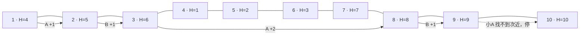
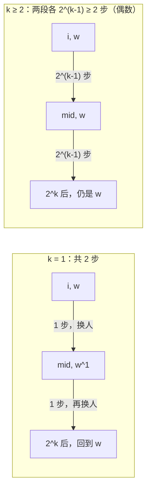

[[TOC]]

## 形式化题目

数轴上有 $N$ 座城市，编号 $1 \ldots N$ 自西向东排列，海拔 $H_1 \ldots H_N$ 互不相同。城市 $i, j$ 之间的距离为 $d[i,j] = |H_i - H_j|$。

从某座城市 $S$ 出发**只能向东**（编号增大方向）前进。行进规则：

- 当前司机为小A 时，走到东侧**第二近**的城市；当前司机为小B 时，走到东侧**最近**的城市；
- 两个候选城市距离相同时，海拔低者视为更近；
- 第一天由小A 先开车，之后每天轮换；
- 若某位司机在当前位置以东找不到自己的目标城市，或者开过去会使累计里程超过 $X$，旅行立即结束。

需要回答两个问题：

1. 给定 $X_0$：从哪个城市出发，小A 的总里程与小B 的总里程之比最小？小B 里程为 $0$ 时比值视为 $+\infty$，两个 $+\infty$ 相等；比值并列时取出发城市海拔最高者，输出该城市编号。
2. 给定 $M$ 组 $(S_i, X_i)$：输出小A、小B 各自的总里程。

上图画出样例中 $S=1,\ X=7$ 的完整旅程：小A 先从 $1$ 开到第二近的 $2$（+1），小B 从 $2$ 开到最近的 $3$（+1），小A 从 $3$ 开到第二近的 $8$（+2），小B 从 $8$ 开到 $9$（+1）。累计 $5$ 公里后轮到小A，但 $9$ 以东只剩城市 $10$，小A 找不到「第二近」的城市，旅行结束。四段依次由 A、B、A、B 先开，单段里程记在先开者名下，故小A 合计 $1+2=3$、小B 合计 $1+1=2$，正是样例第一行询问 $S=1$ 的输出 `3 2`。

## 正解

### 思路

**第一步：O(N) 找出每个城市东侧的「最近」与「次近」。**

如果把所有城市按海拔排成一条双向链表，那么城市 $i$ 的最近、次近城市只会出现在链表上它左右各 2 个邻居里：设 $j$ 与 $i$ 之间隔着城市 $t$（海拔介于两者之间），则

$$d[i,j] = d[i,t] + d[t,j] > d[i,t],$$

即隔着城市的 $j$ 永远不如中间的 $t$ 近。所以每个城市只需考察至多 4 个候选。

但题目要求目的地在**东侧**（编号更大）。技巧是按编号 $1 \ldots N$ 的顺序处理城市，处理完 $i$ 就把它从链表里删掉——这样轮到 $i$ 时，链表里剩下的恰好只有 $i$ 自己和东侧城市，4 个邻居全部合法。把候选按（距离，海拔）排序：第 1 名给小B，第 2 名给小A。排序是唯一的大开销，总计 $O(N \log N)$。

**第二步：把「路径完全确定」变成倍增。**

起点定了，谁先开定了，之后的路径就唯一确定；每天的状态只有「当前城市 + 当前司机」。逐日模拟一次是 $O(N)$，$M$ 次询问加枚举起点共 $O(NM) \approx 10^9$，不可接受。于是对「走 $2^k$ 步」建表：

- `nxt[k][w][i]`：从 $i$ 出发、由 $w$（0 = 小A，1 = 小B）先开，走 $2^k$ 步后到达的城市（$0$ 表示走不动）；
- `da[k][w][i]`、`db[k][w][i]`：这 $2^k$ 步里两人各自的里程。

拼接 $2^k = 2^{k-1} + 2^{k-1}$ 时，后一段的先开者 $w_2$ 只跟 $k$ 有关：

- $k = 1$：整段 2 步 = 1 步 + 1 步，中途换人，$w_2 = w \oplus 1$；
- $k \geqslant 2$：前后两段各有偶数步，先开者换回去，$w_2 = w$。

边界 $k=0$ 是单步：从 $i$ 开到它的目标城市，这一步里程记在先开者名下，走完换司机。三层递推：

$$\text{nxt}[k][w][i] = \text{nxt}[k{-}1][w_2]\big[\text{nxt}[k{-}1][w][i]\big],$$

里程数组把两段的 `da`、`db` 分别相加即可。中途任一段走不动（$0$）整段记 $0$。

**第三步：跳跃回答。** 从高位到低位枚举 $k$：若 `nxt[k][w][cur]` 存在且跳过去累计里程不超 $X$，就跳，累加两人里程；$k=0$ 的跳跃成功后翻转司机。任何可行步数 $s \leqslant N-1 < 2^{\log}$ 都能二进制分解，从高到低位试跳恰好逐位重建整条路径，单次询问 $O(\log N)$。

**第四步：两个问题的回答。** 问题 2 直接 `drive(S_i, X_i)`。问题 1 枚举所有起点调用同一函数得 $(a, b)$，比较 $\frac{a}{b}$ 用交叉相乘 $a \cdot b' \text{ vs } a' \cdot b$（全程整数，无精度问题；$a, b \leqslant X \leqslant 10^9$，乘积不超过 $10^{18}$）。$b = 0$ 按题意视为 $+\infty$：有限比值总是更优；两个 $+\infty$ 相等，此时（以及比值并列时）按海拔取更高的起点。

下表是样例预处理出的目标城市（「—」表示东侧不存在）：

| 城市 $i$ | 1 | 2 | 3 | 4 | 5 | 6 | 7 | 8 | 9 | 10 |
| --- | --- | --- | --- | --- | --- | --- | --- | --- | --- | --- |
| 海拔 $H_i$ | 4 | 5 | 6 | 1 | 2 | 3 | 7 | 8 | 9 | 10 |
| 小B（最近） | 6 | 3 | 7 | 5 | 6 | 7 | 8 | 9 | 10 | — |
| 小A（次近） | 2 | 6 | 8 | 6 | 7 | 8 | 9 | 10 | — | — |

注意城市 $1$（海拔 4）：东侧距离为 $1$ 的候选有 $2$（海拔 5）和 $6$（海拔 3），距离并列时海拔低者算近，故小B 去 $6$、小A 去 $2$。再看城市 $3$（海拔 6）：$2$ 在西侧根本不进候选——「目的地只在东侧」这一约束已由删除顺序天然保证；东侧最近的两个海拔是 $7$（距离 1）和 $8$（距离 2），故小B 去 $7$、小A 去 $8$。沿表逐列检查可以看到：每个目标都落在编号更大的列里。

最后用问题 1 串起全表。$X_0 = 7$ 时枚举全部起点可得：$S=2$ 与 $S=4$ 的里程同为 $(2, 4)$，比值 $\tfrac{1}{2}$ 为全局最小；两者并列，按「海拔最高的出发城市」打破平手，$H_2 = 5 > H_4 = 1$，故输出 $S_0 = 2$。

### 代码

@include-code(./main.py, python)

### 复杂度

- 时间：预处理排序 + 建表 $O(N \log N)$；问题 1 枚举 $N$ 个起点 $O(N \log N)$；问题 2 每次询问 $O(\log N)$，合计 $O((N + M)\log N)$。
- 空间：三张 $\log N \times 2 \times (N+1)$ 的表，$O(N \log N)$。

## 总结

- 模型：向东行驶 + 确定性选择规则 ⇒ 路径由（起点，先开者）唯一决定 ⇒ 倍增。
- 两个易错点：
  1. 换司机只发生在**奇数步**的段——倍增拼接时 $k=1$ 要交换先开者，$k \geqslant 2$ 不交换，$k=0$ 走完交换；
  2. 距离并列按海拔低者算近；比值并列（含两个 $+\infty$）按起点海拔高者输出。
- 链表删除顺序（按编号从西往东处理、处理完即删）是「目的地只在东侧」这一约束的零成本实现。

## 图示解析

### 从样例表到第一次跳跃

以 $S=1,\ X_0=7$ 为例演示 `drive` 的二进制分解（$\log = 4$）：

| 尝试 $k$ | 段长 | 是否成行 | 累计 (A, B) | 当前城市 / 先开者 |
| --- | --- | --- | --- | --- |
| 3 | 8 步 | 表项为 0（走不满 8 步），跳过 | (0, 0) | 1 / A |
| 2 | 4 步 | 1→2→3→8→9，合计 +5 $\leqslant 7$，跳 | (3, 2) | 9 / A |
| 1 | 2 步 | 9 以东走不满 2 步，表项为 0，跳过 | (3, 2) | 9 / A |
| 0 | 1 步 | 9 的次近不存在，表项为 0，跳过 | (3, 2) | 结束 |

逐行对照：高位先试大步，能跳则跳，剩余距离交给低位；$k=2$ 一次跳完 4 步后里程已定为 $(3, 2)$，低位全部无处可走。因此 $S=1$ 时总里程为 $(3, 2)$，与样例第一行一致；由上文起点枚举，全局最优是 $S_0 = 2$（$S=2$ 与 $S=4$ 并列比值 $\tfrac{1}{2}$，海拔更高者胜出）。
