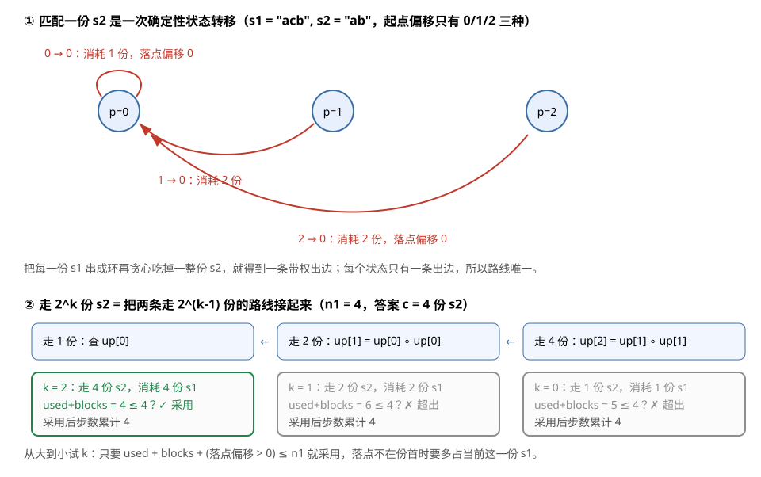

[[TOC]]

## 形式化题目

记 $conn(s,n)$ 为字符串 $s$ 首尾相接 $n$ 次。称 $a$ 能由 $b$ 生成，当且仅当 $a$ 是 $b$ 的子序列（从 $b$ 中删除若干字符、保持顺序可得 $a$）。

给定 $s_1,n_1,s_2,n_2$，求最大的整数 $m$，使得

$$conn\big(conn(s_2,n_2),\,m\big)\ \text{能由}\ conn(s_1,n_1)\ \text{生成}$$

其中 $|s_1|,|s_2|\leqslant 100$，$n_1,n_2\leqslant 10^6$，多组数据读到文件结束。

## 正解

### 思路

#### 第一步：把 $m$ 还原成"能放几份 $s_2$"

因为 $conn(conn(s_2,n_2),m)=conn(s_2,\,m\cdot n_2)$，所以"$conn(s_2,n_2)$ 重复 $m$ 次是 $T$ 的子序列"和"$s_2$ 重复 $m\cdot n_2$ 次是 $T$ 的子序列"是同一件事。记 $T=conn(s_1,n_1)$，记

$$c=\text{$s_2$ 作为子序列在 $T$ 中最多能不重叠地出现的次数}$$

那么答案就是

$$m=\left\lfloor \frac{c}{n_2}\right\rfloor$$

于是问题只剩一件事：**数出 $c$**。

#### 第二步：朴素扫描，以及它为什么不够快

最直接的做法是逐字符贪心：展开 $T$，用指针 $j$ 指向 $s_2$ 中下一个要匹配的字符，从左到右扫 $T$；遇到 `s1[pos] == s2[j]` 就匹配并让 $j$ 前进，$j$ 走完一整份 $s_2$ 时计数加一、$j$ 归零。

以样例第一组（$s_1=\texttt{acb}$，$n_1=4$；$s_2=\texttt{ab}$，$n_2=2$）为例：

```text
T   :  a  c  b  a  c  b  a  c  b  a  c  b
下标:  0  1  2  3  4  5  6  7  8  9 10 11
第1份:  a  .  b                          → 跨过 1 份 s1，落点回到份首
第2份:           a  .  b                 → 跨过 1 份 s1
第3份:                    a  .  b        → 跨过 1 份 s1
第4份:                             a  .  b → 跨过 1 份 s1
```

$c=4$，答案 $m=\lfloor 4/2\rfloor=2$。

其余四组样例各自检验一个侧面：

| 组 | $s_2,n_2$ | $s_1,n_1$ | 输出 | 它在检验什么 |
| --- | --- | --- | --- | --- |
| 1 | ab 2 | acb 4 | 2 | 每份 $s_2$ 跨份匹配，落点正好回到份首 |
| 2 | acb 1 | acb 1 | 1 | $T$ 恰好等于 $s_2$，$c=1$ |
| 3 | aa 1 | aaa 3 | 4 | 9 个 `a` 里能放 4 个 `aa`，答案可以超过 $n_1$ |
| 4 | baab 1 | baba 11 | 7 | 起点偏移 0/1/2 都要跨过份边界才能匹配完 |
| 5 | aaaaa 1 | aaa 20 | 12 | 60 个 `a` 刚好被 12 份 `aaaaa` 铺满 |

"能匹配就立刻匹配"是安全的：匹配得越早，留给 $s_2$ 剩余部分的空间只会越大，不存在"这次先跳过、以后更划算"的情况。

但这个扫描是 $O(n_1|s_1|)=O(10^8)$ 次比较，而且 $T$ 本身就长达 $10^8$，根本不能真的展开。注意轨迹里每份 $s_2$ 的匹配过程**完全一样**——都从份内偏移 $0$ 出发、都在份内偏移 $0$ 结束。这就是可以压缩的地方。

#### 第三步：把"匹配一份 $s_2$"压成一次状态转移

一份 $s_2$ 怎么匹配，只取决于"从哪一份 $s_1$ 的哪个偏移 $p$ 出发"。于是定义：

```text
match_once(p) = ( 匹配一份 s2 跨过的完整 s1 份数 blocks, 匹配结束时的份内偏移 q )
```

状态只有 $|s_1|\leqslant 100$ 种，全部预处理出来即可。样例第一组（$s_1=\texttt{acb}$）的三条转移：

| 起点偏移 $p$ | 消耗的 $s_1$ 份数 `blocks` | 落点偏移 $q$ |
| --- | --- | --- |
| 0 | 1 | 0 |
| 1 | 2 | 0 |
| 2 | 2 | 0 |

`match_once` 也不需要展开 $T$：扫到一份 $s_1$ 的末尾就把位置模 $|s_1|$ 归零、份数加一，等价于把 $T$ 沿 $|s_1|$ 的边界切块后继续扫。只要 $s_2$ 的字符都在 $s_1$ 里，每读完一份 $s_1$ 至少能吃掉 $s_2$ 的一个字符，所以最多扫 $|s_2|$ 份就结束。

#### 第四步：倍增——把"走 $2^k$ 份 $s_2$"预计算出来

只走"份数"次仍然是 $O(c)$，而 $c$ 可以到 $5\times10^7$（例如 $s_1=\texttt{ab}$ 重复 50 次、$s_2=\texttt{ba}$、$n_1=10^6$）。

关键观察：**转移是确定性的**，所以"匹配 $2^k$ 份 $s_2$"的结果也是确定的，并且可以由两个"$2^{k-1}$ 份"拼出来：

```text
up[0][p] = match_once(p)
up[k][p] = 先走 up[k-1][p]，再在它的落点上走一次 up[k-1]
```

样例第一组的完整倍增表（$up[k][p]$ 写成 `(消耗份数, 落点偏移)`）：

| $k$ | 步数 $2^k$ | $p=0$ | $p=1$ | $p=2$ |
| --- | --- | --- | --- | --- |
| 0 | 1 | (1, 0) | (2, 0) | (2, 0) |
| 1 | 2 | (2, 0) | (3, 0) | (3, 0) |
| 2 | 4 | (4, 0) | (5, 0) | (5, 0) |

读表的要点：$up[2][0]=(4,0)$ 一眼读出"走 4 份 $s_2$ 要吃掉 4 份 $s_1$、落点回到份首"，而这张表只花了两轮拼接就建好了，不需要真走 4 步。

#### 第五步：用二进制拆分挑出最大的 $c$

最后从最大的 $k$ 往小试，能加就加：

```text
used, p, copies = 0, 0, 0
对 k 从大到小：
    blocks, q = up[k][p]
    need = used + blocks + (q > 0)      # 落点不在份首时，当前这一份 s1 也被占用
    若 need <= n1：  used, p, copies = used + blocks, q, copies + 2^k
```

判据里 `used` 是此前已经完整跨过的 $s_1$ 份数，`blocks` 是这一步跨过的份数，最后一项 $[q>0]$ 表示**落点不在份首时，当前这一份 $s_1$ 也被占用了一部分**，必须算进预算。

样例第一组的挑选过程：$k=2$ 时走 4 份只需 4 份 $s_1$（$q=0$），采纳；再试 $k=1$ 需要 $4+2=6>4$ 份，$k=0$ 需要 $4+1=5>4$ 份，都放弃。于是 $c=4$，$m=\lfloor4/2\rfloor=2$。

$[q>0]$ 这一项在落点不回到份首时才会生效，看一组对照（$s_1=\texttt{abc}$，$s_2=\texttt{ca}$，$n_1=3$）：

| $k$ | 步数 | $up[k][0]$ | 累计占用 $s_1$ 份数 | 是否采纳 |
| --- | --- | --- | --- | --- |
| 2 | 4 | (4, 1) | $0+4+[1>0]=5>3$ | ✗ |
| 1 | 2 | (2, 1) | $0+2+[1>0]=3\leqslant3$ | ✓ |
| 0 | 1 | (1, 1) | $2+1+[1>0]=4>3$ | ✗ |

$up[1][0]=(2,1)$ 的意思是"跨过 2 份 $s_1$、落回第 3 份的偏移 1"，所以这两份 $s_2$ 实际占住了第 3 份 $s_1$，$c=2$ 而不是 4。这就是判据必须加 $[q>0]$ 的原因。

### 代码

@include-code(./main.py, python)

### 复杂度

设 $L_1=|s_1|$、$L_2=|s_2|$，$c$ 是能放下的份数（上界 $\lfloor n_1L_1/L_2\rfloor\leqslant10^8$）。

- 预处理 `base`：$O(L_1^2L_2)$，$L_1,L_2\leqslant100$ 时约 $10^6$ 次字节索引；
- 倍增建表与挑选：$O(L_1\log c)$，其中 $\log c\leqslant27$；
- 每组总计 $O(L_1^2L_2+L_1\log c)$，空间 $O(L_1\log c)$。

对比朴素扫描的 $O(n_1L_1)=O(10^8)$，倍增把"重复 $n_1$ 次的同一段"折叠成了 $\log$ 次查表。

## 总结

- 由 $conn(conn(s_2,n_2),m)=conn(s_2,m\,n_2)$ 把答案化为 $m=\lfloor c/n_2\rfloor$，问题变成"数出 $s_2$ 在 $conn(s_1,n_1)$ 里最多能不重叠出现多少次"。
- 贪心匹配（能匹配就匹配）保证最优；把一份 $s_2$ 的匹配压缩成"份内偏移 → (消耗份数, 落点偏移)"的确定性转移。
- 转移确定性 $\Rightarrow$ 可以倍增：`up[k]` 由 `up[k-1]` 自拼得到，于是用二进制拆分在 $O(\log c)$ 内求出 $c$。
- 判据是占用份数 `need = used + blocks + (q > 0) <= n1`，落点不在份首时不能漏掉当前这一份。

## 图示解析

下图左侧是一份 $s_2$ 的确定性状态转移（样例第一组），右侧是倍增表的自拼方式与二进制挑选过程。



读图要点：

1. 每个"份内偏移"只有一条出边，边权是吃掉几份 $s_1$——这正是"路线唯一、可倍增"的来源；
2. `up[1] = up[0] ∘ up[0]`、`up[2] = up[1] ∘ up[1]`，走 $2^k$ 份 $s_2$ 的答案一步都不用真走；
3. 挑选时先试大步再试小步，绿色表示采纳（占用份数不超 $n_1$），灰色表示超出；样例中只有 $k=2$ 被采纳，得到 $c=4$、$m=2$。
