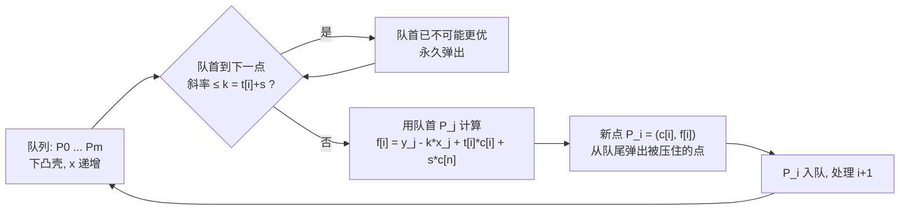

[[TOC]]

## 形式化题目

把序列 $T_1,\dots,T_N$ 划分成若干段连续的批次。批次的执行按顺序进行：机器从时刻 $0$ 开始，处理每批前先等待启动时间 $S$，批内任务依次执行 $T_i$，一批的所有任务在整批结束时同时完成。任务 $i$ 的费用为「所在批的完成时刻 $\times\, C_i$」，求总费用的最小值。

## 正解

### 思路

**第一步：朴素分批 DP。** 设 $f[i][j]$ 表示前 $i$ 个任务分成 $j$ 批的最小总费用。转移时枚举最后一批的开头 $k$，需要知道这批的完成时刻，也就是前面 $j-1$ 批的总耗时。这样状态 $O(n^2)$、转移 $O(n)$，对 $n=5000$ 太慢。更麻烦的是，费用依赖「完成时刻」这个绝对量，状态被迫把时间轴背在身上。

**第二步：费用提前计算，砍掉一维。** 关键观察：每开一批，启动时间 $S$ 会让**这一批以及之后所有任务**的完成时刻都延后 $S$。那么在「决定新开一批」的时刻，它对总费用的全部影响就已经确定：$S \times$（尚未完成的任务的 $C$ 之和）$ = s\cdot(c[n]-c[j])$，其中 $c$ 是 $C$ 的前缀和。于是批次数这一维毫无必要——未来的影响现在一次算清：

$$f[i] = \min_{0 \leqslant j < i}\ \{\, f[j] + t[i]\cdot(c[i]-c[j]) + s\cdot(c[n]-c[j]) \,\}$$

其中 $t[i]$ 是 $T$ 的前缀和，含义是：最后一批为 $j+1 \dots i$，这批内所有任务都在时刻 $t[i]$ 完成（贡献 $t[i]\cdot(c[i]-c[j])$），同时把启动时间 $S$ 对后段的影响提前记为 $s\cdot(c[n]-c[j])$。样例的最优分批如下：

| 批次 | 任务 | 批耗时（含 $S{=}1$） | 完成时刻 | 批内 $C$ 之和 | 费用 |
| --- | --- | --- | --- | --- | --- |
| 1 | 1, 2 | $1+1+3=5$ | 5 | $3+2=5$ | 25 |
| 2 | 3 | $1+4=5$ | 10 | 3 | 30 |
| 3 | 4, 5 | $1+2+1=4$ | 14 | $3+4=7$ | 98 |

合计 $25+30+98=153$，与样例一致。

**第三步：把转移看成几何问题。** 把与 $j$ 有关的项整理成「斜率 × 横坐标 + 截距」的形状。固定 $i$，令

$$k = t[i]+s,\qquad P_j = (x_j,\, y_j) = (c[j],\, f[j])，$$

则

$$f[i] = t[i]\cdot c[i] + s\cdot c[n] + \min_{0 \leqslant j < i}\ \{\, y_j - k\cdot x_j \,\}.$$

花括号里是**过点 $P_j$、斜率为 $k$ 的直线的截距**：min 取到时，$P_j$ 恰好落在这些点构成的上边缘被斜率为 $k$ 的直线撑到的位置。等价地说，只需对每个 $i$ 在二维点集上求「斜率 $k$ 方向的极值」。

**第四步：两个单调性 → 下凸壳 + 单调队列。**

- $c$ 非负，所以 $x_j = c[j]$ 随 $j$ 递增：新点只会从右侧插入，点集维持一个**下凸壳**即可（最小截距只会由凸壳上的点取到，凸壳内的点永远不优）。
- $t$ 非负，所以查询斜率 $k = t[i]+s$ 随 $i$ 递增：在凸壳上，若**队首到第二点的边斜率 $\leqslant k$**，则第二点的截距不会更大，队首永久淘汰。队首指针、队尾插入都只前进，每个点至多进出队一次。

于是每个 $i$ 均 $O(1)$ 摊还，总复杂度 $O(n)$。转移与查询的过程如下：

观察要点：队首判定是「斜率比较」而非「值比较」——一旦边斜率被 $k$ 超过，随着 $k$ 继续增大这条边永远不会再被选中，所以弹出是安全的；队尾判定保证队列中相邻两点连成的折线斜率严格递增，这正是下凸壳的形状条件。

### 代码

@include-code(./main.cpp, cpp)

@include-code(./main.py, python)

### 复杂度

- 时间 $O(n)$：每个点至多入队、出队各一次。
- 空间 $O(n)$：前缀和、$f$ 数组与凸壳队列。
- 费用上界约 $1.3\times 10^{14}$，超过 32 位整数范围（C++ 需 `long long`）；Python 整数天然无溢出。

## 总结

- **费用提前计算**是处理「开始时间影响后续所有贡献」类分批问题的通用手法：在决策点把对未来的影响一次算清，用后缀和（这里是 $c[n]-c[j]$）代替对未来的模拟，状态从二维降到一维。
- **斜率优化的识别信号**：一维 DP 转移形如 $f[i]=\min\{f[j]+与 i 有关项 \times 与 j 有关项 + \dots\}$，把 $j$ 相关部分拆成 $(x_j, y_j)$ 与查询斜率 $k_i$；再核对 $x_j$ 与 $k_i$ 是否都单调，若单调就用下凸壳 + 单调队列做到均摊 $O(1)$。
- 实现细节：队首/队尾判定全部用交叉乘避免除法；共线时（队首用 $\leqslant$、队尾用 $\geqslant$）保留更晚的点不影响正确性。
- 本题是「任务安排」系列的第一题：$N \leqslant 5000$ 时 $O(n^2)$ 也能过，但 $O(n)$ 的斜率优化写法是后续加强版（$N \leqslant 3\times10^5$，且 $T_i$、$C_i$ 可为负导致单调性被破坏）的必经之路。
