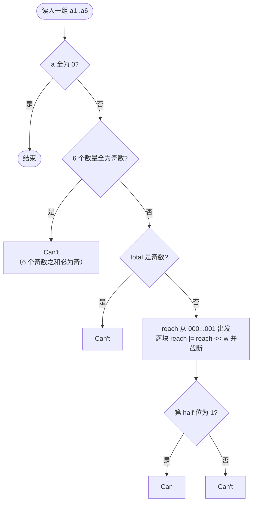

[[TOC]]

## 形式化题目

给定 6 个非负整数 $a_1, \dots, a_6$，表示价值分别为 $1 \dots 6$ 的大理石各有 $a_v$ 块（总块数 $\leqslant 20000$）。问能否把这些大理石分成两部分，使两部分价值总和相等。

形式化地，记总价值 $total = \sum_{v=1}^{6} (v+1)\, a_v$，等分可行当且仅当存在整数 $x_v \in [0, a_v]$，使得

$$
\sum_{v=1}^{6} (v+1)\, x_v = \frac{total}{2}.
$$

这是标准的多重背包**可行性**问题：物品价值为 $v+1$、数量上限为 $a_v$，问能否恰好装满容量 $total/2$。

以样例 `4 7 4 5 9 1` 为例：$total = 4\cdot1 + 7\cdot2 + 4\cdot3 + 5\cdot4 + 9\cdot5 + 1\cdot6 = 101$ 是奇数，直接输出 `Can't`；而 `9 8 1 7 2 4` 的 $total = 9 + 16 + 3 + 28 + 10 + 24 = 90$，可以取一半 $45$（例如 $4$ 块价值 $6$、$2$ 块价值 $5$、$2$ 块价值 $4$、$3$ 块价值 $1$，$24+10+8+3=45$），输出 `Can`。

## 正解

### 思路

**一句话本质**：把「能凑出哪些价值」的布尔集合看成一个二进制位集，每种大理石逐块做一次 `reach |= reach << w` 的位集转移，最后查询第 $total/2$ 位。

**朴素做法与瓶颈。** 最直接的想法是枚举每块大理石分给哪一边，方案数是 $2^{\sum a_v}$（$\sum a_v$ 可达 20000），完全不可行。退一步用 DP：设 $dp[s]$ 表示「能否恰好凑出价值 $s$」，对每种大理石**逐块**拆成 0-1 背包——每加入一块价值 $w$ 的大理石，就有 $dp[s] \mathrel{|}= dp[s-w]$（$s$ 从大到小扫）。转移总量是 $\sum a_v \leqslant 20000$ 次，每次要扫整个 $[0, total/2]$，共约 $20000 \times 60000 = 1.2 \times 10^9$ 次布尔操作，朴素循环太慢，C++ 里需要 `bitset`。

**第一步剪枝：奇偶性。** 只有 $total$ 为偶数才可能等分。特别地，当 6 个 $a_v$ **全为奇数**时，$total$ 是 6 个奇数之和，必为奇数，可以直接输出 `Can't`——这就是《算法竞赛进阶指南》里著名的奇偶剪枝，它只是奇偶判断的一条快捷路径，不改变算法主体。

**第二步：把 dp 数组换成位集。** 注意 $dp$ 本质上是一个 0/1 集合 $S = \{ s : dp[s] = 1 \}$。加入一块价值 $w$ 的大理石后，每个旧可达和 $s$ 变成「$s$ 与 $s+w$ 都可达」，即新集合

$$
S' = S \;\cup\; (S + w),
$$

用整数位集表示恰好是 `reach |= reach << w`（第 $s$ 位为 1 表示价值 $s$ 可达）。转移从「扫一遍数组」塌缩成**一条位运算语句**，一次字长 64 位的与/或/移位顶掉 64 次布尔操作。由于等分只需要 $\leqslant total/2$ 的可达信息、且可达集合单调增大（大理石只会越加越多），每步用 `(1 << (half+1)) - 1` 截掉高位即可。

Python 的大整数天然就是任意长位集，`reach` 始终不超过 $total/2+1 \leqslant 100001$ 位，位集语义零成本落地：

```mermaid
flowchart LR
    A[读入 a1..a6] --> B{6 个数量全为奇数?}
    B -- 是 --> X[输出 Can't]
    B -- 否 --> C{total 为奇数?}
    C -- 是 --> X
    C -- 否 --> D[reach = 1, 只有序 0 可达]
    D --> E[逐块: reach |= reach 左移 w<br/>再截断到 half+1 位]
    E --> F{第 half 位为 1?}
    F -- 是 --> G[输出 Can]
    F -- 否 --> X
```

**小规模演算**：以 `0 2 1 0 0 0`（2 块价值 2、1 块价值 3，$total = 7$ 为奇数，剪枝直接判负）换成 `0 2 2 0 0 0`（$total=8$，$half=4$）演示位集如何生长，行内十六进制是 `reach` 的二进制（高位在左、第 $s$ 位对应价值 $s$）：

| 加入的块 | 转移 | `reach`（二进制，最低位=价值 0） | 含义 |
| --- | --- | --- | --- |
| 初始 | — | `00000001` | 只有序 0 可达 |
| 第 1 块 $w=2$ | `reach \|= reach << 2` | `00000101` | 可达 $\{0, 2\}$ |
| 第 2 块 $w=2$ | `reach \|= reach << 2` | `00010101` | 可达 $\{0, 2, 4\}$ |
| 第 3 块 $w=3$ | `reach \|= reach << 3` | `10010101` → 截断 | 可达 $\{0, 2, 3, 4\}$（5 之后截掉） |

最后查询第 $half = 4$ 位为 1，输出 `Can`（一半取两块价值 2）。观察重点：每一行都恰好是 $S \mathrel{|}= S + w$ 的集合效果——第 2 行里旧的 $\{0,2\}$ 平移成 $\{2,4\}$，并入后得到 $\{0,2,4\}$，这正是 0-1 背包「取或不取」两分支的并集。

### 代码

@include-code(./main.cpp, cpp)

@include-code(./main.py, python)

实现要点：

- `odd_mask = sum((cnt & 1) << v ...)` 把 6 个数量的奇偶拼成 6 位掩码，`odd_mask == ALL_ODD` 一次比较就完成「全奇 → 总和为奇」的快捷剪枝；
- `half_reachable` 用 `divmod` 同时得到 `half` 和 `total` 的奇偶余数，奇数时连位集都不建；
- 内层 `reach |= reach << v + 1`（注意 Python 里 `<<` 优先级低于 `+`，等价于 `reach << (v+1)`）与紧随的截断是一条转移语句的两半。

### 复杂度

设 $total \leqslant 6 \times 20000 = 120000$，$\sum a_v \leqslant 20000$：

- **时间**：每组数据 $O\!\left(\sum a_v \cdot \dfrac{total}{64}\right)$ 次字操作（位集多重背包），约 $20000 \times 1875 \approx 3.75 \times 10^7$，与 C++ `bitset` 解法同阶；
- **空间**：$O(total)$ 位，位集不超过 $100001$ 位（约 13 KB）。

多组数据规模都很小（每组 6 个数），读入用一次性 `split` 分词即可。

## 总结

- 等分问题 = 多重背包**可行性**：奇偶剪枝先排除 $total$ 为奇数（6 个数量全奇是它的快捷特判）。
- 可行性 DP 的状态是 0/1 集合，天然对应位集：逐块 `reach |= reach << w` 一条语句完成一次转移，把朴素 $O(\sum a_v \cdot total)$ 的布尔操作除以字长 64。
- Python 大整数即任意长位集，让 `bitset` 优化不写任何建表代码；思想可直接平移回 C++ 的 `bitset<60001>`。

## 图示解析

下图把「读入 → 剪枝 → 位集 DP → 查询」的完整决策路线放在一起，`Can't` 的三条出口（全奇、总价值奇数、半价值不可达）一目了然：



对照正文的三条规则：前两条出口是纯奇偶判断、不碰 DP；只有走到 DP 那一格才发生 $O(\sum a_v \cdot total / 64)$ 的位集转移。这也解释了为什么剪枝虽然只是快捷路径，却在「全奇数」这类数据上把整组数据的开销降到近零。
