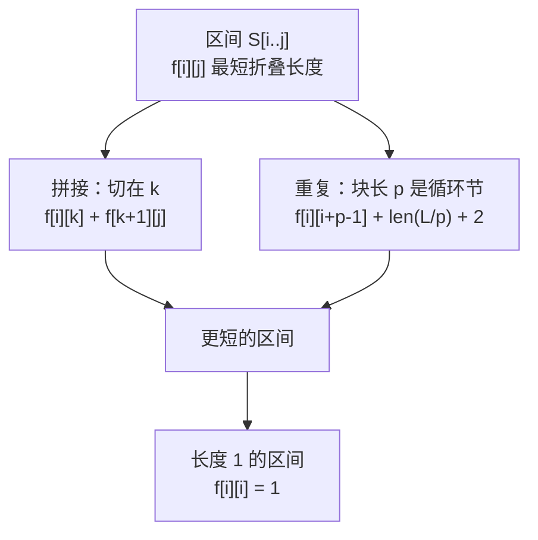

[[TOC]]

## 形式化题目

给定长度为 $n$ 的大写字母串 $S$。折叠序列按三条规则生成，同时给出展开方式：

1. 单个字符 `c` 是折叠序列，展开为 `c`；
2. 若 $S,Q$ 都是折叠序列，则 $SQ$ 是折叠序列，展开为二者展开结果的首尾相接；
3. 若 $S$ 是折叠序列、整数 $X>1$，则 `X(S)` 是折叠序列，展开为 $S$ 的展开结果重复 $X$ 次。

注意规则 3 里 $X$ 必须大于 $1$，`1(A)` 不是合法折叠串。

求展开结果恰为 $S$ 的折叠序列中，字符数最少的一个（答案不唯一时输出任意一个）。

样例输入 `AAAAAAAAAABABABCCD`（$n = 18$）的一个最优答案是 `9(A)3(AB)CCD`，长度 $12$，比原串短 $6$ 个字符。答案可能不唯一：串只含 10 个 `A` 时，`10(A)` 与 `A9(A)` 都是长度为 $5$ 的最优解。

## 正解

### 思路

#### 朴素做法与瓶颈

最直接的做法是按定义递归地构造折叠串：枚举把当前串切成两段的所有位置，再枚举所有可能的循环节长度，取展开后长度最小的那个。可行方案的数量随串长指数增长，$n = 100$ 时完全不可行。

瓶颈其实不在枚举的数量级上，而在**决策的层次**上：与其枚举折叠串，不如直接问“区间 $[i,j]$ 的最短折叠串有多长”。

#### 关键观察：语法树最外层只有两种可能

任何折叠序列都可以看成一棵语法树，内部结点只有两种：

- **拼接结点**：由规则 2 产生；
- **重复结点**：由规则 3 产生。

于是对于 $S[i..j]$ 的任意一个最优折叠串，它最外层必然是下面两种情形之一：

- **最外层是拼接**：存在断点 $k$，$[i,j]$ 被切成 $[i,k]$ 和 $[k+1,j]$ 两段，两段各自折叠，总长度等于两段长度之和。两段互不影响，所以各自取最短即可。
- **最外层是重复**：存在块长 $p$，$S[i..j]$ 正好是 $S[i..i+p-1]$ 原样重复 $L/p$ 次（$L = j-i+1$，$p \mid L$）。此时折叠串形如 `X(Q)`，其中 $X = L/p$，$Q$ 是**块自己的折叠串**。

这样就把“枚举折叠串”换成了“在区间上做决策”，而所有决策都只依赖更短的区间，可以按区间长度从小到大递推。

#### 状态与转移

设 $f_{i,j}$ 表示 $S[i..j]$ 折叠后的最少字符数。

$$
f_{i,i} = 1
$$

$$
f_{i,j} = \min\Bigl(
  \underbrace{\min_{i \leqslant k < j}\bigl(f_{i,k} + f_{k+1,j}\bigr)}_{\text{拼接}},
  \;
  \underbrace{\min_{\substack{p \mid L,\; p \leqslant L/2 \\ S[i..j-p] = S[i+p..j]}}\bigl(f_{i,i+p-1} + \lvert \mathrm{str}(L/p)\rvert + 2\bigr)}_{\text{重复}}
\Bigr)
$$

其中 $L = j-i+1$。重复候选里的三项分别是：块的折叠长度、重复次数的十进制位数、一对括号。

判定“$S[i..j]$ 以 $p$ 为循环节”只需要一次切片比较：$S[i..j-p] = S[i+p..j]$ 等价于对全部 $i \leqslant t \leqslant j-p$ 都有 $S[t] = S[t+p]$，这正好刻画了“长度 $p$ 的块原样重复整次”。

#### 两个容易写错的点

**第一，括号里要放块的最优折叠，而不是块本身。** 例如 `ABABABAB`：

- `2(ABAB)` 长 $8$，等于原文，没有收益；
- `2(2(AB))` 长 $7$，才是最优。

所以重复候选的块内代价必须写成 $f_{i,i+p-1}$。

**第二，折叠不一定更短，必须和拼接一起取最小值。** 规则 3 要求 $X > 1$，折叠本身要付出“括号 $+2$、重复次数位数”的代价：

- `ABCDEFGHIJKLMNOPQRSTUVWXYZ` 没有周期性，压根无法折叠；
- 10 个 `A` 折成 `10(A)` 长 $5$，与 `A9(A)`（$1 + 4$）打平；
- 11 个 `A` 时 `11(A)` 长 $5$，才严格优于 `A10(A)`。

因此循环节 $p$ 只取到 $L/2$（保证 $L/p \geqslant 2$），且重复候选与拼接候选取 $\min$，用“严格更小才替换决策”的写法在平手时保留拼接。

#### 用样例走一遍这张表

样例 $S = $ `AAAAAAAAAABABABCCD` 中几个关键区间的 $f$ 值、最优决策和对应的最优串如下（为了让读者能查表，这里列的是区间 $[i,j]$，不列完整的 $18 \times 18$ 表格）：

| 区间 $[i,j]$ | 子串 | $f_{i,j}$ | 最优决策 | 折叠串 |
| --- | --- | --- | --- | --- |
| $[0,0]$ | `A` | 1 | 单个字符 | `A` |
| $[0,8]$ | 9 个 `A` | 4 | 重复，$p=1$ | `9(A)` |
| $[0,9]$ | 10 个 `A` | 5 | 拼接，$k=0$：$1 + f_{1,9} = 1+4$ | `A9(A)` |
| $[9,14]$ | `ABABAB` | 5 | 重复，$p=2$ | `3(AB)` |
| $[15,17]$ | `CCD` | 3 | 拼接 | `CCD` |
| $[9,17]$ | `ABABABCCD` | 8 | 拼接，$k=14$：$5+3$ | `3(AB)CCD` |
| $[0,17]$ | 整个串 | **12** | 拼接，$k=8$：$4+8$ | `9(A)3(AB)CCD` |

读表时注意两点：$[0,9]$ 处 `10(A)` 与 `A9(A)` 长度打平，DP 保留了拼接决策，所以答案是 `A9(A)` 而不是 `10(A)`，两者都是合法最优解；$[9,14]$ 的 `ABABAB` 折成 `3(AB)` 而不是 `3(3(A...))` 之类，是因为它的循环节长度只能是 $2$ 或 $1$，$p=2$ 时块 `AB` 已经最短。

#### 还原答案串

只算出最短长度还不够，要输出具体串，所以 DP 时额外记录两个决策表：

- `cut[i][j]`：拼接决策的断点 $k$；
- `rep[i][j]`：重复决策的块长 $p$，$0$ 表示这一段不做整体折叠。

从 $[0,n-1]$ 递归展开：若 `rep[i][j] != 0`，输出 `L/p` 加括号，括号里递归展开块 $[i, i+p-1]$；否则按 `cut[i][j]` 把区间拆成两半分别展开，结果相接。两种情形都严格使用更短的区间，递归深度不超过 $n$。

### 代码

@include-code(./main.cpp, cpp)

@include-code(./main.py, python)

### 复杂度

- 时间复杂度：按长度枚举 $O(n^2)$ 个区间，每个区间枚举断点 $O(n)$，主项为 $O(n^3)$。周期判定只对整除 $L$ 的 $p$ 执行，即每个区间约 $d(L)$ 次（$d$ 为约数个数）$O(L)$ 的切片比较，总量为 $O\bigl(\sum_L (n-L+1)\,L\,d(L)\bigr) = O(n^3 d(n))$，$n \leqslant 100$ 时 $d(n) \leqslant 12$、$d(L)$ 的均值远小于它。整体与标准做法同阶，实测单组数据约 $0.02$ s。
- 空间复杂度：三张 $n \times n$ 的表（长度、拼接断点、折叠块长），即 $O(n^2)$。

## 总结

本题的核心是把“枚举折叠串”转成“枚举区间决策”。一旦意识到折叠串语法树的最外层只可能是拼接或重复，$S[i..j]$ 的答案就只依赖更短的区间，区间 DP 便自然成立。两个实现陷阱要记住：重复候选的块内代价必须是 $f_{i,i+p-1}$（嵌套折叠常常更优），以及折叠会付出括号和位数的代价，必须与拼接取 $\min$、并把决策记录下来才能输出具体方案。

## 图示解析

下面这张图概括 $f_{i,j}$ 的两条转移：它把“区间状态”与“拼接 / 重复”两类决策对应起来，也标出了递推的终点（长度 1 的区间）。



读图时关注两点：两条边对应折叠串语法树的两种内部结点；两条边都指向“更短的区间”，所以按长度递增递推不需要考虑循环依赖。

再下面用样例的决策树展示 `unfold` 的还原过程：每个结点标注区间、$f$ 值和它采用的决策，叶子是单个字符。

```text
[0,17] f=12   拼接，断点 k=8
├── [0,8]  f=4   重复 p=1            → 9(A)
└── [9,17] f=8   拼接，断点 k=14
    ├── [9,14] f=5   重复 p=2        → 3(AB)
    └── [15,17] f=3  拼接            → CCD
```

把这棵树的叶子从左到右读出来，就得到 `9(A)3(AB)CCD`，正好是样例输出。这也说明了为什么必须保存决策表：长度相同的拼接与重复（例如 `[0,9]` 的 `10(A)` 与 `A9(A)`）只有靠决策才能还原出确定的串。
