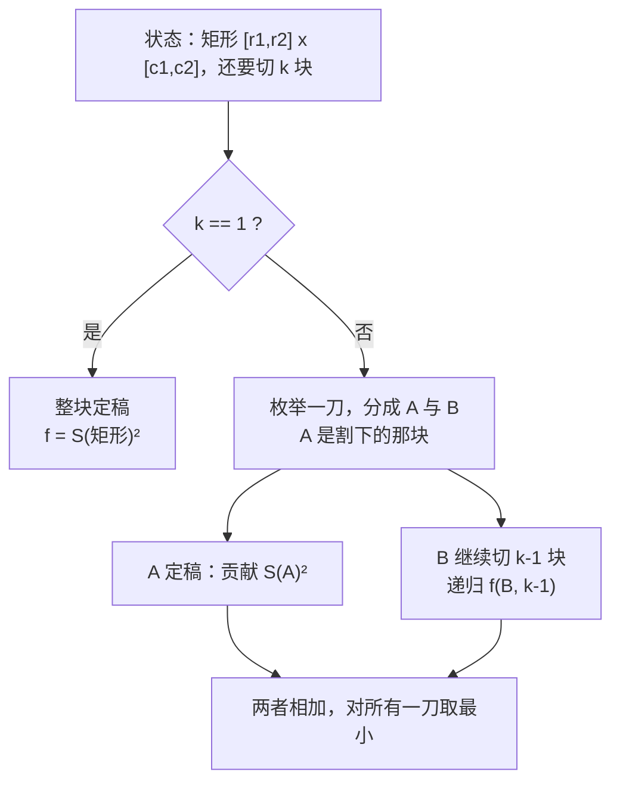

[[TOC]]

## 形式化题目

给定一个 $8 \times 8$ 的矩阵 $a$，把棋盘切成 $n$ 块矩形。切法只有一种形式：每一刀沿着格子边把**当前这块矩形**切成两块，其中一块就此定稿、不再参与后续切割，另一块继续切；共切 $n-1$ 刀。

设第 $i$ 块矩形的分值总和为 $x_i$，$\bar{x} = \frac{1}{n}\sum_{i=1}^{n}x_i$，求

$$
\sigma_{\min} = \sqrt{\frac{1}{n}\sum_{i=1}^{n}\left(x_i - \bar{x}\right)^{2}}
$$

的值，四舍五入到小数点后三位。

注意“割下一块、剩下的继续切”与“每次把矩形分成两块、两块都继续切”不是同一个问题：第一种读法每刀只有一侧存活，可行切法更少，最优值只会更大。两种模型在同一组棋盘上给出的答案差别很大，后面会用一个反例具体说明。

以样例（$n = 3$，棋盘总分 $T = 66$，平均值 $\bar{x} = 22$）为例，最优切法先割下第 5~7 行（记为 A，$x_A = 24$），再把剩下的 $5 \times 8$ 矩形竖着切成左右两半（记为 B、C，$x_B = 20$、$x_C = 22$）。下表把 64 个格子按块标出：

| 行／列 | 0 | 1 | 2 | 3 | 4 | 5 | 6 | 7 |
| --- | --- | --- | --- | --- | --- | --- | --- | --- |
| 0 | B | B | B | B | C | C | C | C |
| 1 | B | B | B | B | C | C | C | C |
| 2 | B | B | B | B | C | C | C | C |
| 3 | B | B | B | B | C | C | C | C |
| 4 | B | B | B | B | C | C | C | C |
| 5 | A | A | A | A | A | A | A | A |
| 6 | A | A | A | A | A | A | A | A |
| 7 | A | A | A | A | A | A | A | A |

三块分值 $20 + 22 + 24 = 66$ 与总分吻合；$\sqrt{\frac{20^2+22^2+24^2}{3} - 22^2} = \sqrt{\frac{1460}{3} - 484} \approx 1.633$，正是样例输出。读表时注意两件事：每块都是矩形而不是任意形状；三块分值 $20,22,24$ 已经非常接近平均值 $22$，这正是最小化均方差要达到的效果。

## 正解

### 思路

#### 朴素做法与瓶颈

最直接的做法是搜索所有切割顺序：每一步在当前矩形上选一条切线和方向，割下的块记入答案，剩下的矩形继续切，直到凑满 $n$ 块。第一刀有 $2\times(7+7)=28$ 种选择，之后每一刀仍有十几到二十几种，搜索树在 $n=14$ 时完全不可行。

真正的瓶颈不在枚举量，而在**没有合并重复子问题**。观察搜索过程：每一步只改变两件事——当前的剩余矩形、还要切出几块；被割下的块此后只贡献一个固定的 $S^2$，不再影响后续。也就是说，同一组“剩余矩形 + 剩余块数”会在大量不同的搜索路径上被反复求解。把它记下来就是 DP。

题面里“剩下的部分也是矩形”这句话正是这个状态成立的原因：剩余部分总能被四个整数 $r_1,c_1,r_2,c_2$ 描述。

#### 第一步：化简目标函数

$$
\sigma^{2} = \frac{1}{n}\sum_{i=1}^{n}\left(x_i - \bar{x}\right)^{2}
= \frac{1}{n}\sum_{i=1}^{n}x_i^{2} - \bar{x}^{2}.
$$

棋盘总分 $T = \sum x_i$ 和块数 $n$ 都是常数，$\bar{x} = T/n$ 也固定，所以**最小化 $\sigma$ 等价于最小化整数 $\sum x_i^2$**。这样 DP 全程只做整数加法与比较，浮点只在最后开一次根。

#### 第二步：状态与转移

设 $f(r_1,c_1,r_2,c_2,k)$ 表示：把矩形 $[r_1,r_2]\times[c_1,c_2]$ 切成 $k$ 块时，$\sum x_i^2$ 的最小值。用 $S(\cdot)$ 表示矩形分值之和（二维前缀和 $O(1)$ 求出），则

$$
f(\cdot,1) = S(r_1,c_1,r_2,c_2)^2,
$$

$$
f(\cdot,k) = \min_{\text{一刀}(A,B)}\Bigl(S(A)^2 + f(B,k-1)\Bigr),\qquad k \geqslant 2 .
$$

其中 $(A,B)$ 遍历所有“割下 $A$、剩下 $B$”的一刀。这一刀有四类：割走上半、割走下半、割走左半、割走右半；代码把它们写成四个生成器，用 `itertools.chain` 接起来，于是转移体里只剩一种写法。

之所以只对 $B$ 继续递归，就是前面强调的“每刀只有一侧存活”。若把转移写成两侧都要继续切的通用形式

$$
f(\cdot,k) = \min_{k_1 + k_2 = k}\bigl(f(A,k_1) + f(B,k_2)\bigr),
$$

可行切法会变多、答案会偏小：真实数据 chess2 用这个形式会得到 $0.000$，而正确答案是 $2.449$；chess5 会得到 $15.937$，正确答案是 $75.263$。

#### 用样例看状态表

下表的每一行是一个子问题，列出矩形和 $S$、最优值 $f$ 以及首刀决策，数值来自样例的完整 DP。第一行 $f = 66^2 = 4356$ 就是 $k=1$ 的边界条件：整块不切时分值平方和就是它自己的平方：

| 状态 $(r_1,c_1,r_2,c_2,k)$ | 矩形 | $S$ | $f$ | 首刀决策 |
| --- | --- | --- | --- | --- |
| $(0,0,7,7,1)$ | 整盘 | 66 | 4356 | 不切 |
| $(0,0,7,7,2)$ | 整盘 | 66 | 2180 | 割下第 0~3 行，保留第 4~7 行 |
| $(0,0,7,7,3)$ | 整盘 | 66 | **1460** | 割下第 5~7 行，保留第 0~4 行 |
| $(5,0,7,7,1)$ | 下 3 行 | 24 | 576 | 不切 |
| $(0,0,4,7,2)$ | 上 5 行 | 42 | 884 | 割下左 4 列，保留右 4 列 |
| $(0,0,4,3,1)$ | 左上 $5\times4$ | 20 | 400 | 不切 |
| $(0,4,4,7,1)$ | 右上 $5\times4$ | 22 | 484 | 不切 |

校验最后一步：$f(0,0,7,7,3) = 24^2 + f(0,0,4,7,2) = 576 + 884 = 1460$。注意 $f$ 只随 $k$ 增大而减小（$4356 \to 2180 \to 1460$），因为切得越细，各块越接近平均值。

#### 为什么不用递推而用记忆化

按 $k$ 从小到大、子矩形从小到大递推当然也可以，但“子矩形的包含关系”和“$k$ 的递减关系”要手工排序，还要为每个 $k$ 开一张 $1296$ 大小的表。本题的状态空间只有约 $1.8\times10^{4}$，直接用 `functools.cache` 记忆化，让递归自己决定访问顺序，代码短得多，代价只是常数级的时间开销。

### 代码

@include-code(./main.py, python)

### 复杂度

- 时间复杂度：状态数为子矩形个数 $\binom{9}{2}^{2} = 1296$ 乘以剩余块数 $k \leqslant 14$，约 $1.8\times10^{4}$；每个状态枚举一刀，水平线 $r_2-r_1$ 条、竖直线 $c_2-c_1$ 条、各带两个方向，候选数不超过 $28$。转移总量的上界约 $1.8\times10^{4} \times 28 \approx 5\times10^{5}$，实测最慢一组（$n = 14$）只访问了 9296 个状态、0.044 s。
- 空间复杂度：记忆化缓存 $O\bigl(36^2 \cdot n\bigr) = O(10^4)$ 个整数，加上 $9\times 9$ 的前缀和；实测峰值内存 16.6 MB。

## 总结

本题有两步是绕不开的。第一步是把均方差化简掉：总分和块数固定，均方差只通过 $\sum x_i^2$ 依赖切法，于是连续优化变成整数最优化。第二步是选对状态：题面“割下一块、剩下的继续切”保证剩余待切部分永远是矩形，用「剩余矩形 + 还要切几块」两个信息就足以描述子问题，被割下的块只留下 $S^2$ 这一个常数贡献。剩下的就是枚举一刀并记忆化。

最容易出错的是把题意读成“每次分成两块、两块都继续切”，那会让答案系统性偏小；真实数据里 chess2 与 chess5 都能立刻暴露这个错误。

## 图示解析

下面用样例的决策链展示 $f(\text{整盘},3)$ 是怎样一步步拆开的。标着 $f$ 的结点是“还剩一块要切”的状态，标注矩形和 $S$ 与当前 $f$ 值；缩进在它上面的那一行是“这一刀割下的矩形”，它只贡献一个 $S^2$，不再往下分叉。

```text
f(整盘 8x8, 3)          S=66  f=1460
├─ 割下第 5~7 行          S=24 → 24² = 576
└─ f(第 0~4 行 5x8, 2)   S=42  f=884
   ├─ 割下左 4 列         S=20 → 20² = 400
   └─ f(右 4 列, 1)       S=22  f=484
```

读图时关注三点：每层的 $k$ 恰好减一；每一刀都只“割下一块、保留一块”，所以每层只有一条线继续往下画；把最底下三个数值加起来，$576 + 400 + 484 = 1460$ 正是 $f(\text{整盘},3)$，也就是样例答案里开方前的 $\sum x_i^2$。这条链就是 DP 从根状态一路递归下去时真正走的路径。

再下面这张图概括转移的一般形态：一个状态只在两种情况下终止或分叉。



图里两条分叉对应题面里“割下一块”和“剩下部分继续分割”这两件事；注意从 $D$ 出发只有 $B$ 一条边会回到状态结点，这正是本题与通用 guillotine 切分的分水岭。
