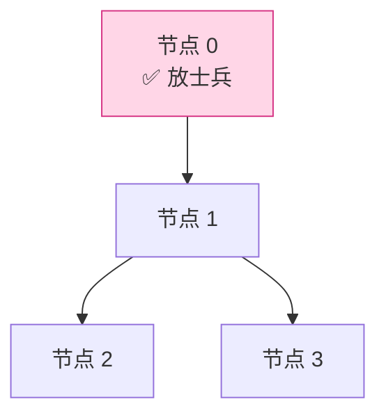
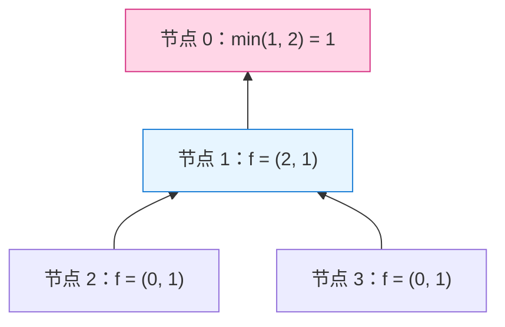

[[TOC]]

## 形式化题目

给定一棵 $n$ 个节点的树（输入按"每个节点的子节点列表"给出，第一行描述的节点是树根）。要在一些节点上放置士兵，一个节点上的士兵可以观察到所有与该点相连的边。要求每条边都至少被某一端的士兵观察到，求最少需要放置的士兵数。

## 正解

### 思路

**朴素做法为什么不行。** 每个节点只有"放 / 不放"两种选择，若直接枚举所有 $2^n$ 种放法再逐一检查每条边是否被覆盖，复杂度是 $O(2^n \cdot n)$，$n = 1500$ 时完全不可行。而且这也不是普通的"选点"问题：贪心地每次选度数最大的节点并不能保证最优（可以在小反例上验证），所以需要一个能利用树结构的算法。

**利用树的结构做 DP。** 树的关键性质是：以根为界，整棵树可以分解成一棵棵互不相交的子树，一条边 $(u, c)$ 完全落在 $u$ 的子树内。于是可以定义"以 $u$ 为根的子树"这一子问题，且每个节点只需两个状态：

- $f[u][0]$：$u$ **不放**士兵时，$u$ 的子树内所有边被覆盖的最少士兵数；
- $f[u][1]$：$u$ **放**士兵时，$u$ 的子树内所有边被覆盖的最少士兵数（先计入 $u$ 自己的 $1$ 个）。

叶子节点没有子边，所以 $f[\text{叶}][0] = 0$，$f[\text{叶}][1] = 1$。对内部节点 $u$ 和它的每个儿子 $c$，边 $(u, c)$ 的覆盖要求只由 $u$ 和 $c$ 的选择共同决定：

- 若 $u$ 不放（状态 $0$），边 $(u,c)$ 只能靠 $c$ 覆盖，$c$ 必须放：$f[u][0] = \sum_{c} f[c][1]$；
- 若 $u$ 放（状态 $1$），这条边已经被 $u$ 覆盖，$c$ 放不放都行，取较小者：$f[u][1] = 1 + \sum_{c} \min(f[c][0],\, f[c][1])$。

儿子之间的选择互相独立（每条父子边只涉及这两个节点），所以直接对儿子求和即可。答案为 $\min(f[\text{根}][0], f[\text{根}][1])$。计算顺序上，$f[u]$ 依赖所有儿子的 $f$ 值，因此按**从叶子到根**的顺序递推；实现时先求一遍从根出发的 BFS 序，再**逆序**遍历该序列，就能保证算 $u$ 时它所有的儿子都已算完——这样把递归改成了迭代，避免 $n = 1500$ 的链状树把 Python 递归栈打爆。

以样例 1（$n = 4$，边 $0\text{--}1$、$1\text{--}2$、$1\text{--}3$，根为 0）为例，这棵树与最终选择如下：

节点 0 上的一个士兵同时观察到 $0\text{--}1$ 这条边，而 $1\text{--}2$、$1\text{--}3$ 由节点 1 观察即可——注意节点 1 自己不放，它放不放都会被节点 0 兜底，两种取法代价相同。对应到 DP 值：

| 节点 | $f[u][0]$（不放） | $f[u][1]$（放） | 计算依据 |
| --- | --- | --- | --- |
| 2（叶） | $0$ | $1$ | 叶子初始化 |
| 3（叶） | $0$ | $1$ | 叶子初始化 |
| 1 | $f[2][1] + f[3][1] = 2$ | $1 + \min(0,1) + \min(0,1) = 1$ | 不放则两个儿子必须放；放则儿子随意 |
| 0（根） | $f[1][1] = 1$ | $1 + \min(2, 1) = 2$ | 同上 |

根节点取 $\min(1, 2) = 1$，与样例答案一致。第二组样例（根为 3，边 $3\text{--}1$、$3\text{--}4$、$3\text{--}2$、$1\text{--}0$）同样可以手算出 $\min(f[3][0], f[3][1]) = 2$：在节点 3 和节点 1 各放一个士兵。

### 代码

@include-code(./main.cpp, cpp)

@include-code(./main.py, python)

代码里有两个值得注意的实现细节：

- 输入的节点行是 `0:(2)	1	2` 这种格式，第一个 token 形如 `0:(2)`，同时携带节点编号和子节点数，用 `head[:-1].split(b':(')` 一次拆出，再逐个读入子节点。
- `order` 列表既当队列又当结果：遍历它的同时往尾部追加新节点，得到 BFS 序；随后 `reversed(order)` 自底向上递推，整个过程只有 $O(n)$ 次循环。

### 复杂度

- 时间复杂度：$O(n)$。每个节点在 BFS 序中恰好出现一次，递推时每条父子边被合并一次；多组数据之间各自独立，总和不超过数据规模上限。
- 空间复杂度：$O(n)$。`children` 邻接表、BFS 序与两个 DP 数组都是线性大小。

同样的算法在 C++ 中的落地方式几乎一样：链式前向星存树、数组代替 `children`、手写队列求 BFS 序后逆序递推，没有任何 Python 特有的瓶颈，$n \le 1500$ 时两种语言都能轻松通过。

## 总结

- 本题是**树的最小点覆盖**的经典模型："每条边至少一端被选中"。
- 树形 DP 的固定套路：状态定义在"以 $u$ 为根的子树"上，且把"$u$ 自己的选择"并入状态（$f[u][0/1]$），转移时父子边的要求由这两个状态天然表达。
- 实现上用 BFS 序 + 逆序遍历代替递归，既得到自底向上的计算顺序，又避免深链在 Python 下爆递归栈。
- 与之孪生的问题是**树的最大独立集**（每条边至多一端被选中）和**树的最大匹配**，状态设计完全相同，只是转移的约束方向相反，可以对比练习。

## 图示解析

### 状态转移的方向

把样例 1 的 DP 递推画成自底向上的数据流，可以看清"儿子的两个状态如何汇入父亲"：

自下而上看：叶子给出初始值；节点 1 汇总两个儿子——"不放"状态被迫接收两个儿子的"放"值之和 $0+1+1=2$，"放"状态只需 $1$ 加上两个儿子的较小值 $0+0=0$，合计 $1$；根节点 0 最后在"自己不放（拿 $f[1][1]=1$）"与"自己放（$1+\min(2,1)=2$）"之间取最小。观察重点是：**每个节点的答案只依赖直接儿子，跨子树的信息完全不需要流动**，这正是 $O(n)$ 复杂度的来源；而 $f[u][0]$ 与 $f[u][1]$ 同时保留，正是为了给父亲留出"放 / 不放"两种选择的余地。
