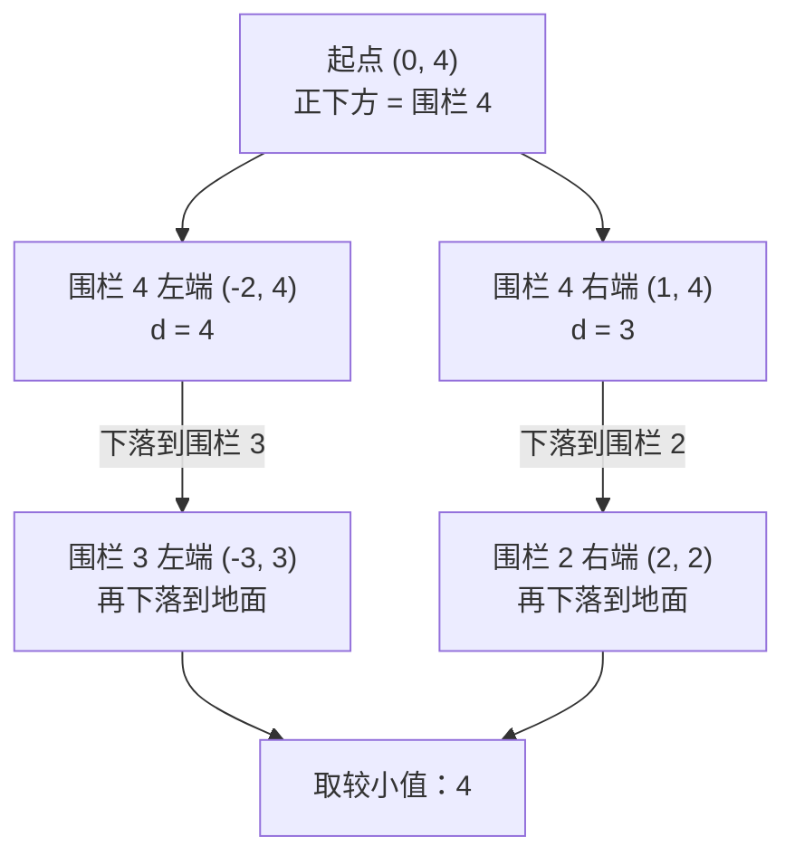

[[TOC]]

## 形式化题目

平面上有 $N$ 条水平线段（围栏），第 $i$ 条位于直线 $y = i$ 上，横跨闭区间 $[A_i, B_i]$。出口是原点 $(0, 0)$，起点是 $(S, N)$，且保证 $A_N \leqslant S \leqslant B_N$。

一个点从起点出发，反复执行：

1. 沿竖直方向下落，横坐标不变；
2. 一旦落在某条围栏上，就沿这条围栏水平移动到它的左端点或右端点；
3. 从端点继续下落，直到落在 $y = 0$ 的地面上，再沿地面走到原点。

竖直方向的距离不计。求水平方向走过的总距离的最小值。

## 正解

### 思路

**第一步：竖直下落不花钱，状态只需要记录"站在哪条围栏的哪个端点上"。**

奶牛在空中时不能横向移动，所以"在空中"这个瞬态没有选择余地，不必作为状态。真正要做决策的时刻，是它落到一条围栏之后的下一步：向左端走还是向右端走。而一条围栏 $[A_i, B_i]$ 上任意一点 $p$ 的后续选择也只有这两个，代价分别是

$$
|p - A_i| + d_i[0], \qquad |p - B_i| + d_i[1]
$$

其中 $d_i[0], d_i[1]$ 表示第 $i$ 条围栏**左右端点到地面**的最少水平距离。于是状态总数只有 $2N + 2$ 个：每条围栏两个端点，再加地面上两个端点（都取原点，$d_0[0] = d_0[1] = 0$）。

**第二步：写清转移，找出真正的瓶颈。**

设 $g(x, i)$ 为"在横坐标 $x$、第 $i$ 层开始下落时，最先接住奶牛的围栏编号"，也就是满足 $j < i$、$A_j \leqslant x \leqslant B_j$ 的最大 $j$；不存在时记 $g(x, i) = 0$（地面）。于是

$$
d_i[0] = \min\bigl(|A_{f} - A_i| + d_{f}[0],\ |B_{f} - A_i| + d_{f}[1]\bigr), \qquad f = g(A_i, i)
$$

$d_i[1]$ 把 $A_i$ 换成 $B_i$ 即可；最后答案把 $x$ 换成 $S$、令 $i = N + 1$，用同一个式子求出。

因为 $f < i$ 恒成立，按 $i = 1, 2, \ldots, N$ 自底向上递推就不会有后效性。

**第三步：瓶颈是查询 $g$。**

状态数已经被压到 $O(N)$，剩下的唯一开销是求 $g(x, i)$。朴素做法从第 $i - 1$ 层往下逐条判断区间是否包含 $x$，单次 $O(N)$，总复杂度 $O(N^2)$；$N = 30000$ 时约 $9 \times 10^8$ 次判断，超时。

注意 $g$ 有一个很强的单调性质：**处理顺序就是层号从小到大，而"层号越大的围栏越晚出现"**。如果把每条围栏的区间 $[A_i, B_i]$ 依次"刷"到横坐标轴上，那么后刷的一定盖住先刷的，正下方最近的围栏就是 $x$ 处**最后被刷上的颜色**。

这正是"区间赋值 + 单点查询"，用线段树可以做到 $O(\log C)$，其中 $C = 200001$ 是横坐标的值域大小。

区间只有 $N$ 个、值域也只有 $2 \times 10^5$，坐标整体加 $100001$ 平移到 $[1, 200001]$ 后，叶子可以直接用横坐标的值当下标，不需要离散化。

**第四步：线段树上不写 pushdown。**

本题的赋值是"整段覆盖"，而且赋值顺序就是层号递增，因此可以只在 $O(\log C)$ 个"整段命中"的节点上记下 `(层号, 颜色)`，查询时沿根到叶的路径取**层号最大**的那个标记：

- 修改：把 $[A_i, B_i]$ 拆成 $O(\log C)$ 个整段节点，写入 `(i, i)`；
- 查询 $x$：从叶子走到根，取时间戳最大的节点；都没有则返回地面 $0$。

父节点的标记时间一定不晚于子节点，所以"路径上时间戳最大者"就是最后一次覆盖。省掉 pushdown 后既不用递归，常数也小。

**第五步：实现顺序不能颠倒。**

对第 $i$ 层要**先查询两端点、再覆盖本层区间**。若先覆盖，端点会查到自己，$f = i$ 会让递推自我循环。

下面的表格用题面样例（$N = 4$，$S = 0$）复算了整个递推过程。列的含义依次是：层号、该层围栏区间、左右端点正下方的围栏编号（$0$ 表示地面）、以及该端点下落到地面的最少水平距离。

| 层号 | 区间 | 左端点下方 | $d[左]$ | 右端点下方 | $d[右]$ |
| --- | --- | --- | --- | --- | --- |
| 1 | $[-2, 1]$ | 0 | 2 | 0 | 1 |
| 2 | $[-1, 2]$ | 1 | 3 | 0 | 2 |
| 3 | $[-3, 0]$ | 0 | 3 | 2 | 4 |
| 4 | $[-2, 1]$ | 3 | 4 | 2 | 3 |

读者应重点观察第 3、4 行：第 4 层的左端点 $(-2)$ 正下方不是"包含它的最低围栏"第 1 层，而是**层号最大的那一条**第 3 层；先落到第 3 层再换乘，才得到 4 这个最小值。起点 $S = 0$ 正下方是第 4 层，答案为 $\min(0 + 4,\ 1 + 3) = 4$。

下面这张图展示样例中"落到哪条围栏 → 走到哪个端点"的两条候选路线，以及为什么最终答案是 4。

两条路线分别对应 DP 表格里第 4 行的两个候选值 $4$ 和 $3$，加上起点到两个端点的水平距离 $2$ 与 $1$，得到 $6$ 与 $4$，取 $\min$ 即为答案。

### 代码

代码就是上面五步的直译：`query` 是 $g$，`assign` 是"把本层刷上去"，`ground_cost` 是那个 $\min$ 式子，`endpoint_costs` 按 $i = 1 \ldots N$ 递推出一张 $d_i[0], d_i[1]$ 表，`fences[0]` 是当作地面用的虚拟围栏。

@include-code(./main.py, python)

### 复杂度

- **时间复杂度**：每条围栏做 2 次单点查询和 1 次区间赋值，最后再做 1 次查询，每次 $O(\log C)$；读入 $O(N)$。总时间复杂度 $O(N \log C)$，其中 $C = 200001$。$N = 30000$ 时约 $1.6 \times 10^6$ 次基本操作，实测单测例约 $0.13$ 秒。
- **空间复杂度**：线段树的两个标记数组（`STAMP`、`WHO`）各 $2 \times \texttt{SIZE} = 2^{19}$ 项，加上围栏端点数组和 DP 数组各 $O(N)$，总空间 $O(C + N)$，实测峰值约 34 MB，低于 128 MB 限制。

## 总结

本题的难点不在 DP 方程本身，而在"谁挡住了下落路径"这个几何查询。把状态从"围栏上的任意点"压缩到"两个端点"之后，递推式就只剩下 $O(N)$ 个状态，瓶颈集中在 $O(N)$ 次"求正下方最近的围栏"。这个查询恰好可以看成在一维坐标轴上依次刷颜色，于是用支持区间赋值、单点查询的线段树把每次查询降到 $O(\log C)$。因为赋值顺序与层号顺序一致，线段树不必下传懒标记，沿根到叶取时间戳最大的标记即可。
