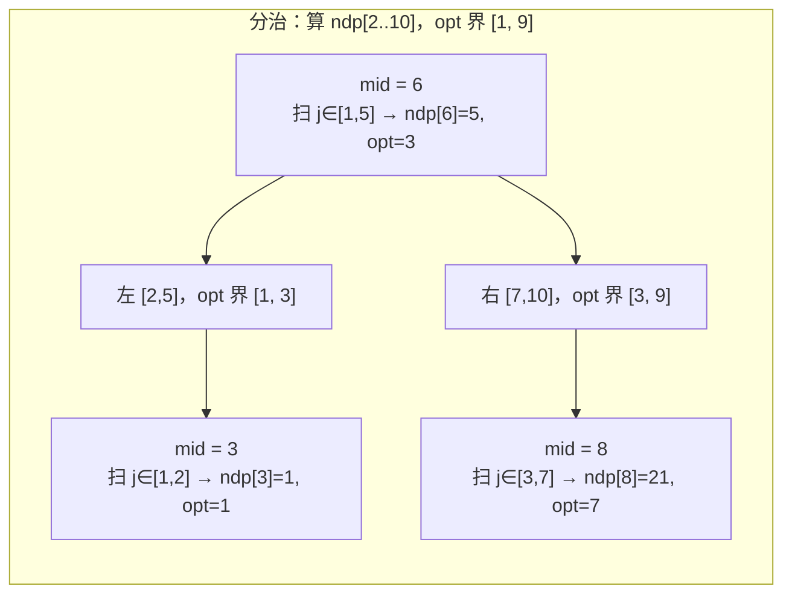
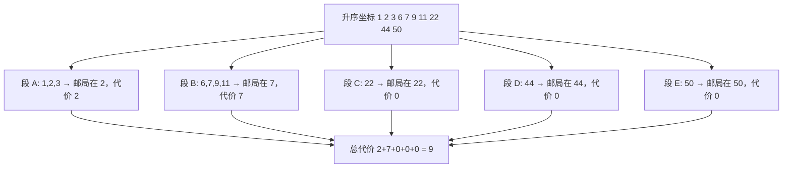

[[TOC]]

## 形式化题目

一条直线上有 $N$ 个互不相同的正整数坐标 $x_1, x_2, \dots, x_N$。选出其中恰好 $P$ 个位置建邮局（邮局只能建在村庄上，集合记为 $S$，$|S| = P$），使

$$
\sum_{i=1}^{N} \min_{j \in S} |x_i - x_j|
$$

最小，输出这个最小值。坐标互不相同，$1 \leqslant N \leqslant 300$，$1 \leqslant P \leqslant 30$。

注意"建在其中的 $P$ 个村庄上"限定了邮局位置只能取自给定坐标集合，因此这是一个**选择问题**，不是连续选址。

## 正解

### 思路

**第一步：排序，并说明可以只考虑"连续的一段"。**

邮局只关心坐标之间的相对顺序，先把村庄按坐标升序排成 $x_1 < x_2 < \dots < x_N$。

设某两个相邻村庄 $x_a < x_b$ 分别由邮局 $u$、$v$ 服务。把分界线左右挪一格，两侧的距离和一增一减，一维情形下不会让答案变大。反复交换后总能得到一个**最优解，使每个邮局负责的村庄恰好是一段连续下标区间**。于是问题变成：

> 把前缀 $[1, N]$ 切成 $P$ 段（每段非空、段内连续），使各段的"单邮局代价"之和最小。

**第二步：写成 DP。**

设 $dp[k][i]$ 表示把前 $i$ 个村庄交给 $k$ 个邮局的最小代价，则

$$
dp[k][i] = \min_{k-1 \leqslant j < i} \bigl( dp[k-1][j] + w(j,\ i-1) \bigr)
$$

这里 $w(l, r)$ 表示"把连续一段村庄 $l..r$（下标 0 起）全部交给**一个**邮局"的最小距离和。边界 $dp[0][0] = 0$，其余 $dp[0][i>0] = \infty$（0 个邮局服务不了任何村庄）。答案是 $dp[P][N]$。

**第三步：$w(l, r)$ 用中位数 $O(1)$ 算。**

这一段只有一个邮局，建在**中位数**村庄上最优。把邮局从位置 $c$ 挪到 $c+1$：左侧所有村庄的距离各 $+1$，右侧各 $-1$。只要右侧村庄个数不少于左侧，距离和就不会变大，平衡点正是中位数。设 $m = \lfloor (l+r)/2 \rfloor$，用前缀和 $pre[i] = x_1 + \dots + x_i$ 得

$$
w(l, r) = \underbrace{x_m (m - l + 1) - (pre[m+1] - pre[l])}_{\text{左侧}} + \underbrace{(pre[r+1] - pre[m+1]) - x_m (r - m)}_{\text{右侧}}
$$

样例里 $P = 1$ 时全部 10 个村庄共用一个邮局，$w(0, 9) = 117$；而 $P = 5$ 时答案是 $9$，说明分段带来的收益非常大。

**第四步：找出真正的瓶颈。**

朴素做法对每个 $i$ 都把 $j$ 从头扫一遍，复杂度 $O(PN^2)$。$N = 300, P = 30$ 时约 $1.35 \times 10^6$ 次转移，虽然能过，但完全没用上转移的结构。观察 $w$ 的性质：

> $w(l, r)$ 满足**四边形不等式** $w(a,c) + w(b,d) \leqslant w(a,d) + w(b,c)\quad (a \leqslant b \leqslant c \leqslant d)$。

这条不等式正是"交叉优于包含"的代数表达——两段交叉分配比一大一小包含分配更省。它的标准推论是**决策单调性**：

$$
opt_k(i) \leqslant opt_k(i+1)
$$

即"前 $i$ 个村庄的最优分割点"随 $i$ **单调不减**。下表用题面样例（$N = 10$）实际算出的 $dp$ 与 $opt$ 验证了这一点（可以拿 `problem-analysis-workspace/viz_render.py` 复现）：

| 层 | $i=3$ | $i=4$ | $i=5$ | $i=6$ | $i=7$ | $i=8$ | $i=9$ | $i=10$ |
| --- | --- | --- | --- | --- | --- | --- | --- | --- |
| $k=2$：$dp$ | 0 | 2 | 3 | 5 | 9 | 21 | 37 | 43 |
| $k=2$：$opt$ | 1 | 3 | 3 | 3 | 3 | 7 | 8 | 8 |
| $k=3$：$dp$ | 0 | 1 | 2 | 3 | 5 | 9 | 21 | 27 |
| $k=3$：$opt$ | 2 | 3 | 3 | 5 | 5 | 7 | 8 | 8 |

每一行的 $opt$ 都从左到右**不减**（$k=2$ 行是 $1,3,3,3,3,7,8,8$；$k=3$ 行是 $2,3,3,5,5,7,8,8$）。这就是可以直接拿来分治的依据。

**第五步：用分治把每层降到 $O(N \log N)$。**

有了决策单调性，算一层 $k$ 时可以这样递归（记 `fill(lo, hi, opt_lo, opt_hi)` 表示"$ndp[lo..hi]$ 的最优分割点都落在 $[opt\_lo, opt\_hi]$"）：

1. 取中点 $mid = \lfloor (lo+hi)/2 \rfloor$；
2. 只在 $j \in [opt\_lo,\ \min(mid-1, opt\_hi)]$ 里扫一遍，求出 $ndp[mid]$ 与 $opt_k(mid)$；
3. 左半边 $[lo, mid-1]$ 的分割点一定 $\leqslant opt_k(mid)$，右半边一定 $\geqslant opt_k(mid)$，各自带新界递归。

第 2 步里的 `min(mid-1, opt_hi)` 上界不能省：它同时保证 $j < mid$（段非空）和 $j$ 落在已知范围内。每一层的总扫描量是 $O(N \log N)$，$P$ 层合计 $O(PN\log N)$。

下面这张图画出样例中 $k=2, i=4$ 这一格的计算过程，帮助建立"枚举分割点"的直观印象。



关键在于每个 $mid$ 只扫一个**被上下界夹住的小窗口**，而不是整段前缀：算 `ndp[3]` 时只需看 $j \in \{1,2\}$，算 `ndp[8]` 时虽然窗口较大，但它已经把右半边的 $opt$ 界收窄到 $[7, 9]$，后面两个位置的枚举量随之骤降。整层的扫描总量因此是 $O(N\log N)$ 而非 $O(N^2)$。

最后还要处理一个边界：若 $P \geqslant N$，每个村庄都能建一个邮局，答案是 $0$，直接短路返回（也让下面的逐层递推不必考虑"段数超过村庄数"）。

### 代码

`segment_cost` 是上面第三步的中位数公式（即 $w(l,r)$）；`layer` 负责一整层 $k$ 的转移；内层 `fill` 就是第五步的分治，靠 `opt_lo / opt_hi` 两个界把每层的扫描量压到 $O(N\log N)$；`solve` 只做读入、排序、前缀和、逐层推进和输出。

@include-code(./main.py, python)

### 复杂度

- **时间复杂度**：排序 $O(N\log N)$；内层分治每层 $O(N\log N)$，共 $P$ 层，合计 $O(PN\log N)$。朴素做法为 $O(PN^2)$；$N = 300, P = 30$ 时两者实测都在 $0.02$ s 量级，但分治版与题目标签"四边形不等式"给出的标准写法同阶。
- **空间复杂度**：`dp`、`ndp`、`pre` 各 $O(N)$，递归栈 $O(\log N)$，合计 $O(N)$；实测峰值约 $15$ MB，远低于 $128$ MB 限制。

## 数据说明

数据仓 10 个 `.out` 是**生成事故文件**：第 1 行形如 `N P 答案`，第 2 行把输入坐标原样回显。例如 `POST3.out` 开头是

```
10 5 9
1 2 3 6 7 9 11 22 44 50
```

而题面的输出格式只要求"输出一个整数"，ROJ 官网该题的样例输出也正是单独的一个 `9`；两个官方数据镜像（`csps.de5.net`、`oidata.cc.cd`）的 `3178.tar.zst` 里都是同样内容，说明这是上游数据缺陷而非本地损坏。逐字节比对对任何符合题面的解都必然失败。

本次按仓库既有先例（同 roj/3006）处理：把每个 `.out` 收敛为第 1 行的第 3 个字段（真实答案），并同步 `data.json` 的文件大小。修复前先用一份**独立编写的 $O(PN^2)$ 朴素 DP** 交叉验证——10 组数据里朴素 DP、分治版 `main.py`、`.out` 内嵌答案三者完全一致（如 `POST7` 的 $300$ 个村庄、$P=1$ 均为 $1428420$）。修复后 `verify.sh 3178` 为 **10/10 PASS**，单测例约 $0.02$ s、峰值约 $15$ MB。

此外按任务要求未提供 `brute.cpp`，改为随机小数据自检：$n \leqslant 26$ 的 4600 组随机样例（含等距、聚集、大量并列最优）中，分治版与朴素 DP 答案全部一致，$opt$ 单调性 0 次违例。

## 图示解析

样例 $N = 10, P = 5$（坐标为 $1,2,3,6,7,9,11,22,44,50$）的最优分段如下图所示。



读图要点：**每一段内部的邮局都建在该段的中位数村庄上**。段 A 的 $1,2,3$ 建在 $2$，两边各差 $1$，代价 $2$；段 B 的 $6,7,9,11$ 建在 $7$，距离和为 $1+0+2+4 = 7$；段 C、D、E 各自只含一个村庄，代价都是 $0$。总代价 $2+7+0+0+0 = 9$，与样例输出一致。这说明 $P$ 较大时，最优策略是把**彼此靠近的村庄合到同一段**（如 $6,7$ 与 $9,11$），而把稀疏的远端村庄各自单独成段——远端的 $22,44,50$ 间距过大，再给它们配一个邮局的边际收益已经不如把邮局让给左边密集区。

## 总结

- 题目是**选择问题**：邮局只能建在给定村庄上，排序后每个邮局只需负责一段连续下标区间。
- 单段最优解建在**中位数**村庄，配合前缀和可以 $O(1)$ 求出任意区间的代价 $w(l,r)$。
- 朴素 DP 是 $O(PN^2)$；利用 $w$ 的**四边形不等式**得到决策单调性 $opt_k(i) \leqslant opt_k(i+1)$，再用**分治**收窄每格的分割点枚举范围，降到 $O(PN\log N)$。
- 实现上必须注意 $j$ 的扫描上界取 $\min(mid-1, opt\_hi)$：既保证段非空，又保证不越出已知范围。
- $P \geqslant N$ 时答案为 $0$，直接短路。
