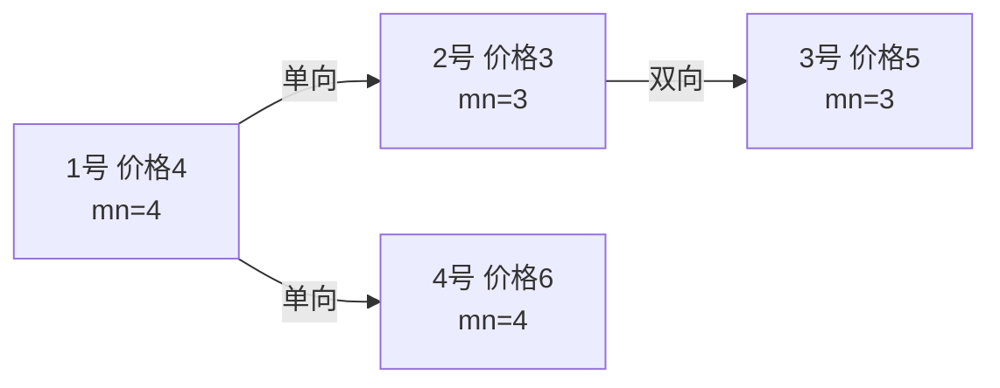

[[TOC]]

## 形式化题目

给定一张 $n$ 个点 $m$ 条边的混合图：每条边单向（$z=1$）或双向（$z=2$），双向边等价于两条相反的有向边。每个点 $i$ 有一个价格 $p_i$。

从点 $1$ 出发沿边移动，最终停在点 $n$；点可以重复经过。移动途中至多完成一次交易：在经过的某个点 $b$ 买入，在**之后**经过的某个点 $s$ 卖出，获利 $p_s - p_b$。求一次交易能获得的最大利润；不交易也是合法选择。

$$1 \leqslant n \leqslant 10^5,\quad 1 \leqslant m \leqslant 5 \times 10^5,\quad 1 \leqslant p_i \leqslant 100$$

::: tip 样例解释
价格依次为 $p = [4, 3, 5, 6, 1]$，边：$1 \to 2$、$1 \to 4$、$2 \leftrightarrow 3$、$3 \to 5$、$4 \leftrightarrow 5$。

答案 5 的走法：$1 \to 4 \to 5 \to 4 \to 5$。先走到 5 号，**在 5 号以 1 元买入**，沿双向边回到 4 号以 6 元卖出，再沿双向边回到 5 号结束旅行。关键在两点：双向边允许「回头」，点允许重复经过（所以 $5 \to 4 \to 5$ 是合法走法）；卖出点不要求第一次经过——走过 5 号不算数，回程再买再卖才是最优。
:::

## 正解

### 思路

**朴素做法**：枚举买入点 $b$ 和卖出点 $s$，对每一对判断「1 能到 $b$、$b$ 能到 $s$、$s$ 能到 $n$」，取 $p_s - p_b$ 的最大值。点对有 $O(n^2)$ 对，还得先花大代价算出每个点的可达集合，$n = 10^5$ 下完全不可行。瓶颈在于：一次交易本质上由「一段旅程」决定，而枚举点对把同一段旅程反复数了很多遍。

**第一步优化：只枚举分割点。** 把一次交易对应到旅程 $1 \to \cdots \to b \to \cdots \to s \to \cdots \to n$ 上的一个「分割点」$v$，定义

$$\text{mn}[v] = \min_{\text{走法}\, 1 \to v} \big(\min_{u \in \text{走法}} p_u\big), \qquad \text{mx}[v] = \max_{\text{走法}\, v \to n} \big(\max_{u \in \text{走法}} p_u\big).$$

这里说「走法」而不是「简单路径」：允许重复经过点，样例里 $v=5$ 的最优卖出价正是靠 $5 \to 4 \to 5$ 这个小环刷出来的。对每个 $v$，在 $v$ 处以历史最低价 $\text{mn}[v]$ 买入、以未来最高价 $\text{mx}[v]$ 卖出，枚举取 $\text{mx}[v] - \text{mn}[v]$ 的最大值。

为什么两个量可以独立取最优：对任意真实旅程（在 $b$ 买、$s$ 卖），取 $v = s$，则旅程前半段证明 $\text{mn}[s] \leqslant p_b$、后半段证明 $\text{mx}[s] \geqslant p_s$，枚举值 $\geqslant$ 真实利润；反过来，$\text{mn}[v]$ 与 $\text{mx}[v]$ 各自对应一条真实存在的走法，两条走法在 $v$ 处拼起来仍是一条合法旅程（1 能到 $v$、$v$ 能到 $n$），所以每个枚举值都真能实现。两侧夹逼，答案精确。

**第二步：两个极值各自是一个单源传播问题。** $\text{mn}$ 在原图上从 1 出发松弛：沿边 $(u,v)$ 有

$$\text{mn}[v] \gets \min(\text{mn}[u],\ p_v), \qquad \text{mn}[1] = p_1;$$

$\text{mx}$ 没有固定起点，把**所有边反向**、从 $n$ 出发做同样的传播，只是 min 换成 max、初值换成 $p_n$。两个松弛的形式完全一样，只是「初值 + 合并运算符 + 比较方向」不同，可以写成同一个函数跑两遍。

**第三步：用什么算法做传播。** 松弛式 $\text{best}[v] = \text{combine}(\text{best}[u],\ p_v)$ 与最短路的三角不等式更新同构（每条边沿松弛方向传播，直到没有更新为止），标准实现就是 SPFA：队列里放「值刚被更新、可能影响后继」的点，用 `inq` 数组防止重复入队。注意这里**不能**用堆优化的 Dijkstra 贪心——min/max 合并的松弛不满足 Dijkstra 所依赖的距离单调性质（比如 $\text{mx}$ 的值会被环反复放大传播），队列松弛（Bellman-Ford 型）跑到不动点才是正确做法。

最后答案为

$$\max_{\substack{v:\ \text{mn}[v] \neq +\infty \\ \text{mx}[v] \neq -\infty}} \big(\text{mx}[v] - \text{mn}[v]\big),$$

只统计「1 能到 $v$ 且 $v$ 能到 $n$」的点（用 $\pm\infty$ 哨兵排除单侧可达的点）；若没有正利润，输出 $0$。

**混合图的处理**：双向边 $z=2$ 在正图里存两条有向弧；反图建图时直接把每条边以 $(y, x, z)$ 喂给同一个建图函数，双向边自然还是两条弧，单向边方向翻转。

下面这张图展示正反两个方向的传播（样例的前 4 个点）：

正图从 1 号沿实线箭头传播「到此为止的最低价」：$\text{mn}[1]=4$，走到 2 号被低价刷新为 3，再传给 3 号仍是 3。反图（从 5 号出发）把所有箭头反过来后以同样方式传播「从这里到终点的最高价」，其中双向边 $4 \leftrightarrow 5$ 构成的小环让 $\text{mx}[5]$ 也能被 4 号的 6 元刷新——这正是必须用「松弛到不动点」而不是一次贪心的原因。

### 代码

@include-code(./main.cpp, cpp)

@include-code(./main.py, python)

### 复杂度

- 时间：两次 SPFA 型松弛，均摊 $O(km)$（$k$ 为小常数；与 SPFA 求最短路的最坏情形一样，理论上限 $O(nm)$，实践中远小于此），外加枚举分割点 $O(n)$。对 $n \leqslant 10^5$、$m \leqslant 5 \times 10^5$ 的加强数据，Python 实测最慢约 0.15s。
- 空间：链式前向星存至多 $2m$ 条弧 × 正反两份，$O(n + m)$；两轮松弛各一个值数组，$O(n)$。

## 样例走法

把样例的 5 个城市列成表，标出每个点经过两次传播后的 $\text{mn}$ / $\text{mx}$：

| 城市 $v$ | 价格 $p_v$ | $\text{mn}[v]$（1 到 $v$ 最低买价） | $\text{mx}[v]$（$v$ 到 5 最高卖价） | $\text{mx}-\text{mn}$ |
| --- | --- | --- | --- | --- |
| 1 | 4 | 4 | 6 | 2 |
| 2 | 3 | 3 | 6 | 3 |
| 3 | 5 | 3 | 6 | 3 |
| 4 | 6 | 4 | 6 | 2 |
| 5 | 1 | **1** | **6** | **5** |

观察这张表：

- $\text{mn}$ 沿「$1 \to 2 \to 3$」被 2 号的低价（3 元）刷新后一路下传；到 5 号时被 $p_5 = 1$ 刷到 1。
- $\text{mx}$ 被价格最高的 4 号（6 元）主导：双向边 $4 \leftrightarrow 5$ 让 $\text{mx}[4]$、$\text{mx}[5]$ 互相刷新都变成 6——$\text{mx}[5] = 6$ 的含义是「从 5 号先走到 4 号、再回 5 号」这条走法上最高能以 6 元卖出。
- 最大差值出现在 $v = 5$：在 5 号以 1 元买入、去 4 号以 6 元卖出，利润 5，与样例输出一致。
- 注意 $\text{mx}-\text{mn}$ 在 $v=4$ 上只有 2：$\text{mx}[4]-\text{mn}[4] = 6-4$ 看似不错，但分割点模型允许每个 $v$ 独立取两侧最优，枚举完所有点自然选中 $v=5$，无需比较不同「方案」。

## 总结

- 一次交易 = 走法上的一个分割点；枚举分割点把 $O(n^2)$ 的点对枚举降为 $O(n)$，并顺带正确处理「重复经过点」的环。
- 「走法上价格的 min/max」是与最短路同构的单源传播问题：正图从 1 做 min、反图从 $n$ 做 max，同一个 SPFA 型松弛函数参数化后跑两遍；不能用 Dijkstra 贪心。
- 答案 $\max_v (\text{mx}[v] - \text{mn}[v])$，只统计两侧都可达的点，无正利润输出 0。
- 该模型（正反两遍带约束极值 + 枚举分割点）是「路径上先买后卖」一类问题的通用套路，可直接迁移到「两次旅行拼接」「路径最长边最小化」等变体。
