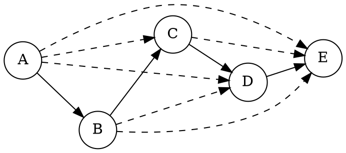
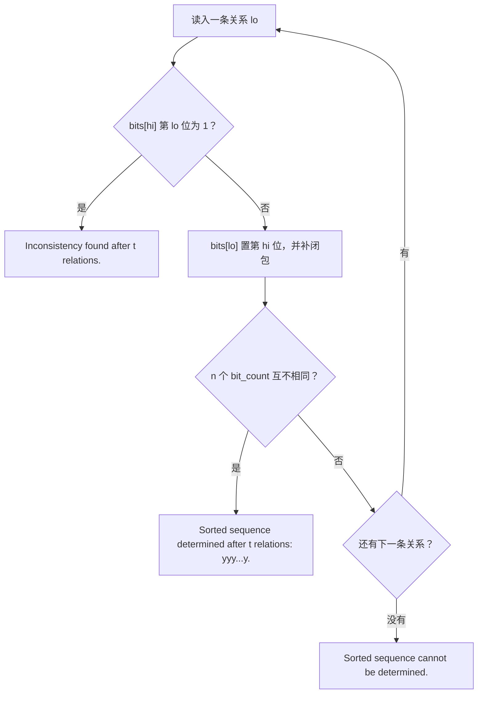

[[TOC]]

## 形式化题目

给定 $n$ 个变量（$2 \leqslant n \leqslant 26$，变量为前 $n$ 个大写字母）和 $m$ 条严格小于关系 `x<y`。
把变量看作点、把 `x<y` 看作有向边 $x \to y$，则得到一个有向图，且我们只关心**由已给关系推出的传递闭包**
$R$：$u \mathrel{R} v$ 表示能推出 $u < v$。

按输入顺序**逐条**加入关系，每加一条后立即检查：

1. 若 $n$ 个变量两两之间的大小都已确定（即 $R$ 是**全序**），停止，输出
   `Sorted sequence determined after t relations: yyy...y.`，其中 $t$ 是已处理的关系条数，
   `yyy...y` 是**由小到大**的变量序列；
2. 若出现矛盾（能推出某个 $x < x$），停止，输出 `Inconsistency found after t relations.`；
3. 若 $m$ 条关系全部处理完仍不满足前两条，输出 `Sorted sequence cannot be determined.`。

矛盾优先于定序；两种情况一旦触发，后面的关系不再影响答案。多组数据以 `0 0` 结束。

样例 `4 6`（$D<B,\ D<A,\ D<C,\ C<A,\ C<B,\ A<B$）在第 $6$ 条关系后定序为 `DCAB`，
即输出 `Sorted sequence determined after 6 relations: DCAB.`。

## 正解

### 思路

#### 朴素做法

最直接的想法是：每读入一条关系就存进图里，然后**从每个点各跑一次 BFS/DFS**（或跑一次三重循环
Floyd）求出全部可达性，再检查"是否有环"和"是否所有点对都可比"。

这正是为什么需要更省事的实现：下面用一点小技巧把"补闭包"和"两个判定"都压到一行位运算里。

#### 观察一：加边只让关系变多，闭包可以增量维护

传递闭包是**单调**的：加入 $u \to v$ 只会让 $R$ 变大。所以在已有的闭包结果上继续求闭包，
与清空重算完全等价（也可以理解为：新推出的关系只会来自"经过新边"的路径，而这一轮 Floyd 会把它补上）。
于是每条边只需在旧结果上补一次闭包，不必回滚、不必重建。

#### 观察二：矛盾 $\Leftrightarrow$ 自环

有向图有环 $\Leftrightarrow$ 存在点 $u$ 满足 $u \mathrel{R} u$：若 $u$ 在环上，沿环走一圈就推出 $u < u$；
反之若 $u < u$，则两条路径上的点构成环。于是"判矛盾"退化成看矩阵对角线。
具体到加边操作，这条性质给出一个 $O(1)$ 的判断：加入 $lo < hi$ 之前若矩阵里**已有 $hi \mathrel{R} lo$**，
则加入后 $hi \mathrel{R} hi$，直接矛盾；否则加入后仍然无环（新环必须用上这条新边，也就必须要有一条
$hi \rightsquigarrow lo$ 的旧路径）。

#### 观察三：无环时，可达点数就是排名

无环时 $R$ 是严格偏序。令 $d(u)$ 为 $u$ 能到达的点数（含 $u$ 自己）。若 $u < v$，则 $v$ 能到达的点
$u$ 都能到达，于是 $d(u) > d(v)$——**$d$ 沿"更小"的方向严格递减**。两个方向都成立：

- **全序 $\Rightarrow$ $d$ 互不相同**：把点按从小到大排成 $x_1 < x_2 < \dots < x_n$，
  则 $d(x_i) = n - i + 1$，取遍 $1, 2, \dots, n$。
- **$d$ 互不相同 $\Rightarrow$ 全序**：$n$ 个互不相同的取值只能是 $1, 2, \dots, n$，于是
  $\sum_u d(u) = \frac{n(n+1)}{2}$。另一方面，$\sum_u d(u)$ 把每个点对 $(u,v)$（$u \mathrel{R} v$）
  数了一次，其中 $n$ 个是 $u = v$，其余是**严格可比**的点对，而严格可比的点对最多 $\binom{n}{2}$ 个，所以

  $$\sum_u d(u) \leqslant n + \binom{n}{2} = \frac{n(n+1)}{2}.$$

  上式取等当且仅当**每一对点都可比**，即 $R$ 是全序。

所以"是否全序"等价于"**$n$ 个 $d$ 值是否互不相同**"，且全序时按 $d$ 从大到小排出的就是升序序列。
这比逐对检查可比性省事得多。

#### 观察四：一行一个整数位图，Floyd 内层化成一次位或

把 $R$ 的第 $i$ 行压成一个 $n$ 位整数 `bits[i]`，第 $j$ 位为 $1$ 表示 $i \mathrel{R} j$
（$n \leqslant 26$，所以每行就是一个不超过 $2^{26}$ 的小整数）。Floyd 求闭包的内层

```text
if R[i][k]:  R[i][j] |= R[k][j]  (对所有 j)
```

正好等于 `if bits[i] >> k & 1: bits[i] |= bits[k]`：$n$ 次下标操作压缩成一次位或。
而 $d(i)$ 就是 `bits[i].bit_count()`——观察三的判定也顺手完成了。

#### 算法

1. 每个点 $i$ 初始 `bits[i] = 1 << i`（自环位，既表示"可达自己"又充当已访问标记）。
2. 逐条读入关系 $lo < hi$：
   - 若 `bits[hi] >> lo & 1` 为真，说明此前已推出 $hi < lo$，再加上 $lo < hi$ 即成环
     $\Rightarrow$ 输出 `Inconsistency`，结束本组；
   - 否则 `bits[lo] |= 1 << hi`，再跑一遍 Floyd 式闭包补全传递关系；
   - 若此时 $n$ 个 `bits[i].bit_count()` 互不相同，说明已是全序，按可达数降序输出序列，结束本组。
3. $m$ 条边都处理完仍没触发前两种，输出 `cannot be determined`。

下面这张图是"传递"这一层的示例：输入 $A<B,\ B<C,\ C<D,\ D<E$ 四条边，实线是输入的直接关系，
虚线是闭包补出来的传递关系。可以看到 $A$ 的可达点数（$5$）远大于它的直接出度（$1$）。



正因为虚线边也被算进 $d$，$d(A)=5, d(B)=4, d(C)=3, d(D)=2, d(E)=1$ 才互不相同，
"全序"才会在第 $4$ 条边后立刻被判出来。

#### 样例走查

对样例 `4 6`，逐条加边后各点的 $d$ 值如下（列顺序 $A, B, C, D$）。最后一列是判定结果。

| 第几条 | 加入的关系 | $d(A)$ | $d(B)$ | $d(C)$ | $d(D)$ | 判定 |
| --- | --- | --- | --- | --- | --- | --- |
| 1 | $D<B$ | 1 | 1 | 1 | 2 | 有并列，继续 |
| 2 | $D<A$ | 1 | 1 | 1 | 3 | 有并列，继续 |
| 3 | $D<C$ | 1 | 1 | 1 | 4 | 有并列，继续 |
| 4 | $C<A$ | 1 | 1 | 2 | 4 | 有并列，继续 |
| 5 | $C<B$ | 1 | 1 | 3 | 4 | 有并列，继续 |
| 6 | $A<B$ | 2 | 1 | 3 | 4 | **互不相同 → `DCAB`** |

前 $5$ 步里总有 $d$ 值撞车（第 $1$ 到第 $3$ 步 $A, B, C$ 全是 $1$；第 $4, 5$ 步 $A, B$ 仍然一样，
因为 $A$ 与 $B$ 之间始终没有可直接推出的关系），直到第 $6$ 条边
$A < B$ 把 $d(A)$ 从 $1$ 抬到 $2$，$4$ 个值才两两不同。按 $d$ 降序排：$D(4), C(3), A(2), B(1)$，
即 `DCAB`——$D$ 最小，与样例一致。

### 代码

@include-code(./main.py, python)

### 复杂度

- 时间复杂度：每条关系一次判环 $O(1)$、一次补闭包 $O(n^2)$（外层枚举 $n$ 个中转点、内层 $n$ 行位或）、
  一次全序判定 $O(n \log n)$，共 $O(m n^2)$。$n \leqslant 26$ 时单条关系约 $676$ 次位运算，
  位运算把常数压得很低；朴素"每条边后重跑一次 Floyd"则需要 $O(m n^3)$。
- 空间复杂度：`bits` 为 $n$ 个 $n$ 位整数，即 $O(n^2)$ 位；读入的 token 为 $O(\sum m)$。

实测：200 组 $n = 26$、共约 5 万条关系的数据本地耗时约 $0.8$ s，官方数据 `p1.in` 约 $0.03$ s。

## 总结

- 把"逐条加边、逐次判定"的形式化成**有向图的增量传递闭包**：加边单调，所以只需在旧闭包上补一次。
- 两个判定都从同一张位图读出：**对角线有自环即矛盾**；**无环时 $n$ 个可达点数互不相同即全序**，
  且可达数从大到小就是升序序列。
- 实现要点：每行一个整数位图，Floyd 的内层 $j$ 循环退化为一次位或，`bit_count()` 免费给出排名。
- 易错点：矛盾优先级高于定序；`A<A`、重边、以及"序已定死但后面还有反向边"都要按题面提前结束。

## 图示解析

每加入一条关系后的判定顺序固定为三步，下图是代码主循环与它们的对应关系。



流程图的左侧分支（成环）优先级最高，一触发就结束；中间是唯一的"计算"步骤——一次位或加一遍闭包；
右侧则说明"全序"是**恰好** $n$ 个可达数互不相同的副产品，不需要额外的点对检查。
