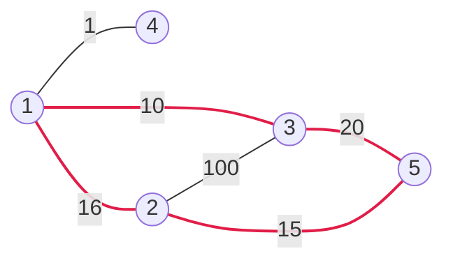

[[TOC]]

## 形式化题目

给定一张 $N$ 个点、$M$ 条边的无向带权图（可能有重边），边权为正整数。
求一个至少包含 $3$ 个点、且点上不重复的**简单环** $C$，使 $\sum_{e \in C} w(e)$ 最小；
按环上的顺序输出 $C$ 经过的所有点，最小环不唯一时输出任意一个，不存在环时输出 `No solution.`。

题目样例（1 与 3 之间实际有 300 和 10 两条平行边，图中只画较短的那条）：



最小环是 $1 \to 2 \to 5 \to 3 \to 1$，权值和 $16 + 15 + 20 + 10 = 61$（图中加粗的四条边）。
点 4 只与 1 相连、度为 1，不可能出现在任何环里；1 与 3 之间的 300 那条平行边也不会被用到。
题面输出 `1 3 5 2`，而下面 `main.py` 实际输出 `2 1 3 5`——这是同一个环的不同起点与方向，
本题输出方案不唯一。

## 正解

### 思路

**朴素做法**：DFS 回溯枚举所有简单环，回到起点且长度 $\geqslant 3$ 时更新答案。
它是正确的，但环的数量本身是指数级的：仅在 $K_{100}$ 里长度恰好为 3 的环就有 $\binom{100}{3} \approx 1.6 \times 10^5$ 个，
更长的环还会迅速膨胀。瓶颈不是常数，而是**候选环有指数多条**，所以任何“把环逐个试出来”的框架都不可行，
必须改写成“多项式个子问题，每个子问题一次查表”。

**拆环**：注意到每个简单环都有一个**唯一的编号最大点** $k$。在 $k$ 处把环剪开（删去 $k$ 及它的两条环上邻边），
剩下的部分是一条 $i \to j$ 的路径，且其内部点编号全部小于 $k$。于是

$$\text{环长} = \text{dist}_{<k}(i, j) + w(i, k) + w(k, j), \qquad i, j < k,$$

其中 $\text{dist}_{<k}$ 表示“中间点编号严格小于 $k$”意义下的最短路。
枚举 $k$ 与端点对 $(i, j)$ 之后，问题就变成了“查一次受限最短路”。这既不会漏解：每个环都在它的最大点那一轮被枚举到；
也不会多解：$i \to^{(<k)} j \to k \to i$ 一定是点数 $\geqslant 3$ 的简单环。

**用 Floyd 的阶段承接**：Floyd 在第 $k$ 轮**松弛开始之前**，`dist[i][j]` 恰好就是只允许经过编号 $< k$ 的最短路，
与拆环需要的受限最短路完全一致。所以每一轮的顺序是：

1. **先探测**：枚举 $i < j < k$ 的点对，用当前 `dist[i][j] + w(i,k) + w(k,j)` 作为候选环，更优则记录。$i, k$ 之间没有边时直接跳过（`continue`）；$i, j$ 不可达或 $k, j$ 没有边时，候选项会落到哨兵值之上，自然不会更新最优值；
2. **再并入**：做标准 Floyd 的 $k$ 阶段松弛，把 $k$ 变成允许使用的中间点。

这两步的顺序不能交换——先松弛再探测，`dist[i][j]` 就可能已经“借道” $k$ 了，闭合出来的东西不再是简单环。

**输出方案**：在松弛时同步维护中转点表 `mid[i][j]`（$i \to j$ 最短路在哪个点拐弯，0 表示直连）。
每当找到更优的环，就用 `mid` 把 $i \to j$ 那一段递归还原成点序列，再接上 $k$，即得到按环上顺序排列的答案。

下表是样例里各轮真正被检视的候选环（`dist` 取该轮探测时的值）：

| 轮次 $k$ | 候选端点 $(i, j)$ | 受限最短路 | 候选环 | 环长计算 | 环长 | 更新最优 |
| --- | --- | --- | --- | --- | --- | --- |
| 3 | $(1, 2)$ | $16$（$1 \to 2$） | $1 \to 2 \to 3 \to 1$ | $16 + 10 + 100$ | 126 | 否 |
| 5 | $(2, 3)$ | $26$（$2 \to 1 \to 3$） | $2 \to 1 \to 3 \to 5 \to 2$ | $26 + 15 + 20$ | 61 | 是 |

$k = 1, 2$ 时还不存在两个更小的点，没有候选；$k = 4$ 是度 1 的死枝，凑不出环。
最终最优值 61：还原出 $2 \to 1 \to 3$，再接上 $k = 5$，输出 `2 1 3 5`。
注意这条最短路只用到了编号小于 5 的点，这正是“先探测、后并入”要保证的事情。

### 代码

@include-code(./main.py, python)

### 复杂度

- 时间：$O(N^3)$——外层 $k$ 共 $N$ 轮，每轮探测与松弛各 $O(N^2)$；$N \leqslant 100$ 时内层循环总数约 $\binom{N}{3} + N^3 \approx 1.2 \times 10^6$，实测最重数据（$N = 100$ 完全图，4950 条边）约 0.04s，峰值内存约 16MB。
- 空间：$O(N^2)$——边权 `w`、阶段最短路 `dist`、中转点表 `mid` 三张 $N \times N$ 矩阵。

## 总结

把“枚举环”改写成“枚举环上编号最大的点 $k$”之后，环就等于一条受限最短路加两条到 $k$ 的边；
Floyd 的阶段不变量恰好提供这种受限最短路，每轮先探测候选环、再把 $k$ 并入松弛，即可 $O(N^3)$ 求出最小环，
并用中转点表回溯出方案。重边取最小、自环忽略、无环输出 `No solution.` 是必须处理的边界。

## 图示解析

这张图串起本题从建模到得到答案的主线：

```text
最小环问题（环有指数多条，不能逐个枚举）
`- 每个环有唯一编号最大的点 k：在 k 处剪开成一条 i→j 路径
   `- 环长 = dist(i,j) + w(i,k) + w(k,j)，dist 只允许经过编号 < k 的点
      `- Floyd 第 k 轮开始前的 dist 正是它 → 每轮先探测候选环，再把 k 并入松弛
         `- 用中转点表回溯出环上的点序列
```

先看每一个节点代表的推理结论，再顺着分支检查它如何导向下一步：
“最大点”保证环被唯一归类，“受限最短路”把枚举环变成查表，
“先探测后并入”保证闭合出的确实是简单环，最后一步才是方案还原。
