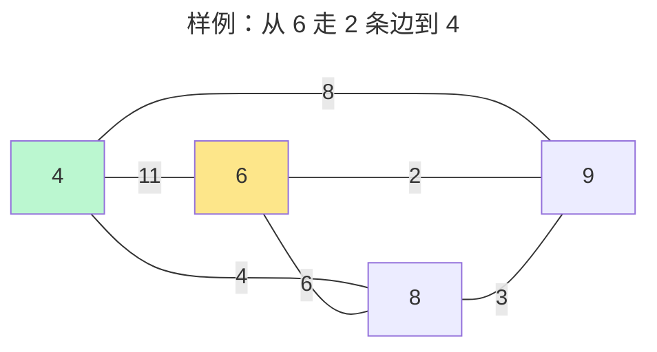
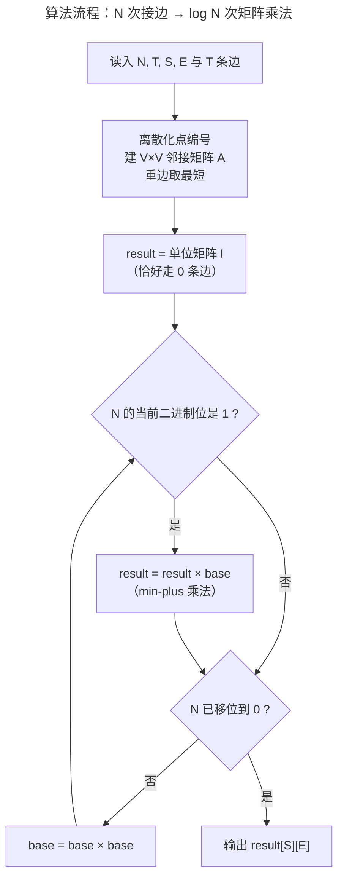

[[TOC]]

## 形式化题目

给定一张无向图，边有正整数边长，可能有重边，点编号是 $1 \sim 1000$ 之间的整数（实际出现的点远少于 1000 个）。给出整数 $N$ 和两个点 $S$、$E$，求从 $S$ 到 $E$ **恰好经过 $N$ 条边**（点、边都可以重复经过）的路径中，边长总和最小的一条，输出这个最小总和。数据保证有解。

$2 \le T \le 100$，$2 \le N \le 10^6$。

### 样例图示

下图画出样例中实际出现的 4 个点（点 5、7 没有任何边落在上面，不影响结果）：

答案是 10：走 $6 \xrightarrow{6} 8 \xrightarrow{4} 4$ 这两条边，总长 $6+4=10$。观察一下它比"看起来更顺"的 $6 \xrightarrow{2} 9$ 差在哪：$9$ 到 $4$ 没有直接的边，所以第二步接不上，这说明"恰好走几条边"是硬约束，贪心选短边没用——每一步都要为"剩下的步数还能不能接上"负责。

## 正解

### 思路

**第一步：朴素做法是什么？** 最直接的想法是按边数分层递推：设 $f_k[i]$ 表示"从 $S$ 走恰好 $k$ 条边到点 $i$"的最短距离，则

$$f_k[i] = \min_{(u,i) \in E} \{ f_{k-1}[u] + w(u,i) \}$$

初始 $f_0[S] = 0$，答案就是 $f_N[E]$。这正确，但要算 $N$ 层，每层 $O(T)$，总复杂度 $O(N \cdot T)$。$N \le 10^6$、$T \le 100$ 时约 $10^8$，对 Python 来说太慢了，我们必须想办法让 $N$ 出现在 $\log$ 里。

**第二步：把"递推一层"看成矩阵乘法。** 关键观察：上面的转移本质上是一种"乘法"。把所有转移写成矩阵形式——设 $A$ 是图的**邻接矩阵**（$A[i][j] = w(i,j)$，不连通处为 $\infty$），并定义一种新的"矩阵乘法"：

$$
(C = A \times B):\quad C[i][j] = \min_k \big( A[i][k] + B[k][j] \big)
$$

它和普通矩阵乘法唯一的区别是：把普通乘法的「乘」换成了「加」，把「求和」换成了「取 min」。这种代数结构叫 **min-plus 半环**（也常叫广义矩阵乘法）。它为什么恰好对应"接两段路"？$A[i][k]$ 是"从 $i$ 走一段路到 $k$"的花费，$B[k][j]$ 是"从 $k$ 再走一段路到 $j$"的花费，两者相加就是把两段路**首尾相接**；对所有中转点 $k$ 取 min，就是在所有接法里挑最短的。

在这个乘法下，两个基本事实成立：

1. **$A^k$ 的含义**：$A^1[i][j]$ 是走 1 条边的最短路，$A^2[i][j] = \min_k(A[i][k]+A[k][j])$ 是"走 1 条边 + 再走 1 条边"，即走 2 条边的最短路……归纳可得 **$A^k[i][j]$ 就是从 $i$ 恰好走 $k$ 条边到 $j$ 的最短距离**。
2. **乘法有结合律**：接路这件事天然满足"先接前三段、再接第四段"和"先接两段、再接两段"结果相同，所以 min-plus 乘法满足结合律（$\infty$ 充当零元：$\infty + x = \infty$，min 时被淘汰；对角线为 0 的单位矩阵 $I$ 满足 $I \times A = A$）。

有了结合律，就能对幂次做**快速幂**：$A^N = (A^{\lfloor N/2 \rfloor})^2$（$N$ 偶）或 $A^N = A \cdot (A^{\lfloor N/2 \rfloor})^2$（$N$ 奇）。于是只需 $O(\log N)$ 次 min-plus 矩阵乘法，从 $N = 10^6$ 压到约 20 次。

**第三步：矩阵要多大？** 点编号虽然最大 1000，但 $T \le 100$ 意味着真正出现的点最多只有 $2T = 200$ 个。矩阵乘法是 $O(V^3)$ 的，$V$ 从 1000 降到 200 意味着常数小 125 倍，所以必须先把点**离散化**：给出现过的点按输入顺序编号。另外图可能有重边，建邻接矩阵时同一对点只保留最短的边——min-plus 乘法会自动在多条平行路里取 min，但这能在建图时就省掉多余的大数。

实现里还有一个小技巧：把"恰好走 0 条边"（单位矩阵 $I$，对角线为 0 其余为 $\infty$）当作快速幂里累积答案的起点 $result$，让它像普通快速幂里的"乘积初值 1"一样工作；快速幂结束时 $result = A^N$，直接查 $result[S][E]$。

### 矩阵视角的样例演算

用样例（只看 4、6、8、9 四个点，按 $[4,6,8,9]$ 排序）演示 $A^2$ 里一个格子的来历。先写邻接矩阵 $A$（$\infty$ 记作 $\infty$）：

| $A$ | 4 | 6 | 8 | 9 |
| --- | --- | --- | --- | --- |
| **4** | $\infty$ | 11 | 4 | 8 |
| **6** | 11 | $\infty$ | 6 | 2 |
| **8** | 4 | 6 | $\infty$ | 3 |
| **9** | 8 | 2 | 3 | $\infty$ |

求 $A^2[6][4]$（从 6 走 2 条边到 4），就是拿 $A$ 的第 6 行逐个加上 $A$ 的第 4 列再取 min：

| 中转点 $k$ | $A[6][k] + A[k][4]$ | 合计 |
| --- | --- | --- |
| 4 | $\infty$（不能原地停留）$+ \infty$ | $\infty$ |
| 6 | $\infty + 11$ | $\infty$ |
| 8 | $6 + 4$ | **10** |
| 9 | $2 + 8$ | 10 |

min 得 10，正是样例答案：$6 \to 8 \to 4$ 或 $6 \to 9 \to 4$（两条等长，$8+2=10$）。表格说明 min-plus 乘法的每个格子就是一次"枚举中转点、接两段路、取最短"——矩阵快速幂只是把这个动作按 $\log N$ 层套娃。

### 代码

@include-code(./main.py, python)

### 复杂度

设离散化后点数为 $V \le 200$。

- **时间**：每次 min-plus 乘法 $O(V^3)$，快速幂做 $O(\log N)$ 次（仔细实现约 $2\log N$ 次，最后一次平方可省），总计 $O(V^3 \log N) \approx 200^3 \times 20 = 1.6 \times 10^8$ 次基本操作。Python 内层用 `min(map(add, row, col))` 把双循环交给 C 执行，本地 12 组真实数据全部在 0.05s 内跑完；若 OJ 限时严格，同样算法落地到 C++ 只需把内层换成 `for` 循环即可。
- **空间**：邻接矩阵与若干中间矩阵，$O(V^2)$。

## 总结

- 「恰好经过 $N$ 条边」的最短路 = 按边数分层递推 $f_k$，但 $N$ 高达 $10^6$，线性层数是瓶颈。
- 把层间递推抽象成 **min-plus 矩阵乘法**（乘→加、和→min），它有结合律，于是 $A^N$ 可用**矩阵快速幂**在 $O(\log N)$ 次乘法内求出，$A^N[S][E]$ 即答案。
- 两个工程要点：点编号要**离散化**（实际点数 $\le 2T$，矩阵从 $1000^3$ 降到 $200^3$）；重边在建图时取最短。
- 这套"把递推写成矩阵乘法 → 快速幂"的框架是通用套路，凡转移满足结合律（min-plus、布尔 and-or、max-plus 等）的线性递推都适用，例如斐波那契第 $10^{18}$ 项、状态压缩后的图上游走计数等。

## 图示解析

流程图把普通快速幂的骨架原样搬到了 min-plus 半环上：`base` 逐层平方（对应 $A^1, A^2, A^4, \dots$），`result` 按 $N$ 的二进制位决定要不要"乘"进来。阅读时对照两个角色：`base` 始终是"走恰好 $2^i$ 条边"的矩阵，`result` 是已确定要走的那部分边数的累积——两者相接（min-plus 乘）就是把两段边数相加、路程取最短，最终 `result` 恰好累积成"走 $N$ 条边"。
