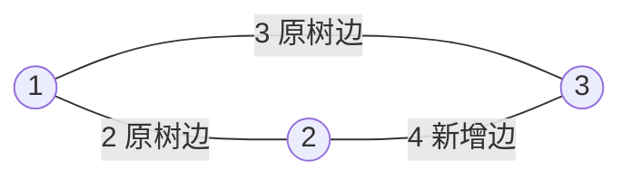

[[TOC]]

## 形式化题目

给定一棵 $n$ 个节点的树 $T=(V,E,w)$，树边权值为整数。要求给每个非树点对 $(u,v)$
填上一个整数权值，把 $T$ 扩充成完全图 $K_n$（原树边权值保持不变），使得 $T$ 仍然是
$K_n$ 的**唯一**最小生成树，并让所有新增边的权值之和最小。

## 正解

### 思路

#### 先算一条非树边能取多小

目标是「新增边权之和」，而「$T$ 是唯一 MST」是**逐边**的局部条件：它只约束每条非树边
与树上路径的关系，不同非树边之间没有耦合。所以可以单独求每条非树边的最小合法权值，
再全部相加。

设 $M_{uv}$ 为 $T$ 上 $u\to v$ 路径的最大树边权。这条边最小只能填 $M_{uv}+1$：

- **填 $c<M_{uv}$**：把路径上权值为 $M_{uv}$ 的树边记为 $f$。在 $T$ 中加入 $(u,v)$、
  删去 $f$ 得到另一棵生成树，权值为 $w(T)-M_{uv}+c<w(T)$，与 $T$ 是最小生成树矛盾。
- **填 $c=M_{uv}$**：同样的替换得到一棵权值相等的生成树 $T'\neq T$，与 $T$ 是**唯一**
  MST 矛盾。
- **填 $c=M_{uv}+1$**：任取 $T'\neq T$ 与 $e=(u,v)\in T'\setminus T$。$T$ 上加 $e$
  形成唯一圈，圈上必有一条树边 $f$ 不在 $T'$ 中（否则 $T'$ 里 $u,v$ 已连通，$e$ 会成圈），
  于是 $c(e)=M_{uv}+1>w(f)$，用 $f$ 换掉 $e$ 使 $T'$ 权值严格减小。所以任何
  $T'\neq T$ 都不是最小生成树，$T$ 唯一。

也就是：**$T$ 是唯一 MST，等价于每条非树边都严格大于它对应路径的最大树边权。**

#### 卡点：$O(n^2)$ 条非树边的枚举跑不完

按这个结论，只要对每条非树边求一次「路径最大边权」即可。但非树边有
$\binom{n}{2}-(n-1)$ 条，$n=6000$ 时约 $1.8\times 10^7$ 条；即便每次查询 $O(1)$，
Python 也跑不完。真正的瓶颈不是「求路径最值」，而是「先把所有非树边枚举出来」。

#### 关键观察：路径最大边权 = 首次连通时的树边权值

把 Kruskal 的过程看成在按权值递增接受树边。当 $u,v$ 在某一步第一次被连通时，
那条让它们连通的树边就是路径 $P_{uv}$ 上的最大边——因为 Kruskal 按非降序处理，
在此之前 $u,v$ 不连通，之后出现的树边权值都不会更小。

于是不要枚举非树边，改去枚举**合并事件**：合并事件只有 $n-1$ 个，每个事件一次性
处理它负责的一整批非树边。

#### 批量定价

设当前处理权值为 $w$ 的树边 $(x,y)$，$A$、$B$ 是两端所在的连通块。此时 $A\times B$
点对中：

- 有 $a\cdot b$ 个点对，其中 $a=|A|$、$b=|B|$；
- 其中**恰好一个**是刚被接受的树边 $(x,y)$ 本身；
- 剩下 $a\cdot b-1$ 个都是非树边，且它们的 $M_{uv}$ 恰好等于 $w$。

所以每条填 $w+1$，本步贡献 $(a\cdot b-1)\cdot(w+1)$。每条非树边归属的「首次连通事件」
唯一，故不重不漏。下面的表把题面两组样例各跑一遍，最后一格就是输出。

| 样例 | 树边 $(x,y)$ | $w$ | A 块大小 | B 块大小 | 新增非树边数 | 每条权值 | 本步贡献 | 累计 |
| --- | --- | --- | --- | --- | --- | --- | --- | --- |
| 一 | $(1,2)$ | 2 | 1 | 1 | 0 | 3 | 0 | 0 |
| 一 | $(1,3)$ | 3 | 2 | 1 | 1 | 4 | 4 | **4** |
| 二 | $(1,2)$ | 3 | 1 | 1 | 0 | 4 | 0 | 0 |
| 二 | $(2,3)$ | 4 | 2 | 1 | 1 | 5 | 5 | 5 |
| 二 | $(3,4)$ | 5 | 3 | 1 | 2 | 6 | 12 | **17** |

每行是一次 Kruskal 合并：先给出这次连接的两块大小，再给出这批非树边的条数与单价。
第一组样例只有第 2 步有贡献——补上唯一的非树边 $(2,3)$，权值 $3+1=4$。
第二组样例是一条链，第 3 步一次要定价 $(1,4)$ 和 $(2,4)$ 两条非树边，各填 $5+1=6$，
合计 $12$，累计 $5+12=17$，与题面输出一致。要注意读 $a\cdot b$ 时必须读**合并前**的
块大小，合并之后这个划分就消失了。

第一组样例补完后的完全图如下：原树边是 $(1,2)$ 权 2、$(1,3)$ 权 3，唯一的非树边
$(2,3)$ 被填成 $3+1=4$。

观察重点是 $(2,3)$ 的权值：它与「第二次合并时那条树边 $(1,3)$ 的权值 $3$」相差正好 1。
如果把它填成 $3$，则 $\{(1,2),(2,3)\}$ 与 $\{(1,2),(1,3)\}$ 都是权值 5 的生成树，
唯一性被破坏；填成 4 之后，任何非树生成树都会比原树更重。

#### 实现要点

- 并查集除 `parent` 外维护每个**根**的 `size`，合并时小树挂大树，保证近 $O(\alpha(n))$。
- 边存成 `(weight, x, y)` 元组，`sorted` 直接给出 Kruskal 顺序，不需要额外的 `key=`。
- 累加必须在**合并之前**完成，否则读到的块大小已经被改掉。

### 代码

@include-code(./main.py, python)

### 复杂度

- **时间复杂度**：$O(n\log n)$ 每组，其中排序 $O(n\log n)$、并查集 $O(n\,\alpha(n))$。
  相比枚举全部非树边的 $O(n^2)$ 做法有本质提升；$n=6000$ 时实测约 0.03s。
- **空间复杂度**：$O(n)$，即并查集两个数组与边列表。

## 总结

- 目标函数可拆时，先求「每条非树边单独的最小合法权值」，再把各边的局部下界相加。
- $T$ 是唯一 MST 的充要条件：每条非树边严格大于其树上路径的最大边权。
- 把「路径最大边权」换成 Kruskal 的视角，它就成了「两点首次连通时那条边的权值」；
  于是 $O(n^2)$ 条非树边的枚举被压成 $n-1$ 次合并事件，每次 $O(1)$ 批量定价。
- 并查集按大小合并，既控制树高，又让批量定价所需的「两块大小」随手可得。
