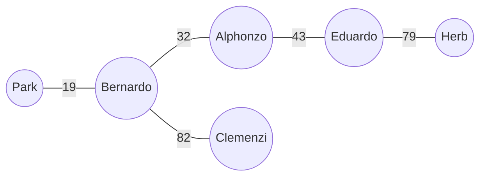

[[TOC]]

## 形式化题目

给一张无向带权图：节点是若干人（不超过 20 人）和公园 `Park`，每条边有长度 $L$，保证每个人都能（直接或间接）到达 `Park`。

一辆车的行驶过程是：从**某个人**的家出发，沿边行驶，途中可以经过其他人的家并把他们全部收上车（车容量无限），最终开进 `Park`。车一旦进入 `Park` 就停在那里，不能再开出接人。`Park` 最多停 $s$ 辆车。

所有人都要到达 `Park`。求所有汽车行驶路程总和的最小值。

## 正解

### 思路

#### 第一步：把问题翻译成生成树

「车一旦进公园就必须停下」意味着：每辆车最终对应一条**从某人的家到 `Park` 的路径**，车上所有人挤在一起沿这条路径走。把每个人看作树上的一个点、每条被走过的道路看作一条树边，则：

- 一个合法方案恰好对应一棵**包含 `Park` 的生成树**；
- 总里程 = 树上所有边的权值和；
- 停车数 = 树上与 `Park` 相连的边数（每条公园边都是一辆车开进公园的"最后一公里"）。

于是题目变成经典模型：**求包含 `Park` 的生成树中边权和最小、且 `Park` 的度数 $\leqslant s$ 的一棵**——度限制最小生成树。

#### 第二步：先不管限制，缩掉公园跑 MST

先看 $s$ 足够大（度数不受限）时怎么做。把 `Park` 和它的所有关联边删掉，剩下的图会被分成若干连通块。观察两点：

- 每个连通块内部：块内所有人怎么互相连接，与公园无关，直接对**人—人边**跑 Kruskal 求最小生成森林即可；
- 每个连通块必须有一条边接入 `Park`（否则块里的人到不了公园），而且**只需一条**：车先开到块内某个人的家，沿块内的生成树边绕一圈把所有人收齐，再从任意一点开进公园。所以每个块取**最便宜**的那条公园边接入。

此时设原图（去掉 `Park` 后）有 $k$ 个连通块，得到一棵 `Park` 度数恰为 $k$、总边权和最小的生成树，停车数正好 $k$。

对样例（$s=3$）具体算一遍。去掉 `Park` 后对人—人边跑 Kruskal，按权依次选中 $32,43,79,82$（$90$ 会被 $82+79$ 成环跳过、$109$ 更大），五个人的家连成**一个**连通块；再接上最便宜的公园边 `Bernardo-Park 19`。得到度数 $k=1$ 的最优树，总里程 $32+43+79+82+19=255$（这正好也是 $s=1$ 时的答案）。



上图是第二步结束时的形状：`Park` 度数为 $1$，`Bernardo` 的车从自己家出发，沿 $32\to43\to79$ 收齐 `Alphonzo`、`Eduardo`、`Herb`，再沿 $82$ 收 `Clemenzi`，最后开进公园（$19$）。

#### 第三步：用剩余车位做「交换」

若 $k<s$，可以再停一辆车：让某个人 $v$ **自己直接开去公园**。具体操作是：

1. 往树里加一条公园边 $v\text{-}Park$，权 $w$——树上出现一个环；
2. 删掉 $v \to Park$ 树上路径中**最重的一条非公园边** $w'$，恢复成树。

总里程变化 $\Delta = w - w'$。$\Delta<0$ 就变便宜了。每次在所有公园边里选 $\Delta$ 最小的交换执行，直到停满 $s$ 辆车，或者没有负收益的交换（此时继续停车只会更贵，提前停止）。

为什么逐次交换就是最优的？这是度限制最小生成树的经典交换引理：若 $T$ 是度数为 $d-1$ 的最优树，$T'$ 是度数为 $d$ 的最优树，则存在一条 $T'$ 有而 $T$ 没有的公园边，把它的"加边 + 删路径最重非公园边"交换作用到 $T$ 上，能恰好得到一棵度数为 $d$ 的最优树。于是从度数 $k$ 的最优树出发，逐次做最优交换，就依次得到度数 $k+1,k+2,\dots$ 下的最优树。

两个实现细节：

- 找"路径最重的非公园边"时**不比较公园边**——删掉公园边不会让公园度数加一，起不到多停一辆车的作用；
- $v$ 自己就是所在块"接入公园的那个人"（单人块）时，路径上没有非公园边可删，这种交换只会让同一辆车翻倍占两个车位，直接跳过。

继续样例：$s=3$ 还剩两个车位。

- 试 `Herb-Park 24`：树上路径 $Herb\to Eduardo\to Alphonzo\to Bernardo\to Park$ 中最重非公园边是 $79$，$\Delta=24-79=-55$，总里程 $255-55=200$；
- 再试 `Clemenzi-Park 65`：此时路径 $Clemenzi\to Bernardo\to Park$ 中最重非公园边是 $82$，$\Delta=65-82=-17$，总里程 $200-17=183$。

剩下的交换（如 `Eduardo-Park 57` 换 $43$，$\Delta=14$）都非负收益，停止。答案 $183$，与样例输出一致。用暴力枚举全部生成树核对：$s=1$ 时最优 $255$、$s=2$ 时 $200$、$s=3$ 时 $183$，与逐次交换的结果完全吻合。

### 代码

@include-code(./main.py, python)

### 复杂度

设人数为 $m\ (\leqslant 20)$、道路数为 $n$。Kruskal 排序占 $O(n \log n)$；每次交换要枚举每条公园边并各做一次 $O(m)$ 的树上路径扫描，交换至多进行 $m$ 次，总计 $O(n\log n + s\cdot m^2)$。对本题规模绰绰有余（实测全部 21 组测试数据约 0.02s、内存 15MB）。

## 总结

- 「车进公园即停 + 容量无限」把方案压缩成一棵**包含 `Park` 的生成树**，停车数就是 `Park` 的度数，本题即**度限制最小生成树**。
- 三段式解法：① 删掉 `Park`，对人—人边跑 Kruskal 得生成森林；② 每个连通块用最便宜的公园边接入，得到度数最小的最优树；③ 剩余车位用来反复做「加公园边、删路径最重非公园边」的最优交换，每次净收益 $w-w'<0$ 才执行。
- 交换的正确性依赖经典交换引理：度数为 $d$ 的最优树总能从度数为 $d-1$ 的最优树经一次最优交换得到。
- 实现细节：多重边交给排序；路径上只删非公园边；单人块没有可删边，跳过；没有负收益交换就提前结束（不要求停满）。

## 图示解析

### 一次「交换」长什么样

下图展示样例的第一次交换：加入 `Herb-Park 24`，删去路径 $Herb\to Eduardo\to Alphonzo\to Bernardo\to Park$ 上最重的非公园边 `Eduardo-Herb 79`。

```
交换前（度数 1，总里程 255）：      交换后（度数 2，总里程 200）：

        Park                            Park
         |                             /      \
     Bernardo                       19/        \24（加）
     /       \                        /          \
   32         82                 Bernardo        Herb
   /            \                 /       \        |
Alphonzo     Clemenzi          32         82      (79 已删)
   |             |              /           \
  43             |          Alphonzo     Clemenzi
   |             |             |
Eduardo ---------+            43
   |                           |
  79（删）                  Eduardo
   |                           |
 Herb                        Herb（改从 Park 直接进园）
```

观察重点：交换前 `Herb` 挂在树上，去公园要走 $79\to43\to32\to19$；加入 `Herb-Park 24` 后，环上 $Herb\to Eduardo\to Alphonzo\to Bernardo\to Park$ 中最重的非公园边是 $79$，删去它——总变化 $24-79=-55$，一次省下 55 公里；第二次交换（`Clemenzi-Park 65` 换 $82$，$\Delta=-17$）同理，省完 3 个车位刚好用完，答案 $183$。整个算法就是把这步「加公园边、删路径最重非公园边」重复到车位用完或不再变便宜为止。
