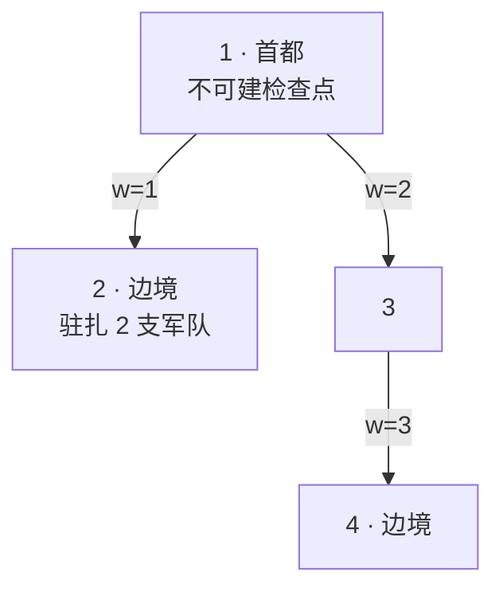
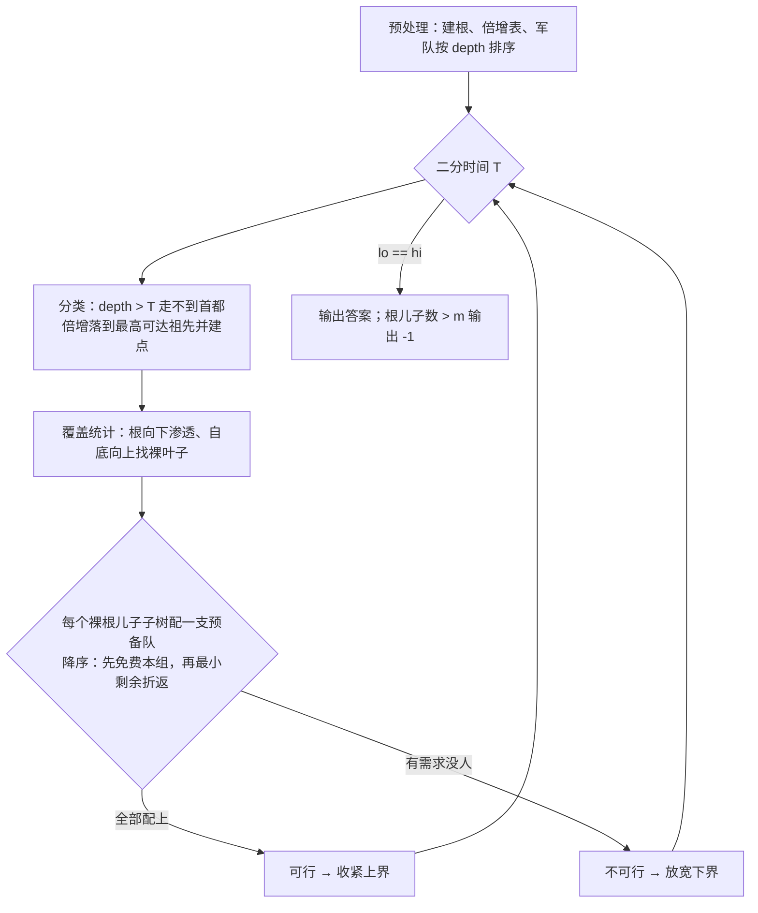

[[TOC]]

## 形式化题目

给定一棵 $n$ 个点、以 $1$ 为根的树，边权 $w > 0$，叶子点称为边境城市。要在若干**非根**点上放检查点，使每条「根 → 叶子」路径都至少经过一个检查点（边境城市也可以放）。

现有 $m$ 支军队，各自驻扎在给定城市，可以沿道路移动到任意城市，放下恰好一个检查点，且不能放在首都；走一条边耗时等于边权，各军同时行动。求让全部路径都被看住的**最少小时数**（各军耗时的最大值）；做不到输出 $-1$。约束：$2 \leqslant m \leqslant n \leqslant 50000$，$0 < w < 10^9$。

样例：两支军队都驻在城市 2，答案 $3$。下图是样例的树（边上为权值）：

一条边境路径是 $1 \to 2$，另一条是 $1 \to 3 \to 4$，因此至少要在 2 和 3（或 4）各放一个检查点。一支军队原地在 2 建点（0 小时）；另一支走 $2 \to 1$（1 小时）再 $1 \to 3$（2 小时）在 3 建点，两军同时行动，总时间 $3$。若想把检查点建在 4，需要 $1 + 2 + 3 = 6$ 小时，更差。

## 正解

### 思路

#### 朴素想法：卡在"时间未知"

任意一支驻在 $s$ 的军队若落在点 $x$，就看住整棵子树 $\mathrm{sub}(x)$。朴素做法要么枚举检查点集合、要么枚举时间再模拟，但检查点组合是指数级的，$n = 50000$ 完全不可行。换角度：答案是各军耗时的**最大值**，典型的「最小化最大值」——先**二分答案** $T$，把问题变成判定「$T$ 小时内能否控制疫情」。判定可以贪心，难点全在判定里落点的结构。

#### 关键观察一：有效落点只有两类

军队可以满树乱走，但对任意落点 $x \neq 1$，记 $a$ 为 $s$ 到根路径上与 $x$ 分叉前的最后一个点（$a$ 是 $s$ 的祖先，$a = \mathrm{lca}(s, x)$）：

- 走到 $x$ 的耗时是 $\mathrm{depth}[s] + \mathrm{depth}[x] - 2\,\mathrm{depth}[a]$，而停在 $a$ 只花 $\mathrm{depth}[s] - \mathrm{depth}[a]$，**更省时间**；
- 覆盖上 $a$ 看住 $\mathrm{sub}(a) \supseteq \mathrm{sub}(x)$，**只多不少**。

所以只要 $a \neq 1$，停在 $a$ 严格不劣于走到 $x$。$a = 1$ 时不能建点，唯一的出路是**穿过首都继续下到某个根儿子 $c$**（下得更深只会更贵、覆盖更窄，落到 $c$ 即可）。于是每支军队的有效选择恰好两类：

1. 落在自己到根路径上的某个祖先（含自己的根儿子）；
2. 穿过首都，落在任意根儿子 $c$，耗时 $\mathrm{depth}[s] + w_c$。

#### 关键观察二：走不到首都的军队别无选择

记 $\mathrm{depth}[s]$ 为 $s$ 到根的距离。若 $\mathrm{depth}[s] > T$，军队连首都都到不了，只能选第 1 类。耗时不超过 $T$ 的祖先中**最高的那个** $a$（即 $\mathrm{depth}[s] - \mathrm{depth}[a] \leqslant T$ 里 $\mathrm{depth}[a]$ 最小者）覆盖 $\mathrm{sub}(a)$ 最大，选它只强不弱——这类军队的落点是**确定的**，先把它们全部落好，再做覆盖统计：自根向下标记「根到此是否已有检查点」，自底向上找「子树里还有没有裸叶子（从根到它无检查点的叶子）」。

#### 关键观察三：需求与预备队的匹配

覆盖统计后，**每个还含裸叶子的根儿子子树**必须补一个检查点。为什么粒度正好是「根儿子子树」？因为这类子树里的裸叶子，靠已有落点已经补不齐了，而一支军队落在这个根儿子 $c$ 上，恰好一次看住整棵 $\mathrm{sub}(c)$；落到它深处反而更贵、看住的更少。于是问题变成：

> 每个需求（根儿子 $c$，代价 $w_c$）配一支「能到首都的军队」，每支军队恰好服务一个需求。

能到首都的军队（$\mathrm{depth}[s] \leqslant T$）是预备队，两种用法：

- **免费**：落在自己的根儿子 $c_0$ 上——不折返，耗时 $\mathrm{depth}[s] - w_{c_0} \leqslant \mathrm{depth}[s] \leqslant T$ 恒成立；
- **折返**：穿过首都落到任意根儿子 $c$，耗时 $\mathrm{depth}[s] + w_c \leqslant T$，等价于剩余时间 $r = T - \mathrm{depth}[s] \geqslant w_c$。

匹配贪心：需求按 $w_c$ **从大到小**处理。第 1 优先用「属于该子树、还没被用掉的预备队」里剩余时间**最小**的一支（免费）；没有就从剩余时间 $r \geqslant w_c$ 的预备队里挑 $r$ **最小**的一支折返过去。交换论证：

- 免费步：若某可行方案没让这支最小 $r$ 的本组预备队 $X$ 落在 $c$，而是让别的预备队 $Y$ 落 $c$（必有 $r_Y \geqslant w_c$），$X$ 落在别处的需求 $c'$（$w' \leqslant w_c$，故 $r_X \geqslant w'$）。交换成 $X$ 落 $c$（免费）、$Y$ 落 $c'$：$r_Y \geqslant w_c \geqslant w'$ 仍成立，方案照旧可行；挑 $r$ 最小保证被换走的 $X$ 不会带走大额剩余时间。
- 折返步：设贪心挑了满足 $r \geqslant w_c$ 中最小的 $M$。可行方案里落 $c$ 的是 $Y$（$r_Y \geqslant w_c$，此时未被用），而 $M$ 在该方案里落在更小的需求 $c'$（$w' \leqslant w_c$；$M$ 闲置则更简单）。交换成 $M$ 落 $c$、$Y$ 落 $c'$：$r_Y \geqslant w_c \geqslant w'$ 仍可行。

归纳下去：只要存在方案，贪心每步之后仍有方案，故贪心成功 $\Leftrightarrow$ 判定可行。

#### 两个实现细节

- 「走不到首都的军队跳到最高可达祖先」用**倍增**：祖先链上 $\mathrm{depth}$ 单调递减，从 $2^{k}$ 大的跳开始，只要跳点的 $\mathrm{depth} \geqslant \mathrm{depth}[s] - T$ 就跳，$O(\log n)$ 一支。
- 「剩余时间 $r \geqslant w_c$ 的最小 $r$」即「$\mathrm{depth} \leqslant T - w_c$ 的最大 $\mathrm{depth}$」：军队按 $\mathrm{depth}$ 升序编号后是一个前缀，用**树状数组**维护可用军队的前缀计数，取「第 $q$ 个可用者」即区间内最后一个可用者，增删都是 $O(\log n)$。

另外，每支军队最多盖住一个根儿子子树，所以根儿子数大于 $m$ 时直接输出 $-1$；否则取上界 $\max \mathrm{depth} + \max w_c$（此时全员预备队、剩余时间处处够用）二分。

#### 样例推演

下表是 $T = 3$ 的判定过程（两军同驻城市 2，$\mathrm{depth} = 1$，无「走不到首都」的军队，故需求是两个都没被覆盖的根儿子）：

| 处理顺序 | 需求（根儿子 / 边权） | 裸叶子 | 挑选的预备队 | 行动与耗时 | 落点看住 |
| --- | --- | --- | --- | --- | --- |
| 1 | 3 / 2 | 4 | 折返步：$r \geqslant 2$ 中最小者（$r = 2$） | $2 \to 1 \to 3$，$1 + 2 = 3 \leqslant 3$ | $\{3, 4\}$ |
| 2 | 2 / 1 | 2 | 免费步：属于 2 的剩余预备队 | 原地不动，$1 - 1 = 0$ | $\{2\}$ |

表格每行是一个需求：先按边权从大到小处理，列出裸叶子、贪心选中的军队、实际耗时与最终覆盖范围。两行做完所有裸叶子都有检查点，判定可行。而 $T = 2$ 时需求相同，两支预备队剩余都只有 $1 < 2$，需求 3 无人能落，折返步失败——判定不可行。二分即得答案 $3$，与样例一致。

### 代码

@include-code(./main.py, python)

### 复杂度

- 预处理：DFS 建根 $O(n)$，倍增表 $O(n \log n)$，军队按到根距离排序 $O(m \log m)$。
- 单次判定：走不到首都的军队各倍增一次 $O(m \log n)$，两遍覆盖统计 $O(n)$，匹配中每个需求做 $O(\log m)$ 的树状数组操作 $O(k \log m)$（$k$ 为根儿子数），合计 $O(n + m \log n)$。
- 二分：上界 $\max \mathrm{depth} + \max w_c \leqslant 5 \times 10^{13}$，约 $47$ 轮。总时间 $O\bigl((n \log n + (n + m \log n) \cdot \log C)\bigr)$，空间 $O(n \log n + m)$。

本题限时 1000 ms：常数不小（每轮判定都要过一遍 $O(n)$ 统计和最多 47 轮二分），**Python 存在 TLE 风险**，本地验证以放宽时限后的输出正确为准；同一算法在 C++ 里就是倍增 + 树状数组的标准写法，时间非常宽裕。

## 总结

1. 「最小化最大耗时」→ 二分答案，全部难点收进判定。
2. 覆盖具有子树包含关系：走到任何落点都不如停在半路的祖先，或穿过首都落到根儿子——有效落点只有「路径祖先」和「根儿子」两类。
3. 走不到首都的军队只能落在路径上，取最高可达点是唯一最优，落点因此确定；剩下的军队是预备队。
4. 判定归结为：裸叶子所在的根儿子子树（需求）与预备队按 $w_c$ 对剩余时间做 1-1 匹配，降序 + 免费优先 + 最小可用剩余即贪心正确。
5. 倍增求最高可达祖先，树状数组维护「可用且剩余够」的最弱预备队；根儿子数超过军队数即 $-1$。

## 图示解析

下图是完整判定流水线，二分外层与判定内层各司其职：

读者应关注：判定里三步是**顺序依赖**的——先让「走不到首都」的军队把确定的覆盖落下来，才能统计出真正的需求；预备队匹配只处理统计后的残余需求，三步合起来才等价于原问题。
